# Convolutional Neural Networks: Foundations

A compact reference for the building blocks of convolutional networks:
- Why fully connected layers fail on images;
- The convolution operation and edge detection;
- Padding: valid and same convolutions;
- Strided convolutions;
- Convolutions over volumes and multiple filters;
- Building one convolutional layer;
- Pooling layers;
- Fully connected layers and a complete ConvNet;
- Parameter sharing and sparsity of connections;
- Training a ConvNet end to end;
- 1-D and 3-D convolutions (EKG, CT, video).

Main idea: a convolutional layer replaces a huge dense weight matrix with a small filter that slides over the whole input, so the same feature detector is reused at every position and the parameter count stops depending on image size.

---

## 1. Computer Vision and Why Convolutions

Computer vision advanced rapidly with deep learning: self-driving perception, face recognition and phone unlocking, photo ranking and search, and generative art. Two reasons the field is worth studying even outside vision: it enables applications that were impossible a few years ago, and its architectures cross-fertilize into speech, language, and other domains.

### 1.1 Computer Vision Problems

| Task | Input | Output |
|---|---|---|
| Image classification / recognition | Image, e.g. $64 \times 64 \times 3$ | Class label, e.g. cat / not cat |
| Object detection | Image | Class labels **plus** bounding boxes for possibly many objects |
| Neural style transfer | Content image + style image | Content repainted in the style |

Object detection is harder than classification because you must localize each object, and there can be several instances of the same class in one image.

### 1.2 Why Not Fully Connected Layers

The input dimension of an image grows with the square of its side length:

$$\boxed{n_x = n_H \times n_W \times n_C}$$

| Image | Input features $n_x$ |
|---|---:|
| $64 \times 64 \times 3$ | 12,288 |
| $1000 \times 1000 \times 3$ (1 megapixel) | 3,000,000 |

With a 3,000,000-dimensional input and only 1,000 units in the first hidden layer, the weight matrix $W^{[1]}$ has shape $1000 \times 3{,}000{,}000$, which is **3 billion parameters** in a single layer.

Three problems follow:

- **Overfitting**: it is hard to collect enough data to constrain that many parameters;
- **Memory**: storing the weights and their gradients and optimizer state is infeasible;
- **Compute**: each forward and backward pass is enormous.

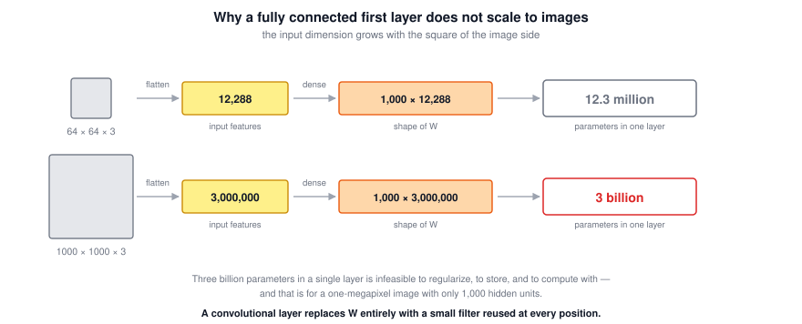

But vision applications should not be restricted to tiny images. The convolution operation is what makes large inputs tractable.

### 1.3 What Convolution Buys You

A dense layer learns a separate weight for every (input pixel, output unit) pair. A convolutional layer instead learns a small filter and applies it at every position. Two structural assumptions are baked in:

- **Locality**: a useful low-level feature depends only on a small neighborhood of pixels;
- **Stationarity / translation equivariance**: a feature worth detecting in one location is worth detecting everywhere, so the same weights can be reused.

Both assumptions are true enough for natural images, which is why the restriction acts as a helpful prior instead of a handicap.

### 1.4 Tricky Interview Questions

**Q: Why not just use a fully connected network on images?**  
The number of parameters scales with the number of pixels times the layer width. For a $1000 \times 1000 \times 3$ image and 1,000 hidden units, that is about 3 billion parameters in one layer, which is infeasible to train, store, and regularize.

**Q: Suppose the input is a $300 \times 300$ RGB image and the first hidden layer has 100 fully connected neurons. How many parameters does that layer have, including biases?**  
$300 \times 300 \times 3 = 270{,}000$ input features, so $270{,}000 \times 100 + 100 = 27{,}000{,}100$. The common mistake is forgetting the three color channels.

**Q: What structural assumptions does a convolutional layer make about its input?**  
That useful features are local and that the same feature detector is useful at every spatial position.

**Q: Is a convolutional layer a special case of a fully connected layer?**  
Yes. It is a dense layer whose weight matrix is constrained to be sparse (each output sees only a local patch) and tied (the same weights repeat at every position).

---

## 2. The Convolution Operation and Edge Detection

Convolution is the fundamental building block of a ConvNet. Edge detection is the clearest way to see what it computes.

Early layers of a network tend to detect edges, middle layers parts of objects, and later layers whole objects such as faces. So it makes sense to start with edges.

### 2.1 Vertical Edge Detection

Take a $6 \times 6$ grayscale image (so $6 \times 6 \times 1$, not $6 \times 6 \times 3$) and a $3 \times 3$ **filter**, also called a **kernel**:

$$\text{image} = \begin{bmatrix} 3&0&1&2&7&4 \\ 1&5&8&9&3&1 \\ 2&7&2&5&1&3 \\ 0&1&3&1&7&8 \\ 4&2&1&6&2&8 \\ 2&4&5&2&3&9 \end{bmatrix}, \qquad \text{filter} = \begin{bmatrix} 1&0&-1 \\ 1&0&-1 \\ 1&0&-1 \end{bmatrix}$$

Convolution is written with an asterisk, $\text{image} * \text{filter}$, and produces a $4 \times 4$ output:

$$\begin{bmatrix} 3&0&1&2&7&4 \\ 1&5&8&9&3&1 \\ 2&7&2&5&1&3 \\ 0&1&3&1&7&8 \\ 4&2&1&6&2&8 \\ 2&4&5&2&3&9 \end{bmatrix} * \begin{bmatrix} 1&0&-1 \\ 1&0&-1 \\ 1&0&-1 \end{bmatrix} = \begin{bmatrix} -5&-4&0&8 \\ -10&-2&2&3 \\ 0&-2&-4&-7 \\ -3&-2&-3&-16 \end{bmatrix}$$

Procedure for each output element:

1. Place the filter over a $3 \times 3$ region of the input.
2. Multiply element-wise.
3. Sum the nine products into one number.
4. Shift the filter one position right; at the end of a row, shift one position down.

For the top-left output: the left column contributes $3 + 1 + 2 = 6$, the middle column contributes $0$, and the right column contributes $-(1 + 8 + 2) = -11$, giving $6 - 11 = -5$.

The output is $4 \times 4$ because a $3 \times 3$ filter has exactly $4 \times 4$ valid positions inside a $6 \times 6$ input.

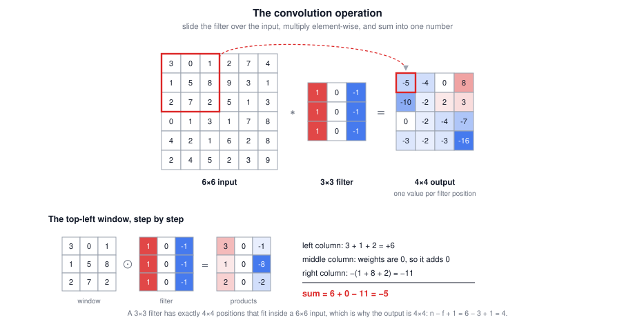

In the figures that follow, grids of numbers are shaded by value: grayscale where a grid should be read as a picture, and blue-to-red where the sign of the number matters.

> **Notation caution.** In mathematics `*` means convolution, but in Python `*` is multiplication (element-wise for arrays). Frameworks use named functions instead: `tf.nn.conv2d` and `Conv2D` in TensorFlow/Keras, `nn.Conv2d` and `F.conv2d` in PyTorch, and `conv_forward` in the from-scratch exercises.

### 2.2 Why This Detects Vertical Edges

Use a simplified image whose left half is $10$ and right half is $0$. Plotted, the left half is bright and the right half is dark, with a strong vertical edge down the middle:

$$\begin{bmatrix} 10&10&10&0&0&0 \\ 10&10&10&0&0&0 \\ 10&10&10&0&0&0 \\ 10&10&10&0&0&0 \\ 10&10&10&0&0&0 \\ 10&10&10&0&0&0 \end{bmatrix} * \begin{bmatrix} 1&0&-1 \\ 1&0&-1 \\ 1&0&-1 \end{bmatrix} = \begin{bmatrix} 0&30&30&0 \\ 0&30&30&0 \\ 0&30&30&0 \\ 0&30&30&0 \end{bmatrix}$$

Where the filter sits entirely inside the bright region, the left column gives $+30$ and the right column gives $-30$, so the output is $0$. Where the filter straddles the boundary, the left column gives $+30$ and the right column gives $0$, so the output is $30$. Plotted, the output has a bright band exactly where the edge is.

The detected edge looks thick only because the image is tiny. On a $1000 \times 1000$ image the band is a thin line relative to the image.

Intuition: with this filter, a vertical edge is a $3 \times 3$ region with **bright pixels on the left, dark pixels on the right, and don't-care values in the middle**.

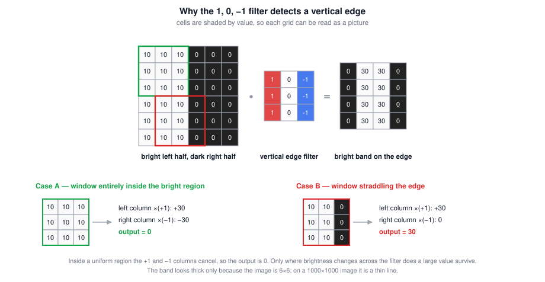

### 2.3 Positive and Negative Edges

Flip the image so the dark half is on the left:

$$\begin{bmatrix} 0&0&0&10&10&10 \\ 0&0&0&10&10&10 \\ 0&0&0&10&10&10 \\ 0&0&0&10&10&10 \\ 0&0&0&10&10&10 \\ 0&0&0&10&10&10 \end{bmatrix} * \begin{bmatrix} 1&0&-1 \\ 1&0&-1 \\ 1&0&-1 \end{bmatrix} = \begin{bmatrix} 0&-30&-30&0 \\ 0&-30&-30&0 \\ 0&-30&-30&0 \\ 0&-30&-30&0 \end{bmatrix}$$

| Sign of output | Transition |
|---|---|
| Positive | Light to dark (bright on the left) |
| Negative | Dark to light (bright on the right) |

So the filter distinguishes the two transition directions. If you only care that an edge exists, take absolute values of the output.

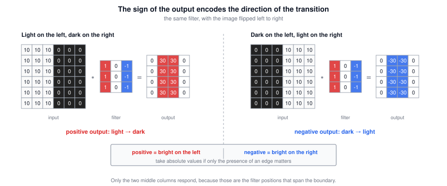

### 2.4 Horizontal Edges

Rotating the filter gives a horizontal edge detector: a $3 \times 3$ region with bright pixels on top and dark pixels on the bottom.

$$\text{horizontal filter} = \begin{bmatrix} 1&1&1 \\ 0&0&0 \\ -1&-1&-1 \end{bmatrix}$$

On a checkerboard-style image with $10$s in the upper-left and lower-right blocks:

$$\begin{bmatrix} 10&10&10&0&0&0 \\ 10&10&10&0&0&0 \\ 10&10&10&0&0&0 \\ 0&0&0&10&10&10 \\ 0&0&0&10&10&10 \\ 0&0&0&10&10&10 \end{bmatrix} * \begin{bmatrix} 1&1&1 \\ 0&0&0 \\ -1&-1&-1 \end{bmatrix} = \begin{bmatrix} 0&0&0&0 \\ 30&10&-10&-30 \\ 30&10&-10&-30 \\ 0&0&0&0 \end{bmatrix}$$

The $+30$ entries sit where the region is bright on top and dark below, and the $-30$ entries where it is dark on top and bright below. The intermediate $\pm 10$ values come from filter positions that straddle both a positive and a negative edge, so the contributions partly cancel. These transition artifacts are large here only because the image is $6 \times 6$; on a large image they are negligible relative to the image size.

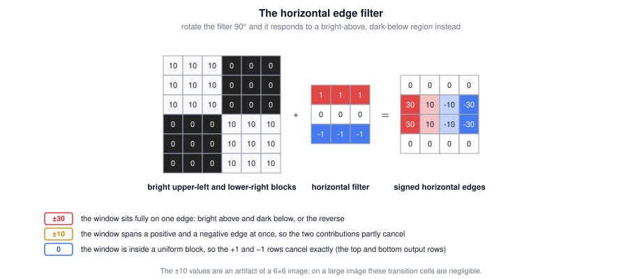

### 2.5 Hand-Designed Filters

The $1, 0, -1$ filter is one choice among many, and classical computer vision debated at length which numbers are best:

| Name | Vertical form | Property |
|---|---|---|
| Simple | $\begin{bmatrix} 1&0&-1 \\ 1&0&-1 \\ 1&0&-1 \end{bmatrix}$ | Uniform weighting of rows |
| Sobel | $\begin{bmatrix} 1&0&-1 \\ 2&0&-2 \\ 1&0&-1 \end{bmatrix}$ | More weight on the central row, somewhat more robust |
| Scharr | $\begin{bmatrix} 3&0&-3 \\ 10&0&-10 \\ 3&0&-3 \end{bmatrix}$ | Even stronger central weighting |

Flipping any of these 90 degrees gives the horizontal version.

### 2.6 Learned Filters

The key deep learning insight: **do not hand-pick the nine numbers, treat them as parameters and learn them with backpropagation.**

$$\boxed{W = \begin{bmatrix} w_1&w_2&w_3 \\ w_4&w_5&w_6 \\ w_7&w_8&w_9 \end{bmatrix} \text{ learned by gradient descent}}$$

Backprop can recover $1, 0, -1$, or Sobel, or Scharr, but more likely it learns something better suited to the statistics of your data. It is also not limited to vertical and horizontal: it can learn edges at 45 degrees, 70 degrees, or any orientation, and features that have no name in English at all.

Learning low-level features from data turns out to be more robust than coding them by hand, and this idea has been one of the most powerful in computer vision. The convolution operation is what makes it possible: backprop picks whatever filter it wants, and convolution applies that one filter at every position of the image.

### 2.7 Cross-Correlation vs Convolution

A math or signal-processing textbook defines convolution with an extra step: **flip the filter** on both the horizontal and vertical axes before multiplying and summing. What deep learning calls convolution skips the flip, so it is technically **cross-correlation**.

$$\text{true convolution: } (I * K)_{ij} = \sum_{m}\sum_{n} I_{i+m,\,j+n}\, K_{f-1-m,\,f-1-n}$$

$$\text{deep learning convention: } (I * K)_{ij} = \sum_{m}\sum_{n} I_{i+m,\,j+n}\, K_{m,n}$$

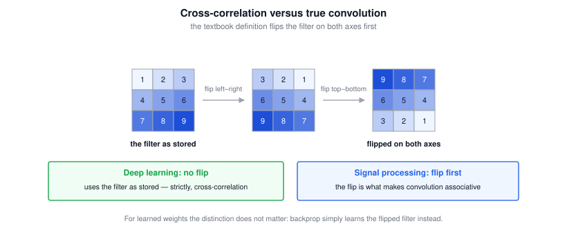

The flip makes convolution associative, $(A * B) * C = A * (B * C)$, which is useful in signal processing. For neural networks it does not matter: the filter weights are learned, so a learned unflipped filter is exactly as expressive as a learned flipped one. Omitting the flip just simplifies the code. By convention the deep learning literature calls the unflipped operation convolution, and these notes do too.

### 2.8 Tricky Interview Questions

**Q: What does convolving a $6 \times 6$ image with a $3 \times 3$ filter produce?**  
A $4 \times 4$ output, because there are $4 \times 4$ positions where the filter fits entirely inside the input.

**Q: What does applying this filter to a grayscale image do?**

$$\begin{bmatrix} 0&1&1&0 \\ 1&3&3&1 \\ -1&-3&-3&-1 \\ 0&-1&-1&0 \end{bmatrix}$$

It detects **horizontal** edges. The top rows are positive and the bottom rows are negative, so the filter responds to a large difference between the upper and lower parts of a region, which is a horizontal edge.

**Q: What is the difference between a $+30$ and a $-30$ in an edge detector's output?**  
The sign encodes the direction of the transition: positive for light-to-dark and negative for dark-to-light with the $1, 0, -1$ orientation. Take absolute values if the direction is irrelevant.

**Q: Why did learned filters replace Sobel and Scharr?**  
Because backprop can find filters tuned to the actual data distribution, including orientations and patterns nobody would hand-code, and it can do so at every layer of a deep network.

**Q: Is what deep learning calls convolution really convolution?**  
Strictly it is cross-correlation, since the filter is not flipped. It makes no difference for learned filters, and the whole literature uses the name convolution.

**Q: Where do the odd intermediate values like $-10$ come from in the horizontal edge example?**  
From filter positions that overlap both a positive and a negative edge, so the two contributions partially cancel. They are an artifact of the small image size.

---

## 3. Padding

Padding is the first modification to plain convolution that you need in order to build deep networks.

### 3.1 Why Padding

Without padding, an $n \times n$ input convolved with an $f \times f$ filter gives:

$$\boxed{(n - f + 1) \times (n - f + 1)}$$

For $n = 6$ and $f = 3$ that is $4 \times 4$. Two downsides:

- **The output shrinks every layer.** In a 100-layer network with $f = 3$ the spatial size drops by 2 per layer, so the representation collapses. You do not want the image to shrink every time you detect a feature.
- **Corner and edge pixels are underused.** A corner pixel appears in exactly one $3 \times 3$ window, while a central pixel appears in many. Information near the border is effectively thrown away.

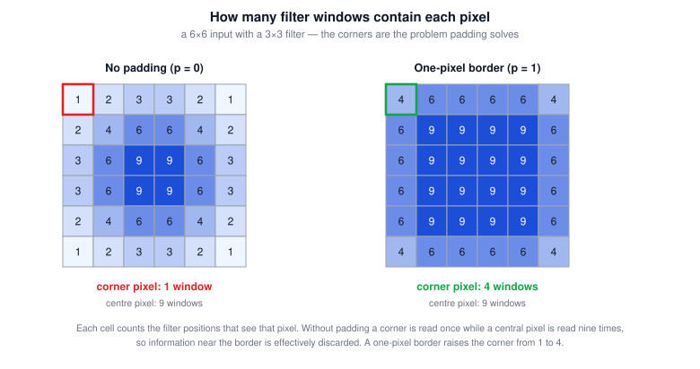

The fix is to pad the input with a border of zeros before convolving. With a one-pixel border, a $6 \times 6$ image becomes $8 \times 8$, and convolving with $3 \times 3$ gives $6 \times 6$ back, preserving the input size. The former corner pixel now participates in several windows.

With padding amount $p$:

$$\boxed{(n + 2p - f + 1) \times (n + 2p - f + 1)}$$

For $n=6$, $p=1$, $f=3$: $6 + 2 - 3 + 1 = 6$.

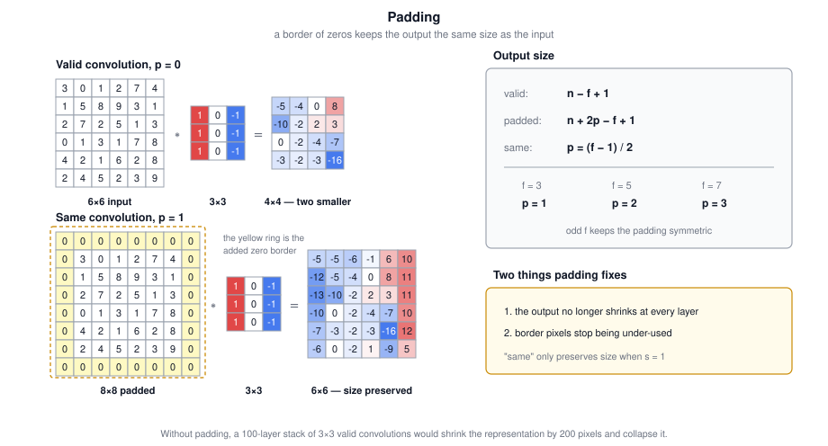

### 3.2 Valid and Same Convolutions

| Type | Padding | Output size |
|---|---|---|
| **Valid** | $p = 0$, no padding | $n - f + 1$ |
| **Same** | $p$ chosen to preserve size | $n$ |

For a same convolution, solve $n + 2p - f + 1 = n$:

$$\boxed{p = \frac{f - 1}{2}}$$

| $f$ | Same padding $p$ |
|---:|---:|
| 3 | 1 |
| 5 | 2 |
| 7 | 3 |

Note that "same" only preserves size when the stride is 1. With stride $s > 1$ the output shrinks by roughly a factor of $s$ regardless of padding.

### 3.3 Why Filter Sizes Are Odd

By convention in computer vision $f$ is almost always odd: $3 \times 3$ is very common, with some $5 \times 5$ and $7 \times 7$, and $1 \times 1$ used for a different purpose discussed later. Two reasons:

- If $f$ were even, same padding would require **asymmetric padding**, for example more on the left than on the right. Odd $f$ gives $p = (f-1)/2$ as an integer, so the padding is symmetric on all sides.
- An odd filter has a **central pixel**, which is convenient when talking about the position of the filter.

Even filters can work, but following the convention costs nothing.

### 3.4 Tricky Interview Questions

**Q: What two problems does padding solve?**  
Shrinking outputs across layers, and underuse of information at the borders of the image.

**Q: What padding makes a $5 \times 5$ convolution size-preserving?**  
$p = (5-1)/2 = 2$.

**Q: You have a $121 \times 121 \times 32$ volume and convolve it with 32 filters of $5 \times 5$ and stride 1, using a same convolution. What is the padding?**  
$p = 2$, which gives output height $\frac{121 - 5 + 4}{1} + 1 = 121$.

**Q: You have a $61 \times 61 \times 32$ input volume and pad it with $p = 3$. What is the padded volume?**  
$67 \times 67 \times 32$. Padding adds $2p = 6$ to the height and 6 to the width, and never changes the number of channels.

**Q: Does a "same" convolution always preserve the spatial size?**  
Only when the stride is 1. With stride $s$ the output is about $n/s$ no matter how much you pad.

**Q: Why is padding with zeros acceptable?**  
Because the network learns filters that operate on the padded input, so it can adapt to the artificial border. Other schemes such as reflection or replication padding exist and sometimes help slightly.

---

## 4. Strided Convolutions

Stride controls how far the filter hops between positions.

### 4.1 How Striding Works

Convolve a $7 \times 7$ input with a $3 \times 3$ filter using **stride 2**. Compute the element-wise product and sum as usual in the upper-left region, then step the window **two** positions right instead of one. At the end of a row, step **two** positions down. The result is a $3 \times 3$ output:

$$\begin{bmatrix} 91&100&83 \\ 69&91&127 \\ 44&72&74 \end{bmatrix}$$

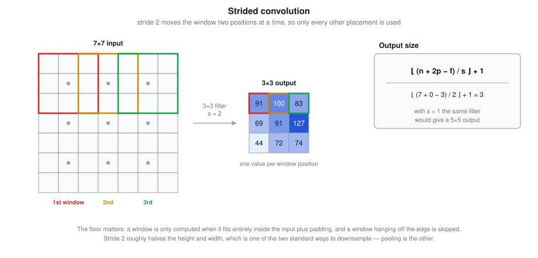

Stride 1 is the default; stride 2 roughly halves the height and width and is one of two standard ways to downsample (the other is pooling).

### 4.2 Output Size

Combining padding and stride, for an $n \times n$ input, $f \times f$ filter, padding $p$, and stride $s$:

$$\boxed{\left\lfloor \frac{n + 2p - f}{s} + 1 \right\rfloor \times \left\lfloor \frac{n + 2p - f}{s} + 1 \right\rfloor}$$

Check with the example: $\frac{7 + 0 - 3}{2} + 1 = \frac{4}{2} + 1 = 3$.

The **floor** matters when the fraction is not an integer. The convention is that the filter must lie entirely inside the input plus padding for an output to be produced; a window that hangs off the edge is simply skipped. Rounding down implements exactly that.

You can usually choose $n, f, p, s$ so the division is exact, but rounding down is perfectly fine otherwise.

### 4.3 Tricky Interview Questions

**Q: Why round down instead of up in the output-size formula?**  
Because a filter position is only computed when the whole window fits inside the input plus padding. Partial windows are discarded, which is what the floor expresses.

**Q: You have a $127 \times 127 \times 16$ input volume and convolve it with 32 filters of $5 \times 5$, stride 2, no padding. What is the output volume?**  
$62 \times 62 \times 32$. Spatially, $\lfloor \frac{127 + 0 - 5}{2} \rfloor + 1 = 61 + 1 = 62$; the channel count equals the number of filters.

**Q: How does stride 2 compare to $2 \times 2$ max pooling for downsampling?**  
Both roughly halve the height and width. Strided convolution learns how to downsample because the reduction happens inside a parameterized filter; pooling is a fixed function with no parameters.

**Q: What happens to the receptive field when you increase the stride?**  
Each output element still sees an $f \times f$ patch, but consecutive outputs cover more distant patches, so deeper layers see a much larger fraction of the original image per unit.

---

## 5. Convolutions Over Volumes

Real images have channels, and this is where convolution becomes powerful.

### 5.1 3D Filters

An RGB image is $6 \times 6 \times 3$: a stack of three $6 \times 6$ channels. To convolve it, the filter must also be three-dimensional, for example $3 \times 3 \times 3$.

$$\boxed{6 \times 6 \times 3 \;*\; 3 \times 3 \times 3 \;=\; 4 \times 4}$$

**The number of channels in the filter must equal the number of channels in the input.** The output is $4 \times 4 \times 1$: the channel dimension collapses because all channels are summed into one number.

Mechanically, the $3 \times 3 \times 3$ filter has $27$ numbers. Place the cube in the upper-left position, multiply each of the 27 filter values with the corresponding input value across the red, green, and blue channels, and add all 27 products into one output element. Then slide the cube and repeat.

Two illustrative filters:

| Filter | Effect |
|---|---|
| $1,0,-1$ pattern in the red channel, zeros in green and blue | Vertical edges **in the red channel only** |
| $1,0,-1$ pattern in all three channels | Vertical edges regardless of color |

### 5.2 Multiple Filters

One filter detects one feature. To detect vertical edges, horizontal edges, 45-degree edges, and more, apply **several filters** and stack their outputs along the channel dimension:

$$\boxed{6 \times 6 \times 3 \;*\; \left\{2 \text{ filters of } 3 \times 3 \times 3\right\} \;=\; 4 \times 4 \times 2}$$

Each filter yields its own $4 \times 4$ map, and stacking two maps gives a $4 \times 4 \times 2$ output volume. The last dimension of the output is the **number of filters**, not the number of input channels. With 128 filters you get $4 \times 4 \times 128$.

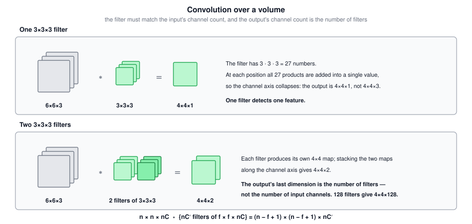

### 5.3 Dimension Summary

With stride 1 and no padding:

$$\boxed{n \times n \times n_C \;*\; f \times f \times n_C \times n_C' \;=\; (n-f+1) \times (n-f+1) \times n_C'}$$

where $n_C$ is the input channel count (which the filter must match) and $n_C'$ is the number of filters. With other strides and padding, apply the formula from section 4.2 to the spatial dimensions.

> **Terminology.** The last dimension of a volume is called either **channels** or **depth**. These notes use *channels*, because *depth* also refers to the number of layers in a network.

### 5.4 Tricky Interview Questions

**Q: Why must the filter have the same number of channels as the input?**  
Because convolution sums the products over all channels simultaneously. Every input channel needs its own slice of filter weights.

**Q: What determines the number of channels in the output volume?**  
The number of filters in that layer. The input channel count is consumed by the summation.

**Q: A $6 \times 6 \times 3$ input convolved with one $3 \times 3 \times 3$ filter gives what shape?**  
$4 \times 4 \times 1$, not $4 \times 4 \times 3$. The channels collapse into a single value per position.

**Q: Suppose the input is a $256 \times 256$ RGB image and you use a convolutional layer with 128 filters of $7 \times 7$. How many parameters does the layer have, including biases?**  
Each filter is $7 \times 7 \times 3$, so $147 + 1 = 148$ parameters, and $148 \times 128 = 18{,}944$. The trap is forgetting that each filter must span the 3 input channels.

**Q: Can a filter look at only one input channel?**  
In principle yes, by zeroing the weights on the other channels, and grouped or depthwise convolutions do this deliberately. The standard convention is that the filter spans all input channels.

**Q: Is a $3 \times 3 \times 3$ RGB filter a 3-D convolution?**  
No. The last 3 is **channels**, not a third spatial axis. A true 3-D convolution (CT, video) has three spatial axes plus an optional channel axis — section 10.

---

## 6. One Layer of a Convolutional Network

Convolving with several filters is the linear part of a layer. Two more steps make it a real layer.

### 6.1 From Convolution to a Layer

For each filter output:

1. Convolve the input volume with the filter.
2. **Add a bias**, a single real number broadcast to all elements of that filter's output map.
3. Apply a **non-linearity**, typically ReLU.

Then stack the resulting maps into the output volume. Going from $6 \times 6 \times 3$ to $4 \times 4 \times 2$ this way is one layer of a ConvNet.

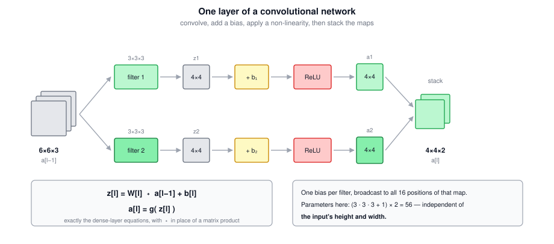

The correspondence with a standard layer is exact. A dense layer computes:

$$z^{[1]} = W^{[1]}a^{[0]} + b^{[1]}, \qquad a^{[1]} = g\!\left(z^{[1]}\right)$$

A convolutional layer computes:

$$\boxed{z^{[l]} = W^{[l]} * a^{[l-1]} + b^{[l]}, \qquad a^{[l]} = g\!\left(z^{[l]}\right)}$$

| Dense layer | Convolutional layer |
|---|---|
| $a^{[0]} = x$ | Input volume, e.g. $6 \times 6 \times 3$ |
| $W^{[1]}$ | The set of filters |
| $W^{[1]}a^{[0]}$ | The convolution outputs |
| $+\, b^{[1]}$ | One bias per filter, broadcast over positions |
| $g(z^{[1]})$ | ReLU applied element-wise |
| $a^{[1]}$ | Output volume, e.g. $4 \times 4 \times 2$ |

### 6.2 Parameter Count

Ten filters of $3 \times 3 \times 3$: each filter has $27$ weights plus 1 bias, so $28$ parameters, and $28 \times 10 = 280$ in total.

$$\boxed{\text{parameters} = \left(f^{[l]} \times f^{[l]} \times n_c^{[l-1]} + 1\right) \times n_c^{[l]}}$$

The crucial property: **that count is independent of the input image size.** Whether the input is $1000 \times 1000$ or $5000 \times 5000$, the layer still has 280 parameters. You learn ten feature detectors once and apply them everywhere, which is a large part of why ConvNets resist overfitting compared with dense networks.

### 6.3 Notation

For a convolutional layer $l$:

| Symbol | Meaning |
|---|---|
| $f^{[l]}$ | Filter size |
| $p^{[l]}$ | Padding |
| $s^{[l]}$ | Stride |
| $n_c^{[l]}$ | Number of filters, and hence output channels |
| $n_H^{[l-1]} \times n_W^{[l-1]} \times n_c^{[l-1]}$ | Input volume shape |
| $n_H^{[l]} \times n_W^{[l]} \times n_c^{[l]}$ | Output volume shape |

Output spatial size, computed independently for height and width:

$$\boxed{n_H^{[l]} = \left\lfloor \frac{n_H^{[l-1]} + 2p^{[l]} - f^{[l]}}{s^{[l]}} + 1 \right\rfloor}$$

$$\boxed{n_W^{[l]} = \left\lfloor \frac{n_W^{[l-1]} + 2p^{[l]} - f^{[l]}}{s^{[l]}} + 1 \right\rfloor}$$

Shapes of everything in the layer:

| Object | Shape |
|---|---|
| Each filter | $f^{[l]} \times f^{[l]} \times n_c^{[l-1]}$ |
| All weights $W^{[l]}$ | $f^{[l]} \times f^{[l]} \times n_c^{[l-1]} \times n_c^{[l]}$ |
| Bias $b^{[l]}$ | $n_c^{[l]}$, often stored as $1 \times 1 \times 1 \times n_c^{[l]}$ |
| Activation $a^{[l]}$ | $n_H^{[l]} \times n_W^{[l]} \times n_c^{[l]}$ |
| Batched activations $A^{[l]}$ | $m \times n_H^{[l]} \times n_W^{[l]} \times n_c^{[l]}$ |

With mini-batch gradient descent, the example index comes first and the three volume dimensions follow.

> **Ordering conventions.** There is no universal standard for the order of height, width, and channels. These notes use channels-last, $m \times n_H \times n_W \times n_c$ (NHWC), which matches TensorFlow's default. PyTorch defaults to channels-first, $m \times n_c \times n_H \times n_W$ (NCHW), and several frameworks have a flag to switch. Both work as long as you are consistent.

### 6.4 Tricky Interview Questions

**Q: How many parameters does a layer with 10 filters of $3 \times 3 \times 3$ have?**  
$(3 \times 3 \times 3 + 1) \times 10 = 280$.

**Q: How does that change if the input image is 25 times larger?**  
It does not. The parameter count depends on filter size, input channels, and number of filters, never on the input's height and width.

**Q: How many biases does a convolutional layer have?**  
One per filter, so $n_c^{[l]}$ in total. The bias is broadcast to every spatial position of that filter's output map.

**Q: Which of these statements about convolutional layers are true?**  
That a feature detector is reused at multiple locations throughout the input volume, and that convolutional layers give sparsity of connections, are both true. It is **false** that convolution speeds up training because gradients need not be computed for convolutional layers: filter weights are learned parameters and do receive gradients.

**Q: Where does the non-linearity go in a convolutional layer?**  
After the convolution and the bias, applied element-wise to the whole output volume.

**Q: A $5 \times 5$ convolution with 20 filters over a $17 \times 17 \times 8$ input, stride 1, no padding. Give the output shape and parameter count.**  
Output $13 \times 13 \times 20$; parameters $(5 \times 5 \times 8 + 1) \times 20 = 201 \times 20 = 4{,}020$.

---

## 7. Pooling Layers

ConvNets use pooling layers to reduce the size of the representation, speed up computation, and make detected features somewhat more robust to small shifts.

### 7.1 Max Pooling

Split the input into regions and output the maximum of each. With a $4 \times 4$ input, $f = 2$, $s = 2$:

$$\begin{bmatrix} 1&3&2&1 \\ 2&9&1&1 \\ 1&3&2&3 \\ 5&6&1&2 \end{bmatrix} \longrightarrow \begin{bmatrix} 9&2 \\ 6&3 \end{bmatrix}$$

Each output is the max over a $2 \times 2$ region: $\max\{1,3,2,9\} = 9$, $\max\{2,1,1,1\} = 2$, $\max\{1,3,5,6\} = 6$, $\max\{2,3,1,2\} = 3$.

Here $f = 2$ because the regions are $2 \times 2$, and $s = 2$ because the window hops two positions. These are the **hyperparameters** of max pooling.

Intuition: treat a large activation as "this feature was detected here". If a whisker or vertical edge detector fires anywhere in a region, max pooling preserves that high number in the output; if the feature is absent everywhere in the region, the max stays small. So the layer reports *whether* a feature was present in the region, discarding *exactly where*.

Honest caveat: this intuition is often cited but the main reason people use max pooling is that it has been found empirically to work well in many experiments. Nobody knows for certain that the intuition is the real underlying reason.

With $f = 3$, $s = 1$ on a $5 \times 5$ input, the same size formula gives a $3 \times 3$ output, with overlapping windows.

### 7.2 Pooling on Volumes

Pooling is applied **independently to each channel**, so the channel count is unchanged:

$$\boxed{n_H \times n_W \times n_C \;\longrightarrow\; \left\lfloor \frac{n_H - f}{s} + 1 \right\rfloor \times \left\lfloor \frac{n_W - f}{s} + 1 \right\rfloor \times n_C}$$

For example, $5 \times 5 \times 2$ with $f = 3$, $s = 1$ gives $3 \times 3 \times 2$, computing the max separately on each slice.

The same output-size formula as convolution applies, with $p = 0$ in the common case.

### 7.3 Average Pooling

Average pooling takes the mean of each region instead of the max. On the $4 \times 4$ example above with $f = 2$, $s = 2$:

$$\begin{bmatrix} 1&3&2&1 \\ 2&9&1&1 \\ 1&3&2&3 \\ 5&6&1&2 \end{bmatrix} \longrightarrow \begin{bmatrix} 3.75&1.25 \\ 3.75&2.00 \end{bmatrix}$$

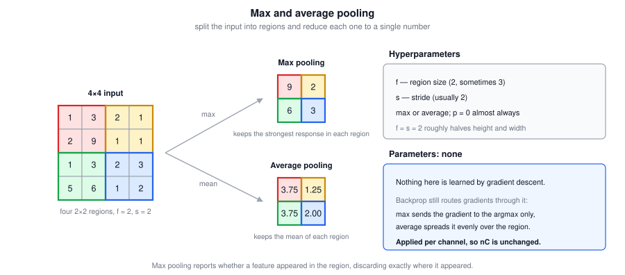

Max pooling is used much more often. The main exception is very deep in a network, where average pooling can collapse a spatial representation entirely, for example $7 \times 7 \times 1000 \rightarrow 1 \times 1 \times 1000$ by averaging over all spatial positions. This is **global average pooling**, common in modern architectures as a replacement for large fully connected layers.

### 7.4 Hyperparameters and Properties

| Hyperparameter | Typical value |
|---|---|
| $f$ (filter size) | 2, sometimes 3 |
| $s$ (stride) | 2 |
| Type | max (usual) or average |
| $p$ (padding) | 0 almost always |

$f = 2$, $s = 2$ is the most common setting and roughly halves the height and width. $f = 3$, $s = 2$ is also seen. Padding in a pooling layer is very rarely used.

**Pooling has hyperparameters but no parameters.** There is nothing for gradient descent to learn: once $f$ and $s$ are fixed, it is a fixed function. Backprop still routes gradients *through* it (for max pooling, the gradient flows only to the position that achieved the maximum; for average pooling, it is distributed equally over the region), but no weights are updated.

### 7.5 Tricky Interview Questions

**Q: Does max pooling have parameters?**  
No. It has hyperparameters $f$, $s$, and the choice of max versus average, but no learnable weights. Nothing in a pooling layer is updated by gradient descent.

**Q: Which of the following are hyperparameters of a pooling layer: $b^{[l]}$, $W^{[l]}$, whether it is max or average, stride?**  
Whether it is max or average, and the stride. Weights and biases do not exist in a pooling layer. The filter size is also a hyperparameter, though people usually set $f = s$.

**Q: You have a $66 \times 66 \times 21$ input volume and apply max pooling with $f = 3$ and $s = 3$. What is the output volume?**  
$22 \times 22 \times 21$. Spatially, $\frac{66 + 0 - 3}{3} + 1 = 22$; the channel count is unchanged because pooling acts per channel.

**Q: Why does pooling not change the number of channels?**  
Because the pooling computation is performed independently on each channel slice.

**Q: How does backprop pass gradients through max pooling if there is nothing to learn?**  
It routes the incoming gradient to the input element that was the maximum in each window and assigns zero to the others, so upstream layers still receive gradients.

**Q: Why do some modern architectures use strided convolution instead of pooling?**  
Because a strided convolution learns how to downsample rather than applying a fixed rule, and it merges two operations into one. Pooling remains cheap, parameter-free, and effective.

---

## 8. Putting It Together: A Complete ConvNet

A typical ConvNet has three kinds of layers:

| Layer | Abbreviation | Has parameters? |
|---|---|---|
| Convolutional | CONV | Yes |
| Pooling | POOL | No |
| Fully connected | FC | Yes |

It is possible to build a good network from convolutional layers alone, but most architectures also include some pooling and some fully connected layers.

### 8.1 A Convolution-Only Example

Classify a $39 \times 39 \times 3$ image as cat or not cat, so $n_H^{[0]} = n_W^{[0]} = 39$ and $n_c^{[0]} = 3$.

| Layer | Hyperparameters | Output |
|---|---|---|
| CONV1 | $f=3$, $s=1$, $p=0$, 10 filters | $37 \times 37 \times 10$ |
| CONV2 | $f=5$, $s=2$, $p=0$, 20 filters | $17 \times 17 \times 20$ |
| CONV3 | $f=5$, $s=2$, $p=0$, 40 filters | $7 \times 7 \times 40$ |
| Flatten | — | 1,960 units |
| Output | Logistic or softmax | $\hat{y}$ |

The arithmetic: $\frac{39 + 0 - 3}{1} + 1 = 37$, then $\frac{37 + 0 - 5}{2} + 1 = 17$, then $\frac{17 + 0 - 5}{2} + 1 = 7$. Note that stride 2 shrinks the representation much faster than stride 1.

The final $7 \times 7 \times 40$ volume holds $1{,}960$ numbers. Flatten (unroll) them into a single long vector and feed it to a logistic unit for binary classification or a softmax unit for multi-class.

Notice the trend: spatial size decreases ($39 \to 37 \to 17 \to 7$) while channels increase ($3 \to 10 \to 20 \to 40$).

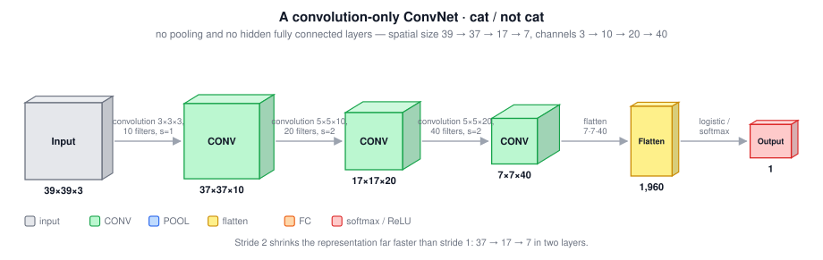

The colour key is the same as in the later case-study diagrams: **gray** input, **green** convolution, **blue** pooling, **yellow** flatten, **orange** fully connected, **red** softmax / logistic / output. Box height is spatial size, box width is channel count.

### 8.2 A LeNet-5-Inspired Example

Recognize handwritten digits from a $32 \times 32 \times 3$ input, with 10 output classes. This is not exactly LeNet-5 (created by Yann LeCun many years ago) but the choices are inspired by it.

| Layer | Hyperparameters | Output shape |
|---|---|---|
| Input | — | $32 \times 32 \times 3$ |
| CONV1 | $f=5$, $s=1$, $p=0$, 6 filters | $28 \times 28 \times 6$ |
| POOL1 | max, $f=2$, $s=2$ | $14 \times 14 \times 6$ |
| CONV2 | $f=5$, $s=1$, $p=0$, 16 filters | $10 \times 10 \times 16$ |
| POOL2 | max, $f=2$, $s=2$ | $5 \times 5 \times 16$ |
| Flatten | — | 400 |
| FC3 | $W^{[3]}$ is $120 \times 400$ | 120 |
| FC4 | $W^{[4]}$ is $84 \times 120$ | 84 |
| Softmax | 10 classes | 10 |

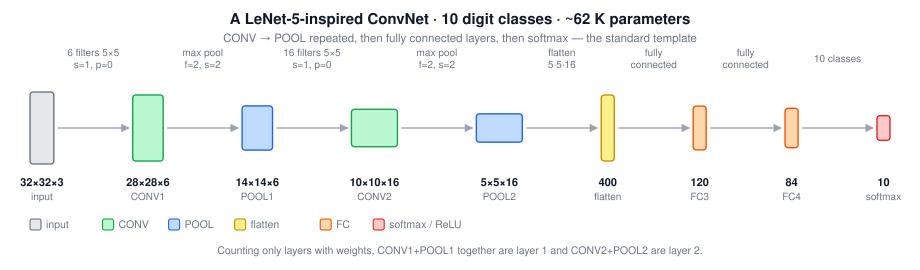

A fully connected layer is exactly the standard dense layer from earlier courses: all 400 flattened units connect to each of the 120 units, with a weight matrix and a bias vector.

### 8.3 Where the Parameters Live

| Layer | Activation shape | Activation size | Parameters |
|---|---|---:|---:|
| Input | $32 \times 32 \times 3$ | 3,072 | 0 |
| CONV1 | $28 \times 28 \times 6$ | 4,704 | 456 |
| POOL1 | $14 \times 14 \times 6$ | 1,176 | 0 |
| CONV2 | $10 \times 10 \times 16$ | 1,600 | 2,416 |
| POOL2 | $5 \times 5 \times 16$ | 400 | 0 |
| FC3 | 120 | 120 | 48,120 |
| FC4 | 84 | 84 | 10,164 |
| Softmax | 10 | 10 | 850 |

The counts: CONV1 is $(5 \times 5 \times 3 + 1) \times 6 = 456$; CONV2 is $(5 \times 5 \times 6 + 1) \times 16 = 2{,}416$; FC3 is $400 \times 120 + 120 = 48{,}120$; FC4 is $120 \times 84 + 84 = 10{,}164$; softmax is $84 \times 10 + 10 = 850$.

Three observations:

- **Pooling layers have zero parameters.**
- **Convolutional layers have remarkably few parameters** relative to their activation size, while **most parameters live in the fully connected layers** (here about 59,000 of roughly 62,000).
- **Activation size falls gradually**, from 4,704 down to 1,600 down to 84. Dropping it too fast is usually bad for performance.

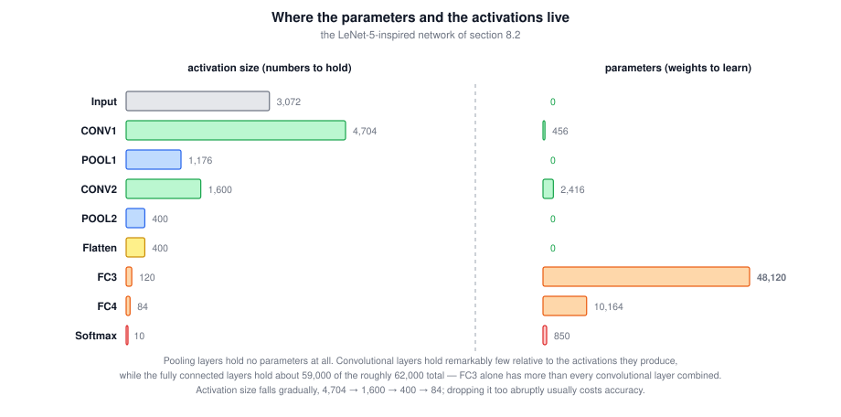

### 8.4 Common Patterns and Layer Counting

Two conventions exist for what counts as a layer. Since a pooling layer has no weights, the convention used here is to **count only layers with parameters** and group a CONV with the POOL that follows it. So CONV1 and POOL1 together are Layer 1. Some papers count the pooling layer separately, so read layer counts with care.

A very common architectural template:

$$\boxed{\left[\left[\text{CONV} \rightarrow \text{RELU}\right] \times a \rightarrow \text{POOL}\right] \times b \;\rightarrow\; \left[\text{FC}\right] \times c \;\rightarrow\; \text{softmax}}$$

That is: one or more convolutional layers followed by a pooling layer, repeated, then a few fully connected layers, then a softmax.

General trends as you go deeper:

| Quantity | Trend |
|---|---|
| Height and width $n_H, n_W$ | Decrease |
| Channels $n_c$ | Increase |
| Activation size | Decreases gradually |
| Receptive field per unit | Grows |

Practical advice on hyperparameters: rather than inventing your own settings for filter size, stride, padding, and filter count, look in the literature for an architecture that worked for a similar problem and start from that. Choices that worked for someone else have a good chance of working for you.

### 8.5 Tricky Interview Questions

**Q: In the LeNet-5-inspired network, which layers hold most of the parameters?**  
The fully connected layers. FC3 alone has 48,120 parameters, more than all convolutional layers combined.

**Q: Why group a CONV and the following POOL into one layer?**  
Because layer counts conventionally refer to layers with weights, and pooling has none. Be aware that some papers count them separately.

**Q: What happens if the activation size drops too quickly across layers?**  
Performance usually suffers. Each layer discards information, and collapsing the representation too early leaves too little for the later layers to work with.

**Q: Why does the channel count typically grow as spatial size shrinks?**  
Deeper layers detect more numerous and more abstract features, so more channels are needed, while spatial precision becomes less important. Growing channels also partly offsets the loss of activation size.

**Q: An input is $32 \times 32 \times 3$, and CONV1 uses $f=5$, $s=1$, $p=0$ with 6 filters. Give the output shape and parameter count.**  
Output $28 \times 28 \times 6$; parameters $(5 \times 5 \times 3 + 1) \times 6 = 456$. A common error is computing $(5 \times 5 + 1) \times 6 = 156$, which forgets the input channels.

**Q: How do you know which hyperparameters to pick for a new vision task?**  
Start from a published architecture for a similar task rather than designing from scratch. The literature encodes a lot of accumulated tuning effort.

---

## 9. Why Convolutions Work

Convolutional layers have two advantages over fully connected layers: **parameter sharing** and **sparsity of connections**.

### 9.1 The Parameter Comparison

Take a $32 \times 32 \times 3$ input and a layer with 6 filters of $5 \times 5$, giving a $28 \times 28 \times 6$ output.

| Approach | Parameter count |
|---|---:|
| Fully connected: 3,072 units to 4,704 units | $3{,}072 \times 4{,}704 \approx 14{,}000{,}000$ |
| Convolutional: $(5 \times 5 \times 3 + 1) \times 6$ | 456 |

Fourteen million parameters for a very small image, versus 456. For a $1000 \times 1000$ image the dense weight matrix becomes impossibly large, while the convolutional layer stays at 456.

### 9.2 Parameter Sharing

Motivation: **a feature detector useful in one part of the image is probably useful in another part.** If a $3 \times 3$ filter detects vertical edges in the upper-left corner, the same filter is likely useful in the lower-right corner.

So the same small set of weights computes every output position. In a $4 \times 4$ output from a $3 \times 3$ filter, nine weights are shared across all 16 output elements. This holds for low-level features like edges and also for higher-level features like an eye that indicates a face.

Even if the corners of your images have somewhat different distributions, they are usually similar enough that sharing detectors across the image works fine.

### 9.3 Sparsity of Connections

Each output element of a $3 \times 3$ convolution depends on only 9 input values. In a $6 \times 6$ input with 36 values, that output unit is connected to 9 of the 36 and the other 27 have **no effect on it at all**. A neighboring output element depends on its own 9 inputs.

Compare with a dense layer, where every output depends on every input. Sparsity is the second mechanism that keeps the parameter count and the computation low.

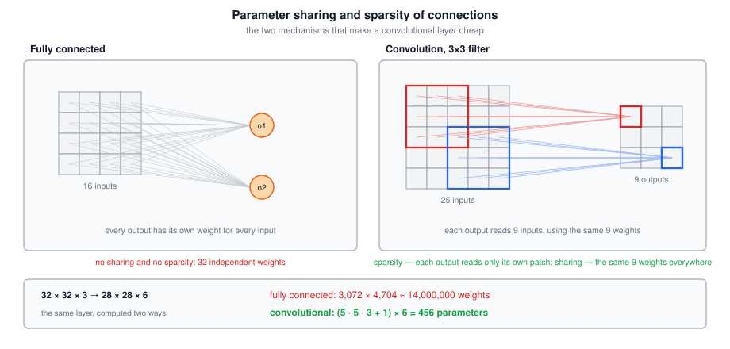

### 9.4 Translation Invariance

A picture of a cat shifted a few pixels to the right is still clearly a cat and should get the same label. Applying the same filter at all positions encodes this: a shifted input produces essentially shifted features, so the network naturally captures the desirable property of translation invariance in both early and late layers.

Strictly, convolution provides translation **equivariance** (shift the input and the feature map shifts too). Invariance in the final prediction comes from combining that with pooling and, ultimately, the global aggregation before the classifier.

### 9.5 The Payoff

Fewer parameters means the network can be trained with smaller training sets and is less prone to overfitting. That is the whole argument for convolutional layers in one sentence.

### 9.6 Training a ConvNet

Nothing new is required; the training procedure is the one you already know.

1. Collect a labeled training set $\{(x^{(1)}, y^{(1)}), \dots, (x^{(m)}, y^{(m)})\}$, where each $x$ is an image and each $y$ is a binary label or one of $K$ classes.
2. Choose an architecture: convolutional and pooling layers, then fully connected layers, then a softmax output producing $\hat{y}$.
3. Randomly initialize all parameters $W$ and $b$ of the convolutional and fully connected layers.
4. Define the cost as the average loss over the training set:

$$\boxed{J = \frac{1}{m}\sum_{i=1}^{m}\mathcal{L}\!\left(\hat{y}^{(i)}, y^{(i)}\right)}$$

5. Minimize $J$ with gradient descent or a better optimizer: momentum, RMSProp, or Adam.

Every technique from earlier courses still applies: mini-batches, learning rate decay, batch normalization, dropout in the fully connected layers, L2 regularization, and data augmentation.

### 9.7 Tricky Interview Questions

**Q: What are the two mechanisms that let a convolutional layer use so few parameters?**  
Parameter sharing (the same filter is applied at every position) and sparsity of connections (each output depends on only a small patch of the input).

**Q: True or false: sparsity of connections and weight sharing make it possible to train a network with smaller training sets.**  
True. Weight sharing sharply reduces the parameter count, and sparse connections reduce it further, so less data is needed to constrain the model.

**Q: What justifies sharing weights across spatial positions?**  
The observation that a feature detector useful in one part of the image is usually useful in other parts, so separate detectors per location are unnecessary.

**Q: What exactly does sparsity of connections mean?**  
Each output activation depends on only a small number of input activations, the ones inside its filter window. All other inputs have zero influence on it.

**Q: Do convolutions give invariance or equivariance to translation?**  
Convolution itself is equivariant: shifting the input shifts the feature map. Approximate invariance in the output comes from pooling and the global aggregation before the classifier.

**Q: What changes about training when you switch from dense to convolutional layers?**  
Nothing in the training procedure. You still define a cost function and minimize it with gradient descent or Adam; only the parameter structure and the way gradients are computed inside the layer differ.

---

## 10. 1-D and 3-D Convolutions

Almost everything in these notes is 2-D because images are everywhere. The same sliding-filter idea applies to 1-D sequences and to 3-D volumes. The output-size formula is reused once per spatial axis.

### 10.1 From 2-D to 1-D

A 2-D reminder, with valid convolution and stride 1:

$$\boxed{14 \times 14 \;*\; 5 \times 5 \;=\; 10 \times 10}$$

With channels and several filters: $14 \times 14 \times 3$ convolved with 16 filters of $5 \times 5 \times 3$ gives $10 \times 10 \times 16$.

Now drop one spatial axis. An **EKG** (electrocardiogram) is a time series of voltages from one electrode on the chest: each peak is a heartbeat. The input is a length-14 vector rather than a $14 \times 14$ image, and the filter is a length-5 tap rather than a $5 \times 5$ patch. Slide that tap along the signal:

$$\boxed{14 \;*\; 5 \;=\; 10}$$

The same 5-tap detector is reused at every time offset, so a heartbeat pattern can fire wherever it occurs. With 16 filters the output is $10 \times 16$. The next layer takes that $10 \times 16$ volume, convolves with a length-5 filter that spans the 16 channels, and if you use 32 filters you get $6 \times 32$ — the 1-D analogue of $10 \times 10 \times 16 \;*\; 5 \times 5 \times 16$ with 32 filters giving $6 \times 6 \times 32$.

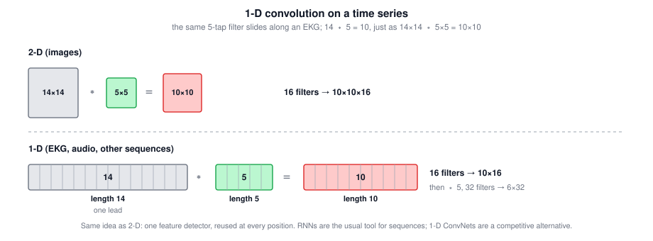

One electrode is one channel. Multiple leads would be multiple channels, matching the filter's last axis exactly as RGB does in 2-D.

RNNs (and later LSTMs) are the models built specifically for sequences. 1-D ConvNets are a competitive alternative: local patterns with shared taps, no recurrence. The next course on sequence models compares the two.

### 10.2 From 2-D to 3-D

A **CT scan** is a stack of X-ray slices through the body: height, width, **and** depth are all spatial. A movie is the same idea with time as the third axis (detecting motion or actions). Neither is a cube in general — height, width, and depth can all differ — but $14 \times 14 \times 14$ is enough to see the arithmetic.

A 3-D filter is then $5 \times 5 \times 5$. Slide it through the volume:

$$\boxed{14 \times 14 \times 14 \;*\; 5 \times 5 \times 5 \;=\; 10 \times 10 \times 10}$$

If the volume has one channel (one CT intensity), each filter is $5 \times 5 \times 5 \times 1$. Sixteen such filters give $10 \times 10 \times 10 \times 16$. The next layer matches those 16 channels with filters of $5 \times 5 \times 5 \times 16$; 32 of them give $6 \times 6 \times 6 \times 32$.

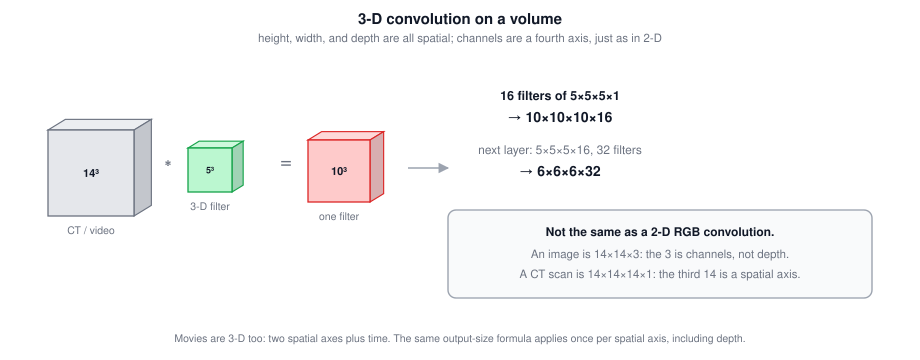

**Do not confuse this with section 5.** An RGB image $14 \times 14 \times 3$ is a 2-D convolution over a volume whose last axis is **channels**. A CT volume $14 \times 14 \times 14 \times 1$ is a 3-D convolution whose third 14 is a **spatial** axis. The filter must still match the channel count; that is a fourth axis, not the third.

### 10.3 The Same Formula, Once Per Axis

Valid convolution, stride $s$, padding $p$:

$$\boxed{n' \;=\; \left\lfloor \frac{n + 2p - f}{s} \right\rfloor + 1 \qquad \text{applied independently to every spatial axis}}$$

Channels never go through that formula. They collapse inside each filter and are replaced by the filter count.

| Data | Spatial axes | Example input | Example filter | 16 filters, $p=0$, $s=1$ |
|---|---|---|---|---|
| Image (2-D) | $H, W$ | $14 \times 14 \times 3$ | $5 \times 5 \times 3$ | $10 \times 10 \times 16$ |
| EKG (1-D) | $T$ | $14 \times 1$ | $5 \times 1$ | $10 \times 16$ |
| CT / video (3-D) | $H, W, D$ | $14 \times 14 \times 14 \times 1$ | $5 \times 5 \times 5 \times 1$ | $10 \times 10 \times 10 \times 16$ |

Worked 3-D example with stride: input $64 \times 64 \times 64 \times 3$, 16 filters of $4 \times 4 \times 4$ (so $4 \times 4 \times 4 \times 3$), $p = 0$, $s = 2$:

$$\left\lfloor \frac{64 - 4 + 0}{2} \right\rfloor + 1 \;=\; 31 \qquad \Rightarrow \qquad 31 \times 31 \times 31 \times 16$$

Traps: $61 \times 61 \times 61$ is $n - f + 1$ with the stride forgotten; $31 \times 31 \times 31 \times 3$ keeps the input channel count instead of the filter count.

### 10.4 Tricky Interview Questions

**Q: A length-14 EKG is convolved with a length-5 filter, 16 filters, valid, stride 1. Output shape?**  
$10 \times 16$. Same arithmetic as $14 \times 14 \;*\; 5 \times 5$ giving $10 \times 10$, with the extra axis being the filter count.

**Q: The next 1-D layer takes $10 \times 16$ and uses 32 filters of length 5. Shape?**  
$6 \times 32$. The 5 must span 16 input channels, just as a 2-D $5 \times 5$ filter spans the previous layer's channels.

**Q: Why use a 1-D ConvNet on an EKG instead of a fully connected net?**  
The same heartbeat detector should fire at every time offset. Parameter sharing and sparsity of connections still apply; only the spatial dimension is time.

**Q: Are 1-D ConvNets the usual model for sequences?**  
RNNs and LSTMs are the models designed for sequences. 1-D convolutions are a reasonable alternative when the patterns are local. The comparison is the next course.

**Q: Input $14 \times 14 \times 14$, one $5 \times 5 \times 5$ filter, valid, stride 1. Output?**  
$10 \times 10 \times 10$. With 16 filters: $10 \times 10 \times 10 \times 16$.

**Q: Is $14 \times 14 \times 3$ (RGB) a 3-D convolution?**  
No. Height and width are spatial; 3 is channels. A 3-D convolution has three spatial axes (CT depth, or time in a video) *plus* channels.

**Q: $64 \times 64 \times 64 \times 3$ input, 16 filters of $4 \times 4 \times 4$, $p = 0$, $s = 2$. Output volume?**  
$31 \times 31 \times 31 \times 16$. Each spatial axis: $\lfloor (64-4)/2 \rfloor + 1 = 31$. Channels become 16, not 3, and not $64-4+1 = 61$.

**Q: Must a 3-D volume be a cube?**  
No. Height, width, and depth can all differ, just as a 2-D image need not be square.

---

## 11. Beyond the Basics

Extra context that makes the building blocks easier to use in practice.

### 11.1 Receptive Field

The **receptive field** of a unit is the region of the original input that can influence it. Stacking small filters grows it quickly:

| Stack (stride 1) | Receptive field | Parameters per channel pair |
|---|---|---:|
| One $5 \times 5$ conv | $5 \times 5$ | 25 |
| Two $3 \times 3$ convs | $5 \times 5$ | 18 |
| Three $3 \times 3$ convs | $7 \times 7$ | 27 |
| One $7 \times 7$ conv | $7 \times 7$ | 49 |

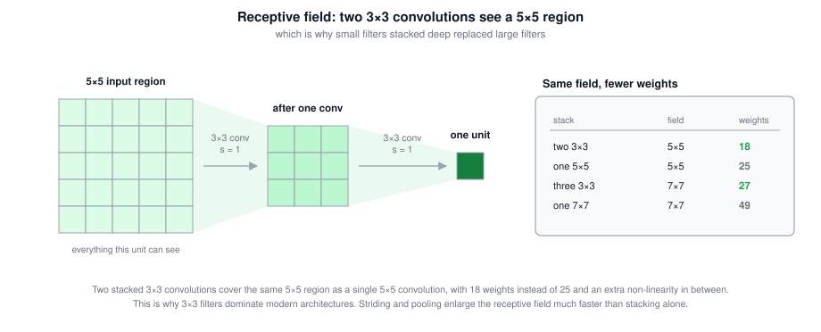

Two stacked $3 \times 3$ convolutions see the same $5 \times 5$ region as one $5 \times 5$ convolution, with fewer parameters and an extra non-linearity in between. This is why $3 \times 3$ filters dominate modern architectures. Striding and pooling enlarge the receptive field much faster.

### 11.2 $1 \times 1$ Convolutions

A $1 \times 1$ filter looks at a single spatial position but spans all input channels, so it computes a learned linear combination across channels followed by a non-linearity. It leaves the spatial size unchanged and is used to reduce or expand the channel count cheaply, which is why it is sometimes called a network-in-network or a channel-wise bottleneck.

### 11.3 Computational Cost

The multiply-accumulate count for a convolutional layer is:

$$\boxed{\text{MACs} = n_H^{[l]} \times n_W^{[l]} \times n_c^{[l]} \times \left(f^{[l]} \times f^{[l]} \times n_c^{[l-1]}\right)}$$

Note that although convolutional layers hold few parameters, they can dominate the compute, while fully connected layers hold most parameters but are cheap to evaluate. Parameter count and FLOP count are different budgets.

### 11.4 Implementation Note

Convolution is usually not implemented as literal nested loops. The common trick is **im2col**: extract every filter-sized patch into a column of a large matrix, then compute the whole layer as one dense matrix multiply, which maps efficiently onto GPU kernels. FFT-based and Winograd algorithms are also used for particular filter sizes.

### 11.5 Common Variants

| Variant | What changes | Why |
|---|---|---|
| Dilated (atrous) | Filter taps spread apart by a dilation rate | Larger receptive field at no extra parameter cost |
| Depthwise separable | One filter per input channel, then a $1 \times 1$ conv | Far fewer parameters and FLOPs; used in mobile architectures |
| Grouped | Input channels split into groups, each with its own filters | Cheaper; originally used to split a model across GPUs |
| Transposed ("deconvolution") | Increases spatial size instead of reducing it | Upsampling for segmentation and generative models |

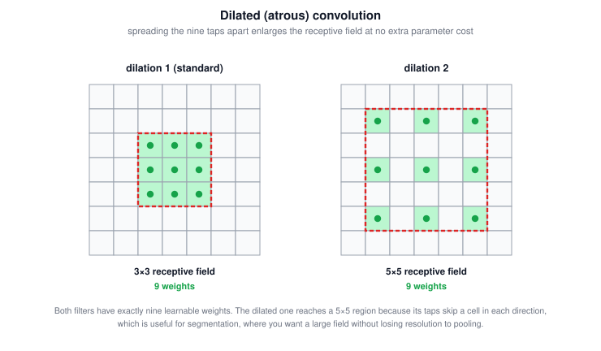

---

## 12. Quick Reference

Output shape of a convolutional layer:

$$\boxed{n^{[l]} = \left\lfloor \frac{n^{[l-1]} + 2p^{[l]} - f^{[l]}}{s^{[l]}} + 1 \right\rfloor \quad \text{per spatial dimension}, \qquad n_c^{[l]} = \text{number of filters}}$$

The same $n^{[l]}$ formula is used once for a 1-D signal, twice for an image, three times for a CT / video volume. Channels are never an $n^{[l]}$ axis.

Parameter count of a convolutional layer:

$$\boxed{\left(f^{[l]} \times f^{[l]} \times n_c^{[l-1]} + 1\right) \times n_c^{[l]}}$$

In 1-D drop one $f$; in 3-D add a third $f$. The $n_c^{[l-1]}$ factor is still the channel match.

Padding for a size-preserving (same) convolution with stride 1:

$$\boxed{p = \frac{f - 1}{2}}$$

| Layer type | Parameters | Hyperparameters | Effect on shape |
|---|---|---|---|
| CONV | $W$ (filters), $b$ (one per filter) | $f$, $p$, $s$, number of filters | Spatial size per the formula; channels become the filter count |
| POOL | None | $f$, $s$, max or average | Spatial size per the formula; channels unchanged |
| FC | $W$, $b$ | Number of units | Flattens to a vector of chosen length |

| Symptom | Likely cause | Fix |
|---|---|---|
| Representation collapses in a deep stack | Valid convolutions shrinking every layer | Use same padding |
| Border information appears to be ignored | Corner pixels appear in few windows | Add padding |
| Output size is not an integer | Non-divisible stride | Floor the result, or adjust $p$, $f$, or $s$ |
| Parameter count much larger than expected | Forgot the $n_c^{[l-1]}$ factor in each filter | Use $(f \cdot f \cdot n_c^{[l-1]} + 1) \cdot n_c^{[l]}$ |
| Most parameters in one layer | A large fully connected layer after flattening | Pool more before flattening, or use global average pooling |
| Too many parameters for the dataset | Dense layers where convolution would do | Use convolutional layers to share weights across positions |
| Called a $14 \times 14 \times 3$ RGB conv “3-D” | Channels mistaken for a spatial axis | 2-D conv over a volume; true 3-D has $H, W, D$ plus channels |
| 3-D output channels equal the input’s 3 | Forgot that channels become the filter count | $n_c^{[l]} =$ number of filters |

Core principle: convolution turns a huge dense weight matrix into a small filter reused at every position, so the parameter count depends on what a feature looks like, not on how big the image is.

---
