# Deep Convolutional Neural Networks: Case Studies

A compact reference for the architectures that shaped modern computer vision:
- Why studying case studies is worth the time;
- Classic networks: LeNet-5, AlexNet, VGG-16;
- Residual networks and skip connections;
- $1 \times 1$ convolutions and network-in-network;
- Inception modules and bottleneck layers;
- MobileNet and depthwise separable convolutions;
- EfficientNet and compound scaling;
- Using open-source implementations;
- Transfer learning from pretrained weights;
- Data augmentation;
- The state of computer vision and benchmark tricks.

Main idea: learn the arrangements that work, then reuse someone else's architecture and weights instead of starting from scratch.

---

## 1. Why Look at Case Studies

The previous notes covered convolutional, pooling, and fully connected layers. The past several years of computer vision research have been largely about **how to put those blocks together** into effective networks. Reading effective architectures is a good way to build intuition, in the same way that many people learn to write code by reading other people's code.

### 1.1 What You Gain

- **Transferable architectures.** A network that works well on one vision task often works well on others. If someone found an architecture that recognizes cats, dogs, and people well, you may be able to apply it to your self-driving car problem.
- **Readable literature.** After seeing a few of these, the original papers become approachable.
- **Cross-domain ideas.** Skip connections and bottleneck layers have made their way into speech, language, and other fields, so the ideas are useful even outside vision.

### 1.2 Roadmap

| Group | Networks | Central idea |
|---|---|---|
| Classic | LeNet-5, AlexNet, VGG-16 | Stacked CONV/POOL blocks, then FC layers |
| ResNet | ResNet-50/101/152 | Skip connections make very deep networks trainable |
| Inception | GoogLeNet, Inception v2–v4 | Use several filter sizes in one layer; use $1\times1$ bottlenecks to control cost |
| Efficient | MobileNet v1/v2, EfficientNet | Cheap convolutions and principled scaling for constrained devices |

### 1.3 Tricky Interview Questions

**Q: Why study architectures instead of just designing your own?**  
Because architectures transfer across tasks, and the published ones encode a great deal of accumulated tuning. Starting from a proven architecture is usually faster and better than designing from scratch.

**Q: Which of these do you typically see in a ConvNet: FC layers in the last few layers, multiple CONV layers followed by a POOL layer, FC layers in the first few layers, multiple POOL layers followed by a CONV layer?**  
The first two. Fully connected layers appear at the end after flattening, and one or more CONV layers followed by a POOL layer is the standard repeating unit. FC layers early would destroy spatial structure and explode the parameter count, and stacking several POOL layers before a CONV is not a pattern anyone uses.

**Q: Reading order for the classic papers?**  
AlexNet first (easiest), then VGG, then LeNet-5. For LeNet-5, focus on sections 2 and 3; the later material on graph transformer networks is not used today.

---

## 2. Classic Networks

### 2.1 LeNet-5

**The main idea**: recognize handwritten digits from $32 \times 32 \times 1$ grayscale images (LeCun et al., 1998).

**NN architecture**:

| Layer | Hyperparameters | Output |
|---|---|---|
| Input | — | $32 \times 32 \times 1$ |
| CONV1 | 6 filters $5\times5$, $s=1$, valid | $28 \times 28 \times 6$ |
| POOL1 | **average** pool, $f=2$, $s=2$ | $14 \times 14 \times 6$ |
| CONV2 | 16 filters $5\times5$, $s=1$, valid | $10 \times 10 \times 16$ |
| POOL2 | **average** pool, $f=2$, $s=2$ | $5 \times 5 \times 16 = 400$ |
| FC3 | 400 $\rightarrow$ 120 | 120 |
| FC4 | 120 $\rightarrow$ 84 | 84 |
| Output | 10 digit classes | $\hat{y}$ |

About **60,000 parameters**, tiny by modern standards. Today networks with 10 million to 100 million parameters are routine, so this is roughly a thousand times smaller than common networks.

The pattern to notice: as you go deeper, height and width shrink ($32 \to 28 \to 14 \to 10 \to 5$) while channels grow ($1 \to 6 \to 16$). And the arrangement CONV $\to$ POOL $\to$ CONV $\to$ POOL $\to$ FC $\to$ FC $\to$ output is still common.

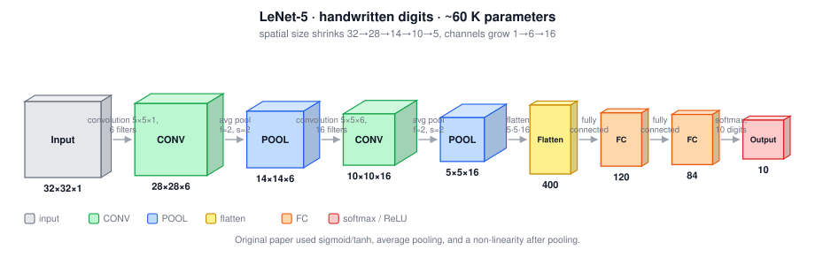

In every diagram below, box **height** stands for spatial size ($n_H \times n_W$) and box **width** for the channel count ($n_C$), so the shrink-and-widen trend is visible at a glance. The colour key is the same throughout: **gray** input, **green** convolution, **blue** pooling, **yellow** flatten, **orange** fully connected, **red** softmax / ReLU / output.

> **Historical details** The paper uses **sigmoid and tanh**, not ReLU, and applies a **non-linearity after pooling**. To save computation on 1998 hardware, different filters looked at different subsets of the input channels rather than all of them, a complication no modern implementation has. The output layer used a classifier that is not used today; a modern version would use a 10-way softmax.

### 2.2 AlexNet

(Krizhevsky, Sutskever, and Hinton)

**NN architecture**:

| Layer | Hyperparameters | Output |
|---|---|---|
| Input | — | $227 \times 227 \times 3$ |
| CONV | 96 filters $11\times11$, $s=4$ | $55 \times 55 \times 96$ |
| MAX POOL | $f=3$, $s=2$ | $27 \times 27 \times 96$ |
| CONV | 256 filters $5\times5$, same | $27 \times 27 \times 256$ |
| MAX POOL | $f=3$, $s=2$ | $13 \times 13 \times 256$ |
| CONV | 384 filters $3\times3$, same | $13 \times 13 \times 384$ |
| CONV | 384 filters $3\times3$, same | $13 \times 13 \times 384$ |
| CONV | 256 filters $3\times3$, same | $13 \times 13 \times 256$ |
| MAX POOL | $f=3$, $s=2$ | $6 \times 6 \times 256 = 9216$ |
| FC | 9216 $\rightarrow$ 4096 | 4096 |
| FC | 4096 $\rightarrow$ 4096 | 4096 |
| Softmax | 1000 classes | $\hat{y}$ |

Input is $227 \times 227 \times 3$. The paper says $224 \times 224 \times 3$, but the layer sizes only work out with 227.

The arithmetic: $\frac{227-11}{4}+1 = 55$, then $\frac{55-3}{2}+1 = 27$, then $\frac{27-3}{2}+1 = 13$, then $\frac{13-3}{2}+1 = 6$.

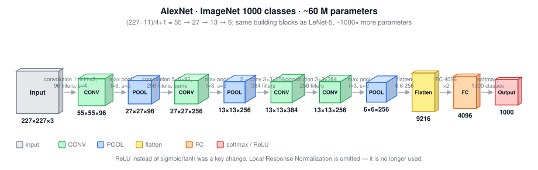

About **60 million parameters**, a thousand times more than LeNet-5. The architecture is similar in spirit to LeNet but much bigger, trained on ImageNet, and it used **ReLU**, which was a major improvement.

Its historical importance is hard to overstate: deep learning was already gaining traction in speech recognition, but this was the paper that convinced the computer vision community to take deep learning seriously, and the effect spread well beyond vision.

> **Historical details** GPUs were slow, so training was split across **two GPUs** with a carefully designed communication scheme between them. The original architecture also included **Local Response Normalization** (LRN): at one $(h, w)$ position, look down all 256 channels and normalize those numbers, the motivation being that you may not want too many neurons at one position with very high activation. Later researchers found this does not help much, and it is not used today.

### 2.3 VGG-16

**The main idea**: instead of many arbitrary hyperparameters, use one simple rule everywhere (Simonyan and Zisserman).

$$\boxed{\text{All CONV: } 3\times3, \; s=1, \; \text{same} \qquad \text{All MAX POOL: } 2\times2, \; s=2}$$

| Stage | Layers | Output |
|---|---|---|
| Input | — | $224 \times 224 \times 3$ |
| CONV 64 $\times 2$ | two $3\times3$ conv, 64 filters | $224 \times 224 \times 64$ |
| POOL | | $112 \times 112 \times 64$ |
| CONV 128 $\times 2$ | | $112 \times 112 \times 128$ |
| POOL | | $56 \times 56 \times 128$ |
| CONV 256 $\times 3$ | | $56 \times 56 \times 256$ |
| POOL | | $28 \times 28 \times 256$ |
| CONV 512 $\times 3$ | | $28 \times 28 \times 512$ |
| POOL | | $14 \times 14 \times 512$ |
| CONV 512 $\times 3$ | | $14 \times 14 \times 512$ |
| POOL | | $7 \times 7 \times 512$ |
| FC | | 4096 |
| FC | | 4096 |
| Softmax | 1000 classes | $\hat{y}$ |

The **16** refers to the 16 layers that have weights (13 convolutional plus 3 fully connected). About **138 million parameters**, large even by modern standards.

Two systematic principles make the architecture attractive:

- Pooling **halves** height and width each time: $224 \to 112 \to 56 \to 28 \to 14 \to 7$.
- Channels **double** with each stack of conv layers: $64 \to 128 \to 256 \to 512$, then stop (the authors judged 512 large enough).

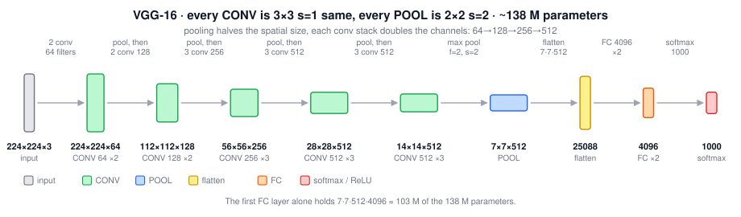

VGG-19 is a bigger variant, but VGG-16 does almost as well, so most people use VGG-16. The main downside of both is the sheer number of parameters to train.

### 2.4 What the Classics Have in Common

| Trend | Direction |
|---|---|
| Height and width | Decrease with depth |
| Channels | Increase with depth |
| Layer pattern | One or more CONV, then POOL, repeated, then FC, then softmax |
| Parameter concentration | Mostly in the fully connected layers |

For VGG-16, the first fully connected layer alone accounts for $7 \times 7 \times 512 \times 4096 \approx 103$ million of the 138 million parameters. This concentration is what later architectures attacked with global average pooling.

### 2.5 Tricky Interview Questions

**Q: In LeNet-5, do channels increase and spatial size decrease as you go deeper?**  
Yes. Only valid convolutions were used, with no padding, so height and width shrink at every convolution and again at every pooling layer, while channels grow from 1 to 6 to 16.

**Q: What made AlexNet work where LeNet-5 could not scale?**  
It was much bigger, trained on a far larger dataset (ImageNet), and used ReLU instead of sigmoid/tanh. The building blocks were similar; the scale and the activation function were the difference.

**Q: What is the single design idea behind VGG?**  
Uniformity: every convolution is $3\times3$ same with stride 1, every pooling is $2\times2$ stride 2, spatial size halves at each pool, and channels double at each stack. That replaces a long list of per-layer hyperparameters with two rules.

**Q: Why does the number 16 appear in VGG-16?**  
It counts the layers with weights: 13 convolutional plus 3 fully connected. Pooling layers are not counted because they have no parameters.

**Q: Why is Local Response Normalization not used anymore?**  
It was found to give little benefit, and batch normalization later provided a more effective and better-understood form of normalization.

**Q: AlexNet's paper says $224\times224$ but the lecture says $227\times227$. Which is right?**  
The layer dimensions only work out with $227 \times 227$, given an $11\times11$ filter with stride 4 producing $55\times55$. The paper's 224 appears to be an error, or it assumes implicit padding.

---

## 3. Residual Networks (ResNets)

**The main idea**: Very deep plain networks are difficult to train. Skip connections fix that, and make networks of 100+ layers practical (He, Zhang, Ren, and Sun; their ResNet had 152 layers).

### 3.1 The Residual Block

In a plain network, going from $a^{[l]}$ to $a^{[l+2]}$ follows the **main path**:

$$z^{[l+1]} = W^{[l+1]}a^{[l]} + b^{[l+1]}, \qquad a^{[l+1]} = g\!\left(z^{[l+1]}\right)$$

$$z^{[l+2]} = W^{[l+2]}a^{[l+1]} + b^{[l+2]}, \qquad a^{[l+2]} = g\!\left(z^{[l+2]}\right)$$

In a residual block, copy $a^{[l]}$ forward and add it in **before** the final ReLU:

$$\boxed{a^{[l+2]} = g\!\left(z^{[l+2]} + a^{[l]}\right)}$$

Written out in full:

$$\boxed{a^{[l+2]} = g\!\left(W^{[l+2]}\,g\!\left(W^{[l+1]}a^{[l]} + b^{[l+1]}\right) + b^{[l+2]} + a^{[l]}\right)}$$

That extra path is called a **shortcut** or a **skip connection**: information from $a^{[l]}$ can skip over two layers instead of having to pass through them. The injection point matters — $a^{[l]}$ is added after the linear part but before the ReLU.

![A plain two-layer path compared with a residual block. The shortcut carries a[l] past both layers and is added before the final ReLU.](figures/resnet-block.svg)

### 3.2 From Plain Network to ResNet

Take a plain network and add a shortcut across every pair of layers. A stack of five such blocks is a residual network. That is the whole construction: **ResNets are many residual blocks stacked together.**

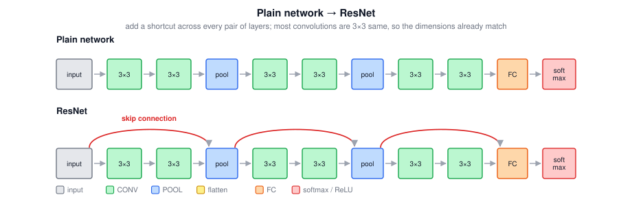

### 3.3 The Problem It Solves

In theory, a deeper network should never be worse: it could always set the extra layers to do nothing. In practice, with a plain network:

| | Behavior as depth increases |
|---|---|
| **Theory** | Training error decreases monotonically |
| **Practice** | Training error decreases for a while, then **increases** |

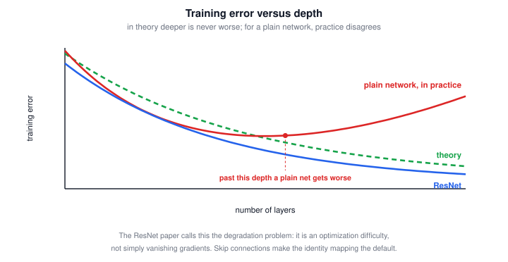

So beyond some depth, a plain network's optimizer simply has a much harder time, and training error gets *worse*. With a ResNet, training error keeps going down even past 100 layers. People have experimented with over 1,000 layers, though that is not much used in practice. At some point the benefit plateaus, but ResNets are remarkably effective at making very deep networks trainable.

Note that this is a statement about **training** error, that is, about optimization. Doing well on the training set is a prerequisite for doing well on dev and test sets, so making deep networks trainable is the first step.

### 3.4 Why ResNets Work

Suppose a big network outputs $a^{[l]}$, and you append two extra layers with a shortcut to get $a^{[l+2]}$. Assume ReLU activations throughout, so all activations are $\geq 0$ (with the possible exception of the input $x$).

$$a^{[l+2]} = g\!\left(W^{[l+2]}a^{[l+1]} + b^{[l+2]} + a^{[l]}\right)$$

Now consider what L2 regularization (weight decay) does: it shrinks $W^{[l+2]}$ toward zero. In the extreme, if $W^{[l+2]} = 0$ and $b^{[l+2]} = 0$:

$$a^{[l+2]} = g\!\left(a^{[l]}\right) = a^{[l]}$$

The last step holds because ReLU applied to a non-negative quantity returns it unchanged.

$$\boxed{\text{The identity function is easy for a residual block to learn}}$$

That is the key. Adding two layers **cannot hurt**, because the network can trivially recover the shallower network's behavior by zeroing the block. And if the extra units do learn something useful, performance improves. You get a floor of "no worse", with upside.

What goes wrong in very deep plain networks is precisely that it becomes **hard to even learn the identity function**, so extra layers make results worse rather than better. The main reason ResNets work is that the identity is so easy to represent that you are effectively guaranteed not to lose ground, and often you gain.

> **A nuance worth knowing.** The lectures attribute plain-network degradation to vanishing and exploding gradients. The ResNet paper calls it the **degradation problem** and argues it is *not* mainly vanishing gradients (batch normalization already addresses much of that) but an optimization difficulty: solvers struggle to find identity-like mappings through stacked non-linear layers. Skip connections help both by shortening gradient paths and by making the identity the default.

### 3.5 Matching Dimensions

The addition $z^{[l+2]} + a^{[l]}$ requires both to have the **same dimension**. This is why ResNets use a lot of **same convolutions**: preserving dimensions makes the shortcut addition valid.

When dimensions differ, for instance $a^{[l]}$ is 128-dimensional while $z^{[l+2]}$ is 256-dimensional, insert a matrix $W_s$:

$$\boxed{a^{[l+2]} = g\!\left(z^{[l+2]} + W_s\, a^{[l]}\right)}$$

Here $W_s$ is $256 \times 128$. It can be either:

- a matrix of **learned parameters**, or
- a **fixed** matrix that just implements zero padding, extending $a^{[l]}$ to 256 dimensions.

Either version works. In practice this is needed exactly where a pooling layer or a strided convolution changes the volume shape.

### 3.6 ResNet on Images

The convolutional ResNet looks like a plain network with the skip connections drawn in. Most convolutions are $3\times3$ **same** convolutions, which is what makes the equal-dimension addition work. These shortcuts connect convolutional layers, not fully connected ones. The overall pattern is CONV-CONV-CONV-POOL repeated, with a $W_s$ adjustment wherever a pooling layer changes the dimensions, and a fully connected layer with a softmax at the end.

> **Extra: the two block types.** Implementations distinguish an **identity block**, where input and output shapes match and the shortcut is a plain copy, from a **convolutional block**, where the shortcut passes through a $1\times1$ convolution (often strided) to fix the shape. Deeper ResNets (50, 101, 152) also use a three-layer **bottleneck** residual block, $1\times1 \rightarrow 3\times3 \rightarrow 1\times1$, which reduces channels, convolves cheaply, then restores them. ResNet-50 has about 25 million parameters, far fewer than VGG-16's 138 million, despite being three times deeper.

### 3.7 Tricky Interview Questions

**Q: Fill in the blanks: $a^{[l+2]} = g\!\left(W^{[l+2]}g\!\left(W^{[l+1]}a^{[l]} + b^{[l+1]}\right) + b^{[l+2]} + \underline{\quad}\right) + \underline{\quad}$**  
$a^{[l]}$ and $0$. The skip connection is added **inside** the activation function, before the ReLU, and nothing is added afterward.

**Q: Which curve is theory and which is practice, for training error versus number of layers in a plain network?**  
Theory is the monotonically decreasing curve; in practice trainin error decreases and then rises after a certain depth. Deeper plain networks eventually become harder to optimize.

**Q: What does a residual block learn in the worst case, and why does that matter?**  
The identity function. Since zeroing $W$ and $b$ makes $a^{[l+2]} = a^{[l]}$ under ReLU, adding the block cannot make the network worse, which is what removes the penalty for extra depth. (Quiz wording sometimes calls this the "best scenario"; the lecture's point is that identity is the **guaranteed floor**, and the hope is the block learns something more useful than identity.)

**Q: Why do ResNets use so many same convolutions?**  
Because the shortcut addition requires $z^{[l+2]}$ and $a^{[l]}$ to have identical dimensions, and same convolutions preserve height and width.

**Q: What do you do when the shortcut's dimensions do not match?**  
Multiply by a matrix $W_s$ that maps $a^{[l]}$ to the required dimension. It can be learned or a fixed zero-padding operation.

**Q: Where exactly is the shortcut added relative to the ReLU?**  
After the linear part and before the ReLU, so the sum $z^{[l+2]} + a^{[l]}$ is what passes through $g$.

**Q: Is the improvement from ResNets about bias or variance?**  
Primarily about optimization and therefore training error, which is a bias-side problem. Deeper trainable networks can then also generalize better, but the direct effect is making deep networks fit the training set at all.

---

## 4. Networks in Networks: $1 \times 1$ Convolutions

A $1\times1$ convolution sounds trivial and is not.

### 4.1 What It Actually Computes

On a $6\times6\times1$ input, a $1\times1\times1$ filter containing the number 2 just multiplies every pixel by 2. Useless.

On a $6\times6\times\mathbf{32}$ input, a $1\times1\times32$ filter does something meaningful. At each of the 36 spatial positions, it takes the element-wise product of the 32 input values with the 32 filter weights, sums them, and applies a ReLU, producing one number.

$$\boxed{6 \times 6 \times 32 \;*\; \left\{n_c' \text{ filters of } 1 \times 1 \times 32\right\} \;=\; 6 \times 6 \times n_c'}$$

The best way to think about it: a $1\times1$ convolution is a **small fully connected network applied independently at every spatial position**, taking $n_c$ inputs and producing $n_c'$ outputs. One filter is one neuron reading 32 numbers with 32 weights; $n_c'$ filters are $n_c'$ such neurons.

This idea is often called **network in network** (Lin, Chen, and Yan). Although the architecture in that paper is not widely used, the $1\times1$ convolution has been enormously influential, including in the Inception network.

### 4.2 Shrinking the Channel Dimension

This is the main practical use. Suppose you have a $28 \times 28 \times 192$ volume and the channel count has grown too large.

| Tool | Reduces | Leaves alone |
|---|---|---|
| Pooling layer | $n_H$, $n_W$ | $n_C$ |
| $1\times1$ convolution | $n_C$ | $n_H$, $n_W$ |

Using 32 filters of $1 \times 1 \times 192$ (the filter channels must match the input channels) gives $28 \times 28 \times 32$. Pooling cannot do this; a $1\times1$ convolution can. It is also free to keep the channel count the same, in which case its only effect is to add a non-linearity and let the network learn a more complex function of the same volume.

$$\boxed{28 \times 28 \times 192 \;\xrightarrow{\;32 \text{ filters of } 1\times1\times192\;}\; 28 \times 28 \times 32}$$

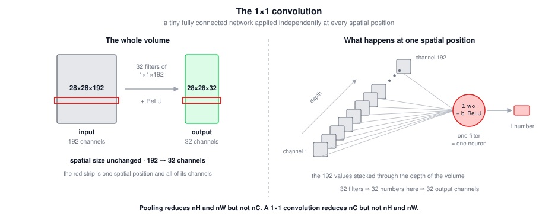

Channel reduction with $1\times1$ convolutions is what makes the Inception module affordable, as the next section shows.

### 4.3 Tricky Interview Questions

**Q: For an $n_H \times n_W \times n_C$ volume, which statements are true?**  
A 2D pooling layer can reduce $n_H$ and $n_W$ but not $n_C$. 
A $1\times1$ convolutional layer with few filters can reduce $n_C$ but not $n_H$ and $n_W$ (with stride 1 and no padding). 

**Q: Why is a $1\times1$ convolution not just multiplication by a scalar?**  
Because it spans all input channels. Each output value is a learned weighted sum of $n_C$ numbers followed by a non-linearity, which is a real computation. It is only trivial when $n_C = 1$, so in that case it is a multiplication by a scalar.

**Q: How many parameters does a $1\times1$ conv layer with 32 filters on a $28\times28\times192$ input have?**  
$(1 \times 1 \times 192 + 1) \times 32 = 6{,}176$.

**Q: What does "network in network" mean?**  
That a $1\times1$ convolution behaves like a tiny fully connected network applied at each spatial position, so you have a network embedded inside the larger network.

**Q: Can a $1\times1$ convolution increase the number of channels?**  
Yes. Use more filters than input channels. MobileNet v2's expansion layer does exactly this.

---

## 5. Inception Networks

**The main idea**: When designing a layer, you don't have to pick $1\times1$, $3\times3$, $5\times5$ convolution or pooling, just do them all and concatenate so that nn learns by itself which combination of filter to prioritize.

### 5.1 The Naive Inception Module

Input $28 \times 28 \times 192$. Run four branches in parallel and stack the outputs along the channel axis:

| Branch | Configuration | Output |
|---|---|---|
| $1\times1$ conv | 64 filters | $28 \times 28 \times 64$ |
| $3\times3$ conv | 128 filters, **same** | $28 \times 28 \times 128$ |
| $5\times5$ conv | 32 filters, **same** | $28 \times 28 \times 32$ |
| MAX POOL | $3\times3$, **same padding**, $s=1$, then 32 channels | $28 \times 28 \times 32$ |
| **Concatenated** | $64 + 128 + 32 + 32$ | $28 \times 28 \times 256$ |

Every branch must produce the same height and width so the channel concatenation works, which is why all convolutions are same convolutions. The pooling branch is unusual: max pooling normally downsamples, but here it needs **same padding and stride 1** so its output stays $28 \times 28$.

The point is that you do not commit to a filter size. The network learns which combination of filter sizes to rely on.

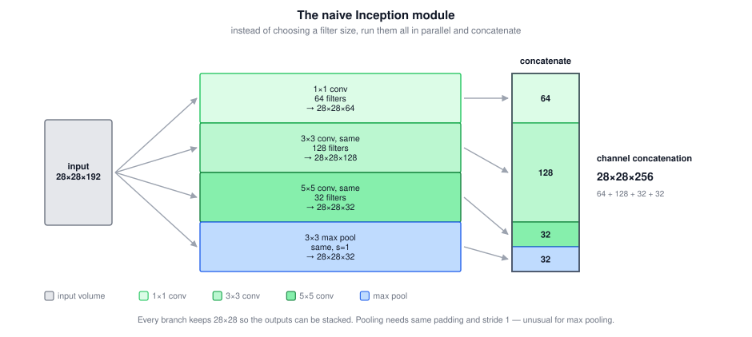

### 5.2 The Computational Cost Problem

Look at just the $5\times5$ branch: $28 \times 28 \times 192$ input, 32 filters of $5\times5\times192$, output $28 \times 28 \times 32$.

$$\text{multiplications} = \underbrace{28 \times 28 \times 32}_{\text{output values}} \times \underbrace{5 \times 5 \times 192}_{\text{per output value}} = 25{,}088 \times 4{,}800 \approx 120 \text{ million}$$

A modern computer can do 120 million multiplications, but it is expensive for one branch of one layer of one network.

### 5.3 The Bottleneck Layer

Insert a $1\times1$ convolution to shrink the channels first, then do the expensive convolution on the smaller volume:

$$28 \times 28 \times 192 \;\xrightarrow{\;16 \text{ filters } 1\times1\times192\;}\; 28 \times 28 \times 16 \;\xrightarrow{\;32 \text{ filters } 5\times5\times16\;}\; 28 \times 28 \times 32$$

Input and output dimensions are unchanged; only the intermediate volume is smaller. That intermediate volume is called a **bottleneck layer**, the narrowest part of the block, like the neck of a bottle: shrink the representation, then expand it again.

| Step | Multiplications |
|---|---:|
| $1\times1$ conv: $28 \times 28 \times 16$ outputs $\times\;(1 \times 1 \times 192)$ | $\approx 2.4$ million |
| $5\times5$ conv: $28 \times 28 \times 32$ outputs $\times\;(5 \times 5 \times 16)$ | $\approx 10.0$ million |
| **Total** | $\approx 12.4$ million |
| Naive version, for comparison | $\approx 120$ million |

$$\boxed{\text{about a factor of 10 cheaper, same input and output dimensions}}$$

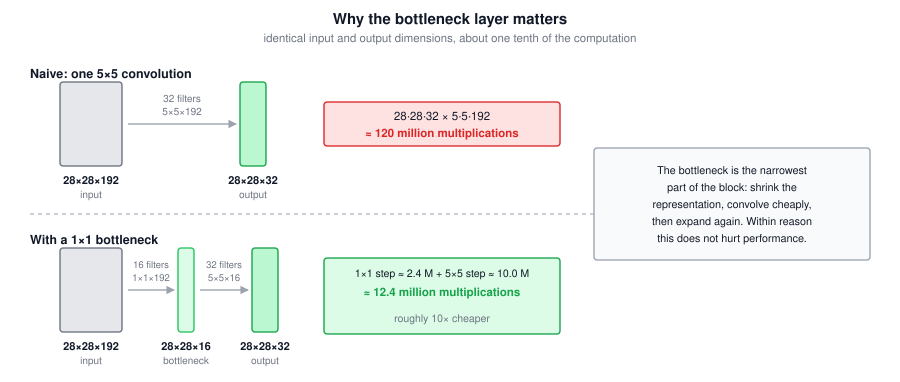

Additions cost about the same as multiplications, which is why counting only multiplications is enough for comparison.

Does shrinking the representation so aggressively hurt accuracy? Within reason, no. As long as the bottleneck is implemented sensibly, you can shrink the intermediate representation a lot without hurting performance, while saving a great deal of computation.

### 5.4 The Full Inception Module

Putting the bottlenecks into every branch that needs one:

| Branch | Configuration | Output |
|---|---|---|
| 1 | $1\times1$ conv, 64 filters | $28 \times 28 \times 64$ |
| 2 | $1\times1$ conv (96) $\rightarrow$ $3\times3$ conv (128), same | $28 \times 28 \times 128$ |
| 3 | $1\times1$ conv (16) $\rightarrow$ $5\times5$ conv (32), same | $28 \times 28 \times 32$ |
| 4 | $3\times3$ max pool (same, $s=1$) $\rightarrow$ $1\times1$ conv (32) | $28 \times 28 \times 32$ |
| **Concat** | $64 + 128 + 32 + 32$ | $28 \times 28 \times 256$ |

Two details worth noting:

- Branch 1 needs no bottleneck. There is no point putting a $1\times1$ conv before another $1\times1$ conv, so it is a single step.
- Branch 4's $1\times1$ conv comes **after** the pooling, not before. Max pooling preserves the channel count, so the pooling branch would otherwise contribute all 192 input channels and dominate the concatenated output. The $1\times1$ conv shrinks it to 32.

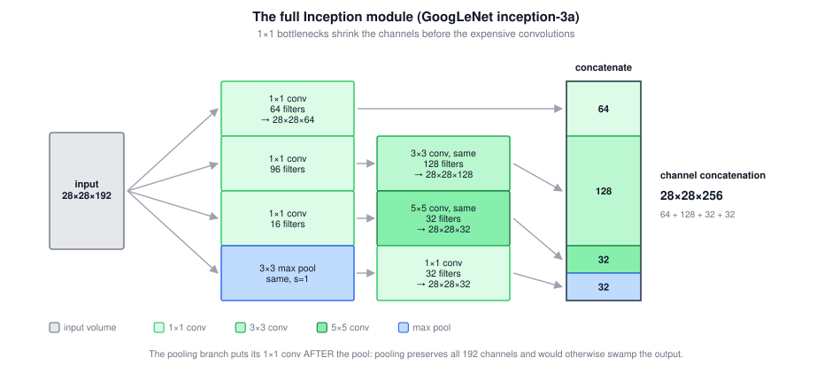

### 5.5 The Inception Network (GoogLeNet)

The Inception Network (GoogLeNet) is largely **the full inception module repeated many times**, with occasional extra max pooling layers between modules to reduce height and width. If you understand the inception module, you understand the inception network.

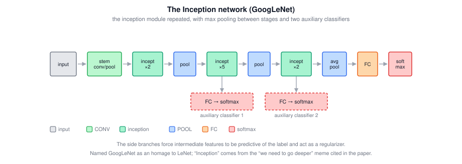

One extra detail from the paper: there are **side branches** (auxiliary classifiers). They take an intermediate hidden layer, pass it through a few fully connected layers, and attach their own softmax to predict the output label. Their purpose is to ensure that the features computed even at intermediate layers are not bad for predicting the class, and they appear to have a **regularizing effect** that helps prevent overfitting.

> **A nuance worth knowing.** The network was developed at Google and named **GoogLeNet** as an homage to LeNet. The name "Inception" comes from the paper's citation of the "we need to go deeper" meme from the film *Inception*, which is an actual reference in the bibliography.

Later versions build on the same idea: Inception v2, v3, v4, and **Inception-ResNet**, which combines inception modules with skip connections and sometimes works even better.

### 5.6 Tricky Interview Questions

**Q: Which statements about Inception networks are true?**  
Three are true: inception blocks use $1\times1$ convolutions to reduce the volume before the $3\times3$ and $5\times5$ convolutions; a single inception block lets the network use a combination of $1\times1$, $3\times3$, $5\times5$ convolutions and pooling; and stacking more inception blocks can improve performance but also risks overfitting and raises computational cost. The claim that inception networks act like dropout by randomly choosing an architecture each step is **false** — all branches are computed every time, nothing is random.

**Q: Why does the pooling branch need same padding and stride 1?**  
So its output stays $28 \times 28$ and can be concatenated with the other branches along the channel axis. Ordinary max pooling would shrink it and break the concatenation.

**Q: Why is there a $1\times1$ convolution after the pooling branch rather than before it?**  
Pooling preserves the channel count, so the branch would output all 192 input channels and swamp the concatenated volume. The $1\times1$ conv afterward reduces it to a modest number of channels.

**Q: How much does the bottleneck save on the $5\times5$ branch, and why doesn't it hurt accuracy?**  
About $120$ million down to $12.4$ million multiplications, roughly a factor of 10. Within reason, shrinking the intermediate representation does not appear to hurt performance.

**Q: Where does the naive module's cost come from?**  
From convolving a large filter over a volume with many channels: each output value costs $f \times f \times n_c^{[l-1]}$ multiplications, so the 192 input channels multiply into every one of the 25,088 output values.

**Q: What do the auxiliary side-branch classifiers do?**  
They force intermediate layers to produce features that are already predictive of the label, and they act as a regularizer.

---

## 6. MobileNet

**The main idea**: The networks so far are computationally expensive. MobileNet targets deployment on devices with weak CPUs or GPUs, such as mobile phones. Its central building block is the **depthwise separable convolution**.

### 6.1 The Cost of a Normal Convolution

Input $6 \times 6 \times 3$, filters $3\times3\times3$, 5 filters, no padding, stride 1, output $4 \times 4 \times 5$. Each output value requires 27 multiplications (one per filter parameter).

$$\boxed{\text{cost} = \underbrace{f \times f \times n_c}_{\text{filter params}} \times \underbrace{n_{out} \times n_{out}}_{\text{filter positions}} \times \underbrace{n_c'}_{\text{filters}}}$$

$$= (3 \times 3 \times 3) \times (4 \times 4) \times 5 = 27 \times 16 \times 5 = 2{,}160$$

### 6.2 Step 1: Depthwise Convolution

The depthwise separable convolution splits this into two steps. First, the **depthwise** convolution.

The filters are $f \times f$, **not** $f \times f \times n_c$, and there are exactly $n_c$ of them — one per input channel. Each filter is applied to **its own** input channel only.

So with a $6 \times 6 \times 3$ input and three $3\times3$ filters: the red filter slides over channel 1 doing **nine** multiplications per position (not 27), the green filter over channel 2, the blue filter over channel 3. Output is $4 \times 4 \times 3$.

$$\text{cost} = (3 \times 3) \times (4 \times 4) \times 3 = 9 \times 16 \times 3 = 432$$

The output has the same number of channels as the input, which is a defining property of this step. But that is not the output shape we want, so a second step is required.

### 6.3 Step 2: Pointwise Convolution

Take the $4 \times 4 \times 3$ intermediate volume and convolve it with $1 \times 1 \times n_c$ filters — a $1\times1$ convolution, exactly as in section 4. With 5 such filters:

$$4 \times 4 \times 3 \;\xrightarrow{\;5 \text{ filters of } 1\times1\times3\;}\; 4 \times 4 \times 5$$

$$\text{cost} = (1 \times 1 \times 3) \times (4 \times 4) \times 5 = 3 \times 16 \times 5 = 240$$

### 6.4 The Comparison

Both routes take a $6 \times 6 \times 3$ input to a $4 \times 4 \times 5$ output.

| Approach | Multiplications |
|---|---:|
| Normal convolution | 2,160 |
| Depthwise step | 432 |
| Pointwise step | 240 |
| **Depthwise separable total** | **672** |
| Ratio | $672 / 2160 \approx 0.31$ |

In general, the MobileNet authors showed:

$$\boxed{\frac{\text{depthwise separable cost}}{\text{normal convolution cost}} = \frac{1}{n_c'} + \frac{1}{f^2}}$$

Check: $\frac{1}{5} + \frac{1}{3^2} = 0.2 + 0.111 = 0.311$, matching the example.

In a realistic network $n_c'$ is much larger, say 512, so the first term becomes negligible:

$$\frac{1}{512} + \frac{1}{9} \approx 0.002 + 0.111 \approx \frac{1}{9}$$

So a depthwise separable convolution is roughly **ten times cheaper** than a normal convolution in typical settings, which is why it works as the building block of an efficient ConvNet.

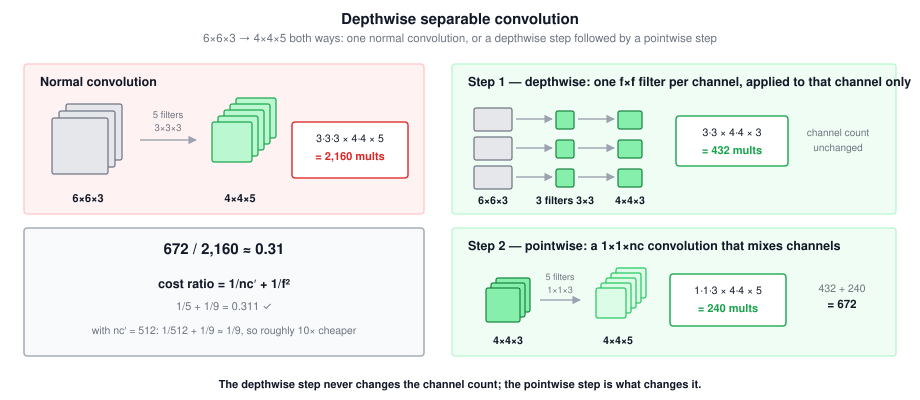

> **Diagram convention.** Depthwise separable convolutions work for any number of input channels: with 6 input channels you would have six $3\times3$ filters and a $4 \times 4 \times 6$ intermediate volume. Lecture diagrams keep drawing a stack of three filters regardless of the true channel count, purely to keep the pictures simple, so treat the icon as a symbol rather than a literal count.

### 6.5 MobileNet v1

The idea: **everywhere you previously used an expensive convolution, use a depthwise separable convolution instead.**

$$\boxed{\left[\text{depthwise} \rightarrow \text{pointwise}\right] \times 13 \;\rightarrow\; \text{POOL} \;\rightarrow\; \text{FC} \;\rightarrow\; \text{softmax}}$$

The v1 paper stacks this block 13 times, then finishes with the usual pooling, fully connected, and softmax layers.

### 6.6 MobileNet v2

Sandler et al. made two changes, giving the **bottleneck block**:

1. A **residual connection** (as in ResNet), passing the input directly to the output so gradients propagate backward more efficiently.
2. An **expansion** layer before the depthwise convolution, and the pointwise convolution renamed the **projection**.

The main path of a v2 bottleneck block, for an $n \times n \times 3$ input:

| Step | Operation | Output |
|---|---|---|
| Expansion | $1\times1\times3$ conv, 18 filters | $n \times n \times 18$ |
| Depthwise | $3\times3$ depthwise, with padding | $n \times n \times 18$ |
| Projection | $1\times1\times18$ conv, 3 filters | $n \times n \times 3$ |

An expansion factor of **6** is typical, which is why 3 channels become 18. Note that with padding the depthwise step preserves the spatial size, unlike the unpadded example in section 6.2.

$$\boxed{\left[\text{expansion} \rightarrow \text{depthwise} \rightarrow \text{projection}\right] \times 17 \;\rightarrow\; \text{POOL} \;\rightarrow\; \text{FC} \;\rightarrow\; \text{softmax}}$$

The v2 architecture repeats this block 17 times.

**Why the block is shaped this way** — it accomplishes two things at once:

- The **expansion** increases the size of the representation inside the block, so there is more computation there and the network can learn a **richer function**.
- The **projection** shrinks the output back down, so the activations passed to the next block are small. This matters because edge devices are often heavily memory-constrained, and it is the inter-block activations you must store.

That combination is the clever part: richer computation inside the block, small memory footprint between blocks. It is why MobileNet v2 outperforms v1 while still using only modest compute and memory.

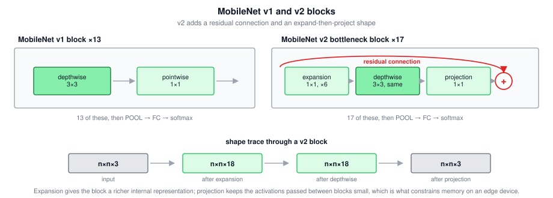

### 6.7 Tricky Interview Questions

**Q: Which statements about depthwise separable convolutions are true?**  
That they have a lower computational cost than normal convolutions, and that they combine depthwise convolutions with pointwise convolutions. It is **false** that the result always has the same number of channels as the input — that holds only for the depthwise step, and the pointwise step changes the channel count. It is also false to describe them as a normal convolution plus a bottleneck layer.

**Q: In a MobileNet v2 bottleneck block, the input is $64 \times 64 \times 16$, with 32 filters for the expansion and 16 for the projection, `pad='same'`. What are the input and output shapes of the depthwise convolution?**  
Both are $64 \times 64 \times 32$. The expansion's filter count sets the channels the depthwise convolution sees, the depthwise step never changes the channel count, and same padding preserves the spatial size.

**Q: Why is a depthwise separable convolution roughly ten times cheaper?**  
Because the cost ratio is $\frac{1}{n_c'} + \frac{1}{f^2}$, and with a large filter count the first term vanishes, leaving about $\frac{1}{f^2} = \frac{1}{9}$ for $3\times3$ filters.

**Q: How many filters does a depthwise convolution have, and what shape are they?**  
Exactly $n_c$ filters, each of shape $f \times f$ with no channel dimension. Each one is applied to a single input channel.

**Q: Why does MobileNet v2 expand and then project, rather than staying at one width?**  
Expanding gives the block a richer internal representation to compute with; projecting keeps the activations handed to the next block small, which is what constrains memory on an edge device.

**Q: What role does the residual connection play in v2?**  
The same as in ResNet: it lets gradients propagate backward more efficiently and makes the block easy to turn into an identity mapping.

---

## 7. EfficientNet

MobileNet gives you efficient layers. EfficientNet gives you a way to **tune a network to a specific device**.

### 7.1 Compound Scaling

Suppose you have a baseline architecture and different deployment targets: several phone models with different compute budgets, or various edge devices. With a bit more compute you would want a slightly bigger network for more accuracy; with less, a smaller and faster one at some accuracy cost.

Tan and Le observed there are three things you can scale:

| Knob | Symbol | What changes |
|---|---|---|
| Resolution | $r$ | Input image resolution |
| Depth | $d$ | Number of layers |
| Width | $w$ | Number of channels per layer |

**Compound scaling** means scaling all three at once, up or down together. The hard part is the **rate**: should you double the resolution and leave depth alone? Double depth only? Increase resolution 10%, depth 50%, and width 20%? EfficientNet's contribution is a principled answer to what trade-off between $r$, $d$, and $w$ gives the best performance within a given computational budget.

$$\boxed{\text{scale } r, d, w \text{ together at a searched ratio, given a compute budget}}$$

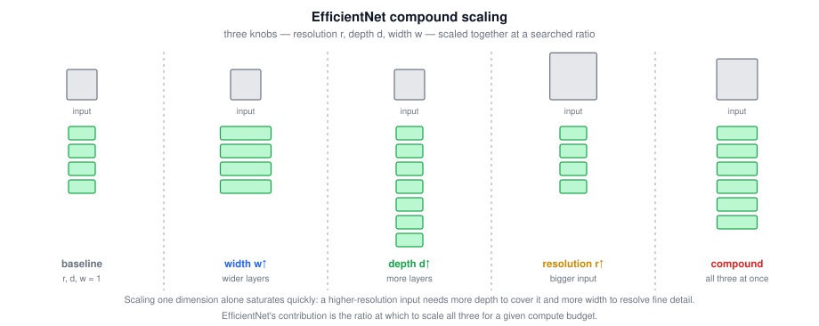

Practical advice: if you need to adapt an architecture to a particular device, look at an open-source EfficientNet implementation, which will help you pick a good trade-off rather than guessing.

### 7.2 Tricky Interview Questions

**Q: What are the three dimensions EfficientNet scales?**  
Input resolution, network depth (number of layers), and network width (channels per layer).

**Q: Why not just scale depth, the way people did before?**  
Because the three dimensions are not independent in their effect on accuracy per FLOP. A higher-resolution input needs more depth to grow the receptive field and more width to capture finer patterns, so scaling one alone saturates quickly.

**Q: What problem does EfficientNet solve that MobileNet does not?**  
MobileNet makes individual layers cheap. EfficientNet tells you how to resize a whole architecture to a particular compute budget, which is a different question.

---

## 8. Practical Advice

### 8.1 Using Open-Source Implementations

Many of these networks are **difficult or finicky to replicate** because so many details matter: learning rate decay schedules and other hyperparameters that make a real difference to performance. It is often hard even for a strong deep learning PhD student at a top university to replicate someone's polished results from the paper alone.

Fortunately, researchers routinely open-source their work. If you want to build on a paper, look for an existing implementation first; you will usually get going much faster than reimplementing from scratch (though reimplementing can be a good exercise).

The workflow with GitHub:

1. Search for the architecture, e.g. ResNet.
2. Pick a repository, ideally one from the original authors.
3. Check the **license**. MIT is one of the more permissive open-source licenses.
4. Copy the clone URL and run `git clone <url>`.
5. Look for the configuration files that specify the network.

A second advantage: some of these networks take a long time to train, and someone else may have used multiple GPUs and a very large dataset to pretrain them. That pretraining is exactly what makes transfer learning possible.

### 8.2 Transfer Learning

Rather than training from random initialization, download weights someone else already trained and transfer them to your task. This is one of the highest-leverage practices in computer vision.

Public datasets people pretrain on: **ImageNet**, **MS COCO**, **Pascal**. Training on these can take weeks on many GPUs, and someone else has already gone through that painful process.

**Worked example.** You want to classify pictures of your own cats: Tigger, Misty, or neither — a 3-class problem with a small training set.

1. Download an open-source network **and its weights**, e.g. one trained on ImageNet with a 1000-way softmax.
2. **Remove the softmax layer** and put your own 3-way softmax in its place.
3. **Freeze** all the earlier layers and train only your new softmax layer.

Frameworks support this directly, with settings like `trainable = 0` or `freeze = 1` on the layers you want fixed.

> **A useful speed trick.** Because the frozen layers are a fixed function, you can **precompute** their activations for every training example once and save them to disk. Then you are just training a shallow softmax on top of a fixed feature vector, and you never recompute those activations on each epoch.

**How much to freeze depends on how much data you have:**

| Your dataset | What to do |
|---|---|
| Small | Freeze all layers, train only a new output layer |
| Medium | Freeze the early layers, train the later layers plus your own output layer |
| Large | Use the downloaded weights as **initialization** and train the whole network |

$$\boxed{\text{more data} \;\Rightarrow\; \text{fewer frozen layers, more trained layers}}$$

For the medium case there are two options: keep the last few layers' weights as initialization and run gradient descent from there, or discard those layers entirely and use your own new hidden units and output. Both are worth trying.

Note that in every case you need your own output layer, because the class set differs from the pretrained model's.

**Bottom line:** because public datasets are so large and the downloaded weights encode weeks of training on enormous amounts of data, computer vision is a field where you should **almost always use transfer learning**, unless you have an exceptionally large dataset and a very large compute budget.

### 8.3 Data Augmentation

Almost every computer vision task could use more data. Vision is a complicated problem — you take in all those pixels and have to figure out what is in the picture — and for the majority of vision problems it feels like we simply cannot get enough data. This is less true in some other domains, but it makes data augmentation broadly useful in vision, whether you are using transfer learning or training from scratch.

**Geometric augmentations:**

| Technique | Notes |
|---|---|
| **Mirroring** on the vertical axis | Simplest method. Works whenever the flip preserves the label — a mirrored cat is still a cat |
| **Random cropping** | Take several random crops of each image. Imperfect (a crop might miss the object) but worthwhile as long as crops are reasonably large subsets of the image |
| Rotation, shearing, local warping | No harm in trying, but used somewhat less in practice, perhaps because of their complexity |

**Color shifting:** add different distortions to the R, G, and B channels. Adding to red and blue while subtracting from green makes the image more purple; the reverse makes it yellower. In practice the R, G, B offsets are drawn from some probability distribution, and can be quite small.

The motivation: sunlight or indoor illumination can easily shift an image's color, but the identity of the cat, and therefore the label $y$, does not change. Training on color-shifted images makes the algorithm **more robust to color changes**.

> **PCA color augmentation.** One way to sample the R, G, B offsets uses Principal Component Analysis; the details are in the AlexNet paper. Roughly: if an image is mainly purple (much red and blue, little green), PCA color augmentation adds and subtracts a lot to red and blue while keeping green roughly balanced, so the overall tint is preserved. Open-source implementations exist if you want it.

**Implementation.** The standard pattern is a CPU thread (or several) that constantly loads images from disk and applies the distortions — random cropping, color shifting, mirroring — to assemble mini-batches. Those batches are passed to another thread or process that performs training, on CPU or increasingly on GPU. The loading/augmenting and the training **run in parallel**.

Augmentation has its own hyperparameters: how much color shifting, exactly what crop parameters. As elsewhere in vision, a good starting point is someone else's open-source settings, though tuning them yourself is reasonable if you need to capture more invariances.

> **Modern additions.** Beyond the classic set, current practice often includes **RandAugment** and **AutoAugment** (learned or randomized augmentation policies), **mixup** and **CutMix** (blending two images and their labels), **random erasing / cutout**, and **label smoothing**. The principle is unchanged: encode the invariances you know the task has.

### 8.4 Tricky Interview Questions

**Q: Can a model trained for one vision task be used directly on another?**  
No. In most cases you must replace the softmax layer, or the last few layers, and retrain for the new task. That is exactly what makes open-source pretrained models useful, and it saves a great deal of compute and data.

**Q: You have 50 labeled images for a 3-class problem. What is your plan?**  
Download a pretrained network, replace the output layer with a 3-way softmax, freeze everything else, and train only the new layer. Optionally precompute the frozen activations to disk to speed up training, and use data augmentation.

**Q: Why does having more data mean freezing fewer layers?**  
Because with more data you can support training more parameters without overfitting, so you can afford to adapt more of the network to your specific task rather than relying on generic pretrained features.

**Q: Why precompute frozen layers' activations?**  
They are a fixed function of the input, so their outputs never change during training. Caching them avoids recomputing the whole forward pass through the frozen part on every epoch.

**Q: Would you use vertical flipping (top-to-bottom) as augmentation?**  
Usually not for natural images, because upside-down objects are not typical inputs and the flip does not preserve the sort of image you will see at test time. Horizontal mirroring is safe for most objects. The rule is that an augmentation must preserve the label *and* stay within the realistic input distribution.

**Q: Should data augmentation be applied to the dev and test sets?**  
No, not for evaluation — they should reflect the real distribution you care about. Test-time augmentation (see section 9.2) is a separate technique for boosting predictions, not for defining the evaluation set.

**Q: Where does augmentation run, and why does that matter?**  
On CPU threads that load and distort images in parallel with training. Keeping augmentation off the critical path prevents the GPU from sitting idle waiting for data.

---

## 9. The State of Computer Vision

Some observations specific to computer vision that help in navigating the literature.

### 9.1 Data versus Hand-Engineering

Machine learning problems fall on a spectrum from little data to lots of data:

| Task | Relative data availability |
|---|---|
| Speech recognition | A decent amount relative to problem complexity |
| Image recognition | Large datasets (over a million images), yet still feels insufficient given the complexity |
| Object detection | Even less, because labeling bounding boxes is more expensive than labeling whole images |

Across the spectrum, a consistent pattern:

$$\boxed{\text{lots of data} \;\Rightarrow\; \text{simpler algorithms, less hand-engineering}}$$

$$\boxed{\text{little data} \;\Rightarrow\; \text{more hand-engineering}}$$

A learning algorithm has two sources of knowledge: the **labeled data**, the $(x, y)$ pairs used for supervised learning; and **hand-engineering**, which covers hand-designed features, hand-designed network architectures, and other components of the system. With little labeled data you have to lean on the second source.

This is not a criticism of hand-engineering. When you do not have enough data, hand-engineering is a difficult, skillful task requiring real insight, and someone good at it makes a great contribution. It is only when you have lots of data that the effort is better spent building up the learning system instead.

Computer vision tries to learn a genuinely complex function and has historically had small datasets, which is why the field has relied more on hand-engineering and why its architectures and hyperparameter choices are so much more complex than in other disciplines. As datasets have grown in recent years, the amount of hand-engineering has dropped significantly, but a lot of architecture engineering remains. Object detection, with even smaller datasets, has even more complex algorithms with more specialized components.

Transfer learning is what helps most when data is limited — the Tigger/Misty example is exactly the regime where it pays off.

### 9.2 Doing Well on Benchmarks

Computer vision researchers are enthusiastic about standardized benchmarks and competitions, partly because strong benchmark numbers make papers easier to publish. The upside is that the community learns which algorithms are genuinely effective. The downside is that papers include techniques you would **not** use in a deployed production system.

**Ensembling.** After settling on an architecture, train 3, 5, or 7 networks **independently** from different random initializations and **average their outputs** $\hat{y}$.

$$\boxed{\hat{y}_{\text{ensemble}} = \frac{1}{k}\sum_{j=1}^{k}\hat{y}_j \qquad \text{never average the weights}}$$

Averaging the weights does not work. Averaging predictions typically gains 1–2%, enough to matter in a competition. But testing an image now means running it through 3 to 15 networks, slowing inference by that factor and requiring all those networks in memory. Almost never used in production.

**Multi-crop at test time.** Data augmentation applied to the *test* image. The **10-crop** technique: take the central crop and the four corner crops, then do the same five on the mirrored image, giving 10 crops. Run all 10 through the classifier and average the results.

$$\boxed{\text{10-crop} = \left\{\text{center} + 4 \text{ corners}\right\} \times \left\{\text{original}, \text{mirrored}\right\}}$$

Multi-crop keeps only one network in memory, so it is lighter than ensembling, but it still slows inference substantially. With a modest compute budget, a few crops rather than 10 might be usable in production.

| Technique | Accuracy gain | Cost | Used in production? |
|---|---|---|---|
| Ensembling | ~1–2% | $3$–$15\times$ inference, $k\times$ memory | Almost never |
| Multi-crop / 10-crop | Small | $\sim 10\times$ inference, $1\times$ memory | Occasionally |

### 9.3 Practical Recipe

Because so many vision problems are in the small-data regime and others have already done extensive architecture engineering, and because a network that works on one vision problem often works on another:

1. **Start with someone else's architecture**, one from the literature or one you heard about.
2. **Use an open-source implementation** if possible — it likely has the finicky details worked out: learning rate schedules and other hyperparameters.
3. **Use a pretrained model and fine-tune** on your dataset. Someone may have spent weeks training on half a dozen GPUs and over a million images.

If you have the compute resources and the inclination, training from scratch is fine, and if you want to invent a new algorithm it is necessary. But for building an application, the three steps above get you going far faster.

### 9.4 Tricky Interview Questions

**Q: Why does computer vision use more hand-engineering than other fields?**  
Because it tries to learn a very complex function and, relative to that complexity, has historically had too little data. When labeled data is scarce, hand-engineered features and architectures are how you get good performance.

**Q: Why does object detection need more complex algorithms than image classification?**  
Bounding-box labels are more expensive to produce, so detection datasets are smaller. Less data means more reliance on hand-engineering and specialized components.

**Q: In an ensemble, why average outputs rather than weights?**  
Because averaging weights of independently trained networks produces a model that is not meaningful — the networks occupy different, unrelated points in parameter space, so their weight average is not a good model of anything. Averaging predictions combines genuine, diverse estimates.

**Q: Would you use ensembling in production?**  
Usually not. A 1–2% gain rarely justifies a 3–15× increase in inference time and keeping every network in memory. It is a benchmark and competition technique.

**Q: What is 10-crop and when is it worth it?**  
Center plus four corner crops of the image and of its mirror, all classified and averaged. Worth considering if you have inference budget to spare, since it needs only one network in memory, but it still multiplies runtime.

**Q: You have a large dataset and lots of compute. Does the advice change?**  
Yes. With plenty of data, spend your effort on the learning system rather than on hand-engineering, and training from scratch becomes reasonable. Transfer learning is most valuable precisely when data is limited.

---

## 10. Quick Reference

| Network | Year | Key idea | Parameters |
|---|---|---|---:|
| LeNet-5 | 1998 | CONV/POOL stack, FC head; tanh/sigmoid, average pooling | ~60 K |
| AlexNet | 2012 | Same idea, much bigger; ReLU; ImageNet | ~60 M |
| VGG-16 | 2014 | Uniform $3\times3$ / $2\times2$ rules; halve size, double channels | ~138 M |
| Inception / GoogLeNet | 2014 | Multiple filter sizes per layer; $1\times1$ bottlenecks | ~7 M |
| ResNet-50 | 2015 | Skip connections make very deep networks trainable | ~25 M |
| MobileNet v1/v2 | 2017/2018 | Depthwise separable convolutions; expand-project bottleneck | ~4 M |
| EfficientNet | 2019 | Compound scaling of resolution, depth, width | varies |

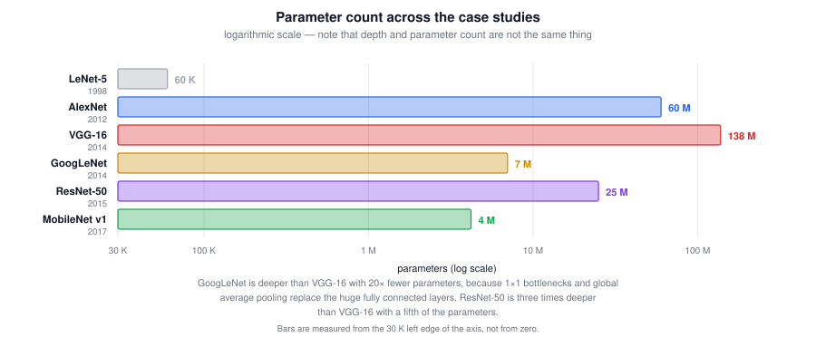

Key formulas:

$$\boxed{\text{residual block: } a^{[l+2]} = g\!\left(z^{[l+2]} + a^{[l]}\right), \quad \text{or } g\!\left(z^{[l+2]} + W_s a^{[l]}\right) \text{ if shapes differ}}$$

$$\boxed{\text{conv cost} = \left(f \times f \times n_c\right) \times \left(n_{out} \times n_{out}\right) \times n_c'}$$

$$\boxed{\frac{\text{depthwise separable cost}}{\text{normal conv cost}} = \frac{1}{n_c'} + \frac{1}{f^2} \;\approx\; \frac{1}{f^2}}$$

| Goal | Tool |
|---|---|
| Reduce $n_H$, $n_W$ | Pooling layer, or strided convolution |
| Reduce $n_C$ | $1\times1$ convolution with fewer filters |
| Increase $n_C$ | $1\times1$ convolution with more filters (expansion) |
| Train a very deep network | Skip connections and same convolutions |
| Avoid choosing a filter size | Inception module with concatenated branches |
| Cut computation in a branch | $1\times1$ bottleneck before the expensive convolution |
| Deploy on a phone | Depthwise separable convolutions; MobileNet blocks |
| Fit a specific compute budget | EfficientNet compound scaling |
| Little labeled data | Transfer learning, then data augmentation |
| Win a benchmark | Ensembling and multi-crop testing |

| Symptom | Likely cause | Fix |
|---|---|---|
| Training error rises as you add layers | Plain deep network is hard to optimize | Add skip connections |
| Shortcut addition raises a shape error | $z^{[l+2]}$ and $a^{[l]}$ differ in dimension | Same convolutions, or a $W_s$ projection |
| Inception module is too slow | Large filters over many channels | Insert $1\times1$ bottlenecks |
| Pooling branch dominates the concatenated output | Pooling preserves all input channels | $1\times1$ conv **after** the pooling |
| Model too slow on a mobile device | Normal convolutions everywhere | Depthwise separable convolutions |
| Overfitting with a small dataset | Too many trainable parameters for the data | Freeze more pretrained layers; augment |
| Cannot reproduce a paper's numbers | Unpublished hyperparameter details | Start from the authors' open-source code |

Core principle: almost never start from scratch. Pick a proven architecture, take an open-source implementation with pretrained weights, fine-tune as much of it as your data supports, and augment.

---
