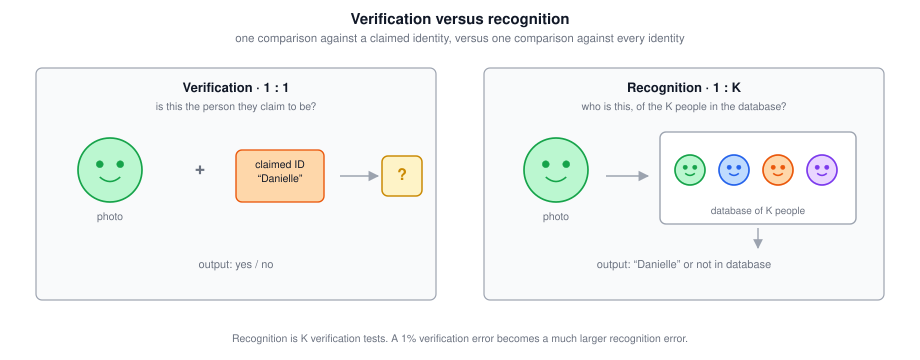
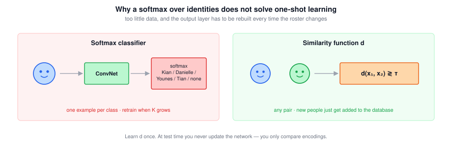
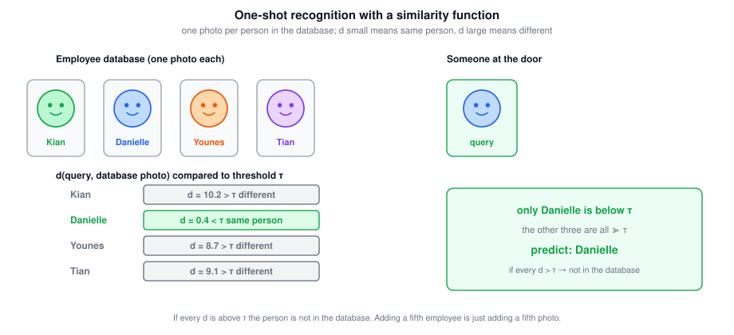
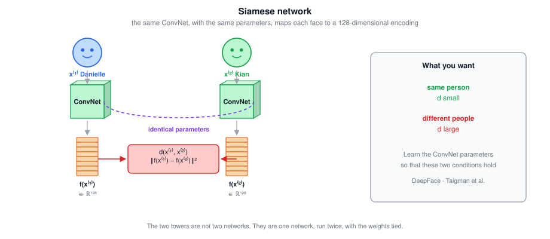
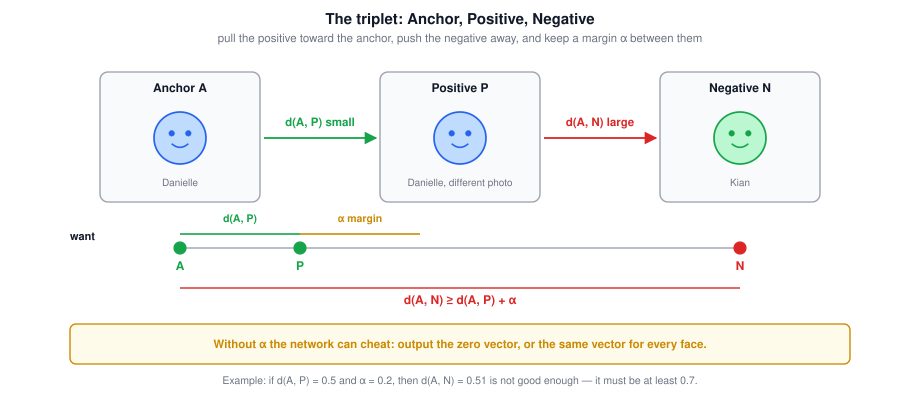
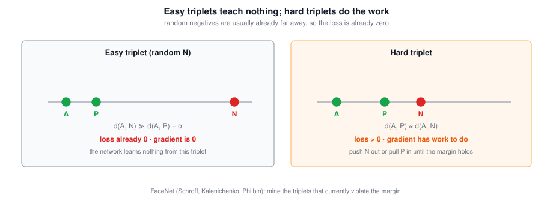
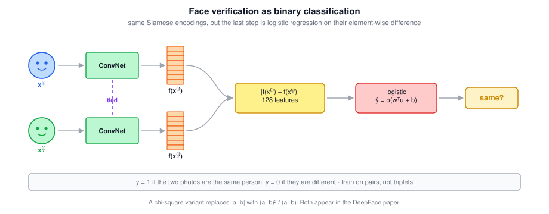
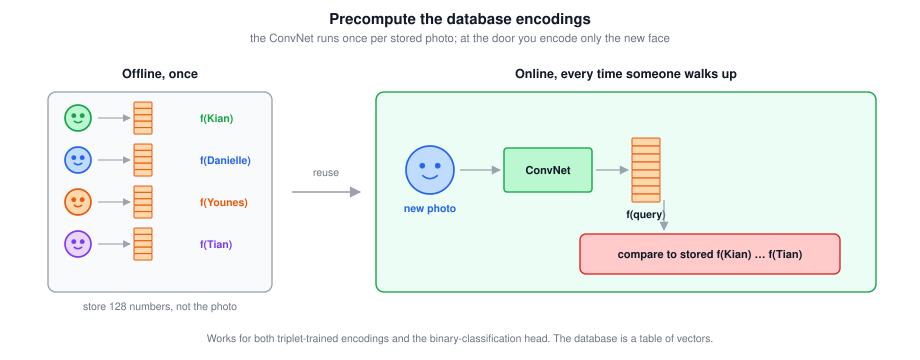

# Face Recognition

A compact reference for identifying people from images rather than classifying objects:
- Face verification versus face recognition;
- Liveness detection;
- One-shot learning;
- The similarity function $d$;
- Siamese networks and 128-dimensional encodings;
- The triplet loss and hard-triplet mining;
- Face verification as binary classification;
- Precomputing encodings at deployment.

Main idea: do not train a softmax over identities. Learn an **encoding** of a face so that pictures of the same person land close together and pictures of different people land far apart. Recognition is then a comparison in that space, which works even from a single photo.

---

## 1. Verification versus Recognition

### 1.1 Two Problems with Similar Names

In the face-recognition literature the two words are not interchangeable.

| Task | Also called | Input | Output |
|---|---|---|---|
| **Face verification** | 1 : 1 | A photo **and** a claimed name or ID | Yes / no: is this that person? |
| **Face recognition** | 1 : $K$ | A photo, plus a database of $K$ people | Who is this — or *not in the database* |

Verification is the building block. Recognition is verification run against every identity in the gallery.

The door-unlock demo that opens this lecture is doing **both**: it recognizes Andrew from a database of authorized people, and it also runs **liveness detection** so a printed photo on an ID card is rejected. Liveness — live human versus spoof — is itself a supervised learning problem (train on live faces versus photos, screens, masks). The rest of these notes is about the recognition half.

### 1.2 Why Recognition Is Harder

Suppose a verification system is 99% accurate. That sounds usable. Now put it in a recognition system with $K = 100$ people in the database. Each identification is about 100 verification tests, so a 1% error per comparison is no longer 1% overall.

A rough union bound: $100 \times 1\% = 100\%$ chance of *some* mistake. More carefully, if errors were independent,

$$\boxed{P(\text{no error}) = 0.99^{100} \approx 0.37}$$

so there is a roughly 63% chance of at least one false match. To keep recognition reliable on a 100-person gallery you typically need verification accuracy of **99.9% or higher**. The next sections therefore build a verification system first, and only promote it to recognition once $d$ is accurate enough.

$$\boxed{\text{recognition} = K \text{ verifications; a }1\%\text{ verification error does not stay }1\%}$$

### 1.3 Tricky Interview Questions

**Q: Is face verification the same problem as face recognition?**  
No. Verification is 1 : 1 — given a photo and a claimed identity, say yes or no. Recognition is 1 : $K$ — given a photo, say which of $K$ people it is, or that it is nobody in the database.

**Q: A verification system is 99% accurate. You use it to recognize among 100 employees. Is the recognition system also about 99% accurate?**  
No. Each identification compares the query against (about) 100 gallery photos. A 1% per-comparison error becomes a much larger chance of at least one mistake — on the order of $1 - 0.99^{100} \approx 63\%$ if the errors were independent.

**Q: Why build a verification system at all, if the product is recognition?**  
Because recognition *is* verification, repeated $K$ times. If the 1 : 1 comparator is accurate enough, the 1 : $K$ system comes for free. If it is not, recognition will not be either.

**Q: What is liveness detection, and is it the same as recognition?**  
Liveness asks whether the input is a live human rather than a photo, screen, or mask. It is a separate supervised problem. The ID-card spoof in the lecture is rejected by liveness, not by failing to match Andrew's face.

**Q: Does a recognition system have to output one of the $K$ identities?**  
No. If every comparison is above the threshold, the correct answer is *not in the database*.

---

## 2. One-Shot Learning

### 2.1 The Constraint

Most deployed face systems must recognize a person given **one** photo of them — the badge photo in the employee database. Historically, deep networks do not work well with a single training example per class. That is the **one-shot learning** problem.

A visitor walks up. The system has seen Danielle once. It must still decide that this is Danielle, and, if the visitor is someone else entirely, that they are none of the four people on file.

### 2.2 Why a Softmax over Identities Fails

The obvious pipeline is: image $\rightarrow$ ConvNet $\rightarrow$ softmax over $K$ employees plus a "none of the above" class. Two things break it.

| Failure | Why |
|---|---|
| **Too little data** | One photo per person is not enough to train a robust ConvNet |
| **A growing roster** | A fifth employee means a sixth softmax unit. You would retrain the network every time someone joins |

Neither is acceptable for a door that employees walk through.

### 2.3 Learn a Similarity Function Instead

Learn a function $d$ that takes **two** images and returns how different they are:

$$\boxed{d(x^{(1)}, x^{(2)}) \text{ small if same person, large if different}}$$

At test time, pick a threshold $\tau$ (a hyperparameter):

$$\boxed{\text{same person if } d(x^{(1)}, x^{(2)}) \le \tau, \qquad \text{different if } d > \tau}$$

For recognition, compare the query against every gallery photo. The gallery entry with $d < \tau$ (and the smallest $d$, if several pass) is the identity. If every $d$ is above $\tau$, the person is not in the database.

This is how one-shot learning is solved. You never need more than one photo of Danielle *at test time*. A new employee is a new row in the database — you do not retrain $d$.

### 2.4 Tricky Interview Questions

**Q: Can you train a softmax classifier on one photo per employee and use it for one-shot recognition?**  
In principle you can write the network down; in practice it does not work. One example per class is not enough to train a ConvNet, and a new person forces you to change the output layer and retrain.

**Q: A new employee joins. Do you retrain the network?**  
No — not if you learned $d$. You add their photo (or, later, their encoding) to the database and keep using the same $d$.

**Q: What does the system output if a stranger walks up?**  
Every $d(\text{query}, \text{gallery photo})$ is large. All of them exceed $\tau$, so the prediction is *not in the database*.

**Q: Is $\tau$ learned?**  
It is a hyperparameter you choose, usually on a validation set of pairs, to trade false accepts against false rejects.

**Q: Does one-shot mean you train on one image total?**  
No. One-shot is a *test-time* constraint: the gallery may hold a single photo of each person you must recognize. Training $d$ still needs many images of many people, as section 4 makes precise.

**Q: Why learn $d(\mathrm{img}_1, \mathrm{img}_2)$ at all, instead of a $K{+}1$-way softmax (the $K$ employees plus “not in database”)?**  
Because you must solve **one-shot** recognition: a new person is identified from a single photo, and the roster grows. A softmax whose class count equals the current gallery size does not do that — you would retrain whenever someone joins. Transfer learning is useful for initializing the ConvNet, but it is not the reason $d$ exists.

**Q: True or false: you learn $d$ so that you can predict identity with a softmax whose number of classes is the number of people in the database plus one.**  
False. That is exactly the architecture one-shot learning is designed to avoid.

---

## 3. Siamese Networks

### 3.1 Encodings

Take a ConvNet that would normally end in a softmax, and instead read out the vector computed by a deep fully connected layer — conventionally **128 numbers**. Call that vector $f(x)$: it is an **encoding** of the face $x$.

To compare two pictures, run **the same network, with the same parameters**, on both of them, and define $d$ as the (squared) distance between encodings:

$$\boxed{d(x^{(i)}, x^{(j)}) \;=\; \bigl\| f(x^{(i)}) - f(x^{(j)}) \bigr\|_2^2}$$

$x^{(i)}$ and $x^{(j)}$ are any two images, not necessarily consecutive training examples.

This architecture — two identical towers, weights tied, compared at the end — is a **Siamese network**. The ideas here come from DeepFace (Taigman, Yang, Ranzato, and Wolf).

The two towers are not two networks. They are one network, run twice.

### 3.2 What the Parameters Must Achieve

The ConvNet's parameters define $f$. Vary them with backpropagation so that:

| Pair | Target |
|---|---|
| $x^{(i)}, x^{(j)}$ are the **same** person | $d\big(x^{(i)}, x^{(j)}\big)$ is **small** |
| $x^{(i)}, x^{(j)}$ are **different** people | $d\big(x^{(i)}, x^{(j)}\big)$ is **large** |

If the encodings are a good representation of faces, nearest-neighbor in encoding space *is* face verification. The next two sections are two different losses that push $f$ toward that property.

### 3.3 Tricky Interview Questions

**Q: Why must the two Siamese branches share parameters?**  
Otherwise the two encodings live in different coordinate systems and $\|f_1(x) - f_2(y)\|$ is meaningless. Tied weights force both photos into the same 128-dimensional space.

**Q: True or false: the two towers see different images but use exactly the same parameters.**  
True. That is the definition of a Siamese network here: one ConvNet, run twice.

**Q: Is $f(x)$ a probability distribution over identities?**  
No. It is a real-valued embedding, typically 128-dimensional. Distances in that space, not a softmax, are what you threshold.

**Q: How many times is the ConvNet run to compare two images?**  
Twice — once per image — but it is the same ConvNet. At deployment you will cache the gallery-side run (section 5.3).

**Q: Why 128 dimensions?**  
It is the convention used in FaceNet and these lectures, not a theorem. Other systems use 256 or 512. What matters is that $f$ is a fixed-length vector you can compare with a distance.

**Q: DeepFace versus FaceNet — which architecture is the Siamese one?**  
Both use a ConvNet to produce an embedding. DeepFace is the paper that popularized the Siamese comparison; FaceNet is the paper that trains that embedding with the triplet loss of the next section.

---

## 4. Triplet Loss

Triplet loss is a **metric-learning** loss. It trains the encoding $f$ so that faces of the same person sit close together in feature space and faces of different people sit far apart. Recognition is then a distance comparison, which is why one-shot learning works: you never softmax over a fixed list of names. The same loss is used outside faces whenever the goal is a similarity metric rather than a closed set of classes.

### 4.1 Anchor, Positive, Negative

Each training step looks at **three** images at once:

| Symbol | Name | Meaning |
|---|---|---|
| $A$ | Anchor | A reference picture of a person |
| $P$ | Positive | A **different** picture of the **same** person |
| $N$ | Negative | A picture of a **different** person |

That is why it is called a **triplet** loss. The three images go through the **same** ConvNet (the Siamese $f$ of section 3), so you get three embeddings $f(A)$, $f(P)$, $f(N)$.

The goal is that the encoding of $A$ is close to $f(P)$ and far from $f(N)$:

$$\boxed{d(A, P) \;\le\; d(A, N)}$$

that is,

$$\bigl\| f(A) - f(P) \bigr\|_2^2 \;\le\; \bigl\| f(A) - f(N) \bigr\|_2^2$$

Rearranging:

$$\bigl\| f(A) - f(P) \bigr\|_2^2 \;-\; \bigl\| f(A) - f(N) \bigr\|_2^2 \;\le\; 0$$

### 4.2 The Margin

As written, the inequality is trivially satisfied by two cheats:

- $f(x) = 0$ for every image — then $0 - 0 \le 0$;
- $f(x)$ equal for every image — same thing.

To stop the network collapsing, demand that the gap is not just $\le 0$ but **at least a margin $\alpha$** (another hyperparameter; $\alpha = 0.2$ is the lecture's running example):

$$\boxed{d(A, P) + \alpha \;\le\; d(A, N)}$$

or, by convention with $+\alpha$ on the left,

$$\bigl\| f(A) - f(P) \bigr\|_2^2 \;-\; \bigl\| f(A) - f(N) \bigr\|_2^2 \;+\; \alpha \;\le\; 0$$

$\alpha$ is the same kind of margin that appears in SVMs: it pushes the positive pair and the negative pair apart rather than allowing them to sit $0.01$ apart. If $d(A,P) = 0.5$ and $\alpha = 0.2$, then $d(A,N) = 0.51$ is **not** good enough — it has to be at least $0.7$. You can get there by pulling $P$ in, pushing $N$ out, or both.

### 4.3 The Loss

On one triplet, take a hinge:

$$\boxed{\mathcal{L}(A, P, N) \;=\; \max\Bigl( \bigl\|f(A)-f(P)\bigr\|_2^2 - \bigl\|f(A)-f(N)\bigr\|_2^2 + \alpha,\; 0 \Bigr)}$$

$f(x)$ is the embedding the ConvNet produces for image $x$. If $d(A,N)$ is already larger than $d(A,P) + \alpha$, the argument of the $\max$ is negative and $\mathcal{L} = 0$: **no penalty**, and no gradient from that triplet. If the margin is violated, the loss is the size of the violation and gradient descent pulls $P$ in, pushes $N$ out, or both. The cost on a training set is the sum of $\mathcal{L}$ over the triplets you formed.

### 4.4 What $\|\,\cdot\,\|_2^2$ Means

$f(x) \in \mathbb{R}^d$, typically $d = 128$. The **L2-norm** (Euclidean length) of a vector $x = (x_1,\dots,x_d)$ is

$$\boxed{\|x\|_2 \;=\; \sqrt{x_1^2 + \cdots + x_d^2}}$$

The **squared** L2-norm drops the square root:

$$\boxed{\|x\|_2^2 \;=\; x_1^2 + \cdots + x_d^2}$$

The term in the loss is therefore the squared Euclidean distance between two embeddings:

$$\boxed{\bigl\| f(A) - f(P) \bigr\|_2^2 \;=\; \sum_{i=1}^{d} \bigl( f(A)_i - f(P)_i \bigr)^2}$$

Squared distance is cheaper (no $\sqrt{\,\cdot\,}$) and has the same ranking as unsquared distance, so which pairs are closer does not change.

FaceNet also **L2-normalizes** every embedding onto the unit hypersphere,

$$\boxed{\|f(x)\|_2 \;=\; 1}$$

before the distances are computed. That keeps lengths from absorbing the loss (a long vector can look far from everything just by having large coordinates) and makes $\|f(A)-f(P)\|_2^2 = 2 - 2\, f(A)^\top f(P)$, so ranking by squared L2 is ranking by cosine similarity. Section 6.3 takes that identity further.

### 4.5 What the Training Set Must Contain

To form $(A, P)$ pairs you need **multiple pictures of the same person**. A set of 10,000 pictures of 1,000 people — about ten photos each — is the lecture's scale. One photo per person is not a training set for the triplet loss.

That does **not** contradict one-shot learning. Multiple photos per person are a *training* requirement. After $f$ is learned, the deployed gallery can hold a single photo of each employee.

### 4.6 Hard Triplets

If you pick $A$, $P$, and $N$ at random (subject to $A,P$ matching and $A,N$ not), the constraint is almost always already true: two random people are already far apart in a half-trained embedding, so $\mathcal{L} = 0$ and the gradient is zero. The network learns nothing.

A **hard triplet** is one where $d(A,P)$ is currently close to $d(A,N)$ — a near-violation of the margin. Those are the examples gradient descent has to work on: push $N$ out or pull $P$ in until there is a gap of $\alpha$. Mining hard triplets is what makes training computationally efficient. The details are in FaceNet (Schroff, Kalenichenko, and Philbin), which is where this loss comes from.

> **BlankNet, DeepBlank.** Face recognition produced FaceNet; the previous paper was DeepFace. Naming a system *BlankNet* or *DeepBlank* is a running joke in this literature.

### 4.7 Dataset Scale, and Why You Download Weights

Commercial face systems are trained on very large datasets: more than a million images is common, some companies use more than ten million, a few more than a hundred million. Those datasets are not easy to acquire. This is a domain where **downloading someone else's pretrained model** is the practical default, rather than training $f$ from scratch. Knowing how the loss works still matters if you ever have to train, fine-tune, or explain the system.

### 4.8 Tricky Interview Questions

**Q: Write the triplet-loss inequality, including the margin.**  
$d(A,P) + \alpha \le d(A,N)$, or $\|f(A)-f(P)\|_2^2 - \|f(A)-f(N)\|_2^2 + \alpha \le 0$.

**Q: Which of these is the triplet loss ($\alpha > 0$)?**  
$\max\big(\|f(A)-f(P)\|_2^2 - \|f(A)-f(N)\|_2^2 + \alpha,\; 0\big)$. Two common traps: putting $-\alpha$ (the margin then *rewards* a smaller gap) and swapping $P$ with $N$ (that would pull the negative in and push the positive out).

**Q: Why is the margin there?**  
Without it the network can output the zero vector, or the same vector for every face, and still get loss zero. $\alpha$ forbids that collapse and forces a gap between same-person and different-person pairs.

**Q: If $d(A,P) = 0.5$, $\alpha = 0.2$, and $d(A,N) = 0.51$, is the triplet satisfied?**  
No. $0.5 + 0.2 = 0.7 \not\le 0.51$. Being *slightly* larger is not enough.

**Q: Can you train the triplet loss with one photo per person?**  
No. Forming a positive pair requires two pictures of the same person. After training, one photo per person at test time is fine — that is one-shot recognition.

**Q: Why not sample triplets uniformly at random?**  
Almost all random negatives already satisfy the margin, so the hinge is zero and no gradient flows. You mine **hard** triplets, where $d(A,P) \approx d(A,N)$.

**Q: Does a triplet with $\mathcal{L} = 0$ still update the weights?**  
No. $\max(\,\cdot\,, 0)$ is already zero, so that example contributes nothing to the gradient.

**Q: You have 10,000 pictures of 1,000 people. Roughly how many photos per person is that, and why does the number matter?**  
About ten. It matters because you need multiple photos of the same person to build $(A,P)$ pairs.

**Q: True or false: 100,000 pictures of 100,000 different people is a reasonable triplet-loss training set.**  
False. That is one photo per person, so you cannot form a positive pair. You need **several pictures of the same person**. One-shot is a test-time property of the gallery, not a training-set property.

**Q: Write $\|f(A)-f(P)\|_2^2$ as a sum.**  
$\sum_{i=1}^{d} \bigl(f(A)_i - f(P)_i\bigr)^2$. It is squared Euclidean distance, not a probability and not a cosine until you unit-normalize.

**Q: What is the difference between $\|x\|_2$ and $\|x\|_2^2$?**  
$\|x\|_2$ is the Euclidean length $\sqrt{\sum_i x_i^2}$. The loss uses the square, $\sum_i x_i^2$, which drops the square root. Ranking of distances is the same; the derivative is simpler.

**Q: If $d(A,N) > d(A,P) + \alpha$ already, what is $\mathcal{L}$?**  
Zero. Easy triplets do not train the network. That is why you mine hard triplets.

**Q: Why does FaceNet set $\|f(x)\|_2 = 1$?**  
So every embedding lies on the unit hypersphere. Distances then cannot be gamed by stretching the vector, and squared L2 becomes $2 - 2 f(x)^\top f(y)$ (cosine). It is a constraint on $f$, not a replacement for $\alpha$.

---

## 5. Face Verification as Binary Classification

### 5.1 Pairs Instead of Triplets

The triplet loss is one way to train $f$. The other is to treat verification as ordinary **binary classification**. Keep the Siamese towers — they still compute $f(x^{(i)})$ and $f(x^{(j)})$ with tied weights — and feed a comparison of those two encodings into logistic regression. The target is $1$ if the photos are the same person and $0$ if they are not.

Training inputs are now **pairs**, not triplets. Assemble a dataset of similar pairs ($y = 1$) and dissimilar pairs ($y = 0$) and backpropagate through both towers.

### 5.2 The Features Fed to Logistic Regression

Do not concatenate the two 128-vectors raw. Take an element-wise comparison and treat those 128 numbers as features $u$, with their own weights $w \in \mathbb{R}^{128}$ and bias $b$:

$$\boxed{\hat{y} \;=\; \sigma\!\left( \sum_{k=1}^{128} w_k \bigl| f(x^{(i)})_k - f(x^{(j)})_k \bigr| \;+\; b \right)}$$

(The index on $w$ is $k$, the component of the encoding — a common slip is to write $w_i$.)

A variant used in DeepFace is the **chi-square** similarity,

$$\boxed{u_k \;=\; \frac{\bigl( f(x^{(i)})_k - f(x^{(j)})_k \bigr)^2}{f(x^{(i)})_k + f(x^{(j)})_k}}$$

then the same logistic unit on $u$. Both versions, and a few others, are explored in that paper. In all of them the Siamese weights stay tied.

### 5.3 Precomputing Encodings

At a turnstile you do **not** re-encode the whole employee database on every swipe. Compute $f(\text{gallery photo})$ **once**, offline, and store the 128 numbers. When someone walks up, encode only the new face and compare it to the stored vectors.

This trick applies equally to a triplet-trained $d$ and to the binary-classification head. The database is a table of vectors; you no longer need the raw gallery images at inference time.

$$\boxed{\text{store } f(\text{gallery}), \text{ not the photos; encode only the query online}}$$

### 5.4 Tricky Interview Questions

**Q: What is the target label for a pair of photos of different people?**  
$y = 0$. Same person is $y = 1$. The input is the pair, not a single image.

**Q: Write the logistic unit that takes two 128-d encodings.**  
$\hat{y} = \sigma\big(\sum_{k=1}^{128} w_k |f(x^{(i)})_k - f(x^{(j)})_k| + b\big)$. A chi-square alternative replaces the absolute difference with $(a_k - b_k)^2 / (a_k + b_k)$.

**Q: Does this formulation still use a Siamese network?**  
Yes. The two ConvNets that produce $f(x^{(i)})$ and $f(x^{(j)})$ share parameters. Only the last step — logistic regression on a comparison of $f$ — differs from the triplet loss.

**Q: Why precompute gallery encodings?**  
A large employee database would otherwise be pushed through the ConvNet on every door event. The encodings do not change until someone is added or removed, so they can be cached. You also no longer need to store the raw photos.

**Q: Does precomputation work only for the binary-classification head?**  
No. It works for a triplet-trained $d$ as well. In both cases the gallery is a set of vectors in the same space as $f(\text{query})$.

**Q: A new employee is hired. What do you compute?**  
Run their badge photo through $f$ **once** and append that vector to the gallery table. You do not retrain, and you do not re-encode everyone else.

---

## 6. Beyond the Basics

Context the lectures do not cover but that comes up immediately in practice.

### 6.1 Detection and Alignment Come First

These notes assume a cropped face is already the input $x$. A real pipeline is:

1. **Detect** the face (the localization / detection notes — bounding box or landmarks).
2. **Align** it: rotate and scale so the eyes (and usually the nose) sit in canonical positions. Landmark detection from the previous notes is exactly this step.
3. **Encode** with $f$, then compare.

Skipping alignment is a common reason an otherwise good embedding model looks weak. Pose, scale, and crop variation leak into $d$.

### 6.2 How Verification Is Actually Scored

A single $\tau$ gives one operating point. The standard curves sweep $\tau$:

| Quantity | Meaning |
|---|---|
| **FAR** (false accept rate) | Fraction of different-person pairs called the same |
| **FRR** (false reject rate) | Fraction of same-person pairs called different |
| **TAR** | $1 - \text{FRR}$, true accept rate |
| **EER** | Equal-error rate: the $\tau$ where FAR $=$ FRR |

Reported numbers are usually **TAR at a fixed FAR** (for example TAR @ FAR $= 10^{-3}$ or $10^{-6}$), because a door lock and a photo-tagger want very different false-accept budgets. The 99% / 99.9% discussion in section 1.2 is this trade-off in disguise: recognition with large $K$ is a low-FAR problem.

### 6.3 Cosine Similarity and Unit-Norm Encodings

FaceNet $\ell_2$-normalizes $f(x)$ onto the unit hypersphere, so $\|f(x)\|_2 = 1$. Then

$$\bigl\| f(x) - f(y) \bigr\|_2^2 \;=\; 2 - 2\, f(x)^\top f(y)$$

and ranking by squared L2 is the same as ranking by **cosine similarity**. Many production systems store unit-norm vectors and compare with a dot product, which is cheaper than an explicit norm.

### 6.4 Contrastive Loss

The pair-based cousin of the triplet loss, used in the original Siamese-network work (Chopra, Hadsell, LeCun). On a pair with label $y \in \{0,1\}$ (1 = same):

$$\boxed{\mathcal{L} \;=\; y\, d^2 \;+\; (1-y)\, \max(\alpha - d,\, 0)^2}$$

Same-person pairs are pulled together; different-person pairs are pushed until they are at least $\alpha$ apart. It is the same geometry as the triplet loss, written on pairs rather than triples.

### 6.5 Where the Field Went

| Development | Contribution |
|---|---|
| DeepFace (2014) | Siamese ConvNet, verification as classification, 97.35% on LFW |
| FaceNet (2015) | Triplet loss, 128-d embeddings, hard-triplet mining |
| SphereFace / CosFace / **ArcFace** | Classification losses that put $f(x)$ on a hypersphere and add an angular **margin** — today the default way to train a face embedding |
| AdaFace | Adaptive margin that down-weights uninformative (low-quality) images |
| InsightFace | The open-source stack most people actually fine-tune |

Note the trajectory: the lectures train $f$ with a metric loss on pairs or triples. The systems that replaced them train $f$ with a **classification** loss over a large identity set, but with a geometric margin in angle rather than a softmax over the identities you will see at test time. The deployed object is still an embedding you compare with $d$. The "don't softmax over the gallery" lesson survived; the training recipe changed.

### 6.6 Closed-Set versus Open-Set

| | Closed-set | Open-set |
|---|---|---|
| Assumption | The query is one of the $K$ gallery identities | It might be nobody in the gallery |
| Decision | $\mathrm{argmin}_k\, d(\text{query}, k)$ | $\mathrm{argmin}$ **and** that $d$ must be $\le \tau$ |

The employee door is open-set: strangers exist. A classroom attendance app that knows the roster and assumes every face is a student is closed-set. Open-set is the one-shot setting of section 2, and it is the one that needs a well-calibrated $\tau$.

---

## 7. Quick Reference

Similarity and decision:

$$\boxed{d(x^{(i)}, x^{(j)}) \;=\; \bigl\| f(x^{(i)}) - f(x^{(j)}) \bigr\|_2^2}$$

$$\boxed{\text{same person if } d \le \tau}$$

Triplet loss:

$$\boxed{\mathcal{L}(A,P,N) \;=\; \max\bigl( d(A,P) - d(A,N) + \alpha,\; 0 \bigr)}$$

$$\boxed{d(A,P) \;=\; \bigl\| f(A) - f(P) \bigr\|_2^2 \;=\; \sum_{i=1}^{d} \bigl( f(A)_i - f(P)_i \bigr)^2}$$

Binary classification head:

$$\boxed{\hat{y} \;=\; \sigma\!\left( \sum_{k=1}^{128} w_k \bigl| f(x^{(i)})_k - f(x^{(j)})_k \bigr| + b \right)}$$

| Task | Input | Output |
|---|---|---|
| Verification (1 : 1) | Photo + claimed ID | Yes / no |
| Recognition (1 : $K$) | Photo + gallery of $K$ | Identity, or not in database |
| Liveness | Photo or video | Live human / spoof |

| How you train $f$ | Supervision | Test-time comparison |
|---|---|---|
| Triplet loss | Triplets $(A,P,N)$, need several photos per person | $d \le \tau$ |
| Binary classification | Pairs with $y \in \{0,1\}$ | logistic on $\|f_i - f_j\|$, or $d \le \tau$ |
| (Modern) ArcFace etc. | Classification over a large identity set, angular margin | cosine / $d$ on the unit sphere |

| Symptom | Likely cause | Fix |
|---|---|---|
| Softmax over employees does not generalize | One photo per class; roster will grow | Learn $d$, store encodings |
| New hire requires a retrain | Output layer is tied to the identity set | Add $f(\text{badge photo})$ to the gallery |
| Triplet loss stuck at zero | Random triplets are too easy | Mine hard triplets |
| Embeddings all near zero / all identical | No margin | Add $\alpha$; do not omit it from $\mathcal{L}$ |
| Cannot form training triplets | Only one photo per person | Need multiple photos of the same people **to train**; one-shot is for test time |
| 100k photos of 100k people “should train FaceNet” | Still one photo each | Same trap: no $(A,P)$ pairs |
| Door is too slow on a large gallery | Re-encoding every stored photo | Precompute $f(\text{gallery})$ |
| 99% verification, terrible recognition | $K$ comparisons compound the error | Raise verification accuracy (lower FAR) before promoting to 1 : $K$ |
| Printed photo unlocks the door | No liveness check | A separate live-versus-spoof classifier |
| Good embeddings, poor $d$ in production | Unaligned, poorly cropped faces | Detect, then align landmarks, then encode |

Core principle: stop asking the network *who is this, of the people I have named*. Ask it *what does this face look like, as a vector*, and put the names in a table of vectors you can add to without retraining. Change the output from a class label to an encoding, and one-shot recognition becomes nearest neighbor in that space.
