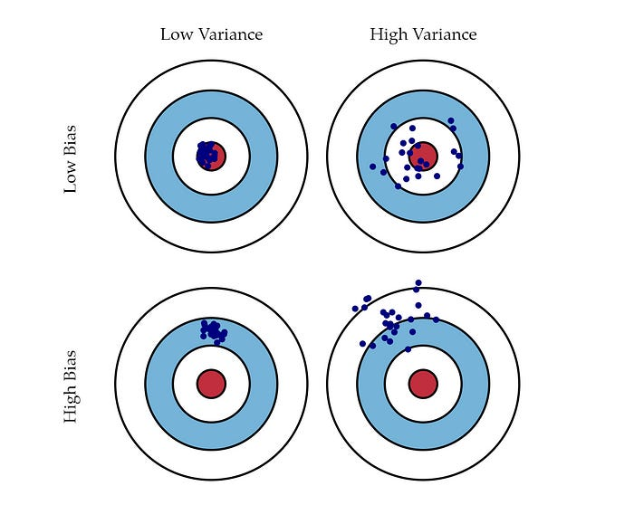
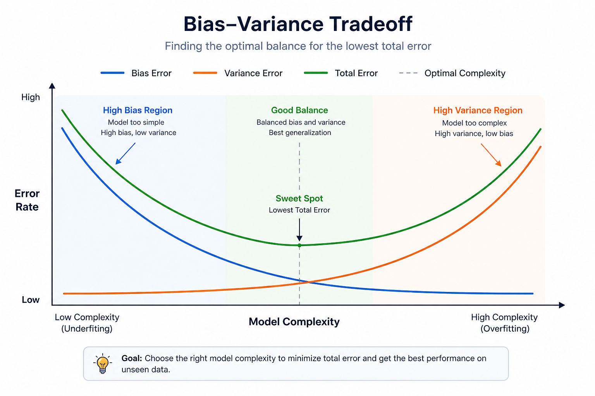
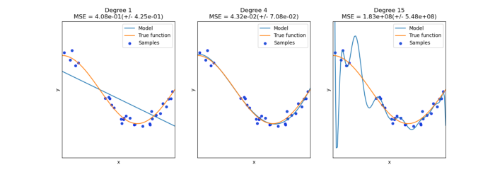

# Improving Deep Neural Networks

## 1. Train / Dev / Test Sets

Applied ML is an iterative process: idea → code → experiment → refine. Splitting data correctly speeds up this cycle.

| Dataset size | Typical split |
|---|---|
| Small (~1k–10k) | 60% train / 20% dev / 20% test |
| Large (~1M+) | 98% train / 1% dev / 1% test |

**Rules of thumb:**
- Dev and test sets must come from the **same distribution**.
- Training data may come from a different distribution (e.g. web-crawled images vs. user uploads).
- It is acceptable to have no test set if an unbiased final estimate is not needed (train + dev only).

---

## 2. Bias and Variance

### 2.1 Mathematical Origin of Bias and Variance

**Setup.** Assume the true data-generating process is:

$$y = f(x) + \varepsilon, \qquad \varepsilon \sim \mathcal{N}(0, \sigma^2_\varepsilon), \quad \varepsilon \perp \mathcal{D}$$

where $f(x)$ is the true unknown function and $\varepsilon$ is irreducible noise independent of everything else. You train a model $\hat{f}(x)$ on a dataset $\mathcal{D}$. Because $\mathcal{D}$ is a random draw, $\hat{f}$ is also random — it changes with every different training set you could draw.

We want to understand the **expected MSE** at a fixed point $x$, averaged over all possible training sets $\mathcal{D}$ and noise draws $\varepsilon$:

$$\text{MSE}(x) = \mathbb{E}_{\mathcal{D},\,\varepsilon}\!\left[(y - \hat{f}(x))^2\right]$$

**Step 1 — substitute** $y = f(x) + \varepsilon$:

$$= \mathbb{E}\!\left[(f(x) + \varepsilon - \hat{f}(x))^2\right]$$

**Step 2 — expand** the square $(a + b)^2 = a^2 + 2ab + b^2$ with $a = f(x) - \hat{f}(x)$ and $b = \varepsilon$:

$$= \mathbb{E}\!\left[(f(x) - \hat{f}(x))^2\right] + 2\,\mathbb{E}\!\left[\varepsilon\,(f(x) - \hat{f}(x))\right] + \mathbb{E}\!\left[\varepsilon^2\right]$$

The middle term vanishes because $\varepsilon$ is independent of $\hat{f}$ and $\mathbb{E}[\varepsilon] = 0$. The last term is the definition of variance of $\varepsilon$, i.e. $\sigma^2_\varepsilon$:

$$= \mathbb{E}_{\mathcal{D}}\!\left[(f(x) - \hat{f}(x))^2\right] + \sigma^2_\varepsilon$$

**Step 3 — decompose** $\mathbb{E}_{\mathcal{D}}[(f(x) - \hat{f}(x))^2]$. Introduce the shorthand $\bar{f}(x) = \mathbb{E}_{\mathcal{D}}[\hat{f}(x)]$ (the mean prediction over all datasets). Add and subtract $\bar{f}(x)$ inside the square:

$$f(x) - \hat{f}(x) = \underbrace{(f(x) - \bar{f}(x))}_{\text{constant w.r.t. }\mathcal{D}} + \underbrace{(\bar{f}(x) - \hat{f}(x))}_{\text{zero-mean w.r.t. }\mathcal{D}}$$

Squaring and taking the expectation over $\mathcal{D}$:

$$\mathbb{E}_{\mathcal{D}}\!\left[(f(x) - \hat{f}(x))^2\right] = (f(x) - \bar{f}(x))^2 + 2\underbrace{(f(x) - \bar{f}(x))}_{\text{const.}}\underbrace{\mathbb{E}_\mathcal{D}[\bar{f}(x) - \hat{f}(x)]}_{=\,0} + \mathbb{E}_{\mathcal{D}}\!\left[(\hat{f}(x) - \bar{f}(x))^2\right]$$

The cross term is zero because $\mathbb{E}_\mathcal{D}[\hat{f}(x)] = \bar{f}(x)$. We are left with:

$$= \underbrace{(f(x) - \bar{f}(x))^2}_{\text{Bias}^2} + \underbrace{\mathbb{E}_{\mathcal{D}}\!\left[(\hat{f}(x) - \bar{f}(x))^2\right]}_{\text{Variance}}$$

**Result — the bias-variance decomposition:**

$$\boxed{\mathbb{E}_{\mathcal{D},\varepsilon}\!\left[(y - \hat{f}(x))^2\right] = \underbrace{\left(f(x) - \mathbb{E}_\mathcal{D}[\hat{f}(x)]\right)^2}_{\text{Bias}^2} + \underbrace{\mathbb{E}_\mathcal{D}\!\left[(\hat{f}(x) - \mathbb{E}_\mathcal{D}[\hat{f}(x)])^2\right]}_{\text{Variance}} + \underbrace{\sigma^2_\varepsilon}_{\text{Irreducible noise}}}$$

**Interpreting each term:**

**Bias²** — the systematic gap between the average prediction of your learning algorithm at $x$ and the true function value $f(x)$:

$$\text{Bias}^2 = \left(f(x) - \mathbb{E}_{\mathcal{D}}[\hat{f}(x)]\right)^2$$

This is a property of the **model class**, not any specific training run. High bias means the model family is too rigid or misspecified (e.g. a linear model for a strongly nonlinear function). It does not vanish by collecting more data if the model class is fundamentally wrong.

**Variance** — how much the learned function $\hat{f}(x)$ fluctuates around its mean when you retrain on different datasets:

$$\text{Variance} = \mathbb{E}_{\mathcal{D}}\!\left[\left(\hat{f}(x) - \mathbb{E}_{\mathcal{D}}[\hat{f}(x)]\right)^2\right]$$

High variance means the model is too flexible and heavily tuned to specific samples — small changes in data lead to very different $\hat{f}$.

**Irreducible noise** $\sigma^2_\varepsilon$ — randomness in the target that no model can capture (measurement error, intrinsic randomness). No model can beat this floor.

The total error has a **U-shape** as a function of model complexity:

$$\text{Total Error} = \text{Bias}^2 + \text{Variance} + \sigma^2_\varepsilon$$



| Model | Bias | Variance |
|---|---|---|
| Constant $\hat{f}(x) = c$ | High — always predicts the mean | Zero — never changes with data |
| Polynomial of degree $m \to \infty$ | Near zero — fits any $f$ | High — wildly sensitive to training set |

Deep learning escapes the U-curve because with large networks and enough data: **Bias² → 0** (the network can express $f$), and with regularization + more data **Variance stays controlled**. Instead of picking a point on the tradeoff curve, you move the whole curve down.

### 2.2 Bias-Variance Tradeoff in Classical ML

**Bias** is the error from a model being too simple to capture the true pattern — it **underfits**. A high-bias model makes the same systematic mistakes regardless of which training data it sees.

**Variance** is the error from a model being too sensitive to the specific training data it was trained on — it **overfits**. A high-variance model fits the training set well but fails to generalize.



**The U-shape.** As you increase model complexity (capacity), bias and variance move in opposite directions:

- Bias typically **decreases**: a more flexible model class can better match the true function $f$.
- Variance typically **increases**: a more flexible model can also fit random noise in the training data.

The total expected error is therefore a sum of two competing terms (plus the irreducible floor):

$$\text{Total Error} = \text{Bias}^2 + \text{Variance} + \sigma^2_\varepsilon$$

- Very simple models: **high bias, low variance** — systematic error dominates.
- Very complex models: **low bias, high variance** — sensitivity to noise dominates.
- The sum is often **U-shaped** as a function of complexity: it first decreases (the bias drop dominates) then increases again (the variance explosion dominates).

Training, regularization, and architecture choices are about finding the point on this curve where the total error is minimized — not minimizing bias or variance alone.

In traditional ML, most levers move you along this curve rather than shifting it:

| Action | Bias | Variance |
|---|---|---|
| Increase model complexity | ↓ | ↑ |
| Decrease model complexity | ↑ | ↓ |
| Add more training data | neutral | ↓ |
| Reduce regularization | ↓ | ↑ |
| Increase regularization | ↑ | ↓ |

**Example — polynomial regression.** 



Suppose two models are fitted to data drawn from a curved true function:

- **Degree-1 polynomial (linear regression):** a straight line cannot bend to follow a curved relationship, so it misses key structure in $f$ → **high bias**. But a line has only two parameters, so retraining on different datasets barely changes it → **low variance**.

- **Degree-20 polynomial:** a high-degree polynomial can twist through many training points. On average its predictions can be close to $f$ → **low bias**. However, small changes in the training set cause large swings in the fitted curve, as the polynomial is busy fitting noise → **high variance**.

Concretely, in terms of the decomposition:

| Model | Bias² | Variance | Dominant error source |
|---|---|---|---|
| Degree 1 (line) | Large — line can't match the curve | Small — retraining barely moves the line | Bias |
| Degree 20 | Small — flexible enough to match $f$ on average | Large — wiggles heavily with each dataset | Variance |

The degree-10 model (for example) sits between the two extremes: the function class is flexible enough to match the underlying curve closely on average (low bias), but can still overfit noise, so variance begins to dominate.

### 2.3 Bias-Variance Tradeoff in the Modern Big-data Deep Models Era

Diagnose model quality by comparing training error and dev error (assuming Bayes/human error ≈ 0%):

| Train error | Dev error | Diagnosis |
|---|---|---|
| Low (~1%) | High (~11%) | High variance (overfitting) |
| High (~15%) | Similar (~16%) | High bias (underfitting) |
| High (~15%) | Even higher (~30%) | High bias **and** high variance |
| Low (~0.5%) | Low (~1%) | Low bias, low variance (ideal) |

**Key insight:** 
In the modern big-data era there are tools that push **one down without hurting the other**:

| Problem | Fix | Effect on bias | Effect on variance |
|---|---|---|---|
| High bias | Train a **bigger network** (with regularization) | ↓ | neutral |
| High variance | Get **more training data** | neutral | ↓ |
| High variance | Add **regularization** | slight ↑ (small) | ↓ |

The workflow becomes a sequential checklist: fix bias first, then fix variance. Each step doesn't undo the other. The tradeoff still exists in theory, but in practice it's much less of a constraint.

In deep learning there is less of a hard bias–variance tradeoff because:
- A bigger (well-regularized) network almost always reduces bias without hurting variance.
- More data reduces variance without hurting bias.
---

## 3. Basic Recipe for Machine Learning

```
Train model
    ↓
High bias?  (look at train error)
    → Bigger network / train longer / new architecture
    ↓
High variance?  (look at dev error)
    → More data / regularization / new architecture
    ↓
Done (low bias + low variance)
```

---

## 4. Regularization

### 4.1 L2 Regularization (Weight Decay)

**Logistic regression cost with L2:**

$$J(w, b) = \frac{1}{m}\sum_{i=1}^{m} \mathcal{L}(\hat{y}^{(i)}, y^{(i)}) + \frac{\lambda}{2m}\|w\|_2^2$$

where $\|w\|_2^2 = \sum_{j=1}^{n_x} w_j^2 = w^\top w$.

**Neural network cost with L2 (Frobenius norm):**

$$J = \frac{1}{m}\sum_{i=1}^{m} \mathcal{L}(\hat{y}^{(i)}, y^{(i)}) + \frac{\lambda}{2m}\sum_{\ell=1}^{L} \left\|W^{[\ell]}\right\|_F^2$$

$$\left\|W^{[\ell]}\right\|_F^2 = \sum_{i=1}^{n^{[\ell]}} \sum_{j=1}^{n^{[\ell-1]}} \left(W^{[\ell]}_{i,j}\right)^2$$

**Modified gradient (backprop + regularization term):**

$$dW^{[\ell]} \leftarrow dW^{[\ell]} + \frac{\lambda}{m} W^{[\ell]}$$

**Weight update (why it's called "weight decay"):**

$$W^{[\ell]} \leftarrow W^{[\ell]} - \alpha \, dW^{[\ell]} = \left(1 - \frac{\alpha\lambda}{m}\right)W^{[\ell]} - \alpha \cdot (\text{backprop term})$$

The factor $\left(1 - \frac{\alpha\lambda}{m}\right)$ is slightly less than 1, so the weights shrink on every step.

**Why it reduces overfitting:**
1. Large $\lambda$ forces $W \approx 0$, effectively simplifying the network toward logistic regression.
2. Small weights → small $z$ values → activations stay in the linear region of tanh → network behaves more like a linear model, less able to overfit.

**L1 regularization** (less common): replaces $\|w\|_2^2$ with $\|w\|_1 = \sum |w_j|$. Produces sparse weights.

$\lambda$ is a hyperparameter tuned on the dev set.

---

### 4.2 Dropout Regularization

Randomly zero out each hidden unit with probability $1 - \text{keep\_prob}$ on every forward pass.

**Inverted dropout (recommended implementation) for layer $\ell$:**

```python
d_l = np.random.rand(*a_l.shape) < keep_prob   # boolean mask
a_l = a_l * d_l                                 # zero out units
a_l = a_l / keep_prob                           # rescale (inverted dropout)
```

Dividing by `keep_prob` ensures the **expected value** of $a^{[\ell]}$ is unchanged, so test-time predictions need no extra scaling.

**At test time:** do not apply dropout (use the full network).

**Why it works:**
- Each unit cannot rely on any single input feature → forced to spread weights → similar effect to L2 regularization.
- Formally, dropout is an adaptive form of L2 regularization with different penalties per weight.

**Practical notes:**
- Apply stronger dropout (lower `keep_prob`) to larger layers (more parameters → more risk of overfitting).
- Dropout is most common in computer vision where data is scarce.
- Dropout makes the cost function $J$ non-deterministic → turn off dropout (set `keep_prob = 1`) when plotting $J$ to verify it decreases.

---

### 4.3 Other Regularization Methods

**Data augmentation:** artificially expand the training set (e.g. flip, crop, rotate images; distort digits). Acts as a regularizer at near-zero extra cost.

**Early stopping:** stop training when dev-set error starts increasing.
- Advantage: tries many values of $\|W\|$ in one training run.
- Disadvantage: couples optimization (minimize $J$) and regularization (reduce variance), making each harder to tune independently. L2 regularization is preferred because it decouples the two.

---

## 5. Normalizing Inputs

### Steps

$$\mu = \frac{1}{m}\sum_{i=1}^{m} x^{(i)}, \qquad x \leftarrow x - \mu$$

$$\sigma^2 = \frac{1}{m}\sum_{i=1}^{m} (x^{(i)})^2, \qquad x \leftarrow \frac{x}{\sigma}$$

Use the **same** $\mu$ and $\sigma^2$ computed on the training set to normalize the test set.

### Why it helps

Unnormalized features on very different scales (e.g. $x_1 \in [0, 1000]$, $x_2 \in [0, 1]$) create a highly elongated cost surface where gradient descent oscillates and needs a tiny learning rate. After normalization the surface is more symmetric and gradient descent converges faster with larger steps.

---

## 6. Vanishing / Exploding Gradients

In a deep network with $L$ layers, the output is (approximately):

$$\hat{y} = W^{[L]} W^{[L-1]} \cdots W^{[1]} x$$

- If $W^{[\ell]} \approx 1.5\,\mathbf{I}$, then activations (and gradients) grow as $\sim 1.5^L$ → **exploding**.
- If $W^{[\ell]} \approx 0.5\,\mathbf{I}$, then activations (and gradients) shrink as $\sim 0.5^L$ → **vanishing**.

Gradient descent becomes very slow or unstable. Careful weight initialization partially addresses this.

---

## 7. Weight Initialization for Deep Networks

### 7.1 Why Initialization Matters

**Symmetry.** If all weights in a layer are initialized to the same value (including zero), every neuron receives an identical gradient and updates identically forever — the network effectively has only one neuron per layer no matter how wide it is. Weights $W^{[\ell]}$ must be initialized **randomly** to break this symmetry so that different hidden units can learn different features. Biases $b^{[\ell]}$ can safely be set to zero as long as $W^{[\ell]}$ is random.

**Scale matters as much as randomness.** Simply drawing large random values does not work well either:

- Large initial weights push pre-activations $z$ into the saturated tails of sigmoid/tanh, where gradients are nearly zero → training is very slow from step one.
- With large weights the output $\hat{y}$ is pushed close to 0 or 1 on many examples. When the model is wrong on such an example the cross-entropy loss is enormous, making the cost start very high and optimization erratic.
- Large weights are also the direct cause of **exploding gradients** in deep networks, which further destabilizes training.

Small random values avoid both saturation and gradient explosion. The cost starts at a reasonable level and gradient descent makes steady progress from the beginning.

**Key takeaways:**
- Different initializations lead to very different results — initialization is not a detail.
- Random initialization breaks symmetry; identical initialization (including all-zeros) destroys it.
- Resist initializing to values that are too large.
- He initialization is specifically designed for ReLU activations and is the default choice for modern deep networks.

### 7.2 Variance-Calibrated Initialization

To keep $z = \sum_j w_j x_j$ from exploding or vanishing as the signal travels through many layers, choose the initial weight variance to compensate for the fan-in of each layer:

$$\text{Var}(w_j) = \frac{c}{n^{[\ell-1]}}$$

where $n^{[\ell-1]}$ is the number of inputs to the layer and $c$ depends on the activation function:

| Activation | Formula | Constant $c$ | Name |
|---|---|---|---|
| ReLU | `np.random.randn(...) * np.sqrt(2 / n^[l-1])` | 2 | He initialization |
| Tanh | `np.random.randn(...) * np.sqrt(1 / n^[l-1])` | 1 | Xavier initialization |
| General | `np.random.randn(...) * np.sqrt(2 / (n^[l-1] + n^[l]))` | — | Glorot |

The factor of 2 in He initialization accounts for the fact that ReLU zeros out half of its inputs on average, so the effective variance would otherwise be halved at every layer. The variance scaling constant can also be treated as a hyperparameter and tuned on a validation set.

---

## 8. Gradient Checking

Used to verify that backprop is implemented correctly. Uses the **two-sided (centered) difference** approximation, which has error $O(\varepsilon^2)$ vs. $O(\varepsilon)$ for one-sided:

$$g(\theta) \approx \frac{J(\theta + \varepsilon) - J(\theta - \varepsilon)}{2\varepsilon}$$

### Procedure

1. Reshape and concatenate all parameters $W^{[1]}, b^{[1]}, \ldots, W^{[L]}, b^{[L]}$ into one vector $\theta$.
2. Do the same for all gradients to get $d\theta$.
3. For each component $i$, compute:

$$d\theta_{\text{approx}}^{[i]} = \frac{J(\theta_1, \ldots, \theta_i + \varepsilon, \ldots) - J(\theta_1, \ldots, \theta_i - \varepsilon, \ldots)}{2\varepsilon}$$

4. Check the relative difference:

$$\text{ratio} = \frac{\|d\theta_{\text{approx}} - d\theta\|_2}{\|d\theta_{\text{approx}}\|_2 + \|d\theta\|_2}$$

| Ratio | Verdict |
|---|---|
| $\sim 10^{-7}$ or smaller | Correct |
| $\sim 10^{-5}$ | Examine closely |
| $\sim 10^{-3}$ or larger | Likely a bug |

### Implementation notes
- Only use grad check for **debugging**, not during training (too slow).
- If check fails, inspect individual components of $d\theta_{\text{approx}} - d\theta$ to localize the bug (e.g. all large errors in $db^{[\ell]}$ → bug in that layer's bias gradient).
- **Include the regularization term** in $J$ when checking.
- **Does not work with dropout** (cost is not deterministic). Turn dropout off, verify grad check passes, then re-enable dropout.
- Consider running grad check both at initialization (small $w$) and after some training steps (larger $w$) to catch bugs that only appear away from zero.

---

## Summary: Techniques and What Problem They Solve

### Core techniques (covered in this document)

| Technique | Main problem it addresses | How it helps |
|---|---|---|
| **L2 regularization** (weight decay) | Overfitting / high variance; large weights | Penalizes large weights, shrinking them toward zero; reduces effective model complexity and improves generalization |
| **Dropout** | Overfitting / high variance; co-adaptation of neurons | Randomly turns off neurons during training so the network cannot rely on any single path; behaves like an ensemble, reducing variance |
| **Data augmentation** | Overfitting due to small or non-diverse training data | Artificially enlarges and diversifies the training set (crops, rotations, noise); the model learns robust patterns instead of memorizing specific examples |
| **Gradient checking** | Bugs in gradient computation (wrong backprop implementation) | Numerically verifies that analytical gradients are correct; does **not** reduce overfitting or improve generalization |
| **Weight initialization** (Xavier, He, Glorot) | Unstable training — vanishing or exploding gradients, slow convergence | Makes activations and gradients better-behaved at the start of training; improves **trainability**, not directly variance or overfitting |

### Additional techniques (broader toolkit)

| Technique | Main problem it addresses | How it helps |
|---|---|---|
| **L1 regularization** (Lasso) | Overfitting; irrelevant features | Shrinks some weights exactly to zero, reducing overfitting and performing implicit feature selection |
| **Early stopping** | Overfitting | Halts training when validation loss stops improving, cutting off the point where the model starts memorizing noise |
| **More training data** | High variance | Naturally reduces variance by giving the model better statistics to learn from |
| **Ensemble methods** (bagging, random forests, …) | High variance | Average many models trained on different data subsets; individual errors cancel out, lowering overall variance |
| **Reducing model capacity** (fewer layers / units / simpler architecture) | High variance | Trades some bias for lower variance by limiting the model's ability to fit noise |
| **Batch normalization** | Unstable training; slow convergence; sometimes variance | Normalizes layer inputs, smoothing the loss surface and stabilizing gradients; often improves generalization as a side effect |

### Quick-reference: bias vs. variance vs. optimization

| Technique | Reduces bias | Reduces variance | Improves optimization |
|---|:---:|:---:|:---:|
| Bigger / more complex model | ✓ | | |
| L2 / L1 regularization | | ✓ | |
| Dropout | | ✓ | |
| More training data | | ✓ | |
| Data augmentation | | ✓ | |
| Early stopping | | ✓ | |
| Weight initialization | | | ✓ |
| Batch normalization | | (✓) | ✓ |
| Gradient checking | | | ✓ (debugging) |
