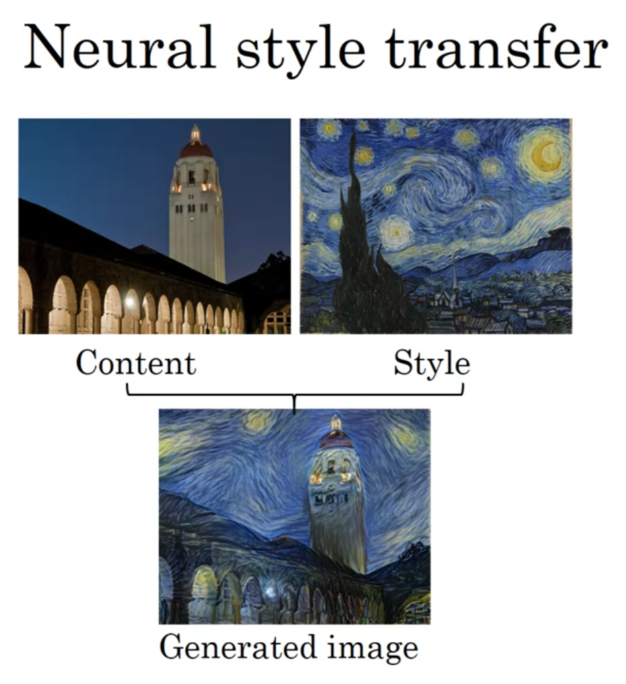
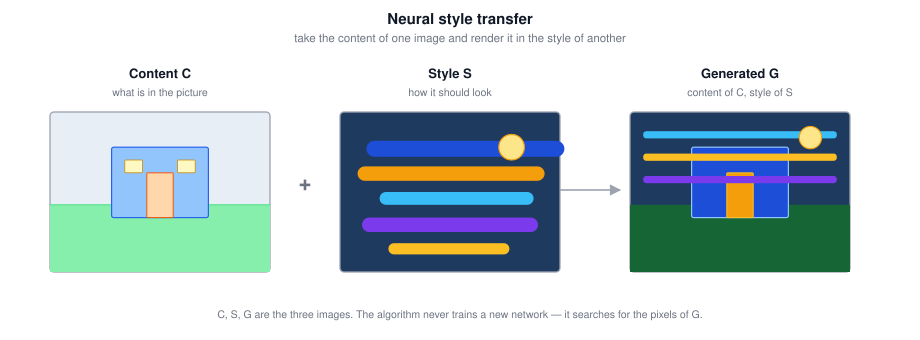
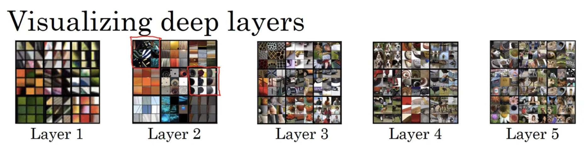
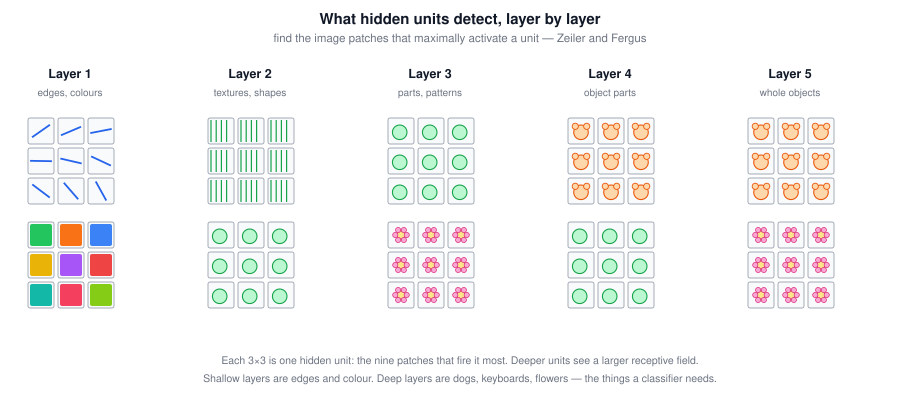
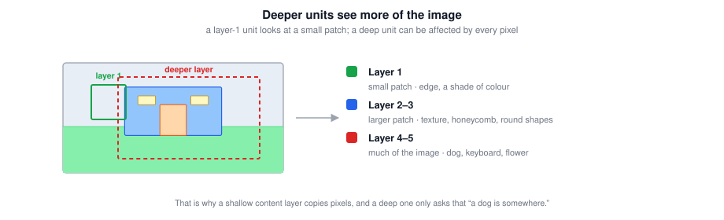
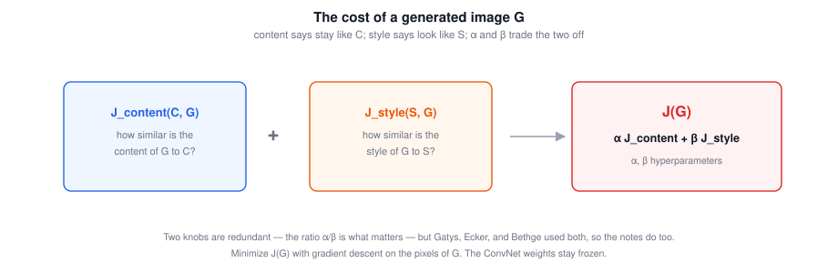
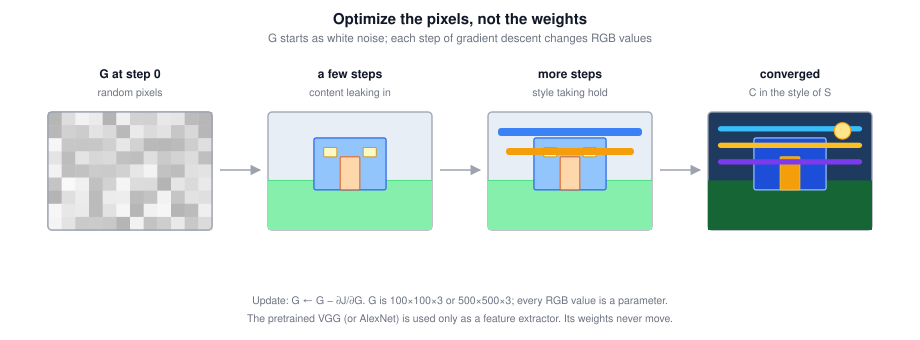
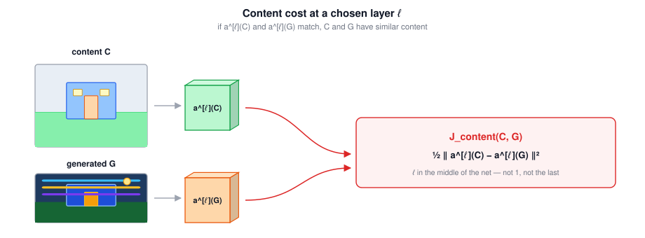
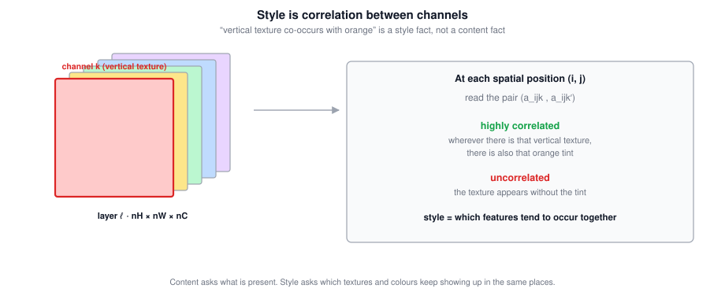
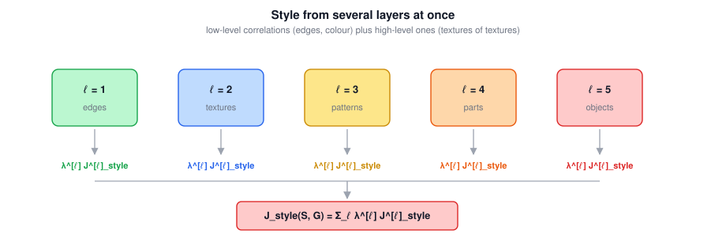

# Neural Style Transfer

A compact reference for painting a photograph in the style of another image:
- The content / style / generated triple $(C, S, G)$;
- What hidden units in a ConvNet actually detect;
- The overall cost $J(G)$;
- Content cost at a chosen layer;
- Style as channel correlation, and the Gram matrix;
- Combining style from several layers;
- Gradient descent on **pixels**, not on network weights.

Main idea: a pretrained ConvNet already separates *what* is in an image from *how it looks*. Content is “the activations at a mid-depth layer match.” Style is “the same pairs of channels fire together.” Search for an image $G$ that satisfies both, and you get the photograph painted like Van Gogh.

---

## 1. What Neural Style Transfer Is

Given a **content** image $C$ (a photo) and a **style** image $S$ (usually a painting), produce a new image $G$ that has the content of $C$ rendered in the style of $S$.

The lecture's running examples, generated by Justin Johnson: Stanford campus in the style of Van Gogh's *Starry Night*; the Golden Gate Bridge in the style of a Picasso.

$$\boxed{C \text{ says what is there.} \quad S \text{ says how it should look.} \quad G \text{ is the image you search for.}}$$

To implement this you will read features out of a ConvNet at several depths — shallow layers and deep ones. That only makes sense if you know what those layers compute, which is the next section.

### 1.1 Tricky Interview Questions

**Q: What are $C$, $S$, and $G$?**  
Content image, style image, generated image. $G$ is the variable you optimize.

**Q: Does the algorithm train a new ConvNet to generate art?**  
No. It uses a *pretrained* ConvNet as a frozen feature extractor and searches for the **pixels** of $G$.

**Q: Could $S$ be a photograph and $C$ a painting?**  
Yes — the math does not care. The interesting results just happen to put a photo in $C$ and a painting in $S$.

---

## 2. What Deep ConvNets Are Learning

Before defining costs, look at what hidden units actually do. The visualizations are from Zeiler and Fergus, *Visualizing and Understanding Convolutional Networks*, on an AlexNet-like network. The method used here is the simple one: run the training set through the net and, for a given hidden unit, collect the **image patches that maximize that unit's activation**.

A layer-1 unit sees only a small patch (its receptive field), so you plot small patches. Deeper units see more of the image; the plots below keep the patch size the same on the page, but the region of the original image is larger.

| Layer | What units prefer |
|---|---|
| **1** | Edges at a particular angle; a particular shade of colour (vertical light edge with green on the left; orange; red-green that reads as brown) |
| **2** | More complicated shapes and textures: many vertical lines, a rounder shape on the left, thin vertical lines |
| **3** | Still more structure: round shapes that pick up cars, honeycomb / square textures, the beginnings of people |
| **4** | Almost a **dog detector** (one breed-ish cluster), water, bird legs |
| **5** | A more varied dog detector, keyboards and keyboard-like dotted texture, possibly text, flowers |

The progression is the one you want for style transfer:

$$\boxed{\text{layer 1: edges and colour} \;\rightarrow\; \text{mid layers: textures} \;\rightarrow\; \text{deep layers: objects}}$$

Content will be read from a **middle** layer (objects without copying pixels). Style will be read from **several** layers (simple textures *and* complex ones).

### 2.1 Tricky Interview Questions

**Q: How do you visualize what one hidden unit computes?**  
Pass the training set through the net and plot the image patches that give that unit its largest activations. Zeiler and Fergus also have more sophisticated methods; this one is enough for the intuition.

**Q: Why plot a small patch for a layer-1 unit?**  
Because that is all the unit sees — its receptive field is a local window. Plotting the whole image would show a lot of pixels that never reached that unit.

**Q: Do deeper units see larger patches?**  
Yes. By the last layers, essentially every input pixel can affect the activation. That is why a deep content cost only asks “is there a dog *somewhere*.”

**Q: A unit in layer 5 that fires on many different dogs — is that a bug?**  
No. That is the point of depth: layer 4 had a narrow dog-like cluster; layer 5's dog unit covers a more varied set. Features become more invariant and more semantic.

**Q: Why does this matter for style transfer?**  
Because you are about to *define* content and style as properties of these activations. If you did not know that early layers are edges and later layers are objects, the choice of $\ell$ in the next sections would be arbitrary.

**Q: You train a ConvNet on cats, dogs, birds. A filter that fires on horizontal edges — is it more likely in layer 6 than in layer 1?**  
No. Edges are a low-level feature. You find them in **layer 1**. Layer 6 is in the object / part-of-object regime.

---

## 3. The Cost Function $J(G)$

You are given $C$ and $S$. You will generate $G$ by **minimizing a cost defined on $G$**.

$$\boxed{J(G) \;=\; \alpha\, J_{\text{content}}(C, G) \;+\; \beta\, J_{\text{style}}(S, G)}$$

| Term | Measures |
|---|---|
| $J_{\text{content}}(C, G)$ | How similar is the *content* of $G$ to $C$? |
| $J_{\text{style}}(S, G)$ | How similar is the *style* of $G$ to $S$? |
| $\alpha, \beta$ | Relative weighting of the two |

Two hyperparameters for one ratio is redundant. The original paper (Gatys, Ecker, and Bethge) used both, so these notes follow that convention. Only $\alpha / \beta$ matters.

### 3.1 The Algorithm

You are given $C$ and $S$. You also have a ConvNet that is **already trained** (VGG is the usual choice; an AlexNet-like net also works). Freeze it. Its weights $W$ never move. The only variables are the pixels of a third image $G$.

**Setup**

1. Load the pretrained ConvNet and **freeze** every weight. Pick a content layer and one or more style layers (sections 4–5), and pick the relative weights $\alpha$, $\beta$.
2. Forward $C$ and $S$ once and **cache** the hidden activations you will compare against. $C$ and $S$ never change, so this is done only at the start.
3. Initialize $G$ as **white noise** — every RGB value drawn at random. Choose the height and width you want the artwork to have, e.g. $400 \times 400 \times 3$. Those $400 \times 400 \times 3$ numbers *are* the parameters.

**Loop** until $J(G)$ stops falling, or $G$ looks right:

4. Forward $G$ through the **same frozen** ConvNet. Read the activations at the layers you chose.
5. Compute the two costs from those activations, then the total:

$$\boxed{J(G) \;=\; \alpha\, J_{\text{content}}(C, G) \;+\; \beta\, J_{\text{style}}(S, G)}$$

6. Backpropagate to get $\partial J / \partial G$. The gradient flows *through* the ConvNet so the activations can influence the pixels; it is **not** used to update $W$.
7. Take a step on the pixels ($\eta$ is an ordinary learning rate, not the content weight $\alpha$):

$$\boxed{G \;\leftarrow\; G \;-\; \eta\,\frac{\partial J}{\partial G}}$$

Adam or L-BFGS can replace the plain step; the variable is still $G$, not $W$. After enough iterations the noise becomes $C$ painted in the style of $S$.

$J_{\text{content}}$ and $J_{\text{style}}$ are filled in in the next two sections. The loop above does not change when those formulas are substituted in.

### 3.2 Tricky Interview Questions

**Q: What is being optimized — the ConvNet or the image?**  
The image. $G$'s pixels are the variables. The ConvNet weights are held fixed.

**Q: True or false: neural style transfer trains the pixels of an image, not the parameters of a network.**  
True. Backprop still runs through the frozen ConvNet; the step you take is $G \leftarrow G - \eta\, \partial J / \partial G$.

**Q: In each iteration, what is updated?**  
The pixel values of **$G$**. Not the network weights, not the pixels of $C$ or $S$, and not the regularization hyperparameters $\alpha, \beta, \lambda^{[\ell]}$.

**Q: Why initialize $G$ as noise rather than as a copy of $C$?**  
Noise is the formulation in the paper and the lectures. Starting from $C$ is a common practical variant that reaches a content-like image faster; it is not what the notes use.

**Q: Why two hyperparameters $\alpha$ and $\beta$?**  
Convention, following Gatys et al. One scalar for the ratio would be enough.

**Q: Is $J$ a function of the network parameters $W$?**  
No. $J = J(G)$. Backpropagation still runs through the ConvNet, but the gradient that you apply is $\partial J / \partial G$, not $\partial J / \partial W$.

**Q: Who are the authors of the algorithm these notes present?**  
Leon Gatys, Alexander Ecker, and Matthias Bethge.

---

## 4. Content Cost

Pick a hidden layer $\ell$ and compare activations on $C$ and on $G$.

### 4.1 Which Layer

| Choice of $\ell$ | Effect |
|---|---|
| Very shallow (layer 1) | Forces $G$'s **pixels** to look like $C$ |
| Very deep | Only asks that if $C$ has a dog, $G$ has a dog *somewhere* |
| **In between** | The usual choice: the objects of $C$ without a pixel-for-pixel copy |

The working default is a middle layer of a pretrained VGG (or similar).

### 4.2 The Formula

Let $a^{[\ell](C)}$ and $a^{[\ell](G)}$ be the activations of layer $\ell$ on the two images. Unroll both into vectors. If they are close, the two images have similar content:

$$\boxed{J_{\text{content}}(C, G) \;=\; \tfrac{1}{2}\,\bigl\| a^{[\ell](C)} - a^{[\ell](G)} \bigr\|_2^2}$$

That is just the sum of squared element-wise differences. A leading $1/2$ or $1/(2n)$ is optional — $\alpha$ can absorb any constant.

When you later minimize $J(G)$, this term incentivizes $G$ to produce the same hidden activations that $C$ did at layer $\ell$.

### 4.3 Tricky Interview Questions

**Q: If you take $\ell = 1$ for the content cost, what happens to $G$?**  
It is forced toward a near-copy of $C$'s pixels, because layer 1 is edges and local colour.

**Q: If you take a very deep $\ell$, what is the content constraint?**  
Semantic: “there is a dog somewhere,” not “the dog's ear is at this pixel.” $G$ can rearrange the scene more freely.

**Q: Must $a^{[\ell](C)}$ and $a^{[\ell](G)}$ have the same shape?**  
Yes. $C$ and $G$ are fed through the same network, so layer $\ell$ produces two tensors of identical $n_H \times n_W \times n_C$. They are then unrolled and compared.

**Q: Do you train the VGG to make these activations similar?**  
No. VGG is pretrained on ImageNet (or similar) and frozen. Similarity is achieved by changing $G$.

**Q: Does the $1/2$ in front of the squared norm matter?**  
Not in principle. $\alpha$ rescales the whole content term.

---

## 5. Style Cost

### 5.1 What “Style” Means

Take the activation block at layer $\ell$: shape $n_H \times n_W \times n_C$. **Style is the correlation between channels** across spatial positions.

Pick two channels, say the red one and the yellow one. At each of the $n_H \cdot n_W$ positions you have a pair of numbers $(a_{ijk},\, a_{ijk'})$. How correlated are those two numbers, as you range over positions?

Why that is style, using the Zeiler–Fergus picture: suppose channel $k$ is “subtle vertical texture” and channel $k'$ is “orange-ish patch.”

| Channels $k$ and $k'$ | Reading |
|---|---|
| **Highly correlated** | Wherever that vertical texture appears, the orange tint appears too |
| **Uncorrelated** | The texture appears without the tint |

Which textures and colours **tend to occur together** — and which do not — is a description of how the image is painted, not of what objects are in it.

So: measure those correlations on $S$, measure them on $G$, and penalize the difference.

### 5.2 The Style (Gram) Matrix

Let $a^{[\ell]}_{ijk}$ be the activation at height $i$, width $j$, channel $k$ in layer $\ell$. The **style matrix** $G^{[\ell]}$ is $n_C \times n_C$:

$$\boxed{G^{[\ell]}_{kk'} \;=\; \sum_{i=1}^{n_H} \sum_{j=1}^{n_W} a^{[\ell]}_{ijk}\, a^{[\ell]}_{ijk'}}$$

$k, k'$ run from $1$ to $n_C$. If both channels tend to be large at the same positions, $G^{[\ell]}_{kk'}$ is large; if they do not, it is small.

Technically this is an **unnormalized cross-covariance**: the means are not subtracted, and there is no division by $n_H n_W$. The lectures still say “correlation” for intuition. In linear algebra $G^{[\ell]}$ is a **Gram matrix**; the notes use “style matrix” because $G$ is already the generated image.

Compute one matrix on $S$ and one on $G$, written $G^{[\ell](S)}$ and $G^{[\ell](G)}$.

 and G^[ℓ](G).](figures/nst-gram.svg)

### 5.3 Style Cost at One Layer

$$\boxed{J^{[\ell]}_{\text{style}}(S, G) \;=\; \frac{1}{\bigl(2 n_H n_W n_C\bigr)^2}\, \bigl\| G^{[\ell](S)} - G^{[\ell](G)} \bigr\|_F^2}$$

The Frobenius norm is the sum of squared element-wise differences:

$$\bigl\| G^{[\ell](S)} - G^{[\ell](G)} \bigr\|_F^2 \;=\; \sum_{k=1}^{n_C} \sum_{k'=1}^{n_C} \Bigl( G^{[\ell](S)}_{kk'} - G^{[\ell](G)}_{kk'} \Bigr)^2$$

The factor $1/(2 n_H n_W n_C)^2$ is the authors' normalization. It does not matter much: $\beta$ multiplies the whole style term.

### 5.4 Several Layers

Style looks better if you use **more than one layer** — early layers (edges, colour) *and* later ones (richer textures):

$$\boxed{J_{\text{style}}(S, G) \;=\; \sum_{\ell} \lambda^{[\ell]}\, J^{[\ell]}_{\text{style}}(S, G)}$$

The $\lambda^{[\ell]}$ are extra hyperparameters (chosen in the programming exercise). They let the net take both low-level and high-level correlations into account.

### 5.5 Putting It Together

$$\boxed{J(G) \;=\; \alpha\, J_{\text{content}}(C, G) \;+\; \beta\, J_{\text{style}}(S, G)}$$

Initialize $G$ as noise, run gradient descent (or a more sophisticated optimizer) on its pixels, and $G$ becomes novel artwork.

### 5.6 Tricky Interview Questions

**Q: Style is defined as correlation between what and what?**  
Between **channels** of a layer, across spatial positions. Not between pixels, and not between images.

**Q: Is style $\|a^{[\ell](S)} - a^{[\ell](G)}\|^2$, or the correlation between the images $G$ and $S$, or the correlation between $C$ and $S$?**  
None of those. $\|a^{[\ell](S)} - a^{[\ell](G)}\|^2$ is a *content*-style comparison of activations (and $S$ is the wrong image for content). Style is the **Gram matrix**: correlation of activations **across channels** of one image, then a Frobenius distance between $G^{[\ell](S)}$ and $G^{[\ell](G)}$.

**Q: Write $G^{[\ell]}_{kk'}$.**  
$\sum_i \sum_j a^{[\ell]}_{ijk}\, a^{[\ell]}_{ijk'}$. Sum over height and width; $k$ and $k'$ index channels.

**Q: Is the style matrix a true correlation matrix?**  
No. Means are not subtracted and there is no normalization by the number of positions. It is an unnormalized Gram matrix / cross-covariance. The lectures say “correlation” for intuition.

**Q: Why can $G^{[\ell]}_{kk'}$ be large even if the two channels are anti-correlated around a non-zero mean?**  
Because the mean is not removed. Two channels that are both always on will give a large inner product even if their *variations* are unrelated. That is a known quirk of this definition; it still works as a style signature.

**Q: What is the shape of $G^{[\ell]}$?**  
$n_C \times n_C$, independent of $n_H$ and $n_W$. That is why style can transfer between images of different sizes: the Gram matrix does not know the spatial layout.

**Q: Why use several layers for style but (usually) one layer for content?**  
Style is “which features co-occur,” and that is meaningful at every scale — brushstrokes *and* large colour fields. Content is “what objects,” which you want at one well-chosen depth so you do not also copy pixels.

**Q: Does the $1/(2 n_H n_W n_C)^2$ constant matter?**  
Barely. $\beta$ (and the $\lambda^{[\ell]}$) absorb it.

**Q: $G$ denotes both the generated image and the Gram matrix. How do you keep them straight?**  
Generated image: $G$ with no superscript, or the pixels you optimize. Style matrix: $G^{[\ell]}$, sometimes $G^{[\ell](S)}$ vs $G^{[\ell](G)}$. The collision is inherited from the paper.

---

## 6. Beyond the Basics

Context the lectures do not cover but that comes up immediately in practice.

### 6.1 Total Variation

Pixel-wise GD on $J(G)$ can produce high-frequency speckles. A **total-variation** term

$$\boxed{J_{\text{TV}}(G) \;=\; \sum_{i,j} \bigl( |G_{i+1,j} - G_{i,j}| + |G_{i,j+1} - G_{i,j}| \bigr)}$$

penalizes neighbouring-pixel jumps and is a standard extra regularizer. It is not in the original Gatys recipe as taught here, but most implementations add it.

### 6.2 Optimizers

The original work used **L-BFGS** on the pixels (a second-order method that is happy with a few thousand variables and a costly objective). Adam also works and is what many course notebooks use. Either way you are still differentiating through the frozen ConvNet to get $\partial J / \partial G$.

### 6.3 Fast Style Transfer

Gatys-style optimization takes hundreds of forward/backward passes **per image**. Johnson, Alahi, and Fei-Fei trained a **feed-forward** network to map $C \mapsto G$ for a *fixed* $S$. At test time you run one forward pass. Later work (conditional instance normalization, AdaIN, arbitrary style transfer) makes the feed-forward net handle many styles without retraining.

The cost that the feed-forward net is trained to minimize is still the Gatys $J$ — content activations plus Gram matrices — so these notes remain the definition of the objective.

### 6.4 What the Gram Matrix Throws Away

$G^{[\ell]}$ sums over space, so it has **no layout**. That is why a style transfer can move swirls around without moving the Golden Gate: content (activations) pins objects down; style (Grams) only cares that the same channel pairs keep lighting up. Alternatives (MRF-based style, attention-based style) put some spatial structure back when you *want* the brushstrokes to follow edges.

### 6.5 Where the Field Went

| Development | Contribution |
|---|---|
| Gatys, Ecker, Bethge (2015/16) | $J(G)$ from VGG activations and Gram matrices |
| Johnson et al. | Perceptual loss; one forward pass for a fixed style |
| Ulyanov et al. | Instance normalization, important for feed-forward style |
| AdaIN / arbitrary style | Align content features to a style's mean and variance |
| StyleGAN | A generator whose *style* vector controls coarse-to-fine appearance — a cousin of the same “style as summary statistics” idea |

Note the trajectory: the slow per-image optimization of these notes became a training *objective* for a fast network, and “style as a set of feature statistics” survived into generative models that no longer mention Van Gogh.

---

## 7. Quick Reference

$$\boxed{J(G) \;=\; \alpha\, J_{\text{content}}(C, G) \;+\; \beta\, J_{\text{style}}(S, G)}$$

$$\boxed{J_{\text{content}}(C, G) \;=\; \tfrac{1}{2}\,\bigl\| a^{[\ell](C)} - a^{[\ell](G)} \bigr\|_2^2}$$

$$\boxed{G^{[\ell]}_{kk'} \;=\; \sum_{i,j} a^{[\ell]}_{ijk}\, a^{[\ell]}_{ijk'}}$$

$$\boxed{J^{[\ell]}_{\text{style}} \;=\; \frac{1}{(2 n_H n_W n_C)^2}\, \bigl\| G^{[\ell](S)} - G^{[\ell](G)} \bigr\|_F^2, \qquad J_{\text{style}} \;=\; \sum_{\ell} \lambda^{[\ell]} J^{[\ell]}_{\text{style}}}$$

$$\boxed{G \;\leftarrow\; G - \eta\,\partial J / \partial G \qquad \text{(pixels move; ConvNet weights do not)}}$$

| Symbol | Meaning |
|---|---|
| $C$ | Content image (usually a photo) |
| $S$ | Style image (usually a painting) |
| $G$ | Generated image — the variable |
| $G^{[\ell]}$ | Style / Gram matrix at layer $\ell$ |
| $\alpha, \beta$ | Content vs style weights |
| $\lambda^{[\ell]}$ | Per-layer style weights |
| $a^{[\ell]}$ | Activations at layer $\ell$ |

| Layer depth | Role in NST |
|---|---|
| Shallow | Edges, colour — good for *style*, too literal for *content* |
| Middle | Objects without pixel-copying — the usual *content* layer |
| Deep | Semantic objects — weak spatial constraint on content |
| Several, mixed | The usual *style* recipe |

| Symptom | Likely cause | Fix |
|---|---|---|
| $G$ is a copy of $C$ | Content layer too shallow, or $\alpha \gg \beta$ | Deeper $\ell$, or raise $\beta$ |
| $G$ has the right textures but the objects have wandered | Content layer too deep, or $\alpha$ too small | Mid-network $\ell$, raise $\alpha$ |
| Style looks only like brushstrokes, not like the painting's colour fields | Style from only a deep layer | Add early layers to $J_{\text{style}}$ |
| Style looks only like colour, no texture | Style from only a shallow layer | Add later layers; set $\lambda^{[\ell]}$ |
| Looking for an edge detector in layer 6 | Edges live in layer 1 | Early layers: edges and colour; deep layers: objects |
| High-frequency speckle | No spatial regularizer | Total variation on $G$ |
| Optimization is extremely slow per photo | Per-image GD through VGG | Train a feed-forward stylizer (Johnson et al.) |
| You updated VGG weights and the result collapsed | NST does not train the ConvNet | Freeze the feature extractor; differentiate w.r.t. $G$ |

Core principle: a ConvNet trained to classify already contains a representation of content (activations) and a representation of style (which of those activations co-occur). Neural style transfer is nearest-neighbor in neither space — it is an image $G$ that is close to $C$ in the first and close to $S$ in the second.
