# Object Detection and Segmentation

A compact reference for localizing and outlining objects rather than just classifying them:
- Object localization and the bounding-box target vector;
- Landmark detection;
- Sliding windows detection and its convolutional implementation;
- YOLO and grid-based bounding box prediction;
- Intersection over Union;
- Non-max suppression;
- Anchor boxes;
- Region proposals and the R-CNN family;
- Semantic segmentation;
- Transpose convolutions;
- The U-Net architecture.

Main idea: classification asks *what*, localization asks *where*, detection asks *what and where, for every object*, and segmentation asks *which class does every single pixel belong to*. Each step is built by changing what the network outputs, not by abandoning the ConvNet.

---

## 1. Object Localization and Landmark Detection

### 1.1 Three Levels of Task

| Task | Objects | Output |
|---|---|---|
| **Classification** | One | Class label: is this a car? |
| **Classification with localization** | Usually one | Class label **plus** a bounding box |
| **Detection** | Multiple, possibly of different categories | All class labels and all bounding boxes |

The ideas from image classification are useful for localization, and the ideas from localization turn out to be useful for detection, so the three build on each other in order.

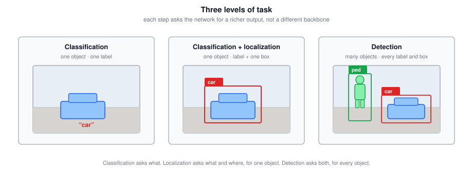

### 1.2 Defining the Target Label

Start from a standard classification pipeline: image $\rightarrow$ ConvNet $\rightarrow$ softmax over classes. For a self-driving car the classes might be pedestrian, car, motorcycle, and **background** (none of the above).

To add localization, have the network output **four more numbers**: $b_x, b_y, b_h, b_w$.

$$\boxed{\text{upper left of image} = (0, 0), \qquad \text{lower right} = (1, 1)}$$

| Symbol | Meaning |
|---|---|
| $b_x, b_y$ | Coordinates of the bounding box **midpoint** |
| $b_h$ | Box height, as a fraction of the image height |
| $b_w$ | Box width, as a fraction of the image width |

For a car roughly halfway across, 70% of the way down, occupying 30% of the height and 40% of the width: $b_x \approx 0.5$, $b_y \approx 0.7$, $b_h \approx 0.3$, $b_w \approx 0.4$.

The full target vector for 3 classes is 8-dimensional:

$$\boxed{y = \begin{bmatrix} p_c \\ b_x \\ b_y \\ b_h \\ b_w \\ c_1 \\ c_2 \\ c_3 \end{bmatrix}}$$

- $p_c$ is **is there an object?** It is 1 if the image contains class 1, 2, or 3, and 0 for the background class. Think of it as the probability that one of the classes you care about is present.
- $b_x, b_y, b_h, b_w$ specify the box, and are only meaningful when $p_c = 1$.
- $c_1, c_2, c_3$ say which class it is. At most one of them equals 1.

Two example labels:

| Image | $y$ |
|---|---|
| Contains a car (class 2) | $[1, \; b_x, b_y, b_h, b_w, \; 0, 1, 0]^T$ |
| Contains no object of interest | $[0, \; ?, ?, ?, ?, \; ?, ?, ?]^T$ |

When $p_c = 0$, every other component is a **don't care**, written `?`. If there is no object, you do not care what box or class the network reports. Note that your labeled training set must actually contain bounding boxes, which is more expensive to annotate than class labels alone.

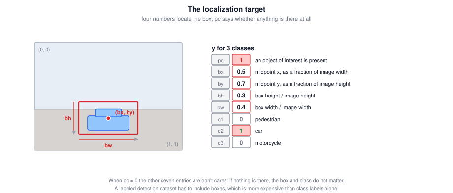

### 1.3 The Loss Function

With squared error and $y_1 = p_c$:

$$\boxed{\mathcal{L}(\hat{y}, y) = \begin{cases} \sum_{i=1}^{8}\left(\hat{y}_i - y_i\right)^2 & \text{if } y_1 = 1 \\[6pt] \left(\hat{y}_1 - y_1\right)^2 & \text{if } y_1 = 0 \end{cases}}$$

When there is an object, penalize deviation on all eight components. When there is none, the only thing that matters is how accurately the network estimates $p_c$, since components 2 through 8 are don't cares.

In practice you would mix loss types rather than use squared error throughout:

| Component | Sensible loss |
|---|---|
| $c_1, c_2, c_3$ | Softmax / log-likelihood loss |
| $b_x, b_y, b_h, b_w$ | Squared error or similar |
| $p_c$ | Logistic regression loss |

Squared error on everything will probably work okay, but the mixed version matches the nature of each output.

### 1.4 Landmark Detection

The same idea generalizes: have the network output the $x$ and $y$ coordinates of any set of important points, called **landmarks**.

For one point (say the corner of an eye), output $l_x, l_y$. For $N$ landmarks, output $l_{1x}, l_{1y}, \dots, l_{Nx}, l_{Ny}$, which is $2N$ numbers.

$$\boxed{N \text{ landmarks} \;\Rightarrow\; 2N \text{ coordinate outputs}}$$

With 64 face landmarks plus one unit for "is this a face", the network has $64 \times 2 + 1 = 129$ output units.

| Application | Landmarks |
|---|---|
| Face landmarks | Eye corners, points along the eyes, mouth (to tell smiling from frowning), nose edges, jaw line |
| Emotion recognition | Built on top of face landmarks |
| AR filters | Snapchat-style crowns and hats, face warping and special effects |
| Pose detection | Chest midpoint, left shoulder, elbow, wrist, and so on — perhaps 32 points |

Two practical requirements:

- **Label consistency.** Landmark 1 must be the same anatomical point in every image — always that corner of that eye. If the identity of a landmark drifts between images, the network has nothing consistent to learn.
- **Laborious annotation.** Someone has to hand-annotate every landmark in every training image.

The general lesson: having a neural network output a set of real numbers, essentially as a regression task, is a very powerful and reusable idea.

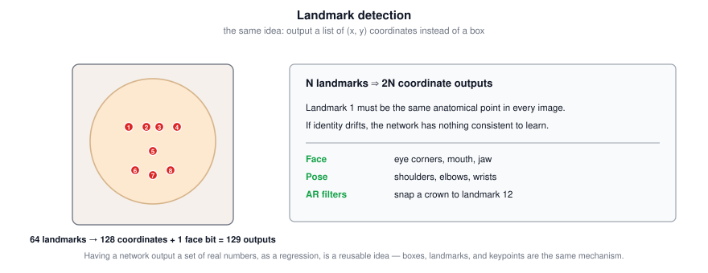

### 1.5 Tricky Interview Questions

**Q: For a 3-class localization problem with $y = [p_c, b_x, b_y, b_h, b_w, c_1, c_2, c_3]$, what is $y$ for an image with no object of interest?**  
$y = [0, ?, ?, ?, ?, ?, ?, ?]$. Once $p_c = 0$, every other component is a don't care. Note that $[1, ?, ?, ?, ?, 0, 0, 0]$ is self-contradictory — it claims an object is present while asserting none of the three classes — and $[1, ?, \dots, ?]$ is wrong too, because if an object is present you do know its class.

**Q: A factory detects soft-drink cans on a conveyor. The bounding box is always square, the can always appears the same size, and there is at most one can. Is $y = [p_c, b_x, b_y, b_h, b_w, c_1]$ the most adequate output?**  
No — $b_h$ and $b_w$ are unnecessary, because the cans are always the same size, so those two values are constants the network does not need to predict. ($c_1$ is also redundant with $p_c$ when there is only one class.) The lesson is to strip outputs that carry no information in your specific setting.

**Q: A network outputs $N$ face landmarks. What is the shape of $\hat{y}^{(i)}$?**  
$(2N, 1)$ — two coordinates per landmark. It stores coordinates directly, not a probability distribution over positions.

**Q: You need more data for a cat *detection* system and find many cat photos online without bounding boxes. Can you use them?**  
Not for the detection task as such: you cannot add them unless they have bounding boxes, because the localization outputs $b_x, b_y, b_h, b_w$ have no supervision signal without boxes. They certainly cannot go in dev/test, which need boxes to evaluate localization at all. (The obstacle here is missing labels, not distribution shift — extra off-distribution *labeled* data is often fine.)

**Q: Why is $p_c$ separate from the class outputs $c_1, c_2, c_3$?**  
Because they answer different questions. $p_c$ asks whether any object of interest is present, which gates whether the box and class outputs mean anything at all; $c_1, c_2, c_3$ then distinguish among classes conditional on something being there.

**Q: Why can't $b_h$ and $b_w$ simply be read off the classifier's window size?**  
Because a window has a fixed size and aspect ratio, while real objects vary in both. Predicting the four numbers explicitly is what allows arbitrary aspect ratios and precise coordinates.

---

## 2. Sliding Windows Detection

### 2.1 The Basic Algorithm

First, train a classifier on **closely cropped** images: crop out everything that is not the object, so $x$ is essentially just a car, centered and filling the frame. Train a ConvNet on these to output $0$ or $1$ — car or no car.

Then, at test time:

1. Pick a window size.
2. Feed the image region inside that window into the ConvNet and get a prediction.
3. Shift the window by some stride and repeat, until you have covered every position.
4. Repeat the whole sweep with a **larger** window (resizing each region to the ConvNet's expected input size), then a larger one still.

The hope is that if there is a car anywhere in the image, some window will line up with it well enough for the ConvNet to output 1.

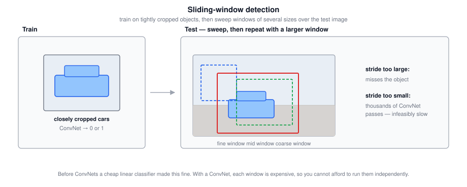

### 2.2 The Computational Problem

The huge disadvantage is **cost**: you crop out many square regions and run each one independently through a ConvNet.

| Stride | Effect |
|---|---|
| Coarse (large) | Fewer windows and less compute, but coarser granularity may hurt performance and localization |
| Fine (small) | Better coverage, but an enormous number of ConvNet passes |

Before neural networks, classifiers were much simpler — a linear function over hand-engineered features — so each window was cheap and sliding windows ran fine. It was not a bad method in that era. With a ConvNet, one classification is far more expensive, and sliding windows this way is **infeasibly slow**. And unless the stride is very small, you cannot localize objects accurately either.

Fortunately the cost problem has a good solution: implement the sliding-window detector **convolutionally**.

### 2.3 Turning Fully Connected Layers into Convolutional Layers

This is the enabling trick. Take a network: $14 \times 14 \times 3$ input, $5\times5$ conv with 16 filters, $2\times2$ max pool, then FC to 400, FC again, then a 4-way softmax.

| Original | Convolutional equivalent | Output |
|---|---|---|
| $14 \times 14 \times 3$ input | same | $14 \times 14 \times 3$ |
| $5\times5$ conv, 16 filters | same | $10 \times 10 \times 16$ |
| $2\times2$ max pool | same | $5 \times 5 \times 16$ |
| FC to 400 units | $5\times5$ conv, **400 filters** | $1 \times 1 \times 400$ |
| FC to 400 units | $1\times1$ conv, 400 filters | $1 \times 1 \times 400$ |
| Softmax over 4 classes | $1\times1$ conv, 4 filters + softmax | $1 \times 1 \times 4$ |

Why the first replacement is exact: a filter over a $5 \times 5 \times 16$ input is itself $5 \times 5 \times 16$ (the convention is that a filter spans all channels), so convolving gives a $1 \times 1$ output per filter. With 400 filters the result is $1 \times 1 \times 400$. Each of those 400 values is an arbitrary linear function of all $5 \times 5 \times 16$ activations from the previous layer — which is precisely what a fully connected layer computes.

$$\boxed{\text{an FC layer} \;\equiv\; \text{a convolution whose filter covers the entire input volume}}$$

So instead of viewing those 400 numbers as a flat set of nodes, view them as a $1 \times 1 \times 400$ volume. Nothing about the computation changes; only the bookkeeping does.

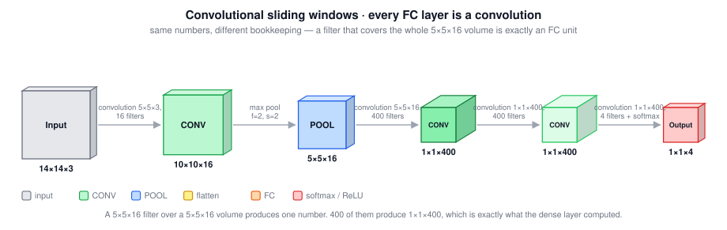

### 2.4 The Convolutional Implementation

Now the payoff (based on the OverFeat paper by Sermanet, Eigen, Zhang, Mathieu, Fergus, and LeCun).

Suppose the classifier expects $14 \times 14 \times 3$ and your test image is $16 \times 16 \times 3$. The naive sliding window with stride 2 would run the ConvNet **four times**, on the upper-left, upper-right, lower-left, and lower-right $14\times14$ crops. But most of that computation is duplicated, because the four crops overlap heavily.

Instead, run the **whole** $16 \times 16$ image through the same network with the same parameters:

| Layer | Output |
|---|---|
| Input | $16 \times 16 \times 3$ |
| $5\times5$ conv, 16 filters | $12 \times 12 \times 16$ |
| $2\times2$ max pool | $6 \times 6 \times 16$ |
| $5\times5$ conv, 400 filters | $2 \times 2 \times 400$ |
| $1\times1$ conv, 400 filters | $2 \times 2 \times 400$ |
| $1\times1$ conv, 4 filters | $2 \times 2 \times 4$ |

Each $1 \times 1 \times 4$ slice of that $2 \times 2 \times 4$ output is exactly the result the original network would have produced on one of the four crops: the upper-left slice corresponds to the upper-left window, and so on. If you step through the calculation for one crop, its activations at every layer are exactly the corresponding sub-region of the full-image activations.

$$\boxed{\text{one forward pass over the whole image} \;=\; \text{all window positions at once, with shared computation}}$$

A bigger example: a $28 \times 28 \times 3$ image through the same network gives an $8 \times 8 \times 4$ output, that is, 64 window positions evaluated in one pass. Working through it: $28 \rightarrow 24$ after the $5\times5$ conv, $\rightarrow 12$ after pooling, $\rightarrow 8$ after the second $5\times5$ conv.

The **effective stride** of the sliding window is set by the downsampling in the network. Here the $2\times2$ max pool means consecutive output positions correspond to windows 2 pixels apart in the original image.

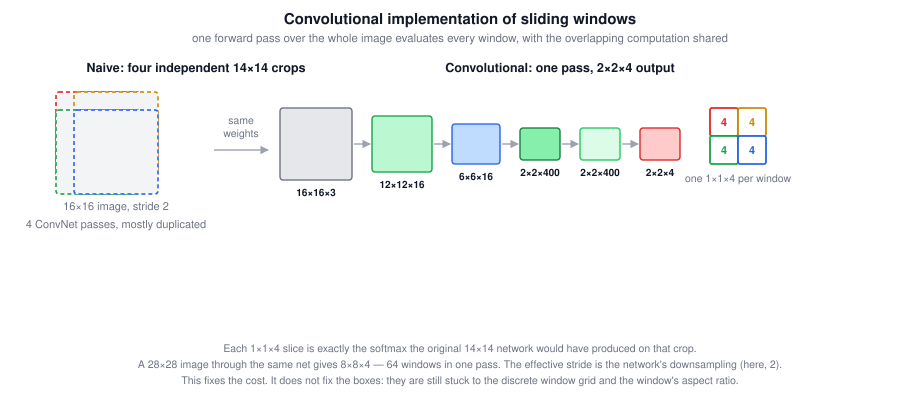

### 2.5 The Remaining Weakness

The convolutional implementation fixes the speed problem but not the accuracy problem: **the bounding box positions are still not accurate**. You are choosing from a discrete set of window locations and shapes, so none of the boxes may line up well with the object. In the car example, the best available box may still be noticeably off, and the true box may not even be square — real objects often have a wider, more horizontal aspect ratio than the windows you slide.

The next section fixes this.

### 2.6 Tricky Interview Questions

**Q: Why is a fully connected layer equivalent to a convolution?**  
Because an FC layer computes arbitrary linear functions of the entire input volume, and a convolution whose filter is exactly as large as the input volume does the same thing. A $5\times5\times16$ input with 400 filters of $5\times5\times16$ gives $1\times1\times400$, one arbitrary linear function per filter.

**Q: What makes the convolutional implementation faster than running windows one at a time?**  
Overlapping windows share almost all of their intermediate computation. Running each crop separately recomputes the same convolutions many times; one pass over the full image computes each shared activation once.

**Q: What determines the stride of the convolutionally implemented sliding window?**  
The cumulative downsampling of the network — the pooling layers and strided convolutions. A single $2\times2$ max pool means adjacent output positions correspond to windows 2 pixels apart.

**Q: A $14\times14$ classifier is applied convolutionally to a $28\times28$ image. How many window positions do you get?**  
$8 \times 8 = 64$, following the layer arithmetic $28 \rightarrow 24 \rightarrow 12 \rightarrow 8$.

**Q: Why train the classifier on closely cropped images?**  
Because at test time each window contains (ideally) just the object filling the frame, so the training distribution has to match: $x$ should be essentially only the object.

**Q: What problem does the convolutional implementation *not* solve?**  
Bounding box accuracy. The boxes are still restricted to the discrete grid of window positions and the window's aspect ratio.

---

## 3. YOLO: Bounding Box Predictions

YOLO stands for **You Only Look Once** (Redmon, Divvala, Girshick, and Farhadi). It gets accurate boxes by having the network output coordinates directly, per grid cell.

### 3.1 The Grid

Place a grid over the input image. Illustrations use $3 \times 3$; a real implementation uses something finer like $19 \times 19$. Then apply the classification-with-localization algorithm from section 1 to **each grid cell**.

The assignment rule is the key definition:

$$\boxed{\text{each object is assigned to the one grid cell containing its \textbf{midpoint}}}$$

So an object spanning several cells still belongs to exactly one of them. If two cars have their midpoints in the left and right cells, those two cells are responsible for them, and the central cell — even though parts of both cars pass through it — is labeled as containing no object.

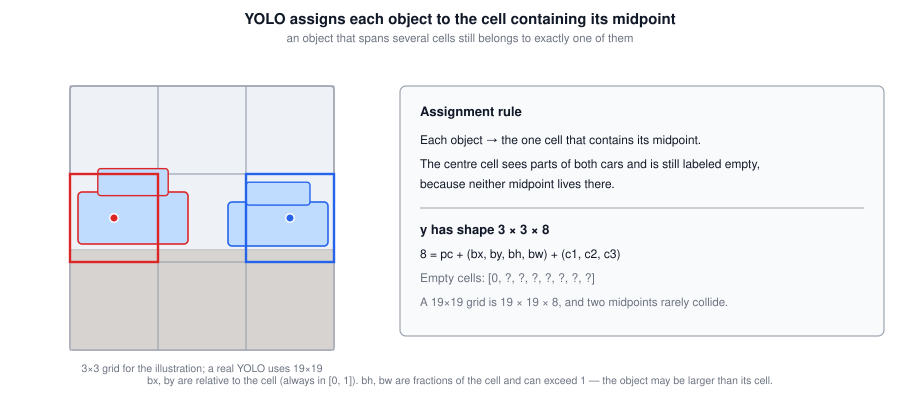

### 3.2 The Target Volume

Each cell gets the same 8-dimensional vector as before, so for a $3\times3$ grid and 3 classes:

$$\boxed{y \text{ has shape } 3 \times 3 \times 8}$$

The $1 \times 1 \times 8$ slice at each grid position is that cell's target vector. Cells with nothing in them get $[0, ?, ?, ?, ?, ?, ?, ?]$. Cells containing a midpoint get $p_c = 1$, the box coordinates, and a one-hot class.

Training is ordinary supervised learning: input a $100 \times 100 \times 3$ image, run it through conv and pool layers chosen so the final volume is $3 \times 3 \times 8$, and use backpropagation to map $x$ to $y$.

With a $19\times19$ grid the output is $19 \times 19 \times 8$. A finer grid also **reduces the chance that two objects share a cell**, since two midpoints landing in the same one of 361 cells is less likely than in one of 9.

### 3.3 Encoding the Bounding Boxes

This is where YOLO differs from section 1: coordinates are specified **relative to the grid cell**, not the whole image.

$$\boxed{\text{cell upper left} = (0,0), \qquad \text{cell lower right} = (1,1)}$$

| Value | Range | Why |
|---|---|---|
| $b_x, b_y$ | Always in $[0, 1]$ | The midpoint is inside the cell by definition — if it were outside, the object would have been assigned to a different cell |
| $b_h, b_w$ | Can exceed $1$ | The object may be larger than its grid cell |

$b_h$ is the box height as a fraction of the cell height, and $b_w$ the width as a fraction of the cell width.

![A box larger than its assigned cell: the midpoint stays inside the cell so bx, by are in [0, 1], while bh and bw exceed 1.](figures/det-yolo-cell-box.svg)

> **More advanced parametrizations.** The YOLO papers use variants that work slightly better: a **sigmoid** on $b_x, b_y$ to guarantee they land in $[0,1]$, and an **exponential** parametrization for $b_h, b_w$ to guarantee they stay non-negative. The simple convention above works fine for understanding.

### 3.4 Why YOLO Works Well

- **Precise boxes.** Coordinates are output explicitly, so boxes can have any aspect ratio and are not restricted to the stride of a sliding-window classifier.
- **One convolutional pass.** You are not running the algorithm 9 times, or $19^2 = 361$ times. It is a single ConvNet with computation shared across all grid cells, exactly as in section 2.4.
- **Real-time speed.** Because of that, YOLO runs very fast, fast enough for real-time detection, which accounts for much of its popularity.

The one limitation so far: this works as long as **no grid cell contains more than one object**. Section 5 addresses that.

> **A warning about the paper.** The YOLO paper is one of the harder ones to read. It is not unusual for even senior researchers to struggle with paper details and have to consult open-source code or contact the authors. Do not be discouraged if it is slow going.

### 3.5 Tricky Interview Questions

**Q: How is an object assigned to a grid cell?**  
By its midpoint. Whichever single cell contains the object's midpoint is responsible for it, even if the object spans many cells.

**Q: Why must $b_x$ and $b_y$ be between 0 and 1, while $b_h$ and $b_w$ need not be?**  
Because the midpoint lies inside the assigned cell by construction, so its relative coordinates are in $[0,1]$. The object's extent, however, can easily be larger than one cell, so the height and width fractions can exceed 1.

**Q: What is the output volume for a $19\times19$ grid, 3 classes, and no anchor boxes?**  
$19 \times 19 \times 8$, where $8 = 5 + 3$: one $p_c$, four box coordinates, and three class scores.

**Q: Why use a $19\times19$ grid instead of $3\times3$?**  
Finer localization, and a much lower chance that two object midpoints fall in the same cell, which is the case the basic algorithm cannot handle.

**Q: Is YOLO run once per grid cell?**  
No. It is a single convolutional forward pass whose output volume has one slice per grid cell, with computation shared across all of them. That is what makes it fast enough for real time.

**Q: What does the network output for a cell that contains no object, given that it cannot emit "?"?**  
It outputs $p_c \approx 0$ plus arbitrary numbers in the remaining slots. Those numbers are effectively noise and get ignored precisely because $p_c$ is near zero.

---

## 4. Intersection over Union and Non-Max Suppression

### 4.1 Intersection over Union

How do you tell whether a predicted box is good? Compare it to the ground-truth box by area overlap.

$$\boxed{\text{IoU} = \frac{\text{area of intersection}}{\text{area of union}}}$$

The **union** is the area contained in either box; the **intersection** is the area contained in both. Perfectly overlapping boxes give $\text{IoU} = 1$, since intersection equals union.

By convention, a detection is judged **correct if $\text{IoU} \geq 0.5$**. This gives you a way to turn localization into an accuracy number: count how often the algorithm correctly detects *and* localizes an object.

The $0.5$ threshold is a purely human-chosen convention with no deep theoretical justification. You can use $0.6$ or $0.7$ to be more stringent — higher thresholds demand more accurate boxes — but people rarely drop below $0.5$.

More generally, IoU measures **how similar any two boxes are**, which is what makes it useful inside the next algorithm, not just for evaluation.

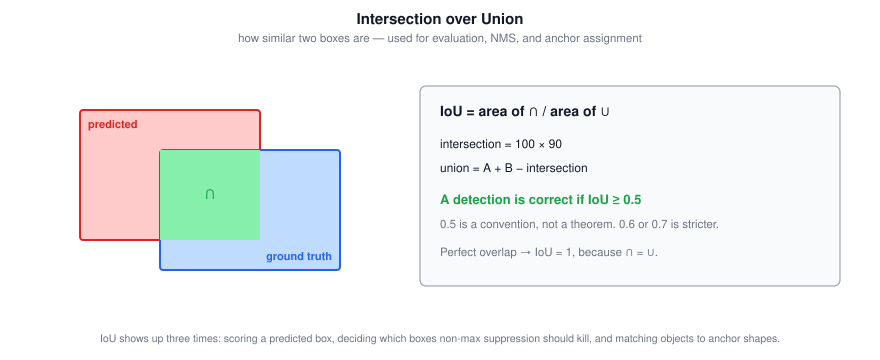

### 4.2 The Duplicate Detection Problem

Because you run classification and localization on every one of the (say) 361 grid cells, many cells may claim to contain an object's midpoint. Technically a car has one midpoint and should be claimed by one cell, but in practice several neighboring cells will all report a high $p_c$. The result is **multiple detections of the same object**.

Non-max suppression cleans this up so you end up with one detection per object.

### 4.3 The Non-Max Suppression Algorithm

Work with the detection **score**, which is $p_c$ (or, as in the programming exercise, $p_c$ times the class probability $c_i$).

For a single class:

1. **Discard** every box with score $\leq 0.6$. If the network is not even 60% confident, throw it away.
2. **While** any boxes remain unprocessed:
   - **Pick** the box with the highest score and **output it** as a prediction.
   - **Discard** every remaining box whose IoU with that output box is high (say $\geq 0.5$).

Walking through the classic example: boxes with scores $0.9$, $0.7$, and $0.6$ overlap one car, and $0.8$ overlaps another. Take $0.9$ first and commit to it; the $0.7$ and $0.6$ boxes overlap it heavily, so they are suppressed. Then take $0.8$, commit to it, and suppress anything overlapping it. What survives are two detections, one per car.

The name says what it does: output the **maximal**-probability detections and **suppress** the nearby **non-maximal** ones.

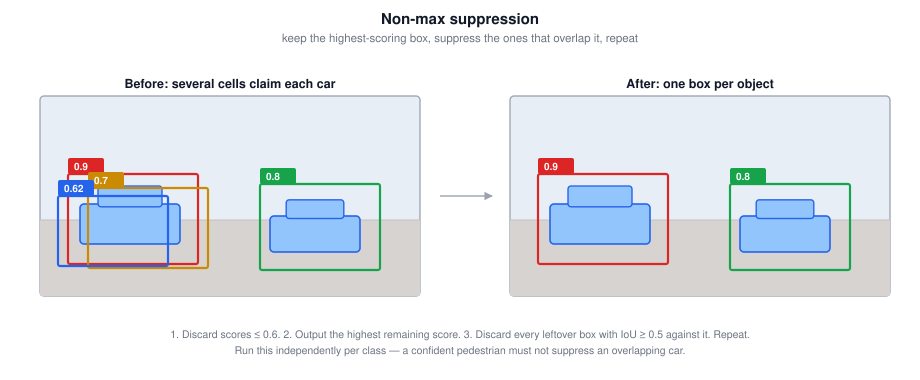

$$\boxed{\text{with multiple classes, run non-max suppression independently for each class}}$$

Running it once across all classes would let a confident pedestrian suppress an overlapping car, which is not what you want.

### 4.4 Tricky Interview Questions

**Q: Two boxes each cover 4 unit squares and overlap in exactly 1 square. What is the IoU?**  
Intersection is $1$; union is $4 + 4 - 1 = 7$, so $\text{IoU} = 1/7$. The trap is computing $1/8$ by adding the two areas without subtracting the double-counted overlap — the union is not the sum of the areas.

**Q: After non-max suppression with a score threshold of $0.4$ and an IoU threshold of $0.5$, three car boxes with scores $0.73$, $0.61$, and $0.66$ are reduced to just the $0.73$ box. True?**  
False, if the $0.66$ box sits on a *different* car. Non-max suppression only suppresses boxes that **overlap** the selected one; a box with IoU zero survives regardless of having a lower score. So two car detections remain. It is also wrong to think a higher-scoring pedestrian could eliminate the cars, because suppression is run per class.

**Q: Does non-max suppression eliminate every box with a score below the maximum?**  
No. It eliminates only boxes that both score lower *and* overlap heavily with an already-selected box. Non-overlapping lower-scoring boxes are kept, which is exactly how multiple instances of the same class get detected.

**Q: Why is $0.5$ the standard IoU threshold?**  
Convention only. There is no deep theoretical reason; $0.6$ or $0.7$ are used when you want to be stricter about localization quality.

**Q: Why must non-max suppression be run per class?**  
Because objects of different classes legitimately overlap. A pedestrian standing in front of a car should not suppress the car detection.

**Q: What score does non-max suppression actually sort by?**  
$p_c$ in the simple presentation, and $p_c \times c_i$ in a full multi-class implementation, so that the ranking reflects confidence in the specific class being detected.

---

## 5. Anchor Boxes

### 5.1 The Problem

Each grid cell can detect only **one** object. If a pedestrian and a car have midpoints in almost the same place, they fall in the same cell, and its single 8-dimensional vector cannot express two detections. You would have to pick one and drop the other.

### 5.2 The Solution

**Predefine several anchor box shapes** and give each one its own slot in the output vector. With two anchors, the label for a cell is the 8-dimensional vector repeated twice:

$$\boxed{y = \underbrace{[p_c, b_x, b_y, b_h, b_w, c_1, c_2, c_3]}_{\text{anchor box 1}} \;\Vert\; \underbrace{[p_c, b_x, b_y, b_h, b_w, c_1, c_2, c_3]}_{\text{anchor box 2}}}$$

If anchor 1 is tall and thin and anchor 2 is wide and flat, the pedestrian is encoded in the first eight numbers and the car in the second eight. The output volume grows accordingly:

| Setup | Output shape |
|---|---|
| $3\times3$ grid, no anchors | $3 \times 3 \times 8$ |
| $3\times3$ grid, 2 anchors | $3 \times 3 \times 16$, or equivalently $3 \times 3 \times 2 \times 8$ |

The assignment rule gains a second component:

$$\boxed{\text{object} \;\rightarrow\; (\text{grid cell containing its midpoint}, \; \text{anchor box with highest IoU with its shape})}$$

So an object is assigned to a **(grid cell, anchor box) pair**. To find the anchor, compute the IoU between the object's box shape and each anchor shape, and take the best match.

If a cell contains only a car whose shape matches anchor 2, then the anchor-2 half of the vector is filled in normally and the anchor-1 half gets $p_c = 0$ with don't cares for the rest.

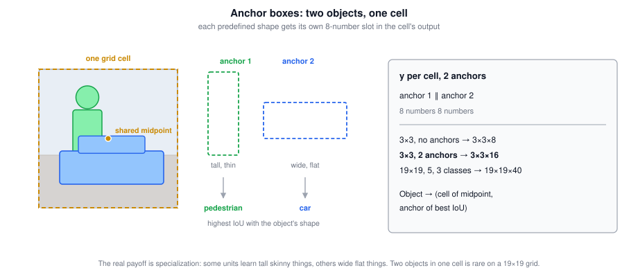

### 5.3 Cases It Does Not Handle

- **Three objects in one cell with only two anchors.** Not handled well; you need some default tiebreaker.
- **Two objects in one cell with the same best anchor shape.** Also not handled well; again a tiebreaker.

Both are rare, especially with a $19\times19$ grid, so they should not affect performance much.

### 5.4 The Better Motivation

Anchor boxes were introduced above as a fix for two objects in one cell, but with 361 cells that situation is genuinely rare. The stronger reason to use them is **specialization**:

If your dataset has tall skinny objects (pedestrians) and wide flat objects (cars), anchor boxes let some output units specialize in detecting wide flat things and others in detecting tall skinny things. That division of labor tends to improve results more than the multiple-objects-per-cell fix does.

### 5.5 Choosing Anchor Boxes

| Method | How |
|---|---|
| By hand | Pick 5 or 10 shapes spanning the variety of objects you expect — some tall and skinny, some wide and flat |
| **K-means** | Cluster the box shapes in your training set and use the cluster centers as anchors |

The K-means approach comes from a later YOLO paper and automatically produces anchors that are stereotypically representative of the object shapes in your data. Hand-picking a reasonable spread also works fine.

### 5.6 Tricky Interview Questions

**Q: With anchor boxes, do you still need to predict $b_x, b_y, b_h, b_w$?**  
Yes. The claim that the cell position and anchor selection determine the box is **false**. Anchors are only prior shapes that decide *which output slot* an object uses; the network still regresses the actual coordinates, which is what gives precise boxes.

**Q: How is an object assigned when using anchor boxes?**  
To the grid cell containing its midpoint *and* to the anchor box with the highest IoU against the object's shape — a (cell, anchor) pair.

**Q: What is the output shape for a $19\times19$ grid, 5 anchors, and 3 classes?**  
$19 \times 19 \times 5 \times 8 = 19 \times 19 \times 40$, since each anchor needs $5 + 3 = 8$ numbers.

**Q: What is the real benefit of anchor boxes in practice?**  
Specialization. Different output units learn to detect different object shapes. Handling two objects in one cell is the textbook motivation but is rarely the binding constraint with a fine grid.

**Q: What happens with three objects in one cell and two anchors?**  
The algorithm has no good answer; you fall back on an arbitrary tiebreaker and accept losing a detection. It is rare enough not to matter much.

**Q: How does IoU get used at *training* time here?**  
To match each ground-truth object to an anchor shape. IoU appears in three distinct roles: evaluation, non-max suppression, and anchor assignment.

---

## 6. The Complete YOLO Algorithm

### 6.1 Constructing the Training Set

Detect 3 classes — pedestrian, car, motorcycle — with an explicit background class, using 2 anchor boxes and a $3\times3$ grid.

$$\boxed{y \text{ has shape } 3 \times 3 \times 2 \times 8, \qquad \text{where } 8 = 5 + \#\text{classes}}$$

The $5$ is $p_c$ plus the four box coordinates; the rest is one entry per class.

Go through all nine grid cells and build the target vector for each:

- **Upper-left cell, nothing there.** $p_c = 0$ for anchor 1 and $p_c = 0$ for anchor 2, with don't cares everywhere else. Most cells look like this.
- **Cell containing a car's midpoint.** Suppose the car's box is slightly wider than it is tall, so it has higher IoU with anchor 2. Then anchor 1's $p_c = 0$ with don't cares, and anchor 2's half holds $p_c = 1$, the box coordinates, and the class vector $[0, 1, 0]$ for car.

Do this for every cell and you get a 16-dimensional vector per position, hence the $3 \times 3 \times 16$ output volume. In practice it would be more like $19 \times 19 \times 16$, or with 5 anchors, $19 \times 19 \times 40$.

Then train a ConvNet mapping a $100 \times 100 \times 3$ image to that output volume.

### 6.2 Making Predictions

Run the image through the network to get the $3 \times 3 \times 2 \times 8$ volume. For each cell you read off two predicted boxes, one per anchor.

Remember that the network **cannot output a question mark**. Where the target had don't cares, the network emits some arbitrary numbers — essentially noise — and that is fine, because the accompanying $p_c \approx 0$ tells you to ignore them.

Note also that predicted boxes **can extend outside the grid cell they came from**, since $b_h$ and $b_w$ may exceed 1.

### 6.3 Filtering the Output

With 2 anchors you get two boxes per cell whether or not anything is there, so the raw output needs cleaning up:

1. **Discard low-probability predictions** — the ones where the network itself says the object probably is not there.
2. **Run non-max suppression once per class**: separately for pedestrians, for cars, and for motorcycles.

$$\boxed{\text{network output} \rightarrow \text{threshold on score} \rightarrow \text{per-class non-max suppression} \rightarrow \text{final detections}}$$

The result should be one box per detected object, with all cars and all pedestrians found.

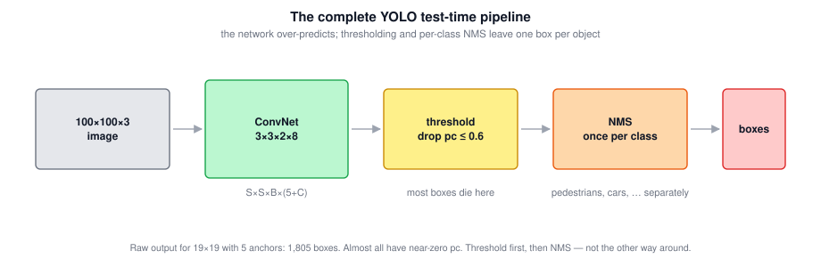

YOLO is one of the most effective object detection algorithms, and it pulls together many of the best ideas in the detection literature.

### 6.4 Tricky Interview Questions

**Q: What is the general formula for the YOLO output volume?**  
$S \times S \times B \times (5 + C)$ for an $S \times S$ grid, $B$ anchor boxes, and $C$ classes. The $5$ is $p_c$ plus four coordinates.

**Q: In what order do thresholding and non-max suppression run?**  
Threshold first to throw away low-confidence boxes cheaply, then non-max suppression on what remains, per class. Doing it the other way around wastes work comparing boxes you were going to discard anyway.

**Q: Can a predicted box extend beyond its grid cell?**  
Yes, whenever $b_h$ or $b_w$ exceeds 1, which happens for any object larger than one cell.

**Q: How many boxes does the raw network output for a $19\times19$ grid with 5 anchors?**  
$19 \times 19 \times 5 = 1{,}805$, almost all of which have near-zero $p_c$ and are removed by thresholding.

**Q: Why does the network's output contain meaningless numbers?**  
Because a network cannot emit "don't care". Slots whose targets were `?` are unconstrained by the loss, so they take arbitrary values, which are ignored because $p_c \approx 0$ there.

---

## 7. Region Proposals: The R-CNN Family

An influential alternative line of work. (This was an optional lecture; the region-proposal approach is used somewhat less often now, but you will come across it.)

### 7.1 The Motivation

Sliding windows — even implemented convolutionally — classifies a great many regions where there is **clearly no object**. A rectangle of empty road or blank sky is not worth running a classifier on.

**Region proposals** pick a small number of regions that plausibly contain something, and run the classifier only there.

### 7.2 The Family

| Algorithm | Authors | What changed |
|---|---|---|
| **R-CNN** | Girshick, Donahue, Darrell, Malik | Run a **segmentation algorithm** to find candidate blobs (about 2,000), place a box around each, and classify just those |
| **Fast R-CNN** | Girshick | R-CNN with a **convolutional implementation** of sliding windows, sharing computation across proposals |
| **Faster R-CNN** | Ren, He, Girshick, Sun | Use a **convolutional neural network** to propose the regions instead of a traditional segmentation algorithm |

R-CNN stands for *Regions with CNNs*. The segmentation step might find a blob that turns out to be a pedestrian and another that turns out to be a car; running the classifier on ~2,000 blobs is far cheaper than every position in the image, and it naturally handles tall skinny regions for pedestrians and wide flat ones for cars, at multiple scales.

Importantly, **R-CNN does not just trust the proposed box**. It also outputs its own $b_x, b_y, b_h, b_w$, so the final box can be more accurate than whatever the segmentation algorithm produced.

The bottleneck moved each time: R-CNN was slow because it classified regions one at a time; Fast R-CNN fixed that but left the proposal step slow; Faster R-CNN replaced the proposal step too. Even so, most Faster R-CNN implementations are still noticeably slower than YOLO.

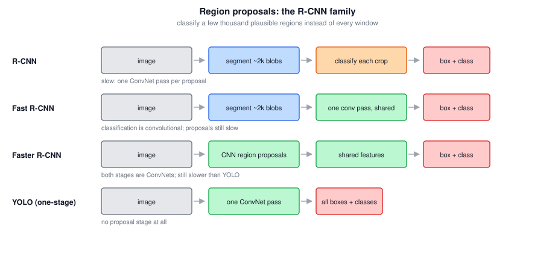

### 7.3 One-Stage versus Two-Stage

This is the standard taxonomy the two families define:

| | Two-stage | One-stage |
|---|---|---|
| Examples | R-CNN, Fast R-CNN, Faster R-CNN | YOLO, SSD, RetinaNet |
| Pipeline | Propose regions, then classify them | Predict classes and boxes directly in one pass |
| Trade-off | Historically more accurate | Faster, and now competitive on accuracy |

Andrew Ng's stated personal opinion (explicitly not the consensus of the computer vision community): doing everything at more or less the same time, as YOLO does, seems like a more promising long-term direction than the two-step propose-then-classify approach. Worth taking with a grain of salt, but the trend in the field has broadly gone that way.

### 7.4 Tricky Interview Questions

**Q: What problem do region proposals solve?**  
Wasted computation. Sliding windows classifies many regions that obviously contain nothing; proposals concentrate the classifier on a few thousand plausible regions.

**Q: Does R-CNN output the proposed box as its final answer?**  
No. It predicts its own bounding box coordinates as well, so the output can be more accurate than the proposal.

**Q: What is the difference between Fast and Faster R-CNN?**  
Fast R-CNN made the *classification* of proposals fast with a convolutional implementation. Faster R-CNN then made the *proposal step* fast by replacing the traditional segmentation algorithm with a CNN.

**Q: Why is YOLO usually faster than Faster R-CNN?**  
Because it has no separate proposal stage at all — one convolutional pass produces all classes and boxes, so there is no per-region processing to serialize.

---

## 8. Semantic Segmentation

### 8.1 What It Is

Detection draws a box around an object. **Semantic segmentation** draws a careful outline, labeling **every single pixel** with a class, so you know exactly which pixels belong to the object and which do not.

Why bounding boxes are not always enough: for a self-driving car, boxing the other vehicles is reasonable, but a bounding box around *the road* is useless. What you want is a per-pixel answer to "is this drivable surface?" Some self-driving teams use semantic segmentation for exactly that — determining which pixels are safe to drive over.

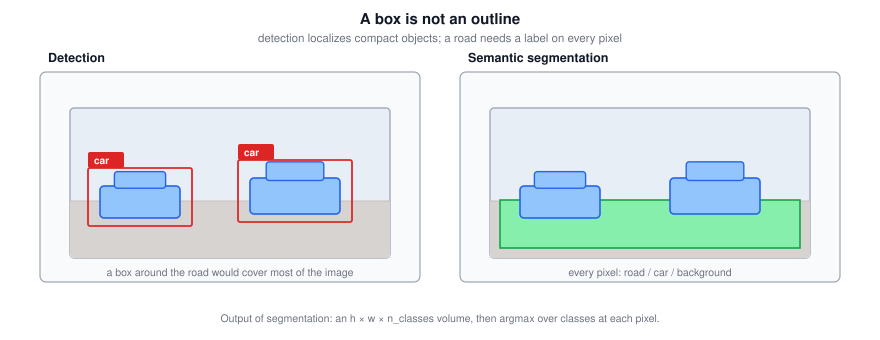

### 8.2 Applications

| Domain | Use |
|---|---|
| Self-driving | Label every pixel as drivable road or not |
| Chest X-ray (Novikov et al.) | Segment lungs, heart, and clavicles in different colors, making irregularities easier to spot and helping surgeons plan |
| Brain MRI (Dong et al.) | Segment out a tumor automatically, saving radiologists laborious manual work and informing surgical planning |

### 8.3 The Output

For segmenting a car from background, use two labels: $1$ for car, $0$ for not car, assigned to every pixel. For a finer segmentation, add classes — $1$ car, $2$ building, $3$ road — and label each pixel with one of them.

$$\boxed{\text{output} = \text{a whole matrix of per-pixel class labels, not a single label or a box}}$$

That is a lot more output than before, and it changes what the architecture must look like.

### 8.4 The Architecture Shape

Start from a familiar classification ConvNet: input image, forward through layers of shrinking spatial size, out comes $\hat{y}$. To convert it for segmentation:

1. **Drop the last few layers** (the classifier head).
2. Add a second half that makes the representation **bigger** again, gradually blowing it back up to full image size.

$$\boxed{\text{first half: } n_H, n_W \downarrow \text{ and } n_C \uparrow \qquad \text{second half: } n_H, n_W \uparrow \text{ and } n_C \downarrow}$$

That is the essential structural difference from every architecture so far: spatial dimensions have always shrunk with depth, and now they must grow back. The operation that makes them grow is the **transpose convolution**.

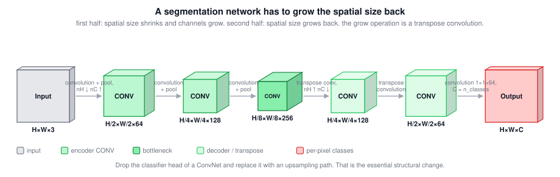

### 8.5 Tricky Interview Questions

**Q: Can semantic segmentation only label pixels in a binary way, 1 or 0?**  
No, that is false. Binary segmentation (car / not car) is one option, but you can have any number of classes — car, building, road — and the output layer produces a score per class per pixel.

**Q: Why is a bounding box a bad representation for a road?**  
Because a road is not a compact object; its box would cover most of the image and tell you almost nothing about which specific pixels are drivable.

**Q: What structural change distinguishes a segmentation network from a classification network?**  
The classifier head is replaced by an upsampling path that restores the spatial dimensions to the input size, so the output is a per-pixel map rather than a single vector.

**Q: What is the difference between semantic, instance, and panoptic segmentation?**  
Semantic segmentation labels each pixel with a **class**, so two adjacent cars merge into one "car" region. **Instance** segmentation additionally separates individual objects, giving car #1 and car #2 distinct masks (Mask R-CNN is the standard approach). **Panoptic** segmentation does both: instance masks for countable objects plus semantic labels for background regions like road and sky.

---

## 9. Transpose Convolutions

The operation that turns a small set of activations into a bigger one.

### 9.1 Normal versus Transpose

| | Input | Filter | Output |
|---|---|---|---|
| Normal convolution | $6 \times 6 \times 3$ | $3\times3\times3$, 5 filters | $4 \times 4 \times 5$ — **smaller** |
| Transpose convolution | $2 \times 2$ | $3 \times 3$ | $4 \times 4$ — **bigger** |

### 9.2 The Mechanics

The one sentence that captures it:

$$\boxed{\text{in a normal convolution you place the filter on the \textbf{input}; in a transpose convolution you place it on the \textbf{output}}}$$

The procedure, with filter size $f$, padding $p$ applied to the *output*, and stride $s$:

1. Take one value from the input.
2. **Multiply the entire filter** by that value.
3. **Paste** the resulting $f \times f$ block into the output, at an offset determined by the stride: input position $(i, j)$ writes to output position starting at $(s \cdot i, \; s \cdot j)$.
4. Where pasted blocks **overlap, add** the values rather than overwriting.
5. **Ignore / crop** the padding region at the end.

### 9.3 A Worked Example

Input $2 \times 2$, filter $3 \times 3$, $p = 1$, $s = 2$:

$$\text{input} = \begin{bmatrix} 1 & 2 \\ 3 & 4 \end{bmatrix}, \qquad \text{filter} = \begin{bmatrix} 1 & 1 & 1 \\ 0 & 0 & 0 \\ -1 & -1 & -1 \end{bmatrix}$$

Each input value scales the whole filter and is pasted at a stride-2 offset. Accumulating all four contributions gives this $6 \times 6$ grid (the output plus its padding border):

$$\begin{bmatrix} 1 & 1 & 3 & 2 & 2 & 0 \\ 0 & 0 & 0 & 0 & 0 & 0 \\ 2 & 2 & \mathbf{4} & 2 & 2 & 0 \\ 0 & 0 & 0 & 0 & 0 & 0 \\ -3 & -3 & \mathbf{-7} & -4 & -4 & 0 \\ 0 & 0 & 0 & 0 & 0 & 0 \end{bmatrix}$$

The overlaps are where it gets interesting. The bold $4$ at position $(2,2)$ receives four contributions at once — $-1$ from the input value 1, $-2$ from the value 2, $+3$ from the value 3, and $+4$ from the value 4 — summing to $4$. Similarly the bold $-7$ is $-3 + (-4)$.

Cropping the one-pixel padding border leaves the $4 \times 4$ output:

$$\begin{bmatrix} 0 & 0 & 0 & 0 \\ 2 & 4 & 2 & 2 \\ 0 & 0 & 0 & 0 \\ -3 & -7 & -4 & -4 \end{bmatrix}$$

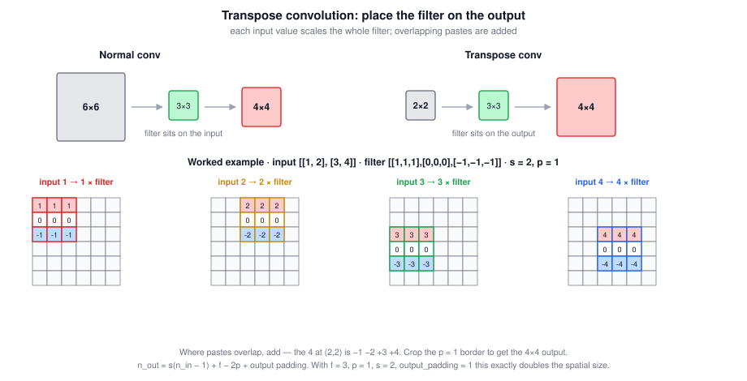

### 9.4 Output Size

$$\boxed{n_{out} = s\left(n_{in} - 1\right) + f - 2p \;+\; \text{output padding}}$$

For the example: $2(2-1) + 3 - 2 = 3$, plus one row and column of trailing zeros gives the $4 \times 4$ used here. That extra row and column is what frameworks call **output padding**, and setting it to 1 with $f=3$, $p=1$, $s=2$ is the standard recipe for **exactly doubling** the spatial size — the common case in a decoder. In PyTorch that is `ConvTranspose2d(kernel_size=3, stride=2, padding=1, output_padding=1)`.

### 9.5 Why This Operation

There are multiple possible ways to take a small input and turn it into a bigger output. The transpose convolution happens to be one that works well, and crucially its **filter values are learned**, so the network learns how to upsample rather than following a fixed interpolation rule. In the context of U-Net, that gives good results.

> **A known artifact.** When the filter size is not divisible by the stride, transpose convolutions produce uneven overlap and can leave **checkerboard artifacts** in the output. A common alternative is to upsample by nearest-neighbor or bilinear interpolation and then apply an ordinary convolution, which avoids the artifact at similar cost.

### 9.6 Tricky Interview Questions

**Q: With input $\begin{bmatrix} 1 & 2 \\ 3 & 4\end{bmatrix}$, filter $\begin{bmatrix} 1&1&1 \\ 0&0&0 \\ -1&-1&-1\end{bmatrix}$, $p=1$, $s=2$, what are the marked values in the $6\times6$ result?**  
The center of row 3 is $-1 - 2 + 3 + 4 = 4$, and the center of row 5 is $-3 - 4 = -7$. Both come from **summing** overlapping pasted blocks, which is the step people most often get wrong.

**Q: What is the single conceptual difference from a normal convolution?**  
The filter is placed on the output rather than the input. Instead of collapsing a patch into one number, you expand one number into a patch.

**Q: What happens where two pasted blocks overlap?**  
The values are added. You never overwrite one contribution with another.

**Q: Is a transpose convolution the inverse of a convolution?**  
No. It reverses the *shape* transformation, not the values — you cannot recover the original input. The name comes from the fact that it applies the transpose of the matrix that represents the corresponding forward convolution.

**Q: Are transpose convolutions the only way to upsample?**  
No. Nearest-neighbor or bilinear upsampling followed by a normal convolution is a common alternative that avoids checkerboard artifacts. Unpooling is another. The advantage of the transpose convolution is that the upsampling itself is learned.

---

## 10. The U-Net Architecture

### 10.1 The Shape

U-Net is due to Ronneberger, Fischer, and Brox. They wrote it for **biomedical image segmentation**, but the ideas turned out to be useful across computer vision segmentation tasks generally. It is one of the most important and foundational architectures in computer vision today, and the name comes from the fact that the diagram looks like a **U**.

The three parts:

| Half | Operations | Effect |
|---|---|---|
| **Encoder** (down the left) | Normal conv + ReLU, with occasional max pooling | $n_H, n_W$ shrink; $n_C$ grows |
| **Decoder** (up the right) | Transpose convolutions, plus more conv + ReLU | $n_H, n_W$ grow; $n_C$ shrinks |
| **Skip connections** (across) | Copy encoder activations to the matching decoder layer | Reinjects fine spatial detail |

The lecture's arrow legend:

| Arrow | Meaning |
|---|---|
| Black | Convolution + ReLU |
| Green | Transpose convolution |
| Grey | Skip connection (copy across) |
| Magenta | Final $1\times1$ convolution |

The colour key in the figure below is the same as the rest of these notes: **gray** input, **green** convolution, **blue** pooling (down), light green transpose convolution (up), **red** $1\times1$ output. Skip connections are dashed copies.

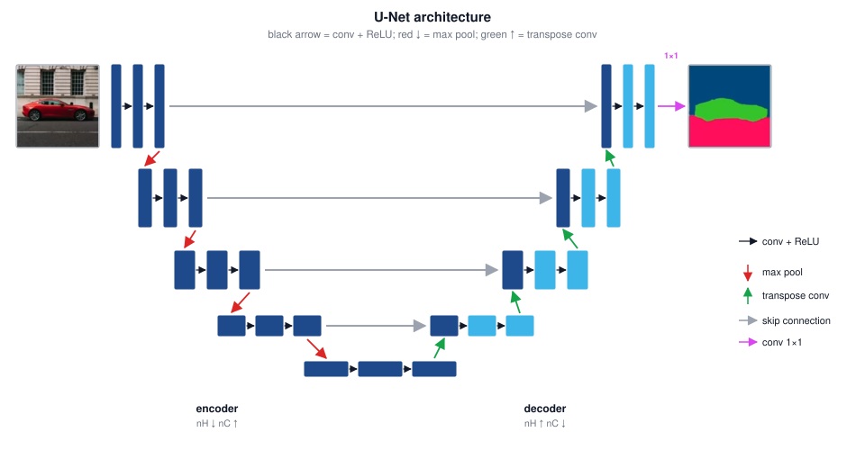

### 10.2 Why the Skip Connections Matter

This is the heart of the architecture. To decide whether a given pixel is part of a cat, the final layer needs **two different kinds of information**:

- **High-level contextual information**, which comes up through the deep path: the network has figured out that there is cat-like stuff in the lower-right portion of the image. But this path has been compressed heavily, so its spatial resolution is low and precise pixel locations have been lost.
- **Low-level, high-resolution detail**, which the deep path cannot supply: for this exact pixel, how much furry texture is there? That information exists in the *early* layers, which still have full spatial resolution.

The skip connection passes those early, high-resolution, low-level activations directly to the later layer. So the decoder layer has both the coarse "what and roughly where" and the fine "exactly which pixel", which is what it needs to classify individual pixels.

In each decoder block, part of the volume comes from the transpose convolution and the rest is **copied over** from the corresponding encoder layer — the two are concatenated along the channel axis.

> **Contrast with ResNet.** ResNet skip connections **add** ($z^{[l+2]} + a^{[l]}$) and exist to make optimization easier. U-Net skip connections **concatenate** and exist to restore spatial information the encoder discarded. Same name, different mechanism and different purpose.

### 10.3 The Output Layer

After the decoder brings the activations back to the original height and width, and a couple more normal convolutions, a final **$1 \times 1$ convolution** maps to the segmentation map:

$$\boxed{\text{output shape} = h \times w \times n_{\text{classes}}}$$

The spatial dimensions match the original input. The channel dimension is the number of classes — 3 if you have three classes to recognize, 10 if you have ten.

For each of the $h \times w$ pixels you get a vector of $n_{\text{classes}}$ numbers saying how likely that pixel is to belong to each class. Take the **argmax** over the class dimension and you have a single class label per pixel, which is the segmentation map you can visualize.

### 10.4 Tricky Interview Questions

**Q: For a U-Net with input $h \times w \times c$, does the output have shape $h \times w$?**  
The spatial dimensions are restored to $h \times w$, so in that sense yes — but the full output shape is $h \times w \times n_{\text{classes}}$, and note $n_{\text{classes}}$ has nothing to do with the input's channel count $c$. (Strictly, the original U-Net paper used valid convolutions and produced a *smaller* map than its input; the same-convolution version taught here preserves the size.)

**Q: Why does U-Net need skip connections at all — doesn't the deep path already know where the cat is?**  
Only roughly. The deep path has high-level context but low spatial resolution, because pooling threw away precise positions. Per-pixel classification needs fine detail, which only the early high-resolution layers still have.

**Q: How do U-Net skip connections differ from ResNet skip connections?**  
U-Net **concatenates** encoder activations onto decoder activations to recover spatial detail. ResNet **adds** the input of a block to its output to make deep networks easier to optimize. Different operation, different motivation.

**Q: What does the final $1\times1$ convolution do?**  
It maps each pixel's feature vector to $n_{\text{classes}}$ scores, acting as a per-pixel classifier applied identically at every spatial position.

**Q: How do you turn the output volume into a picture?**  
Take the argmax over the class channel at each pixel to get one label per pixel, then color the labels.

**Q: Why was U-Net originally designed for biomedical images, and why did it generalize?**  
Medical segmentation has few training images and needs precise boundaries, which the skip connections provide. The underlying problem — combining global context with local precision — is generic, so the architecture transfers to segmentation tasks broadly.

---

## 11. Beyond the Basics

Context the lectures do not cover but that comes up immediately in practice.

### 11.1 Evaluating a Detector: mAP

IoU judges a single box. To score a whole detector, the standard metric is **mean average precision**:

1. Pick an IoU threshold (0.5 is standard, written mAP@0.5).
2. For one class, sort all predicted boxes by confidence and sweep the threshold, computing precision and recall at each point. A prediction counts as a true positive if it matches an unmatched ground-truth box at $\text{IoU} \geq$ threshold.
3. **Average precision (AP)** is the area under that precision-recall curve.
4. **mAP** is the mean of AP over all classes.

The COCO convention averages mAP over IoU thresholds from 0.5 to 0.95 in steps of 0.05, written mAP@[.5:.95], which rewards tighter boxes.

### 11.2 Refinements to Non-Max Suppression

| Variant | Idea |
|---|---|
| **Soft-NMS** | Instead of deleting overlapping boxes, *decay* their scores in proportion to the overlap. Helps when two instances of the same class genuinely overlap |
| **Class-wise NMS** | The per-class version described in section 4, the standard choice |
| **Batched NMS** | Add a large per-class offset to box coordinates so a single NMS pass cannot suppress across classes — an efficient trick for the same result |

### 11.3 The Class Imbalance Problem

A one-stage detector evaluates thousands of anchor positions, almost all of which are background. That imbalance can swamp the loss with easy negatives. The standard fix is **focal loss** (RetinaNet), which down-weights easy examples so the loss focuses on hard ones:

$$\boxed{\text{FL}(p_t) = -\left(1 - p_t\right)^{\gamma}\log(p_t)}$$

With $\gamma = 0$ this is ordinary cross-entropy; larger $\gamma$ suppresses the contribution of already-well-classified examples.

### 11.4 Segmentation Losses

Per-pixel cross-entropy is the default, but segmentation often has severe class imbalance — a tumor may be a tiny fraction of a scan. Common alternatives:

$$\boxed{\text{Dice} = \frac{2\left|A \cap B\right|}{\left|A\right| + \left|B\right|}, \qquad \mathcal{L}_{\text{Dice}} = 1 - \text{Dice}}$$

Dice loss and soft-IoU loss optimize overlap directly rather than per-pixel accuracy, so they are not dominated by the large background class. Combining Dice with cross-entropy is a common practical choice.

### 11.5 Where the Field Went

| Development | Contribution |
|---|---|
| SSD | One-stage detection with multi-scale feature maps |
| Feature Pyramid Network | Combines features across scales, so small and large objects are both handled well |
| RetinaNet | Focal loss, closing the accuracy gap between one-stage and two-stage |
| YOLOv3 through v8 | Multi-scale prediction, better backbones, anchor-free variants |
| Mask R-CNN | Adds a mask branch to Faster R-CNN for **instance** segmentation |
| DETR | Transformer-based detection with set prediction — **no anchors and no NMS** |
| Segment Anything | Promptable segmentation trained on a very large mask dataset |

Note the trajectory: several hand-designed components from these notes — anchor boxes, non-max suppression — have been progressively replaced by learned mechanisms, which is the same "less hand-engineering as data grows" pattern from the state-of-computer-vision discussion.

---

## 12. Quick Reference

Target vectors:

$$\boxed{\text{localization: } y = [p_c, b_x, b_y, b_h, b_w, c_1, \dots, c_C]^T}$$

$$\boxed{\text{YOLO output: } S \times S \times B \times (5 + C)}$$

$$\boxed{\text{segmentation output: } h \times w \times n_{\text{classes}}, \text{ then argmax per pixel}}$$

Key operations:

$$\boxed{\text{IoU} = \frac{\left|A \cap B\right|}{\left|A \cup B\right|}, \qquad \left|A \cup B\right| = \left|A\right| + \left|B\right| - \left|A \cap B\right|}$$

$$\boxed{\text{transpose conv: } n_{out} = s\left(n_{in}-1\right) + f - 2p + \text{output padding}}$$

| Task | Output | Algorithm |
|---|---|---|
| Classification | One class label | Standard ConvNet |
| Localization | Label + one box | Add $p_c, b_x, b_y, b_h, b_w$ to the output |
| Landmarks | $2N$ coordinates | Add $l_{ix}, l_{iy}$ per landmark |
| Detection | Many labels + boxes | YOLO, or the R-CNN family |
| Semantic segmentation | Per-pixel class | U-Net |

| Where IoU is used | Purpose |
|---|---|
| Evaluation | Is this predicted box correct? ($\geq 0.5$ by convention) |
| Non-max suppression | Are these two boxes the same detection? |
| Anchor assignment | Which anchor shape best matches this object? |

| Symptom | Likely cause | Fix |
|---|---|---|
| Same object detected several times | Many grid cells claim the midpoint | Non-max suppression, per class |
| Two overlapping objects, only one detected | One object per grid cell | Anchor boxes, and/or a finer grid |
| Boxes are the wrong aspect ratio | Boxes tied to window shapes | Predict $b_h, b_w$ explicitly (YOLO) |
| Detection is far too slow | Independent forward pass per window | Convolutional implementation; one-stage detector |
| A high-scoring pedestrian removes a car | NMS run across all classes at once | Run NMS independently per class |
| Segmentation output is too small | Encoder downsampling never reversed | Transpose convolutions in a decoder |
| Segmentation boundaries are blurry | Fine spatial detail lost in the encoder | Skip connections (U-Net) |
| Checkerboard pattern in the output | Filter size not divisible by stride | Upsample then convolve, or fix $f$ and $s$ |
| Detector predicts background everywhere | Class imbalance across anchors | Focal loss, or hard negative mining |

Core principle: every one of these tasks is the same ConvNet with a different output head and a different target label. Change what you ask the network to predict, and add the machinery — grid cells, anchors, non-max suppression, transpose convolutions, skip connections — needed to make that prediction well-posed.

---
