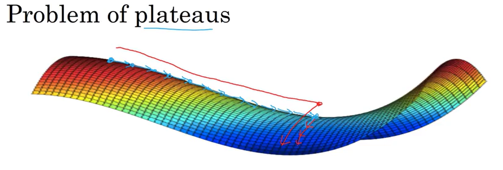

# Optimization Algorithms

## 1. Mini-Batch Gradient Descent

Mini-batch gradient descent is an optimization method that splits the training set into small subsets called mini-batches and performs one gradient descent update per mini-batch. This lets the model start making progress before processing the entire dataset, combining the stability of batch gradient descent with the speed of stochastic gradient descent.

### 1.1 Notation

| Superscript | Meaning | Example |
|---|---|---|
| $(i)$ | $i$-th training example | $x^{(i)}$ |
| $[l]$ | Layer $l$ | $W^{[l]}$ |
| $\{t\}$ | Mini-batch $t$ | $X^{\{t\}},\, Y^{\{t\}}$ |

### 1.2 Algorithm

**Idea**  
Instead of waiting to process all $m$ examples before taking a gradient step, split the data into mini-batches of size $B$ and update parameters after each one. One full pass through the data is called an **epoch**; with mini-batch gradient descent each epoch yields $\lceil m/B \rceil$ gradient steps (iterations) instead of just one.

For $t = 1, \ldots, m/B:$

1. Forward prop on $X^{\{t\}}$ → compute $\hat{Y}^{\{t\}}$
2. Compute cost on the mini-batch:

$$\boxed{J^{\{t\}} = \frac{1}{B}\sum_{i=1}^{B}\mathcal{L}(\hat{y}^{(i)}, y^{(i)}) + \frac{\lambda}{2B}\sum_l \|W^{[l]}\|_F^2}$$

3. Backprop on $J^{\{t\}}$ → compute $dW^{[l]},\, db^{[l]}$
4. Update parameters:

$$\boxed{W^{[l]} := W^{[l]} - \alpha\, dW^{[l]}, \qquad b^{[l]} := b^{[l]} - \alpha\, db^{[l]}}$$

### 1.3 Why it works

The three variants differ only in batch size $B$, which controls the tradeoff between update frequency and gradient quality:

| Variant | Batch size | Behaviour |
|---|---|---|
| Batch GD | $m$ (whole dataset) | Smooth, low-noise updates; very slow on large data — must process all $m$ examples per step |
| Stochastic GD | 1 | One update per example; very frequent but very noisy; loses vectorization speedup |
| **Mini-batch GD** | $1 < B < m$ | Best of both: vectorized over $B$ examples for speed, yet frequent enough updates to make fast progress |

Mini-batch GD dominates in practice because modern GPUs can process a batch of 64–512 examples in nearly the same time as a single example, and frequent updates mean the model learns much faster than waiting for a full pass.

### 1.4 How it helps

Mini-batch GD is useful because it:
- starts improving parameters almost immediately, without waiting to see the whole dataset,
- makes efficient use of GPU parallelism through vectorization over the batch,
- introduces a small amount of noise in gradient estimates, which can help escape shallow local minima.

### 1.5 Intuition

With **batch GD**, $J$ must decrease monotonically on every iteration — if it rises, something is wrong (learning rate too large or a bug). With **mini-batch GD**, the cost $J^{\{t\}}$ plotted per mini-batch oscillates slightly but should trend downward overall, because each mini-batch is a different random sample and some are harder than others.

### 1.6 Choosing mini-batch size

- If $m \leq 2000$: use batch GD — the whole dataset fits in memory and noise adds no benefit.
- Otherwise, choose a **power of 2**: **64, 128, 256, 512** — this aligns with CPU/GPU memory layout and runs faster.
- Ensure $X^{\{t\}}, Y^{\{t\}}$ fit in CPU/GPU memory; exceeding memory causes a sharp performance drop.
- Mini-batch size is a hyperparameter to tune.

### 1.7 Epochs vs Iterations

**Epoch** — one complete pass through the entire training dataset.  
**Iteration** — one parameter update using one mini-batch of data.

| Aspect | Epoch | Iteration |
|---|---|---|
| Definition | One full cycle over all training examples | One step: process one mini-batch, update weights |
| Data processed | Entire dataset | One mini-batch (e.g., 64 examples) |
| When it happens | After all iterations in that epoch finish | Each time you compute gradients and update |
| Hyperparameter | You choose number of epochs | Iterations per epoch $= \lceil m / \text{mini\_batch\_size} \rceil$ |

**Relationship:**

$$\text{iterations per epoch} = \left\lceil \frac{m}{\text{mini\_batch\_size}} \right\rceil$$

**In different GD variants:**

| Method | 1 epoch = how many iterations? |
|---|---|
| Batch GD | 1 iteration (use all data at once) |
| Stochastic GD (SGD) | $m$ iterations (1 example per iteration) |
| Mini-batch GD | $\lceil m / \text{batch\_size} \rceil$ iterations |

### 1.8 Tricky Interview Questions

**Q: If you have $m = 1000$ examples and mini-batch size 64, how many iterations does one epoch take?**  
$\lceil 1000/64 \rceil = 16$ iterations. The last mini-batch has only $1000 - 15 \times 64 = 40$ examples — this is valid and common.

**Q: Does increasing mini-batch size to the full dataset $m$ guarantee a lower loss per epoch than mini-batch GD?**  
Not necessarily. Batch GD takes exactly one gradient step per epoch vs. $\lceil m/B \rceil$ steps for mini-batch GD. In the time one batch-GD epoch takes, mini-batch GD may have already converged further.

**Q: Why does the cost curve oscillate with mini-batch GD but decrease monotonically with batch GD?**  
Each mini-batch is a different random sample; some batches are harder than others, so the loss on a given mini-batch $J^{\{t\}}$ can jump between consecutive steps even as the overall trend improves.

**Q: Why are power-of-2 batch sizes (64, 128, 256, 512) recommended over, say, 100?**  
CPU and GPU memory is organized in powers of 2. Power-of-2 batch sizes align with cache lines and CUDA thread blocks, giving better memory throughput. A batch of 100 may leave GPU threads partially unused.

**Q: You increase mini-batch size from 64 to 1024 and training becomes slower per epoch. Why?**  
Larger batches mean fewer updates per epoch, so the model makes less progress per unit of compute. Additionally, large batches often converge to sharper, less-generalizable minima (the "sharp vs. flat minima" phenomenon).

**Q: Why must you shuffle the data before creating mini-batches each epoch?**  
Without shuffling, all mini-batches always contain the same examples in the same order. The model can overfit to this order and gradient estimates for each batch are biased by class or feature imbalance within that fixed slice.

**Q: Mini-batch GD noise "helps escape shallow local minima" — but why only shallow ones, and why is escaping them actually beneficial?**  
**Why noise exists:** each mini-batch uses a random subset of data, so its gradient is a noisy estimate of the true gradient. At a local minimum the true gradient is zero, but the mini-batch gradient is not — it randomly points in some direction, slightly nudging the parameters.

**Why only shallow ones:** the nudge size is fixed by the gradient variance of your mini-batches. A shallow basin has a low "rim" — the noise is large enough to kick the parameters over it. A deep basin has a high rim — the noise is too small to escape, so the optimizer stays put.

**Why escaping shallow minima is good:** basin depth correlates with sharpness. A shallow minimum is typically **sharp** — the loss spikes steeply if weights shift even a little, so the model is sensitive to weight perturbations and generalizes poorly. A deep minimum is typically **flat** — the loss barely changes under small perturbations, so the model is robust and generalizes better. Mini-batch noise therefore acts as a natural filter: it bounces the optimizer out of sharp, overfit-prone traps and lets it settle only in flat, generalizable ones.

---

## 2. Exponentially Weighted Averages (EWA)

Exponentially Weighted Averages (EWA) are a way to compute an average where recent observations matter more than older ones, and the importance of past values decays exponentially over time.

The foundation of momentum, RMSprop, and Adam.

### 2.1 Algorithm

**Update rule:**

$$\boxed{V_t = \beta\, V_{t-1} + (1-\beta)\,\theta_t}, \qquad V_0 = 0$$

where 
- $\theta_t$ — the raw observed value at step $t$ (e.g., a gradient, a temperature reading, any sequence of measurements).
- $V_t$ — the smoothed estimate (the EWA) after incorporating all observations up to step $t$.
- $\beta \in (0,1)$ — smoothing factor: how much of the old estimate to keep vs. how much of the new observation to mix in.

At each step $V_t$ blends the previous smoothed value with the new raw observation. $\beta$ keeps the old estimate; $(1-\beta)$ adds the new signal.

**Why past observations get exponentially smaller weights**

Unroll the recurrence by substituting $V_{t-1} = \beta V_{t-2} + (1-\beta)\theta_{t-1}$, then $V_{t-2}$, and so on:

$$V_t = (1-\beta)\theta_t + (1-\beta)\beta\,\theta_{t-1} + (1-\beta)\beta^2\,\theta_{t-2} + \cdots$$

$$\boxed{V_t = (1-\beta)\sum_{k=0}^{t-1}\beta^k\,\theta_{t-k}}$$

The weight on an observation **$k$ steps in the past** is $(1-\beta)\,\beta^k$. Because $0 < \beta < 1$, $\beta^k$ shrinks as $k$ grows — older observations receive exponentially smaller weight. The factor $(1-\beta)$ ensures all weights sum to 1, making $V_t$ a proper weighted average.

**Why $V_t$ approximates an average over $\frac{1}{1-\beta}$ recent steps**

The convention a past observation become negligible when its weight falls to $\approx e^{-1} \approx 0.37$ of the most recent observation's weight, i.e. when $\beta^k \approx e^{-1}$:

$$\beta^k = e^{-1} \implies k\ln\beta = -1 \implies k = \frac{-1}{\ln\beta}$$

For $\beta$ close to 1, $\ln\beta \approx -(1-\beta)$, so:

$$k \approx \frac{1}{1-\beta}$$

Beyond this lag, each past observation contributes less than 37% of the weight of the most recent one — effectively negligible. So $V_t$ behaves like an average over the most recent $\frac{1}{1-\beta}$ steps.

| $\beta$ | Effective window $\approx \frac{1}{1-\beta}$ | Behavior |
|---|---|---|
| 0.5 | ~2 steps | Very noisy, adapts instantly |
| 0.9 | ~10 steps | Smooth, moderate lag |
| 0.98 | ~50 steps | Very smooth, slow to adapt |

### 2.2 How it works

- High $\beta$ (e.g. 0.98): long memory — old values still have significant weight, the curve is very smooth but slow to react to new observations.
- Low $\beta$ (e.g. 0.5): short memory — recent values dominate, the curve tracks changes quickly but is noisy.

Memory efficiency: only one number $V_t$ needs to be stored; it is overwritten in-place each step — $O(1)$ memory regardless of how long training runs.

### 2.3 Bias Correction

Because $V_0 = 0$, early estimates are systematically too small. Fix:

$$\hat{V}_t = \frac{V_t}{1 - \beta^t}$$

As $t \to \infty$, $\beta^t \to 0$ so $\hat{V}_t \approx V_t$ — correction only matters in the first few steps. In practice, momentum often skips bias correction; Adam always includes it.

### 2.4 Tricky Interview Questions

**Q: With $\beta = 0.9$, what is $V_1$ if $\theta_1 = 10$ and $V_0 = 0$? Is this a good estimate?**  
$V_1 = 0.9 \times 0 + 0.1 \times 10 = 1$. This severely underestimates $\theta_1 = 10$. Bias correction gives $\hat{V}_1 = 1 / (1 - 0.9^1) = 10$ — exactly correct.

**Q: Why does the bias correction term $1 - \beta^t$ approach 1 as training progresses?**  
As $t \to \infty$, $\beta^t \to 0$ (since $0 < \beta < 1$), so $1 - \beta^t \to 1$ and $\hat{V}_t \approx V_t$. The zero-initialization bias vanishes once enough data has been seen.

**Q: If you increase $\beta$ from 0.9 to 0.99, the EWA becomes smoother. What is the downside?**  
A higher $\beta$ means a longer effective window ($\approx 1/(1-\beta)$ steps) and a slower response to recent changes. If the underlying signal shifts suddenly — e.g., a new phase of training — the EWA lags behind, potentially causing slow adaptation or instability.

**Q: EWA uses only $O(1)$ memory. What is the trade-off compared to a true moving average?**  
A true $k$-step moving average stores the last $k$ values and treats them all equally. EWA stores only one number but weights recent values more heavily. You cannot recover the exact $k$-step average from EWA — it is an approximation with exponentially decaying weights rather than a uniform window.

**Q: Can $\beta$ be negative or greater than 1? What happens?**  
$\beta < 0$: the update alternates sign, causing oscillation and divergence. $\beta > 1$: past terms grow exponentially — $V_t$ diverges. EWA is only well-defined for $\beta \in [0, 1)$.

---

## 3. Momentum

Gradient Descent with Momentum is an optimization method that speeds up plain gradient descent by remembering previous updates and adding that “inertia” to the next step. It helps the model move faster in the right direction and reduces the zig-zagging you often get in narrow valleys.

### 3.1 Algorithm

**Idea**
In normal gradient descent, each step depends only on the current gradient. With momentum, you smooths oscillations by using an EWA of the gradients and keep a running average of past gradients, so updates reflect both the current direction and the recent trend.

Initialize: $V_{dW} = 0,\; V_{db} = 0$

On each iteration $t$, compute $dW, db$ via backprop, then:

$$\boxed{V_{dW} = \beta_1\, V_{dW} + (1-\beta_1)\, dW}$$

$$\boxed{V_{db} = \beta_1\, V_{db} + (1-\beta_1)\, db},$$

where $V_{dW}$, $V_{db}$ - momentum term.

Then update weights and bias:

$$W := W - \alpha\, V_{dW}$$
$$\qquad b := b - \alpha\, V_{db}$$

### 3.2 Why it works

On a cost surface with narrow valleys (fast curvature in one direction, slow in another):
- Oscillating directions: positive and negative gradients average out → $V_{dW}$ small → slow movement → dampened oscillations.
- Progress direction: gradients consistently point the same way → $V_{dW}$ large → fast movement.

This allows a **larger learning rate** without diverging, because oscillations are suppressed.

### 3.3 How it helps
Momentum is useful because it:
- speeds up learning in directions where gradients keep pointing the same way,
- reduces oscillations in steep, narrow regions,
- can make training more stable and efficient.

### 3.4 Intuition

Standard gradient descent acts like taking each step from scratch. Momentum acts like a ball rolling downhill with inertia.

If your loss surface is shaped like a long valley, plain gradient descent may bounce from side to side. Momentum smooths those updates, so instead of zig-zagging, the optimizer moves more directly toward the minimum.

The gradient provides acceleration; $\beta_1$ acts as friction preventing unlimited speed-up.

### 3.5 Hyperparameters

| Parameter | Typical value | Notes |
|---|---|---|
| $\alpha_0$ | tune | Initial learning rate; most important to tune |
| $\beta_1$ | **0.9** | Rarely needs tuning |

### 3.6 Tricky Interview Questions

**Q: If $\beta_1 = 0$, does momentum reduce to standard gradient descent?**  
Yes. With $\beta_1 = 0$: $V_{dW} = (1-0) \cdot dW = dW$, so the update becomes $W := W - \alpha \, dW$ — exactly plain GD. $\beta_1 = 0$ means no memory of past gradients.

**Q: Can momentum overshoot the minimum? When is this a problem?**  
Yes. Because momentum accumulates velocity, the optimizer can sail past the minimum even when the gradient changes sign. It then has to decelerate and reverse. This is more of an issue with large $\beta_1$ or large $\alpha$, and in convex settings with a sharp minimum. In practice, the combination converges faster despite the overshoot.

**Q: Momentum smooths oscillations — but can it escape a saddle point faster than vanilla GD?**  
Only partially. At a saddle point the gradient is zero, so momentum accumulates zero velocity and stalls just like GD. What helps is that near (but not at) saddle points, momentum can push through the nearly-flat region faster because of accumulated velocity from earlier steps.

**Q: You have a narrow valley (high curvature in one direction, low in another). With the same $\alpha$, which converges faster: momentum or plain GD? Why?**  
Momentum. In the oscillating direction, positive and negative gradients cancel in $V_{dW}$, damping zig-zag steps. In the progress direction, gradients consistently add up, accelerating movement. This lets you use a larger $\alpha$ without divergence.

**Q: Why is $\beta_1$ typically set to 0.9 rather than 0.99 for momentum?**  
$\beta_1 = 0.99$ gives a window of $\approx 100$ steps — much too long for typical gradient descent. The optimizer becomes very slow to respond to changes in gradient direction and can overshoot badly. $\beta_1 = 0.9$ ($\approx 10$ steps) provides good smoothing while remaining responsive.

---

## 4. RMSprop (Root Mean Square Prop)

RMSprop is an optimization method that adapts the learning rate **per parameter** by keeping a running average of squared gradients. Parameters with consistently large gradients get their learning rate reduced; parameters with small gradients get it increased. This helps navigate narrow valleys without oscillating.

### 4.1 Algorithm

**Idea**  
Instead of using the raw gradient for the update, divide by the root of a running average of squared past gradients. This scales down the step size where gradients are large (steep directions) and scales it up where they are small (flat directions).

Initialize: $S_{dW} = 0,\; S_{db} = 0$

On each iteration $t$, compute $dW, db$ via backprop, then:

$$\boxed{S_{dW} = \beta_2\, S_{dW} + (1-\beta_2)\, dW^2}$$

$$\boxed{S_{db} = \beta_2\, S_{db} + (1-\beta_2)\, db^2},$$

where $S_{dW}$, $S_{db}$ are the second-moment (squared gradient) accumulation terms. The squaring is **elementwise**.

Then update weights and bias:

$$W := W - \alpha\, \frac{dW}{\sqrt{S_{dW}} + \varepsilon}$$

$$b := b - \alpha\, \frac{db}{\sqrt{S_{db}} + \varepsilon}$$

$\varepsilon \approx 10^{-8}$ is added for numerical stability to prevent division by zero.

### 4.2 Why it works

The gradient is much larger in oscillating directions (steep curvature) than in the progress direction (shallow curvature):
- Steep/oscillating directions: $dW^2$ large → $S_{dW}$ large → update scaled **down** → oscillations dampened.
- Flat/progress directions: $dW^2$ small → $S_{dW}$ small → update scaled **up** → faster progress.

Net effect: you can use a **larger $\alpha$** without diverging, because the per-parameter scaling automatically suppresses oscillations.

### 4.3 How it helps

RMSprop is useful because it:
- eliminates the need to manually tune different learning rates for different parameters,
- reduces oscillations in steep directions while accelerating progress in flat ones,
- makes training more stable in non-stationary settings.

### 4.4 Intuition

Think of gradient descent on a narrow elliptical valley. Plain gradient descent bounces back and forth across the narrow axis while crawling along the long axis. RMSprop measures how large the gradients have been in each direction and automatically brakes where they are large and accelerates where they are small — so the optimizer moves more directly toward the minimum.

### 4.5 Hyperparameters

| Parameter | Typical value | Notes |
|---|---|---|
| $\alpha_0$ | tune | Initial learning rate; most important to tune |
| $\beta_2$ | **0.999** | Rarely needs tuning |
| $\varepsilon$ | $10^{-8}$ | Never needs tuning |

### 4.6 Tricky Interview Questions

**Q: What happens if you remove $\varepsilon$ from the RMSprop update rule?**  
If $S_{dW} \approx 0$ (gradient was near zero for many steps), the denominator $\sqrt{S_{dW}}$ approaches zero and the update $\alpha \cdot dW / \sqrt{S_{dW}}$ explodes to infinity — the network diverges. $\varepsilon$ is a numerical stability guard, not a regularizer.

**Q: RMSprop divides by $\sqrt{S_{dW}}$ rather than $S_{dW}$ itself. Why the square root?**  
$S_{dW}$ accumulates *squared* gradients, so it has units of $(\text{gradient})^2$. Dividing by $\sqrt{S_{dW}}$ restores units of gradient, making the effective update dimensionally consistent: $dW / \sqrt{dW^2} \approx \text{sign}(dW)$ — a normalized step. Dividing by $S_{dW}$ directly would over-normalize and make the update unit-less.

**Q: RMSprop is said to fix Adagrad's "learning rate dying" problem. What is that problem and how does RMSprop fix it?**  
Adagrad accumulates the *sum* of all squared gradients since the start of training. That sum grows monotonically, so the effective learning rate $\alpha / \sqrt{\text{sum}}$ shrinks toward zero and learning stops. RMSprop replaces the cumulative sum with an exponentially weighted average, so old gradients decay away and the effective rate stays non-zero.

**Q: Does RMSprop include bias correction? Should it?**  
The standard RMSprop formulation does not include bias correction. Because $S_{dW}$ appears under a square root, the initial underestimate makes the first few steps *larger* than intended (dividing by a too-small denominator), which can cause instability. Adam addresses this by applying bias correction to both moments.

**Q: Can RMSprop converge to a different local minimum than momentum? Why?**  
Yes. RMSprop scales step sizes per parameter adaptively; momentum accumulates directional velocity. On the same loss surface they trace different trajectories and can settle in different basins. Neither is guaranteed to find the global minimum; the quality of the result depends on initialization and the specific surface geometry.

---

## 5. Adam (Adaptive Moment Estimation)

Adam is an optimization method that combines Momentum and RMSprop into a single algorithm. It keeps a running average of past gradients (like Momentum) and a running average of squared gradients (like RMSprop), then uses both to make an adaptive, bias-corrected update. It is the most widely used deep learning optimizer in practice and works well across a broad range of architectures with minimal tuning.

### 5.1 Algorithm

**Idea**  
Momentum alone smooths the update direction but applies the same effective learning rate everywhere. RMSprop alone scales the learning rate per parameter but can be noisy early in training. Adam does both: it steers in the right direction and scales each parameter's step size — then corrects for the initialization bias that both running averages have at the start.

Initialize: $V_{dW} = S_{dW} = V_{db} = S_{db} = 0$

On each iteration $t$, compute $dW, db$ via backprop, then:

**First moment — momentum-like update:**

$$\boxed{V_{dW} = \beta_1\, V_{dW} + (1-\beta_1)\, dW}$$

$$\boxed{V_{db} = \beta_1\, V_{db} + (1-\beta_1)\, db},$$

where $V_{dW}$, $V_{db}$ are exponentially weighted averages of the gradients (first moment / mean).

**Second moment — RMSprop-like update:**

$$\boxed{S_{dW} = \beta_2\, S_{dW} + (1-\beta_2)\, dW^2}$$

$$\boxed{S_{db} = \beta_2\, S_{db} + (1-\beta_2)\, db^2},$$

where $S_{dW}$, $S_{db}$ are exponentially weighted averages of the squared gradients (second moment / uncentered variance). The squaring is **elementwise**.

**Bias correction** — both $V$ and $S$ are initialized at zero, which biases them toward zero early in training. Divide by $(1 - \beta^t)$ to correct:

$$\boxed{\hat{V}_{dW} = \frac{V_{dW}}{1-\beta_1^t}, \qquad \hat{V}_{db} = \frac{V_{db}}{1-\beta_1^t}}$$

$$\boxed{\hat{S}_{dW} = \frac{S_{dW}}{1-\beta_2^t}, \qquad \hat{S}_{db} = \frac{S_{db}}{1-\beta_2^t}}$$

Then update weights and bias:

$$\boxed{W := W - \alpha\,\frac{\hat{V}_{dW}}{\sqrt{\hat{S}_{dW}} + \varepsilon}}$$

$$\boxed{b := b - \alpha\,\frac{\hat{V}_{db}}{\sqrt{\hat{S}_{db}} + \varepsilon}}$$

$\varepsilon \approx 10^{-8}$ prevents division by zero.

### 5.2 Why it works

- The **first moment** ($V$) smooths the update direction just like Momentum — gradients that consistently point the same way accumulate, while oscillating gradients cancel out.
- The **second moment** ($S$) adapts the step size per parameter just like RMSprop — large gradients shrink their own updates, small gradients grow theirs.
- **Bias correction** ensures both averages are accurate estimates even in the first few iterations, not deflated by the zero initialization.

Together, the update $\frac{\hat{V}}{\sqrt{\hat{S}}}$ normalizes the gradient by its own recent magnitude, producing a step of roughly unit scale in each direction regardless of the raw gradient size.

### 5.3 How it helps

Adam is useful because it:
- combines the benefits of both Momentum and RMSprop in a single pass,
- requires minimal hyperparameter tuning — only $\alpha$ needs to be searched,
- is robust across many different architectures and loss landscapes,
- handles sparse gradients well due to the per-parameter adaptive scaling.

### 5.4 Intuition

Imagine navigating a hilly landscape in the dark. Momentum remembers which way you've been walking and keeps you moving in that direction even when the ground briefly tilts elsewhere. RMSprop tells you to take smaller steps in steep ravines and larger steps on flat plains. Adam does both simultaneously: it steers by recent history and sizes each step by the terrain's difficulty — then double-checks its estimates are accurate before committing to the update.

### 5.5 Hyperparameters

| Parameter | Typical value | Notes |
|---|---|---|
| $\alpha_0$ | tune | Initial learning rate; most important to tune |
| $\beta_1$ | **0.9** | First moment; rarely needs tuning |
| $\beta_2$ | **0.999** | Second moment; rarely needs tuning |
| $\varepsilon$ | $10^{-8}$ | Never needs tuning |

In practice: fix $\beta_1, \beta_2, \varepsilon$ at defaults and only search over $\alpha$.

**Name origin:** Adam = **Ada**ptive **M**oment estimation — $\beta_1$ tracks the first moment (mean) of the gradients, $\beta_2$ tracks the second moment (variance).

### 5.6 Tricky Interview Questions

**Q: Why is $V$ called the "first moment / mean" and $S$ the "second moment / uncentered variance"?**  
In statistics, the **$k$-th moment** of a random variable $X$ is $\mathbb{E}[X^k]$:

| Moment | Formula | Name |
|---|---|---|
| First ($k=1$) | $\mathbb{E}[X]$ | Mean |
| Second ($k=2$) | $\mathbb{E}[X^2]$ | Mean of squares |

$V_{dW}$ is an EWA of the raw gradients $dW$, so it approximates $\mathbb{E}[dW]$ — the mean of the gradient → first moment.  
$S_{dW}$ is an EWA of $dW^2$, so it approximates $\mathbb{E}[dW^2]$ — the mean of the squared gradients → second moment.

The word **"uncentered"** distinguishes $S$ from true variance. True variance subtracts the mean first (centered around the mean); $S$ is centered around **zero** — it skips that subtraction:

$$\underbrace{\mathbb{E}\!\left[(dW - \mathbb{E}[dW])^2\right]}_{\text{variance (centered)}} = \underbrace{\mathbb{E}[dW^2]}_{S \approx \text{ this}} - \left(\mathbb{E}[dW]\right)^2$$

They are equal only when $\mathbb{E}[dW] = 0$. "Uncentered variance" simply means: second moment computed around zero instead of around the mean.

**Q: If you set $\beta_1 = 0$ in Adam, what does it reduce to?**  
With $\beta_1 = 0$: $V_{dW} = dW$ every step (no gradient smoothing), and bias correction gives $\hat{V}_{dW} = dW / (1-0^t) = dW$. The update becomes $W := W - \alpha \cdot dW / (\sqrt{\hat{S}_{dW}} + \varepsilon)$ — exactly RMSprop with bias correction.

**Q: Adam always applies bias correction; momentum often skips it. Why does it matter more for Adam?**  
Adam's second moment $S$ is initialized to zero. In the first few steps $S_{dW}$ is tiny, so $\sqrt{\hat{S}_{dW}}$ without correction is near zero, making the update arbitrarily large and potentially causing divergence. The bias correction on $S$ is critical for numerical stability early in training. Momentum's first moment is less dangerous to underestimate — a too-small $V_{dW}$ just makes the first steps smaller, not explosive.

**Q: Adam's update $\hat{V} / \sqrt{\hat{S}}$ roughly normalizes the gradient. What does that imply about the effective step size?**  
When $\hat{V}_{dW} \approx \hat{S}_{dW}^{1/2}$ (gradient is approximately constant), the ratio approaches $1$, so the effective step size is $\approx \alpha$ regardless of the raw gradient magnitude. Adam effectively takes steps of roughly the same size $\alpha$ in all directions, which is why $\alpha$ is the dominant hyperparameter to tune.

**Q: Can Adam diverge on some problems despite being "adaptive"?**  
Yes. Adam can fail to converge on simple convex problems — this was demonstrated by Reddi et al. (2018). The issue is that $S_{dW}$ can drop rapidly after a large gradient, allowing the learning rate to jump up again. AMSGrad was proposed as a fix by using the maximum of past $S$ values, but in practice Adam with a decaying $\alpha$ usually works fine.

**Q: Adam typically generalizes slightly worse than SGD with momentum on image classification. Why might that be?**  
Adam's adaptive per-parameter learning rates make it converge faster to a sharp minimum, whereas SGD with a well-tuned schedule tends to find flatter minima that generalize better. Flat minima are less sensitive to parameter perturbations, which correlates empirically with lower test error.

**Q: During training you notice the loss decreases quickly at first but then stalls, while SGD with the same $\alpha$ is still making progress. What might be wrong with Adam?**  
$\beta_2$ is too high (e.g., 0.999): $S_{dW}$ accumulates a very long history of large early gradients, so the effective learning rate $\alpha/\sqrt{\hat{S}}$ shrinks toward zero even when the current gradients are small. Try reducing $\beta_2$ or adding learning rate decay.

---

## 6. Learning Rate Decay

Learning rate decay means gradually reducing the learning rate during training so the model takes large steps at the beginning and smaller, more careful steps later. As training converges, a smaller $\alpha$ helps the algorithm settle near the minimum instead of oscillating around it.

### 6.1 Common schedules

**Step decay (most common)** — reduce $\alpha$ by a fixed factor at the end of each epoch:

| $\text{decayRate}$ | tune | Controls how fast $\alpha$ drops; highly schedule-dependent |
| interval size $k$ | ~1000 iterations | Only relevant for fixed interval scheduling |

**Exponential decay** — multiply $\alpha$ by a constant factor every epoch:

| $\text{decayRate}$ | tune | Controls how fast $\alpha$ drops; highly schedule-dependent |
| interval size $k$ | ~1000 iterations | Only relevant for fixed interval scheduling |

**Square-root decay:**

$$\alpha = \frac{\alpha_0}{\sqrt{\text{epochNum}}}$$

**Manual decay:** reduce $\alpha$ by hand when training plateaus (feasible when training takes hours/days).

**Decay granularity: per-epoch vs. per-iteration vs. fixed interval**

The formulas above apply decay once per **epoch**. If you instead decay at every **iteration** (every mini-batch update), $\alpha$ reaches zero far too quickly — even with a large $\alpha_0$. For a small number of epochs this barely matters, but with many epochs the optimizer effectively stops updating long before convergence.

The common fix is **fixed interval scheduling**: apply the decay formula only every $k$ iterations rather than every single step. The learning rate stays constant within each interval window of size $k$ and drops only at the interval boundary. Two equivalent ways to compute the current interval index:

- **Number the intervals:** $\text{interval} = \lfloor \text{iteration} / k \rfloor$
- **Divide epoch by window size:** $\text{interval} = \lfloor \text{epochNum} / k \rfloor$

Either way, the result is a **staircase** schedule — the learning rate holds steady for $k$ steps, then drops, holds again, drops again, and so on. A typical choice is $k = 1000$ iterations, giving the optimizer enough time to make meaningful progress at each rate before it is reduced.

### 6.2 Why it helps

At the start of training, a higher learning rate helps the model learn quickly and move toward a good region of the loss surface. Later, a smaller learning rate helps it fine-tune the parameters and avoid overshooting the minimum.

### 6.3 When it is useful

Learning rate decay is especially helpful when:
- training deep neural networks,
- the loss starts to oscillate near the optimum,
- you want better convergence at the end of training.

### 6.4 Hyperparameters

| Parameter | Typical value | Notes |
|---|---|---|
| $\alpha_0$ | tune | Initial learning rate; most important to tune |
| decayRate | tune | Controls how fast $\alpha$ drops; highly schedule-dependent |
| $k$ (interval size) | ~1000 iterations | Only for fixed interval scheduling |

### 6.5 Tricky Interview Questions

**Q: Why not just start with a very small $\alpha$ and skip decay entirely?**  
A small initial $\alpha$ means very slow early progress — the optimizer crawls through flat regions and may never reach a good basin within a reasonable number of epochs. A larger $\alpha$ at the start makes fast initial progress; decay then fine-tunes near the optimum without oscillating.

**Q: What happens if you decay the learning rate too aggressively (e.g., halving every epoch)?**  
The learning rate shrinks to near-zero before the model has converged. The optimizer freezes and the loss plateaus prematurely at a sub-optimal value. In the worst case, the model stops learning entirely after only a few epochs.

**Q: Is learning rate decay more or less important when using Adam compared to SGD?**  
Less important for Adam. Adam's adaptive per-parameter scaling already acts like a form of implicit learning rate reduction for parameters with large accumulated gradients. For SGD with momentum, which applies the same $\alpha$ everywhere, explicit decay is usually necessary for good convergence near the end of training.

**Q: Step decay halves $\alpha$ every $k$ epochs. Is this schedule convex-optimal?**  
No. The theoretically optimal decay for convex problems is $O(1/\sqrt{t})$ (square-root decay), which keeps the cumulative step size finite while ensuring each step is still non-trivial. Step decay is a practical heuristic that works well empirically but is not derived from convergence theory.

**Q: You apply exponential decay but notice training loss diverges after a few epochs. What went wrong?**  
The initial learning rate $\alpha_0$ is too large relative to the decay schedule. Even after a few epochs, $\alpha$ is still large enough to overshoot. Fix: reduce $\alpha_0$, slow down decayRate, or switch to step decay with a manual warm-up period.

---

## 7. The Problem of Local Optima

### Old intuition (incorrect for deep learning)

Low-dimensional plots suggest many local minima where gradient descent could get stuck.

### Modern understanding

In a very high-dimensional space (e.g. 20,000 parameters), a zero-gradient point requires the cost surface to curve **upward in every direction simultaneously**. The probability of this is $\approx 2^{-20000}$ — essentially impossible.

Instead, zero-gradient points are almost always **saddle points**: some directions curve up, others curve down. Gradient descent can escape saddle points.

### Real problem: Plateaus

A **plateau** is a region where $\|\nabla J\| \approx 0$ over many steps, so learning is very slow. The algorithm must wander across the flat region before finding a slope.

Algorithms like momentum, RMSprop, and Adam help escape plateaus faster by accumulating velocity across flat regions.

---

## 8. Algorithm Comparison

| Algorithm | Adapts per-param LR | Uses gradient history | Bias correction | Key hyperparams |
|---|---|---|---|---|
| SGD / Mini-batch GD | No | No | — | $\alpha$ |
| Momentum | No | Yes (1st moment) | Optional | $\alpha, \beta_1$ |
| RMSprop | Yes (2nd moment) | Yes (2nd moment) | Optional | $\alpha, \beta_2$ |
| **Adam** | **Yes (2nd moment)** | **Yes (1st + 2nd)** | **Yes** | $\alpha, \beta_1, \beta_2$ |

**Recommendation:** Use **Adam** with mini-batch gradient descent as the default. It works well across a wide range of architectures and requires minimal tuning beyond the learning rate $\alpha$.

---

## 9. Practical Tips

- **Shuffle** training data before splitting into mini-batches each epoch to avoid systematic ordering effects.
- **Power-of-2** mini-batch sizes (64–512) align with CPU/GPU memory and run faster.
- **Tune $\alpha$ first** — it has the largest impact on convergence speed.
- **Plot $J$ vs. epoch** to diagnose: if $J$ increases or oscillates wildly, $\alpha$ is too large; if $J$ decreases very slowly, $\alpha$ is too small.
- With **dropout**, $J$ is non-deterministic — temporarily set `keep_prob = 1` to verify $J$ decreases monotonically before enabling dropout.
- **Learning rate decay** is more important for fine-grained convergence near the end of training than for early-phase learning.
