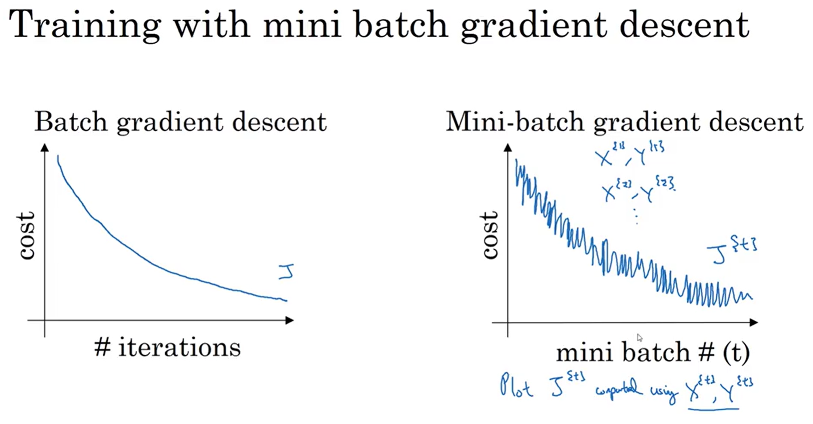
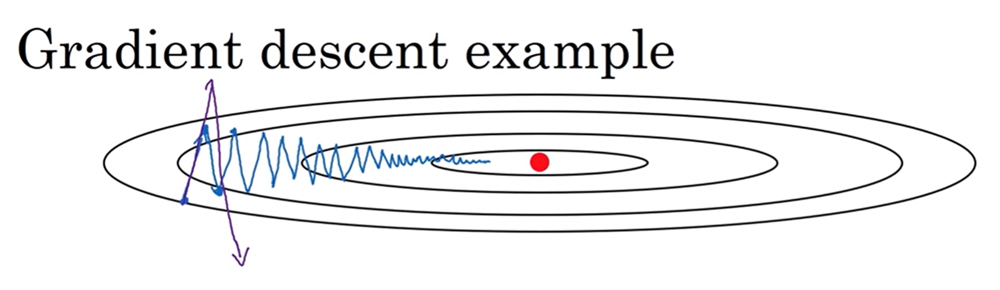
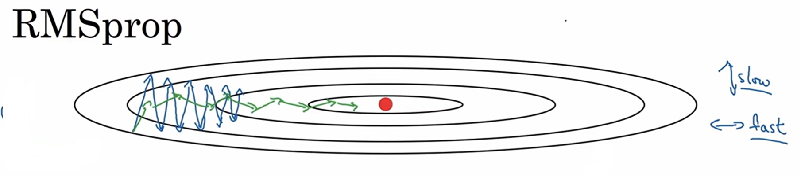
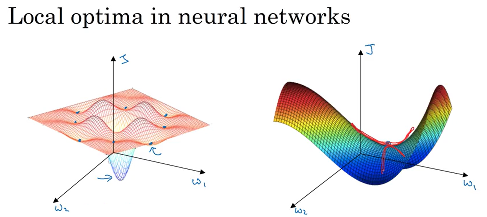

# Optimization Algorithms

## 1. Mini-Batch Gradient Descent

Mini-batch gradient descent is an optimization method that splits the training set into small subsets called mini-batches and performs one gradient descent update per mini-batch. This lets the model start making progress before processing the entire dataset, combining the stability of batch gradient descent with the speed of stochastic gradient descent.

### 1.1 Notation

| Superscript | Meaning | Example |
|---|---|---|
| $(i)$ | $i$-th training example | $x^{(i)}$ |
| $[l]$ | Layer $l$ | $W^{[l]}$ |
| $\{t\}$ | Mini-batch $t$ | $X^{\{t\}},\, Y^{\{t\}}$ |

### 1.2 Algorithm

**Idea**  
Instead of waiting to process all $m$ examples before taking a gradient step, split the data into mini-batches of size $B$ and update parameters after each one. One full pass through the data is called an **epoch**; with mini-batch gradient descent each epoch yields $\lceil m/B \rceil$ gradient steps instead of just one.

For $t = 1, \ldots, m/B:$

1. Forward prop on $X^{\{t\}}$ → compute $\hat{Y}^{\{t\}}$
2. Compute cost on the mini-batch:

$$J^{\{t\}} = \frac{1}{B}\sum_{i=1}^{B}\mathcal{L}(\hat{y}^{(i)}, y^{(i)}) + \frac{\lambda}{2B}\sum_l \|W^{[l]}\|_F^2$$

3. Backprop on $J^{\{t\}}$ → compute $dW^{[l]},\, db^{[l]}$
4. Update parameters:

$$W^{[l]} := W^{[l]} - \alpha\, dW^{[l]}, \qquad b^{[l]} := b^{[l]} - \alpha\, db^{[l]}$$

### 1.3 Why it works

The three variants differ only in batch size $B$, which controls the tradeoff between update frequency and gradient quality:

| Variant | Batch size | Behaviour |
|---|---|---|
| Batch GD | $m$ (whole dataset) | Smooth, low-noise updates; very slow on large data — must process all $m$ examples per step |
| Stochastic GD | 1 | One update per example; very frequent but very noisy; loses vectorization speedup |
| **Mini-batch GD** | $1 < B < m$ | Best of both: vectorized over $B$ examples for speed, yet frequent enough updates to make fast progress |

Mini-batch GD dominates in practice because modern GPUs can process a batch of 64–512 examples in nearly the same time as a single example, and frequent updates mean the model learns much faster than waiting for a full pass.

### 1.4 How it helps

Mini-batch GD is useful because it:
- starts improving parameters immediately, without waiting to see the whole dataset,
- makes efficient use of GPU parallelism through vectorization over the batch,
- introduces a small amount of noise in gradient estimates, which can help escape shallow local minima.

### 1.5 Intuition

With **batch GD**, $J$ must decrease monotonically on every iteration — if it rises, something is wrong (learning rate too large or a bug). With **mini-batch GD**, the cost $J^{\{t\}}$ plotted per mini-batch oscillates slightly but should trend downward overall, because each mini-batch is a different random sample and some are harder than others.

### 1.6 Choosing mini-batch size

- If $m \leq 2000$: use batch GD — the whole dataset fits in memory and noise adds no benefit.
- Otherwise, choose a **power of 2**: **64, 128, 256, 512** — this aligns with CPU/GPU memory layout and runs faster.
- Ensure $X^{\{t\}}, Y^{\{t\}}$ fit in CPU/GPU memory; exceeding memory causes a sharp performance drop.
- Mini-batch size is a hyperparameter to tune.

---

## 2. Exponentially Weighted Averages (EWA)

Exponentially Weighted Averages (EWA) are a way to compute an average where recent observations matter more than older ones, and the importance of past values decays exponentially over time.

The foundation of momentum, RMSprop, and Adam.

### 2.1 Algorithm

**Idea**
Instead of a simple average (where all points are equal), EWA updates the average step by step:

$$\boxed{V_t = \beta\, V_{t-1} + (1-\beta)\,\theta_t}, \qquad V_0 = 0,$$

where 
$V_t$ - current value,
$\theta_t$ - smoothed value (the average),
$β$ - smoothing factor (between 0 and 1).

The the weights of past observations decrease exponentially:

$$(1-\beta), (1-\beta)\beta, (1-\beta)\beta^2, (1-\beta)\beta^3, \dots
$$

$V_t$ approximates an average over roughly $\frac{1}{1-\beta}$ recent values:

| $\beta$ | Effective window | Curve |
|---|---|---|
| 0.5 | ~2 steps | Very noisy, fast to adapt |
| 0.9 | ~10 steps | Smooth, moderate lag |
| 0.98 | ~50 steps | Very smooth, slow to adapt |

### 2.2 How it works

Intuition:
- the weight on $\theta_{t-k}$ decays as $\beta^k$. After $\frac{1}{1-\beta}$ steps the weight has decayed to $\approx e^{-1} \approx 0.37$ of the current weight;
- if $β$ is close to 1 (e.g., 0.9 or 0.99), then strong smoothing, long memory (old values still matter);
- if $β$ is small (e.g., 0.5), then quick reaction to recent changes, no long memory.

Memory efficiency: requires only one stored number; overwrites it in-place each step.

### 2.3 Bias Correction

Because $V_0 = 0$, early estimates are systematically too small. Fix:

$$\hat{V}_t = \frac{V_t}{1 - \beta^t}$$

As $t \to \infty$, $\beta^t \to 0$ so $\hat{V}_t \approx V_t$ — correction only matters in the first few steps. In practice, momentum often skips bias correction; Adam always includes it.

---

## 3. Gradient Descent with Momentum

Gradient Descent with Momentum is an optimization method that speeds up plain gradient descent by remembering previous updates and adding that “inertia” to the next step. It helps the model move faster in the right direction and reduces the zig-zagging you often get in narrow valleys.

### 3.1 Algorithm

**Idea**
In normal gradient descent, each step depends only on the current gradient. With momentum, you smooths oscillations by using an EWA of the gradients and keep a running average of past gradients, so updates reflect both the current direction and the recent trend.

Initialize: $V_{dW} = 0,\; V_{db} = 0$

On each iteration $t$, compute $dW, db$ via backprop, then:

$$\boxed{V_{dW} = \beta_1\, V_{dW} + (1-\beta_1)\, dW}$$

$$\boxed{V_{db} = \beta_1\, V_{db} + (1-\beta_1)\, db},$$

where $V_{dW}$, $V_{db}$ - momentum term.

Then update weights and bias:

$$W := W - \alpha\, V_{dW}$$
$$\qquad b := b - \alpha\, V_{db}$$

### 3.2 Why it works

On a cost surface with narrow valleys (fast curvature in one direction, slow in another):
- Oscillating directions: positive and negative gradients average out → $V_{dW}$ small → slow movement → dampened oscillations.
- Progress direction: gradients consistently point the same way → $V_{dW}$ large → fast movement.

This allows a **larger learning rate** without diverging, because oscillations are suppressed.

### 3.3 How it helps
Momentum is useful because it:
- speeds up learning in directions where gradients keep pointing the same way,
- reduces oscillations in steep, narrow regions,
- can make training more stable and efficient.

### 3.4 Intuition

Standard gradient descent acts like taking each step from scratch. Momentum acts like a ball rolling downhill with inertia.

If your loss surface is shaped like a long valley, plain gradient descent may bounce from side to side. Momentum smooths those updates, so instead of zig-zagging, the optimizer moves more directly toward the minimum.

The gradient provides acceleration; $\beta_1$ acts as friction preventing unlimited speed-up.

### 3.5 Hyperparameters

| Parameter | Typical value | Notes |
|---|---|---|
| $\alpha$ | tune | Most important to tune |
| $\beta_1$ | **0.9** | Rarely needs tuning |

---

## 4. RMSprop (Root Mean Square Prop)

RMSprop is an optimization method that adapts the learning rate **per parameter** by keeping a running average of squared gradients. Parameters with consistently large gradients get their learning rate reduced; parameters with small gradients get it increased. This helps navigate narrow valleys without oscillating.

### 4.1 Algorithm

**Idea**  
Instead of using the raw gradient for the update, divide by the root of a running average of squared past gradients. This scales down the step size where gradients are large (steep directions) and scales it up where they are small (flat directions).

Initialize: $S_{dW} = 0,\; S_{db} = 0$

On each iteration $t$, compute $dW, db$ via backprop, then:

$$\boxed{S_{dW} = \beta_2\, S_{dW} + (1-\beta_2)\, dW^2}$$

$$\boxed{S_{db} = \beta_2\, S_{db} + (1-\beta_2)\, db^2},$$

where $S_{dW}$, $S_{db}$ are the second-moment (squared gradient) accumulation terms. The squaring is **elementwise**.

Then update weights and bias:

$$W := W - \alpha\, \frac{dW}{\sqrt{S_{dW}} + \varepsilon}$$

$$b := b - \alpha\, \frac{db}{\sqrt{S_{db}} + \varepsilon}$$

$\varepsilon \approx 10^{-8}$ is added for numerical stability to prevent division by zero.

### 4.2 Why it works

The gradient is much larger in oscillating directions (steep curvature) than in the progress direction (shallow curvature):
- Steep/oscillating directions: $dW^2$ large → $S_{dW}$ large → update scaled **down** → oscillations dampened.
- Flat/progress directions: $dW^2$ small → $S_{dW}$ small → update scaled **up** → faster progress.

Net effect: you can use a **larger $\alpha$** without diverging, because the per-parameter scaling automatically suppresses oscillations.

### 4.3 How it helps

RMSprop is useful because it:
- eliminates the need to manually tune different learning rates for different parameters,
- reduces oscillations in steep directions while accelerating progress in flat ones,
- makes training more stable in non-stationary settings.

### 4.4 Intuition

Think of gradient descent on a narrow elliptical valley. Plain gradient descent bounces back and forth across the narrow axis while crawling along the long axis. RMSprop measures how large the gradients have been in each direction and automatically brakes where they are large and accelerates where they are small — so the optimizer moves more directly toward the minimum.

### 4.5 Hyperparameters

| Parameter | Typical value | Notes |
|---|---|---|
| $\alpha$ | tune | Most important to tune |
| $\beta_2$ | **0.999** | Rarely needs tuning |
| $\varepsilon$ | $10^{-8}$ | Never needs tuning |

---

## 5. Adam (Adaptive Moment Estimation)

Adam is an optimization method that combines Momentum and RMSprop into a single algorithm. It keeps a running average of past gradients (like Momentum) and a running average of squared gradients (like RMSprop), then uses both to make an adaptive, bias-corrected update. It is the most widely used deep learning optimizer in practice and works well across a broad range of architectures with minimal tuning.

### 5.1 Algorithm

**Idea**  
Momentum alone smooths the update direction but applies the same effective learning rate everywhere. RMSprop alone scales the learning rate per parameter but can be noisy early in training. Adam does both: it steers in the right direction and scales each parameter's step size — then corrects for the initialization bias that both running averages have at the start.

Initialize: $V_{dW} = S_{dW} = V_{db} = S_{db} = 0$

On each iteration $t$, compute $dW, db$ via backprop, then:

**First moment — momentum-like update:**

$$\boxed{V_{dW} = \beta_1\, V_{dW} + (1-\beta_1)\, dW}$$

$$\boxed{V_{db} = \beta_1\, V_{db} + (1-\beta_1)\, db},$$

where $V_{dW}$, $V_{db}$ are exponentially weighted averages of the gradients (first moment / mean).

**Second moment — RMSprop-like update:**

$$\boxed{S_{dW} = \beta_2\, S_{dW} + (1-\beta_2)\, dW^2}$$

$$\boxed{S_{db} = \beta_2\, S_{db} + (1-\beta_2)\, db^2},$$

where $S_{dW}$, $S_{db}$ are exponentially weighted averages of the squared gradients (second moment / uncentered variance). The squaring is **elementwise**.

**Bias correction** — both $V$ and $S$ are initialized at zero, which biases them toward zero early in training. Divide by $(1 - \beta^t)$ to correct:

$$\hat{V}_{dW} = \frac{V_{dW}}{1-\beta_1^t}, \qquad \hat{V}_{db} = \frac{V_{db}}{1-\beta_1^t}$$

$$\hat{S}_{dW} = \frac{S_{dW}}{1-\beta_2^t}, \qquad \hat{S}_{db} = \frac{S_{db}}{1-\beta_2^t}$$

Then update weights and bias:

$$W := W - \alpha\,\frac{\hat{V}_{dW}}{\sqrt{\hat{S}_{dW}} + \varepsilon}$$

$$b := b - \alpha\,\frac{\hat{V}_{db}}{\sqrt{\hat{S}_{db}} + \varepsilon}$$

$\varepsilon \approx 10^{-8}$ prevents division by zero.

### 5.2 Why it works

- The **first moment** ($V$) smooths the update direction just like Momentum — gradients that consistently point the same way accumulate, while oscillating gradients cancel out.
- The **second moment** ($S$) adapts the step size per parameter just like RMSprop — large gradients shrink their own updates, small gradients grow theirs.
- **Bias correction** ensures both averages are accurate estimates even in the first few iterations, not deflated by the zero initialization.

Together, the update $\frac{\hat{V}}{\sqrt{\hat{S}}}$ normalizes the gradient by its own recent magnitude, producing a step of roughly unit scale in each direction regardless of the raw gradient size.

### 5.3 How it helps

Adam is useful because it:
- combines the benefits of both Momentum and RMSprop in a single pass,
- requires minimal hyperparameter tuning — only $\alpha$ needs to be searched,
- is robust across many different architectures and loss landscapes,
- handles sparse gradients well due to the per-parameter adaptive scaling.

### 5.4 Intuition

Imagine navigating a hilly landscape in the dark. Momentum remembers which way you've been walking and keeps you moving in that direction even when the ground briefly tilts elsewhere. RMSprop tells you to take smaller steps in steep ravines and larger steps on flat plains. Adam does both simultaneously: it steers by recent history and sizes each step by the terrain's difficulty — then double-checks its estimates are accurate before committing to the update.

### 5.5 Hyperparameters

| Parameter | Typical value | Notes |
|---|---|---|
| $\alpha$ | tune | Most important to tune |
| $\beta_1$ | **0.9** | First moment; rarely needs tuning |
| $\beta_2$ | **0.999** | Second moment; rarely needs tuning |
| $\varepsilon$ | $10^{-8}$ | Never needs tuning |

In practice: fix $\beta_1, \beta_2, \varepsilon$ at defaults and only search over $\alpha$.

**Name origin:** Adam = **Ada**ptive **M**oment estimation — $\beta_1$ tracks the first moment (mean) of the gradients, $\beta_2$ tracks the second moment (variance).

---

## 6. Learning Rate Decay

Learning rate decay means gradually reducing the learning rate during training so the model takes large steps at the beginning and smaller, more careful steps later. As training converges, a smaller $\alpha$ helps the algorithm settle near the minimum instead of oscillating around it.

### 6.1 Common schedules

**Step decay (most common):**

$$\alpha = \frac{\alpha_0}{1 + \text{decayRate} \times \text{epochNum}}$$

**Exponential decay:**

$$\alpha = \alpha_0 \cdot e^{-\text{decayRate} \times \text{epochNum}}$$

**Square-root decay:**

$$\alpha = \frac{\alpha_0}{\sqrt{\text{epochNum}}}$$

**Manual decay:** reduce $\alpha$ by hand when training plateaus (feasible when training takes hours/days).

`decayRate` and $\alpha_0$ are hyperparameters to tune.

### 6.2 Why it helps

At the start of training, a higher learning rate helps the model learn quickly and move toward a good region of the loss surface. Later, a smaller learning rate helps it fine-tune the parameters and avoid overshooting the minimum.

### 6.3 When it is useful

Learning rate decay is especially helpful when:
- training deep neural networks,
- the loss starts to oscillate near the optimum,
- you want better convergence at the end of training.

---

## 7. The Problem of Local Optima

### Old intuition (incorrect for deep learning)

Low-dimensional plots suggest many local minima where gradient descent could get stuck.

### Modern understanding

In a very high-dimensional space (e.g. 20,000 parameters), a zero-gradient point requires the cost surface to curve **upward in every direction simultaneously**. The probability of this is $\approx 2^{-20000}$ — essentially impossible.

Instead, zero-gradient points are almost always **saddle points**: some directions curve up, others curve down. Gradient descent can escape saddle points.

### Real problem: Plateaus

A **plateau** is a region where $\|\nabla J\| \approx 0$ over many steps, so learning is very slow. The algorithm must wander across the flat region before finding a slope.

Algorithms like momentum, RMSprop, and Adam help escape plateaus faster by accumulating velocity across flat regions.

---

## 8. Algorithm Comparison

| Algorithm | Adapts per-param LR | Uses gradient history | Bias correction | Key hyperparams |
|---|---|---|---|---|
| SGD / Mini-batch GD | No | No | — | $\alpha$ |
| Momentum | No | Yes (1st moment) | Optional | $\alpha, \beta_1$ |
| RMSprop | Yes (2nd moment) | Yes (2nd moment) | Optional | $\alpha, \beta_2$ |
| **Adam** | **Yes (2nd moment)** | **Yes (1st + 2nd)** | **Yes** | $\alpha, \beta_1, \beta_2$ |

**Recommendation:** Use **Adam** with mini-batch gradient descent as the default. It works well across a wide range of architectures and requires minimal tuning beyond the learning rate $\alpha$.

---

## 9. Practical Tips

- **Shuffle** training data before splitting into mini-batches each epoch to avoid systematic ordering effects.
- **Power-of-2** mini-batch sizes (64–512) align with CPU/GPU memory and run faster.
- **Tune $\alpha$ first** — it has the largest impact on convergence speed.
- **Plot $J$ vs. epoch** to diagnose: if $J$ increases or oscillates wildly, $\alpha$ is too large; if $J$ decreases very slowly, $\alpha$ is too small.
- With **dropout**, $J$ is non-deterministic — temporarily set `keep_prob = 1` to verify $J$ decreases monotonically before enabling dropout.
- **Learning rate decay** is more important for fine-grained convergence near the end of training than for early-phase learning.
