# Sequence Models: Recurrent Neural Networks

A compact reference for the models that read and write sequences:
- What a sequence is, what its tensor looks like, and what its properties demand of a model;
- Notation for indexing a sequence, and one-hot representations of symbolic data;
- Why a network of fully connected layers cannot do the job;
- The recurrent neural network and its forward propagation;
- Backpropagation through time;
- The family of shapes: many-to-many, many-to-one, one-to-many, encoder-decoder;
- Language modelling and how to train one on a corpus;
- Sampling novel sequences, and character-level models;
- Vanishing and exploding gradients in RNNs;
- Gated recurrent units (GRU);
- Long short-term memory (LSTM);
- Bidirectional RNNs;
- Deep (stacked) RNNs.

Main idea: one small set of parameters, scanned across the sequence one position at a time, carrying an activation forward as memory. Everything else in these notes is a repair to that one idea.

---

## 1. Sequence

### 1.1 What Is a Sequence

A **sequence** is data whose elements come in a definite **order**, where that order is part of the information. Rearrange the elements and you change what the data means:

> the cat ate the mouse  
> the mouse ate the cat

Same words, same word counts, opposite meaning. So a sequence is not a bag of items. It is an ordered list, and the position of an item matters as much as the item itself.

That ordering is very often **time**, and the notation in these notes reflects it: positions are indexed by $t$, and each position is called a "time step". But nothing in the mathematics needs a clock.

| Data | What the order actually is |
|---|---|
| A sentence | reading order, left to right |
| A DNA strand | position along the chromosome |
| A protein | position along the amino-acid chain |
| An audio clip | time |
| A video | time |
| A daily price series | time |
| The pages a user clicked through | the order of the clicks |

DNA is the clearest counter-example to the temporal reading: A-C-G-T along a chromosome has a definite order with no time in it at all. So read $t$ as "position", and treat "time step" as a figure of speech that stuck.

$$\boxed{\text{a sequence is about } \textbf{order}; \text{ time is only the most common kind of order}}$$

The second half of the definition matters as much as the first: **the number of elements is not fixed**. One sentence is nine words, the next is thirty; one audio clip is two seconds, the next is ten. A sequence model is handed whatever length it gets.

### 1.2 Applications

| Task | Input $X$ | Tensor shape of one $X$ | Output $Y$ | Which side is a sequence |
|---|---|---|---|---|
| Speech recognition | an audio clip, playing out over time | $(T_x,\, n_{\text{mel}})$ | a transcript in words | both |
| Music generation | nothing, a genre, or the first few notes | $(1,)$ or empty | a sequence of notes | output only |
| Sentiment classification | "There is nothing to like in this movie" | $(T_x,\, V)$ | 1 to 5 stars | input only |
| DNA sequence analysis | a strand over the alphabet A, C, G, T | $(T_x,\, 4)$ | which stretch codes for a protein | both |
| Machine translation | *Voulez-vous chanter avec moi?* | $(T_x,\, V)$ | "Do you want to sing with me?" | both, **different lengths** |
| Video activity recognition | a clip of video frames | $(T_x,\, h,\, w,\, 3)$ | the activity | input only |
| Name entity recognition | "Harry Potter and Hermione Granger…" | $(T_x,\, V)$ | one label per word | both, **same length** |
| Time series forecasting | the last $T_x$ readings of demand, price, or a sensor | $(T_x,\, d)$ | the next $H$ values | both, $T_y = H$ |
| Panel data | $d$ features for each of $N$ entities over $T_x$ periods | $(N,\, T_x,\, d)$ | one series, or one label, per entity | both |

**Reading the shape column.** $T_x$ is the number of positions, $V$ the vocabulary size, $d$ the number of features recorded at each position, $n_{\text{mel}}$ the number of frequency bins in one audio frame, and $h \times w \times 3$ one RGB video frame. These are the shapes of **one example**; a framework adds a leading mini-batch dimension $m$, so what a layer actually receives is $(m,\, T_x,\, d)$ — rank 3 for most of these tasks, rank 5 for video.

Every row has the same skeleton:

$$\boxed{\left(\underbrace{T_x}_{\text{the sequence axis}},\; \underbrace{\ldots}_{\text{what sits at one position}}\right)}$$

Knowing which axis is the sequence axis is the first thing to get right when wiring up a model, and confusing it with the batch axis is the classic bug.

Every one of these tasks is ordinary **supervised learning** on labelled $(X, Y)$ pairs — nothing exotic happens to the training procedure. What has to change is the architecture, and section 1.3 says exactly why.

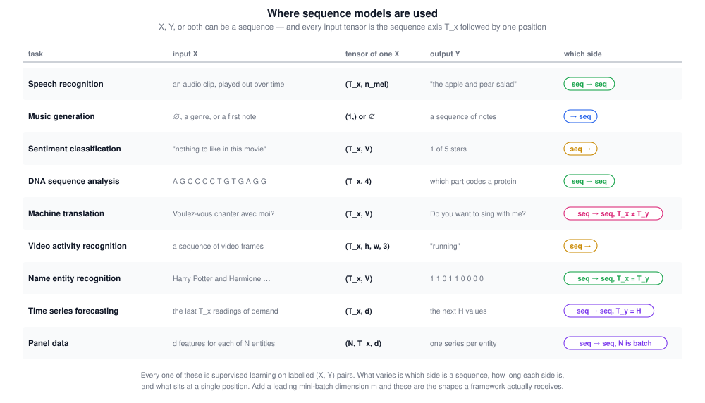

Two of these rows deserve a comment.

**Time series** differ from the language rows in what sits at a position. There is no vocabulary and no one-hot vector: each position is already a vector of $d$ real numbers — one for a **univariate** series such as daily electricity demand, several for a **multivariate** one that tracks demand alongside temperature, price, and day of week. The target is usually a **horizon** of $H$ future values, which makes forecasting a many-to-many problem where $T_y = H$ has nothing to do with $T_x$.

**Panel data** adds an entity axis: the same features measured for many entities over the same periods, such as 12 financial ratios for 500 companies across 40 quarters. Note what that third axis is *not* — it is not a second sequence axis. Entities have no order, so the $N$ axis behaves exactly like the **batch** dimension, and each entity is one training example of shape $(T_x,\, d)$. What makes panel data its own topic is that all $N$ entities **share one parameter set**, so the model learns cross-sectional structure: the pattern "a ratio rising three quarters running predicts a fall" is learned from all 500 companies at once rather than 500 separate times.

### 1.3 Characteristics of a Sequence

A handful of properties follow from the definition. Each one is a constraint on the model, and each is answered somewhere in these notes.

| Characteristic | What it means | Where it is answered |
|---|---|---|
| **Order carries meaning** | Permuting the elements changes the label, so the model has to consume positions in order rather than as a set | the recurrence itself, section 2 |
| **Variable length** | $T_x$ differs between examples, so one fixed parameter set has to handle any length | the recurrence itself, section 2 |
| **$T_x$ need not equal $T_y$** | A translation has a different number of words than the sentence it translates | the architecture shapes, section 4 |
| **Patterns are position-invariant** | *Harry* means the same thing at position 1 and at position 7, so what is learned at one position should apply at all of them | parameters shared across $t$, section 2.1 |
| **Dependencies can be long-range** | An element can be decided by one far away: *the cat … **was** full* against *the cats … **were** full* | gated units, sections 7 to 9 |
| **Context can run both ways** | Whether *Teddy* is part of a name depends on the word that comes after it | bidirectional RNNs, section 10 |
| **Availability varies** | Sometimes the whole sequence is in hand, sometimes it arrives one element at a time | causal against bidirectional, section 10.3 |

The last one shapes deployment rather than architecture: a model that has to read the whole sentence before predicting anything is fine for a stored document and useless for live dictation.

Taken together, the first four are also a precise statement of what a network of fully connected layers gets wrong, which is the subject of section 1.6.

### 1.4 Notation

Positions inside a sequence are indexed with angle brackets, training examples with round ones.

| Symbol | Meaning |
|---|---|
| $x^{\langle t \rangle}$ | the $t$-th element of the input sequence |
| $y^{\langle t \rangle}$ | the $t$-th element of the output sequence |
| $T_x$ | the length of the input sequence |
| $T_y$ | the length of the output sequence |
| $x^{(i)\langle t \rangle}$ | element $t$ of training example $i$ |
| $T_x^{(i)}$ | the input length of training example $i$ |

$$\boxed{\text{different training examples may have different } T_x^{(i)} \text{ and } T_y^{(i)}}$$

**What sits at one position** depends on the kind of data:

| Kind of data | One element $x^{\langle t \rangle}$ |
|---|---|
| Continuous — prices, sensor readings, audio features | already a vector of $d$ real numbers; feed it in as it is |
| Symbolic — words, DNA bases, note names | an index into a **vocabulary**, turned into a one-hot vector |

Only the symbolic case needs extra machinery, and the rest of this section is about it.

**Building a vocabulary.** A vocabulary, also called a dictionary, is simply the list of symbols you are willing to represent.

| Index | Word |
|---:|---|
| 1 | a |
| 2 | Aaron |
| 367 | and |
| 4075 | Harry |
| 6830 | Potter |
| 10000 | Zulu |

Ways to build it: take the top 10,000 most frequent words in your training corpus, or start from an online frequency list for the language.

| Vocabulary size | Where you see it |
|---|---|
| 10,000 | a convenient round number for illustration |
| 30,000 to 50,000 | common in commercial applications |
| 100,000 | not uncommon |
| a million or more | some of the large internet companies |

**One-hot vectors.** Each word then becomes a vector of zeros with a single 1 at the word's index, so if the vocabulary has 10,000 words, every $x^{\langle t \rangle}$ is a 10,000-dimensional vector with exactly one entry on:

$$\boxed{x^{\langle t \rangle} = e_k \quad \text{where } k \text{ is the index of the word in the vocabulary}}$$

**Words you have never seen.** If a word is not in the vocabulary, you create one extra fake word — the **unknown word** token `UNK` — and map every out-of-vocabulary word to it. That keeps every input a valid one-hot vector, at the cost of collapsing all rare words into a single symbol.

> **A nuance worth knowing.** Modern systems rarely use word-level one-hot vectors. They use **subword** tokenization (byte-pair encoding, WordPiece, SentencePiece), which splits rare words into pieces and eliminates most of the need for `UNK`, and they feed the network **learned embeddings** rather than one-hot vectors. The two are closer than they look: multiplying a one-hot vector by a weight matrix just selects one column of that matrix, which is exactly what an embedding lookup does. The one-hot picture is the right mental model for what an embedding layer is doing.

### 1.5 Example: Named Entity Recognition

This is the running example for the rest of these notes. **Named entity recognition** is used by search engines to index the people, companies, times, locations, countries, and currencies mentioned in text — so that, for instance, everyone named in the last 24 hours of news articles can be looked up. The input is a sentence; the output says, for each word, whether it is part of a person's name.

> Harry Potter and Hermione Granger invented a new spell.

Putting the notation of section 1.4 to work on it:

| Piece of notation | In this sentence |
|---|---|
| Input | nine words, so $T_x = 9$ |
| Output | nine labels, $1\,1\,0\,1\,1\,0\,0\,0\,0$, so $T_y = 9$ |
| Vocabulary | 10,000 words, so each $x^{\langle t \rangle}$ is 10,000-dimensional |

$$\boxed{x^{\langle 1 \rangle} = \text{Harry} = e_{4075}, \qquad x^{\langle 2 \rangle} = \text{Potter} = e_{6830}, \qquad x^{\langle 3 \rangle} = \text{and} = e_{367}}$$

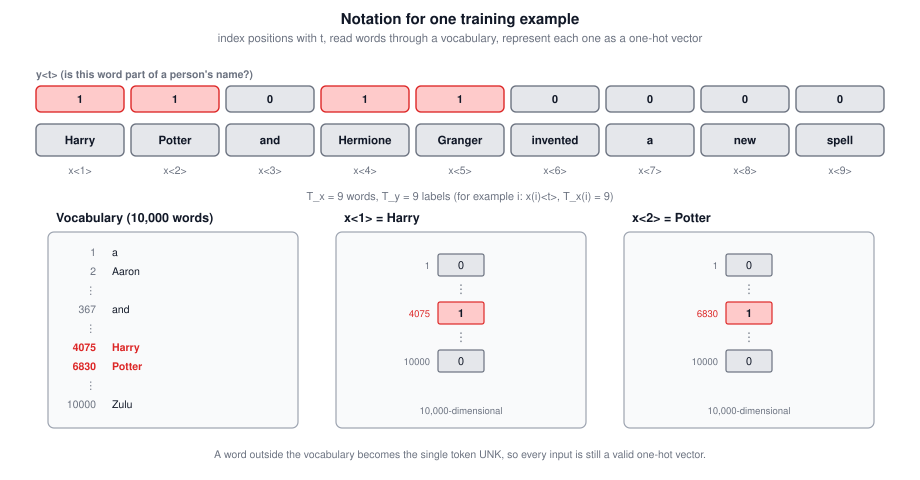

Here $T_x = T_y$, but that is a property of this task, not of sequences in general: a different training sentence of 15 words has $T_x^{(i)} = 15$, and in translation the two lengths differ within a single example.

Note also that the output representation is deliberately simple. A more sophisticated one would mark the **start and end** of each name rather than tagging words individually, which matters when two names sit next to each other — as "Harry Potter and Hermione Granger" nearly demonstrates.

### 1.6 Why a Network of Fully Connected Layers Does Not Work

The obvious thing to try is a **plain feedforward network made of fully connected layers** — the ordinary kind, where every unit of one layer is wired to every unit of the next and each of those connections has its own weight. Lay the nine one-hot vectors end to end into one long input vector, push it through a couple of fully connected hidden layers, and read off nine zero-or-one outputs:

$$\boxed{\underbrace{\left[x^{\langle 1 \rangle}; x^{\langle 2 \rangle}; \ldots; x^{\langle 9 \rangle}\right]}_{9 \,\times\, 10{,}000 \;=\; 90{,}000 \text{ input units}} \;\xrightarrow{\;W^{[1]}\;}\; \text{hidden} \;\rightarrow\; \cdots \;\rightarrow\; \hat{y}^{\langle 1 \rangle}, \ldots, \hat{y}^{\langle 9 \rangle}}$$

Three things go wrong, and all three trace back to that first fully connected layer.

**1. A fully connected layer has a fixed input size; sentences do not.**

$W^{[1]}$ has exactly one column per input unit, so its shape is frozen the moment you build the network. A nine-word sentence produces 90,000 input units, a fifteen-word sentence produces 150,000, and no single matrix has both shapes. So one architecture cannot read both sentences.

The usual patch is to pick a maximum length $T_{\max}$ and zero-pad every input up to it. That runs, but it is a poor representation rather than a fix: you pay for $T_{\max}$ positions on every example no matter how short it is, you still cannot read anything longer, and the same problem remains on the output side, since $T_y$ varies too.

**2. Every position gets its own weights, so nothing is shared across positions.**

This is the more serious one. In the concatenated input vector, the word at position 1 occupies units 1 to 10,000 and the word at position 7 occupies units 60,001 to 70,000. Those are **different columns of $W^{[1]}$** — the word *Harry* lands in column 4,075 when it sits at position 1 and in column 64,075 when it sits at position 7 — and gradient descent updates them independently.

So the weight meaning "*Harry* here suggests a person's name" is one number at position 1 and a completely unrelated number at position 7. Whatever the network learns at one position it must **learn again from scratch** at every other, and it can only learn it at the positions where the training data happened to put a name.

This is the same argument that motivates convolution. One filter slides across the whole image, so an edge detector learned from the top-left corner also works in the bottom-right. You want that effect along a sequence, and a fully connected layer is precisely the thing that denies it to you. An RNN provides it: $W_{ax}$ is literally the same matrix at $t = 1$ and at $t = 7$.

**3. That first weight matrix is enormous.**

"Fully connected" means one weight per (input unit, hidden unit) pair, so the count is the product of the two. With 100 hidden units:

| Architecture | First-layer parameters | Grows with sequence length? |
|---|---:|---|
| Fully connected, 9-word sentence | $100 \times 90{,}000 = 9$ million | yes |
| Fully connected, padded to $T_{\max} = 100$ | $100 \times 1{,}000{,}000 = 100$ million | yes |
| RNN: $W_{ax}$ plus $W_{aa}$ | $100 \times 10{,}000 + 100 \times 100 \approx 1$ million | **no** |

Nine million parameters in the first layer alone, for a nine-word sentence, before any of the later layers exist. The RNN reads one word at a time, so its input weight matrix is sized for **a single word** no matter how long the sentence gets.

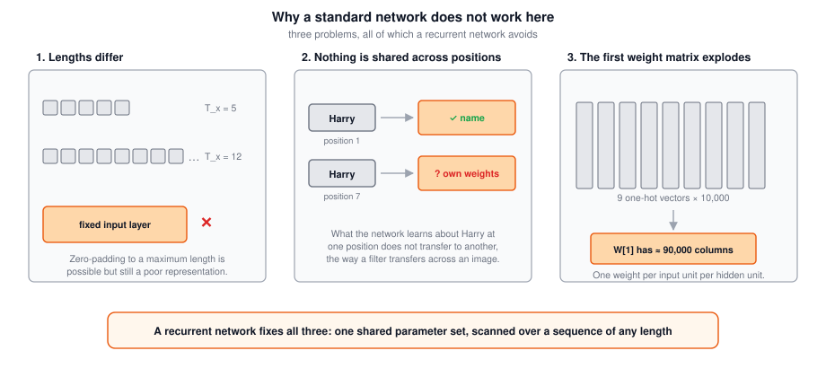

A recurrent network has none of these disadvantages. Problems 1 and 2 are fixed by the same move — reuse one set of parameters at every position instead of giving each position its own — and problem 3 falls out of it for free, so as with convolutions the better representation also **reduces the parameter count**.

### 1.7 Tricky Interview Questions

**Q: Is a sequence model always about time?**  
No. What a sequence needs is an **order**, and time is only the most common source of one. DNA is ordered by position along the chromosome with no time involved. The index $t$ and the phrase "time step" are conventions borrowed from the temporal case.

**Q: What makes a sequence different from a set of the same elements?**  
That permuting it changes the meaning. "The cat ate the mouse" and "the mouse ate the cat" contain identical elements and identical counts; only the order distinguishes them, so a model that treats its input as a bag cannot tell them apart.

**Q: Give an example where only the output is a sequence.**  
Music generation. The input can be empty, a single integer naming a genre, or the first few notes; the output is a whole sequence of notes.

**Q: Give an example where both sides are sequences but the lengths differ.**  
Machine translation. A French sentence and its English translation generally need a different number of words to say the same thing, so $T_x \neq T_y$.

**Q: You have a mini-batch of 32 sentences, at most 20 tokens each, embedded in 300 dimensions. What shape does the recurrent layer see?**  
$(32, 20, 300)$ — batch, then the sequence axis, then the feature dimension of one position. Shorter sentences are padded to 20 and masked. The sequence axis is the one the recurrence walks along, and mixing it up with the batch axis is the classic wiring bug.

**Q: Panel data has three axes. Does that make it a two-dimensional sequence?**  
No. Only the time axis is ordered. Entities have no meaningful order, so the $N$ axis behaves exactly like the batch dimension, and each entity is one example of shape $(T_x, d)$. Genuinely two-dimensional ordering — an image — is what convolution is for.

**Q: What does the superscript in $x^{(i)\langle t \rangle}$ mean?**  
The round brackets index the **training example**, and the angle brackets index the **position within the sequence**. So this is element $t$ of example $i$.

**Q: How large is $x^{\langle t \rangle}$ if the vocabulary has 10,000 words?**  
It is a 10,000-dimensional one-hot vector, regardless of $t$. Note that this only applies to symbolic data; in a time series, $x^{\langle t \rangle}$ is just the $d$ measurements taken at that position.

**Q: Why is the vocabulary size a design choice rather than just "all the words"?**  
Because the softmax output layer and the input weight matrix both scale with it. A larger vocabulary covers more words but costs parameters and compute, and the marginal words are very rare.

**Q: Must $T_x$ equal $T_y$?**  
No. They are equal in the named entity recognition example and unequal in machine translation. The two cases need different architectures, covered in section 4.

**Q: Why not treat named entity recognition as nine independent classification problems?**  
Because the label at one position depends on the surrounding words. "Teddy" is part of a person's name in "He said Teddy Roosevelt was a great president" and not in "He said teddy bears are on sale", and the difference is only visible from the context.

**Q: What are the two advantages of an RNN over a fully connected network on sequence data?**  
It handles inputs and outputs of any length, and it shares the same parameters across every position, so a pattern learned at one position is recognized at every other one. The shared parameters also make the model much smaller.

---

## 2. Recurrent Neural Networks

The fix for all three failures in section 1.6 is a single idea: stop building one layer wide enough for the whole sequence, and instead build one small layer that reads **one position at a time** and passes a summary of what it has seen so far along to the next position.

### 2.1 Building One Up

Read the sentence left to right. Feed $x^{\langle 1 \rangle}$ into a hidden layer and let it predict $\hat{y}^{\langle 1 \rangle}$. Now read $x^{\langle 2 \rangle}$: instead of predicting $\hat{y}^{\langle 2 \rangle}$ from $x^{\langle 2 \rangle}$ alone, also pass in the **activation from time step 1**. Continue to the end.

To start the whole thing off you need some made-up activation at time zero, $a^{\langle 0 \rangle}$, which is almost always the **vector of zeros**. Some researchers initialize it randomly, and there are other schemes, but zeros is by far the most common choice.

The parameters are **shared across every time step**:

| Parameter | Governs |
|---|---|
| $W_{ax}$ | the connection from the input $x^{\langle t \rangle}$ into the hidden layer |
| $W_{aa}$ | the horizontal connection carrying $a^{\langle t-1 \rangle}$ forward |
| $W_{ya}$ | the connection from the hidden layer out to the prediction |

The naming convention: the **second** subscript says what the matrix is multiplied by, and the **first** says what kind of quantity it produces. $W_{ax}$ multiplies an $x$-like quantity to compute an $a$-like quantity; $W_{ya}$ multiplies an $a$-like quantity to compute a $y$-like quantity.

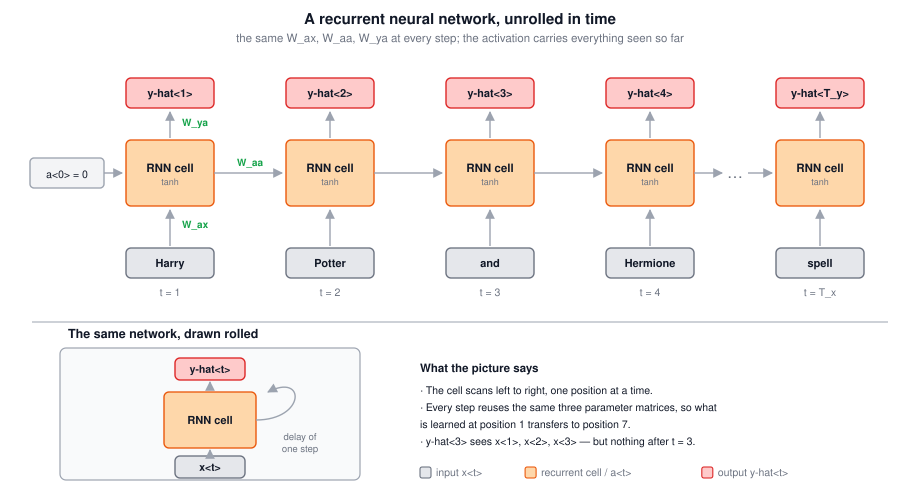

You will also see this drawn **rolled**: one cell, with a loop feeding the layer back into itself, sometimes with a shaded box marking a one-step delay. The unrolled drawing is much easier to read, so when you meet the rolled form in a paper, mentally unroll it.

### 2.2 Forward Propagation

Start with $a^{\langle 0 \rangle} = \vec{0}$, then for each $t$:

$$\boxed{a^{\langle t \rangle} = g_1\!\left(W_{aa}\, a^{\langle t-1 \rangle} + W_{ax}\, x^{\langle t \rangle} + b_a\right)}$$

$$\boxed{\hat{y}^{\langle t \rangle} = g_2\!\left(W_{ya}\, a^{\langle t \rangle} + b_y\right)}$$

| Function | Usual choice |
|---|---|
| $g_1$, the activation | **tanh**, most commonly; ReLU is sometimes used |
| $g_2$, the output | **sigmoid** for a binary output, **softmax** for a $k$-way one |

The two activation functions are generally different, which is why they are written $g_1$ and $g_2$, though most writing just calls them both $g$. For named entity recognition, where $y^{\langle t \rangle} \in \{0, 1\}$, $g_2$ is a sigmoid.

Because tanh is the standard choice here, you might expect vanishing gradients; there are other ways of dealing with that in an RNN, which is the subject of sections 7 through 9.

### 2.3 Simplifying the Notation

Carrying two parameter matrices around gets tedious once the models get more complex, so stack them side by side:

$$\boxed{W_a = \left[\,W_{aa} \mid W_{ax}\,\right]}$$

and stack the two vectors on top of each other, writing $\left[a^{\langle t-1 \rangle}, x^{\langle t \rangle}\right]$ for the concatenation. With a 100-dimensional activation and a 10,000-dimensional input:

| Matrix | Shape |
|---|---|
| $W_{aa}$ | $100 \times 100$ |
| $W_{ax}$ | $100 \times 10{,}000$ |
| $W_a$ | $100 \times 10{,}100$ |
| $\left[a^{\langle t-1 \rangle}, x^{\langle t \rangle}\right]$ | $10{,}100 \times 1$ |

The block product recovers exactly what you had:

$$\left[\,W_{aa} \mid W_{ax}\,\right] \begin{bmatrix} a^{\langle t-1 \rangle} \\ x^{\langle t \rangle}\end{bmatrix} = W_{aa}\, a^{\langle t-1 \rangle} + W_{ax}\, x^{\langle t \rangle}$$

So forward propagation becomes:

$$\boxed{a^{\langle t \rangle} = g\!\left(W_a \left[a^{\langle t-1 \rangle}, x^{\langle t \rangle}\right] + b_a\right), \qquad \hat{y}^{\langle t \rangle} = g\!\left(W_y\, a^{\langle t \rangle} + b_y\right)}$$

Now a single subscript says what kind of quantity the parameters compute: $W_a, b_a$ for an activation, $W_y, b_y$ for an output. This is the form every later unit in these notes is written in.

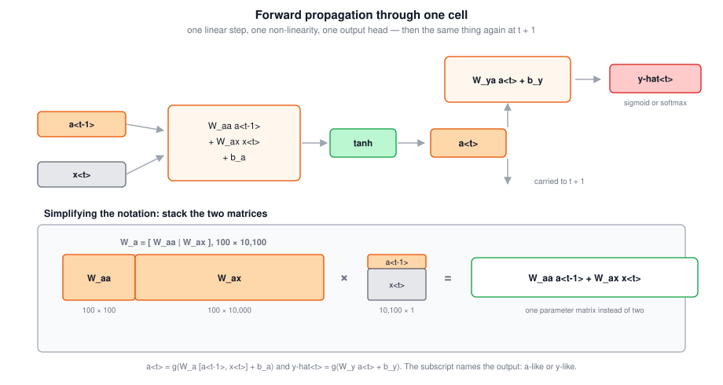

### 2.4 The Limitation

When predicting $\hat{y}^{\langle 3 \rangle}$, this network uses information from $x^{\langle 1 \rangle}$, $x^{\langle 2 \rangle}$, and $x^{\langle 3 \rangle}$ — and **nothing later in the sequence**. That is a real problem:

> He said **Teddy** Roosevelt was a great president.  
> He said **teddy** bears are on sale.

From the first three words you cannot tell whether "Teddy" is part of a person's name. This is a limitation of the architecture, not of the training, and section 10 fixes it with a bidirectional RNN.

### 2.5 Tricky Interview Questions

**Q: What is $a^{\langle 0 \rangle}$ and why do you need it?**  
It is the activation fed into the first time step, which has no predecessor. It is almost always the vector of zeros; random initialization also appears but is less common.

**Q: In $W_{ax}$, what does each subscript mean?**  
The second one ($x$) says the matrix multiplies an $x$-like quantity; the first one ($a$) says the result is an $a$-like quantity. Read $W_{ya}$ the same way: it multiplies an activation to produce an output.

**Q: Why is tanh the usual activation inside an RNN cell rather than ReLU?**  
tanh is the conventional choice and keeps the activation bounded, which helps stability in a recurrence that is applied many times. ReLU is sometimes used, and there are other, better tools for the vanishing gradient problem, namely gated units.

**Q: If $a$ is 100-dimensional and the vocabulary is 10,000 words, what shape is $W_a$?**  
$100 \times 10{,}100$: the $100 \times 100$ block $W_{aa}$ beside the $100 \times 10{,}000$ block $W_{ax}$.

**Q: Which inputs affect $\hat{y}^{\langle 3 \rangle}$ in this architecture?**  
Only $x^{\langle 1 \rangle}$ through $x^{\langle 3 \rangle}$. Information flows forward in $t$ only, so nothing after position 3 can influence the prediction there.

---

## 3. Backpropagation Through Time

Frameworks do this for you. It is still worth having a rough sense of the shape of the computation.

### 3.1 The Computation Graph

Forward propagation goes left to right: $x^{\langle 1 \rangle}$ and $a^{\langle 0 \rangle}$ give $a^{\langle 1 \rangle}$, then $x^{\langle 2 \rangle}$ and $a^{\langle 1 \rangle}$ give $a^{\langle 2 \rangle}$, and so on to $a^{\langle T_x \rangle}$. The parameters $W_a, b_a$ feed into **every** activation node, and $W_y, b_y$ into every prediction node.

### 3.2 The Loss

Per position, the element-wise loss is the standard logistic regression loss, also called the **cross-entropy** loss:

$$\boxed{L^{\langle t \rangle}\!\left(\hat{y}^{\langle t \rangle}, y^{\langle t \rangle}\right) = -\,y^{\langle t \rangle} \log \hat{y}^{\langle t \rangle} - \left(1 - y^{\langle t \rangle}\right) \log\!\left(1 - \hat{y}^{\langle t \rangle}\right)}$$

Then the loss for the whole sequence is the sum over positions:

$$\boxed{L\!\left(\hat{y}, y\right) = \sum_{t=1}^{T_y} L^{\langle t \rangle}\!\left(\hat{y}^{\langle t \rangle}, y^{\langle t \rangle}\right)}$$

The superscript is what distinguishes the two: $L^{\langle t \rangle}$ is one position, $L$ without it is the whole sequence.

### 3.3 Why "Through Time"

Backprop passes messages in the opposite direction of every forward arrow, which lets you compute the derivatives with respect to the parameters and take a gradient descent step. The most significant of those messages is the recursive one **along the activations**, which travels right to left. Forward propagation scans with increasing $t$; backpropagation goes backwards through $t$, hence the name.

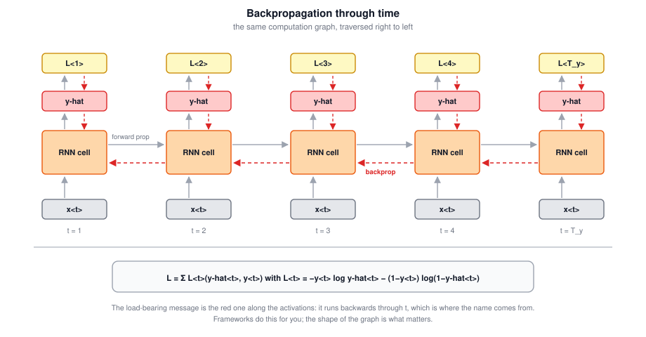

> **A nuance worth knowing.** In practice long sequences are trained with **truncated backpropagation through time**: run forward for a fixed window of steps, backpropagate within that window only, carry the final activation forward as the next window's initial state, and do not propagate gradients past the boundary. This bounds memory and compute per update at the cost of never learning dependencies longer than the window.

### 3.4 Tricky Interview Questions

**Q: What makes backpropagation in an RNN different from a feedforward network?**  
Nothing structural — it is the same backpropagation on the same kind of computation graph. What is distinctive is that the graph is deep in the **time** direction, and the same parameters appear at every depth, so each parameter's gradient is a sum of contributions from every time step.

**Q: Why is the total loss a sum rather than an average over $t$?**  
As written in the lecture it is a sum over positions. Implementations often average instead, over positions and over the mini-batch, which only rescales the gradient and is absorbed by the learning rate.

**Q: How many times does $W_a$ receive a gradient contribution in one sequence?**  
Once per time step, $T_x$ times, because the same matrix is used at every step. Those contributions add up into a single update.

**Q: Does every position have to contribute a loss?**  
No. In a many-to-one architecture there is only one output, at the last step, so there is one loss term and the gradient reaches earlier steps only through the activations.

---

## 4. The Family of RNN Architectures

So far $T_x = T_y$. For many applications they differ, or one side is not a sequence at all. The basic building blocks cover all of it. (This presentation follows Andrej Karpathy's blog post *The Unreasonable Effectiveness of Recurrent Neural Networks*.)

### 4.1 The Five Shapes

| Shape | Example | Structure |
|---|---|---|
| **One-to-one** | — | A plain network; you do not need an RNN |
| **One-to-many** | Music generation | One input (or none), then emit a sequence |
| **Many-to-one** | Sentiment classification | Read the whole sequence, output once at the end |
| **Many-to-many, $T_x = T_y$** | Name entity recognition | One output per input |
| **Many-to-many, $T_x \neq T_y$** | Machine translation | Encoder reads, then decoder writes |

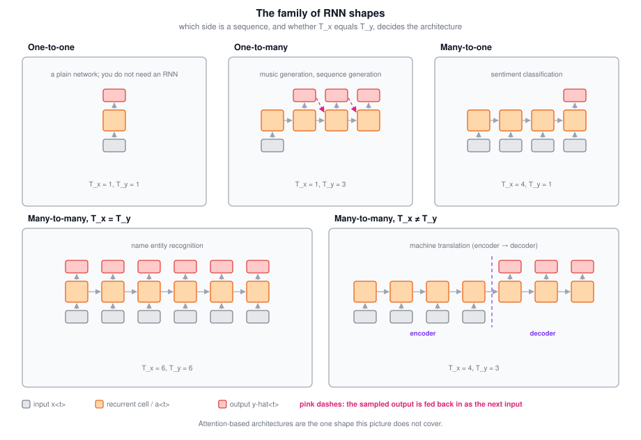

### 4.2 Many-to-One

For sentiment classification, $x$ is a piece of text and $y$ is a number — 0 or 1, or 1 to 5 stars. Feed the words in one at a time, and rather than producing an output at every step, let the RNN read the **entire** sentence and output $\hat{y}$ only at the last time step, once it has seen everything.

### 4.3 One-to-Many

For music generation, the input can be an integer naming a genre, the first note, or nothing at all (a null input, which can simply be the vector of zeros). The network then emits the first value, and with no further input the second, then the third, until the piece ends.

One technical detail matters here: when **generating** a sequence, you normally take each synthesized output and **feed it back in as the next input**. Section 6 does this properly.

### 4.4 Many-to-Many With Different Lengths

For machine translation, first have the network read the whole input sentence, then have it output the translation. The architecture splits into two distinct parts:

| Part | Job |
|---|---|
| **Encoder** | reads the input sentence and compresses it into an activation |
| **Decoder** | starts from that activation and emits the output sequence |

$$\boxed{\text{encoder} \rightarrow \text{decoder} \;\Rightarrow\; T_x \text{ and } T_y \text{ are free to differ}}$$

> **A nuance worth knowing.** This encoder-decoder shape is the **sequence-to-sequence** model (Sutskever, Vinyals, and Le; Cho et al.), and it was the standard architecture for translation for several years. Its weak point is that the whole input has to survive in one fixed-size activation. **Attention** removes that bottleneck by letting the decoder look back at every encoder state, and the Transformer keeps attention while discarding recurrence entirely. Attention is the one shape the five-panel picture above does not capture.

### 4.5 Tricky Interview Questions

**Q: Which architecture would you use for sentiment classification, and why not one output per word?**  
Many-to-one. The label describes the whole review, so there is one output, produced after the network has read every word. Per-word outputs would be predicting something that does not exist.

**Q: Why does translation need an encoder-decoder rather than one output per input word?**  
Because $T_x \neq T_y$: the translation generally has a different number of words. A per-position architecture forces the two lengths to agree, and it would also force each output word to align with one input word, which translation does not respect.

**Q: In a one-to-many generator, what is the input at step 3?**  
The output the model produced at step 2. Only the first step gets a genuine external input (or none at all); after that the model is fed its own predictions.

**Q: Is a one-to-one RNN useful?**  
Not really. With a single input and a single output there is no sequence, no recurrence to exploit, and a standard network does the job.

---

## 5. Language Modelling and Sequence Generation

Language modelling is one of the most basic and important tasks in NLP, and one that RNNs do very well.

### 5.1 What a Language Model Is

A speech recognition system hears a sentence that could be transcribed two ways:

> The apple and **pair** salad was delicious.  
> The apple and **pear** salad was delicious.

They sound identical. The way the system picks the second is with a **language model**, which reports the probability of each sentence:

| Candidate | Probability |
|---|---|
| "the apple and pair salad" | $3.2 \times 10^{-13}$ |
| "the apple and pear salad" | $5.7 \times 10^{-10}$ |

The second is more likely by a factor of about $10^{3}$, so that is what gets output.

$$\boxed{\text{a language model estimates } P\!\left(y^{\langle 1 \rangle}, y^{\langle 2 \rangle}, \ldots, y^{\langle T_y \rangle}\right)}$$

By "probability of a sentence" we mean: if you were to pick up a random newspaper, open a random email, read a random webpage, or listen to the next thing a friend says, what is the chance that the sentence you encounter is this one? It is a fundamental component of both speech recognition and machine translation, where the system should only output sentences that are **likely**.

Note the convention: for a language model the sentence is written as the **outputs** $y^{\langle t \rangle}$, not as inputs $x^{\langle t \rangle}$. The reason becomes clear in a moment.

### 5.2 Preparing the Training Set

You need a **corpus**: an NLP term for a large body of text, tens of thousands of sentences or far more, in whatever language you are modelling.

Take a sentence from it:

> cats average 15 hours of sleep a day

**Tokenize** it: form a vocabulary as in section 1.4, and map each word to a one-hot vector or a vocabulary index. Three decisions come up:

| Decision | Options |
|---|---|
| End of sentence | append an **`<EOS>`** token so the model can learn where sentences stop, or leave it out |
| Punctuation | make the period its own token and add it to the vocabulary, or ignore it |
| Rare words | replace any word outside the vocabulary with **`UNK`** |

With `<EOS>` appended, this sentence gives nine tokens $y^{\langle 1 \rangle}$ through $y^{\langle 9 \rangle}$. And if "Mau" — a breed of cat — is not among your top 10,000 words, it becomes `UNK`, so the model ends up predicting the chance of *an unknown word* rather than the chance of *Mau*.

### 5.3 The Model

The architecture is a plain RNN with one crucial wiring choice:

$$\boxed{x^{\langle 1 \rangle} = \vec{0}, \quad a^{\langle 0 \rangle} = \vec{0}, \quad \text{and} \quad x^{\langle t \rangle} = y^{\langle t-1 \rangle} \text{ for } t > 1}$$

Step by step:

- **$t = 1$.** Both $x^{\langle 1 \rangle}$ and $a^{\langle 0 \rangle}$ are zero vectors, and the softmax predicts $\hat{y}^{\langle 1 \rangle}$: the chance the first word is *a*, is *Aaron*, is *cats*, …, is *Zulu*, is `UNK`, is `<EOS>`. With a 10,000-word vocabulary plus those two extra tokens, this is a **10,002-way softmax**.
- **$t = 2$.** Now the model is told what the first word actually was. Feed in $x^{\langle 2 \rangle} = y^{\langle 1 \rangle} = \text{cats}$, and the softmax predicts the second word *given* that the first was "cats". The right answer here is "average".
- **$t = 3$.** Feed in "average", and predict the third word given "cats average". The right answer is "15".
- **…and so on**, until $x^{\langle 9 \rangle} = y^{\langle 8 \rangle} = \text{day}$ and the model should assign a high probability to `<EOS>`.

So each step answers: given the words that came before, what is the distribution over the next word? The RNN learns to predict **one word at a time, left to right**.

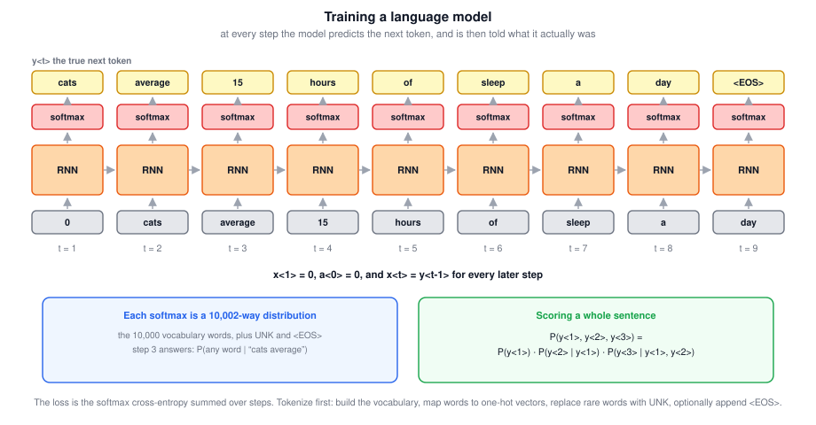

### 5.4 Training It

At step $t$, with true word $y^{\langle t \rangle}$ and prediction $\hat{y}^{\langle t \rangle}$, use the softmax loss, and sum over steps:

$$\boxed{L^{\langle t \rangle} = -\sum_{i} y_i^{\langle t \rangle} \log \hat{y}_i^{\langle t \rangle}, \qquad L = \sum_{t} L^{\langle t \rangle}}$$

### 5.5 Scoring a Whole Sentence

Once trained, the probability of a new sentence is the product of the per-step conditionals. For a three-word sentence:

$$\boxed{P\!\left(y^{\langle 1 \rangle}, y^{\langle 2 \rangle}, y^{\langle 3 \rangle}\right) = P\!\left(y^{\langle 1 \rangle}\right) \cdot P\!\left(y^{\langle 2 \rangle} \mid y^{\langle 1 \rangle}\right) \cdot P\!\left(y^{\langle 3 \rangle} \mid y^{\langle 1 \rangle}, y^{\langle 2 \rangle}\right)}$$

The first softmax gives the first factor, the second softmax the second, the third the third. Multiply them out and you have the sentence probability — which is exactly what the speech recognizer in section 5.1 needed.

> **A nuance worth knowing.** Feeding the *true* previous word at training time, rather than the model's own prediction, is called **teacher forcing**. It makes training stable and parallelizable, but it creates a mismatch with generation time, when the model must consume its own (sometimes wrong) outputs — a gap known as exposure bias. The standard quality metric for a language model is **perplexity**, the exponential of the average per-token cross-entropy, which you can read as "how many words is the model effectively choosing between at each step".

### 5.6 Tricky Interview Questions

**Q: Why is a language model's input at step $t$ the true output from step $t-1$?**  
Because the model's job is to predict the next token given the previous ones. Handing it the correct prefix at every step is what makes each softmax a clean estimate of $P(y^{\langle t \rangle} \mid y^{\langle 1 \rangle}, \ldots, y^{\langle t-1 \rangle})$.

**Q: How wide is the softmax layer, exactly?**  
The vocabulary size plus any special tokens you added. With 10,000 words plus `UNK` and `<EOS>`, 10,002.

**Q: What is $x^{\langle 1 \rangle}$?**  
The zero vector. There is no previous word at the first step, so the model has to predict the first word unconditionally.

**Q: Why append `<EOS>`?**  
So the model learns where sentences end, which gives generation a natural stopping signal and lets the model assign probability mass to "the sentence is over". It is optional; some setups just cap the length instead.

**Q: A language model gives sentence A a probability of $10^{-13}$ and sentence B $10^{-10}$. Is B "likely"?**  
Both are tiny in absolute terms, because any specific long sentence is rare. What matters is the **ratio**: B is a thousand times more likely than A, which is enough to choose it.

**Q: Where does the word "corpus" come from and what does it mean here?**  
It is NLP terminology for a large body of text used as a training set. Nothing more technical than that.

---

## 6. Sampling Novel Sequences

After you train a sequence model, one informal way to see what it learned is to **sample novel sequences** from it.

### 6.1 The Procedure

The network is the same one you trained. What changes is what you feed in.

1. **Step 1.** Input $x^{\langle 1 \rangle} = \vec{0}$ and $a^{\langle 0 \rangle} = \vec{0}$. The softmax gives a distribution over the whole vocabulary. Rather than taking the most likely word, **randomly sample** from that distribution — `np.random.choice` with the softmax vector as `p`.
2. **Step 2.** The trained network expects $y^{\langle 1 \rangle}$ here. Pass in the $\hat{y}^{\langle 1 \rangle}$ you just **sampled** instead, as a one-hot encoding. If you drew "the", then $x^{\langle 2 \rangle} = \text{the}$, and the next softmax gives the distribution over the second word given that the first is "the".
3. **Repeat**, each time sampling from the softmax and feeding the sampled token into the next step.

$$\boxed{\text{training: } x^{\langle t \rangle} = y^{\langle t-1 \rangle} \qquad \text{sampling: } x^{\langle t \rangle} = \hat{y}^{\langle t-1 \rangle}}$$

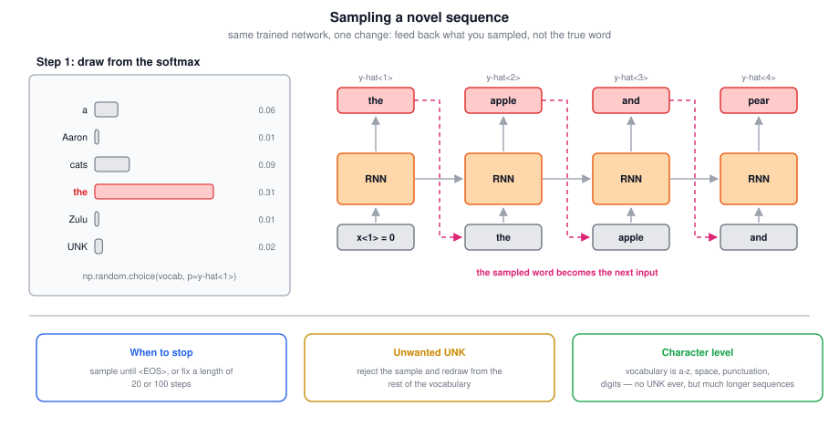

### 6.2 Practicalities

| Question | Answer |
|---|---|
| How do you know when to stop? | Keep sampling until you draw `<EOS>`, if it is in your vocabulary. Otherwise pick a number of steps — 20, 100 — and stop there |
| What if it generates `UNK`? | Reject that sample and redraw from the rest of the vocabulary until you get a real word. Or leave it in, if you do not mind |

### 6.3 Character-Level Models

Everything above is a **word-level** model: the vocabulary is English words. You can instead build a **character-level** model, where the vocabulary is the alphabet a–z, plus space, punctuation if you want it, the digits 0–9, and the uppercase letters if you want to distinguish case. A practical way to define it is just to look at which characters appear in your training set.

Then $y^{\langle 1 \rangle}, y^{\langle 2 \rangle}, \ldots$ are individual **characters**. For "cats average 15 hours of sleep a day", $y^{\langle 1 \rangle} = \text{c}$, $y^{\langle 2 \rangle} = \text{a}$, $y^{\langle 3 \rangle} = \text{t}$, $y^{\langle 4 \rangle} = \text{space}$, and so on.

| | Character level |
|---|---|
| **Advantage** | No `UNK` ever. A word like "Mau" gets a non-zero probability, whereas a word-level model can only call it `UNK` |
| **Disadvantage** | Much longer sequences. An English sentence is 10 to 20 words but many dozens of characters |
| **Consequence** | Worse at capturing long-range dependencies across a sentence, and more expensive to train |

The trend has been that word-level models remain the default, with character-level models appearing in specialized applications — where you have to deal with a lot of out-of-vocabulary words, or where the vocabulary is unusual — and becoming somewhat more common as computers get faster.

### 6.4 What the Samples Look Like

Trained on news articles, a character-level model produces text that looks vaguely like news and is not quite grammatical, such as *"concussion epidemic to be examined"*. Trained on Shakespeare, it produces things that sound like Shakespeare could have written them:

> The mortal moon hath her eclipse in love.  
> And subject of this thou art another this fold.

That is the point of sampling: it is a quick, informal read on what the model has picked up.

> **A nuance worth knowing.** Pure sampling from the softmax is only one option. **Temperature** rescales the logits before the softmax to make samples more conservative or more adventurous; **top-$k$** and **nucleus (top-$p$)** sampling truncate the distribution to its plausible head, which avoids the long tail of nonsense words. And when you want the *most likely* sequence rather than a random one — in translation, say — you use **beam search** instead of sampling, since greedily taking the argmax at each step does not find the highest-probability sentence.

### 6.5 Tricky Interview Questions

**Q: What is the one change to the network between training and sampling?**  
What gets fed in as $x^{\langle t \rangle}$. Training passes the true previous token; sampling passes the token the model itself just drew.

**Q: Why sample from the softmax rather than take the most likely word each step?**  
Taking the argmax every step produces one deterministic, usually repetitive sequence. Sampling produces genuinely novel sequences, which is the point of the exercise.

**Q: Why does a character-level model never need `UNK`?**  
Because any word, however rare, is spelled out of characters that are all in the vocabulary. The model can therefore assign a non-zero probability to a word it has never seen.

**Q: Why are character-level models worse at long-range dependencies?**  
For the same content, the sequence is several times longer, so the distance in time steps between two related pieces of information grows by that factor — and the vanishing gradient problem of section 7 scales with that distance.

**Q: Your sampler never terminates. What did you forget?**  
A stopping rule. Either put `<EOS>` in the vocabulary and sample until you draw it, or cap the number of steps.

---

## 7. Vanishing Gradients With RNNs

The basic RNN has a specific failure mode, and the remaining sections of these notes are largely about fixing it.

### 7.1 Long-Range Dependencies

Consider two sentences:

> The **cat**, which already ate a bunch of food that was delicious, …, **was** full.  
> The **cats**, which already ate a bunch of food that was delicious, …, **were** full.

To be consistent, a singular subject needs *was* and a plural subject needs *were*. Language is full of dependencies like this, where a word much earlier determines what has to come much later — and the material in the middle can be **arbitrarily long**. The network has to memorize whether it saw a singular or a plural noun, and hold that for a long time before it gets to use it.

### 7.2 Why the Basic RNN Cannot

This is the vanishing gradient problem from deep feedforward networks, transplanted. In a very deep plain network, the gradient from the output has a very hard time propagating back to affect the weights of the earliest layers. An RNN is the same picture rotated:

$$\boxed{\text{an RNN over } 1{,}000 \text{ time steps is effectively a } 1{,}000\text{-layer network}}$$

So the error associated with a late time step has great difficulty influencing the computations at early time steps. The practical consequence is that the basic RNN has **many local influences**:

| | |
|---|---|
| What $\hat{y}^{\langle 3 \rangle}$ is mostly determined by | inputs near $t = 3$ |
| What $\hat{y}^{\langle T \rangle}$ is mostly determined by | inputs near $t = T$ |
| What is hard | letting an input very early in the sequence strongly influence an output very late in it |

If the model gets *was* versus *were* wrong, it is very difficult for that error to backpropagate all the way to the beginning of the sequence and change how the network handles the subject.

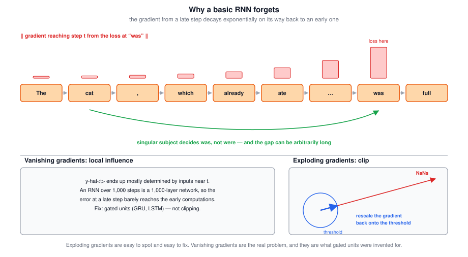

### 7.3 Exploding Gradients

The same analysis says gradients may also **grow** exponentially with depth, not just shrink. Of the two, vanishing gradients are the bigger problem for training RNNs — but exploding gradients are catastrophic when they happen, because exponentially large gradients can blow the parameters up until the network is ruined.

The saving grace is that exploding gradients are **easy to spot**: the parameters blow up, and you will often see `NaN`s, the result of a numerical overflow. And the fix is simple:

$$\boxed{\text{gradient clipping: if } \|g\| > \theta, \text{ rescale } g \leftarrow \theta \frac{g}{\|g\|}}$$

Look at the gradient vectors, and if one is bigger than some threshold, rescale it so it is not too big. It is a relatively robust solution that takes care of the problem.

| Problem | How you notice | Fix |
|---|---|---|
| Exploding gradients | parameters blow up, `NaN`s appear | gradient clipping |
| Vanishing gradients | the model just fails to learn long-range structure | gated units (sections 8 and 9) |

> **A nuance worth knowing.** Mechanically, the gradient across $k$ steps involves a product of $k$ Jacobians, each containing $W_{aa}^{\top}$ and a tanh derivative bounded by 1. If the relevant singular values are below 1 the product decays geometrically; above 1 it grows geometrically. That is why the effect is exponential in the distance, and why no learning rate tuning fixes it — the signal is gone, not merely small. Careful (orthogonal or identity) initialization of $W_{aa}$ helps at the margin, but the structural fix is a gated unit.

### 7.4 Tricky Interview Questions

**Q: Which is the bigger problem for RNNs, vanishing or exploding gradients?**  
Vanishing. Exploding gradients are more dramatic but are easy to detect and easy to fix with clipping. Vanishing gradients take much more to address, and gated units are the answer.

**Q: Would gradient clipping help with vanishing gradients?**  
No. Clipping only bounds gradients that are too large. It does nothing for a gradient that has already decayed to nothing on the way back.

**Q: What does "local influence" mean for an RNN?**  
That each output is effectively determined by nearby inputs. Information and gradients do travel along the recurrence, but they decay fast enough with distance that distant positions have little effect on one another.

**Q: You are training an RNN and see `NaN` in the loss after a few hundred steps. What do you check first?**  
Exploding gradients. Add gradient clipping, and check the learning rate. `NaN`s come from numerical overflow, which is the signature of parameters blowing up.

**Q: Why does sequence length translate into network depth?**  
Because the unrolled graph has one layer of computation per time step, and the parameters at each step compose multiplicatively. A 10,000-step sequence is a 10,000-deep composition.

---

## 8. Gated Recurrent Units

**The main idea**: give the cell an explicit memory, and a gate that decides when to overwrite it. Then the memory can be carried unchanged across arbitrarily many steps. (Chung, Gulcehre, Cho, and Bengio.)

### 8.1 The Memory Cell

Introduce a variable $c$ for **cell**, as in memory cell. Its job is to remember something — for example, whether "cat" was singular or plural — so that much later in the sentence the network can still act on it.

For a GRU, the cell and the activation are the same thing:

$$\boxed{c^{\langle t \rangle} = a^{\langle t \rangle}}$$

They are given separate names anyway, because in an LSTM they will be genuinely different.

### 8.2 The Simplified GRU

Three equations. First, a **candidate** value that might replace the memory cell:

$$\tilde{c}^{\langle t \rangle} = \tanh\!\left(W_c \left[c^{\langle t-1 \rangle}, x^{\langle t \rangle}\right] + b_c\right)$$

Second — and this is the important part — an **update gate**:

$$\Gamma_u = \sigma\!\left(W_u \left[c^{\langle t-1 \rangle}, x^{\langle t \rangle}\right] + b_u\right)$$

Third, the gate decides whether the update actually happens:

$$\boxed{c^{\langle t \rangle} = \Gamma_u \odot \tilde{c}^{\langle t \rangle} + \left(1 - \Gamma_u\right) \odot c^{\langle t-1 \rangle}}$$

The Greek capital $\Gamma$ is used for gates because a gated fence looks a bit like a row of them, and because G is for gate.

| $\Gamma_u$ | What happens |
|---|---|
| $\approx 1$ | $c^{\langle t \rangle} = \tilde{c}^{\langle t \rangle}$ — overwrite the memory with the new candidate |
| $\approx 0$ | $c^{\langle t \rangle} = c^{\langle t-1 \rangle}$ — hold on to the old value, do not update |

Because $\Gamma_u$ comes out of a sigmoid, it is always between 0 and 1, and over most of the input range the sigmoid is very close to 0 or very close to 1. So for intuition, think of the gate as being either 0 or 1 most of the time.

### 8.3 Reading It Over a Sentence

Walk through "The cat, which already ate …, was full":

- At "**cat**", you are being told about a new concept, the subject of the sentence. That is a good moment to **open the gate** ($\Gamma_u = 1$) and write a bit meaning "singular".
- Through the entire middle of the sentence, the gate stays **closed** ($\Gamma_u = 0$), so $c^{\langle t \rangle} = c^{\langle t-1 \rangle}$ and the bit is carried along untouched.
- At "**was**", the network reads the bit and picks the singular form.
- After "was full", the information is no longer needed and the gate can open again to overwrite it.

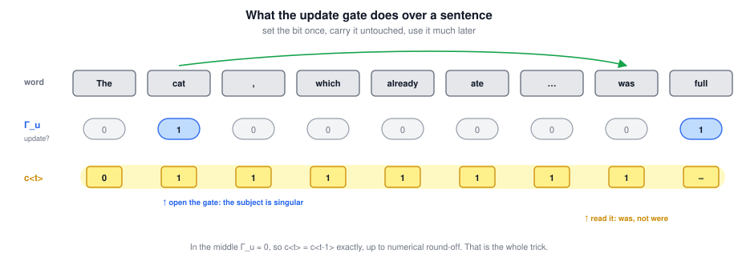

### 8.4 Why This Fixes Vanishing Gradients

The gate is easy to set to zero: as long as the pre-activation is a large negative number, the sigmoid output is essentially zero — 0.000001 or smaller. When that happens, the update equation becomes, up to numerical round-off:

$$\boxed{\Gamma_u \approx 0 \;\Longrightarrow\; c^{\langle t \rangle} = c^{\langle t-1 \rangle}}$$

The value is maintained pretty much exactly, even across many time steps. And because the path from $c^{\langle t-1 \rangle}$ to $c^{\langle t \rangle}$ is now essentially the identity rather than a matrix multiply and a squashing non-linearity, the gradient along it does not decay either. That is the whole mechanism, and it is why a GRU can learn that "cat" and "was" are related even when a lot of words separate them.

### 8.5 Everything Is a Vector

In the equations above, $c^{\langle t \rangle}$ can be a vector. If the hidden activation is 100-dimensional then $c^{\langle t \rangle}$, $\tilde{c}^{\langle t \rangle}$, and $\Gamma_u$ are all 100-dimensional, and the $\odot$ operations are **element-wise multiplication**.

So $\Gamma_u$ is really a 100-dimensional vector of bits, mostly near 0 and 1, telling the unit **which dimensions of the memory to update at this step**. You can keep some bits constant while changing others: one bit might remember singular-versus-plural, while another remembers that the topic is food — since we talked about eating, we may well talk later about the cat being full. At each step only a subset of the bits changes.

### 8.6 The Full GRU

The version above is slightly simplified. The full unit adds **one more gate** to the candidate equation:

$$\Gamma_r = \sigma\!\left(W_r \left[c^{\langle t-1 \rangle}, x^{\langle t \rangle}\right] + b_r\right)$$

$$\boxed{\tilde{c}^{\langle t \rangle} = \tanh\!\left(W_c \left[\Gamma_r \odot c^{\langle t-1 \rangle}, x^{\langle t \rangle}\right] + b_c\right)}$$

Here $r$ stands for **relevance**: this gate says how relevant $c^{\langle t-1 \rangle}$ is to computing the next candidate. Collecting the whole unit:

| Equation | |
|---|---|
| $\Gamma_u = \sigma\!\left(W_u \left[c^{\langle t-1 \rangle}, x^{\langle t \rangle}\right] + b_u\right)$ | update gate |
| $\Gamma_r = \sigma\!\left(W_r \left[c^{\langle t-1 \rangle}, x^{\langle t \rangle}\right] + b_r\right)$ | relevance gate |
| $\tilde{c}^{\langle t \rangle} = \tanh\!\left(W_c \left[\Gamma_r \odot c^{\langle t-1 \rangle}, x^{\langle t \rangle}\right] + b_c\right)$ | candidate |
| $c^{\langle t \rangle} = \Gamma_u \odot \tilde{c}^{\langle t \rangle} + \left(1 - \Gamma_u\right) \odot c^{\langle t-1 \rangle}$ | update |
| $a^{\langle t \rangle} = c^{\langle t \rangle}$ | output |

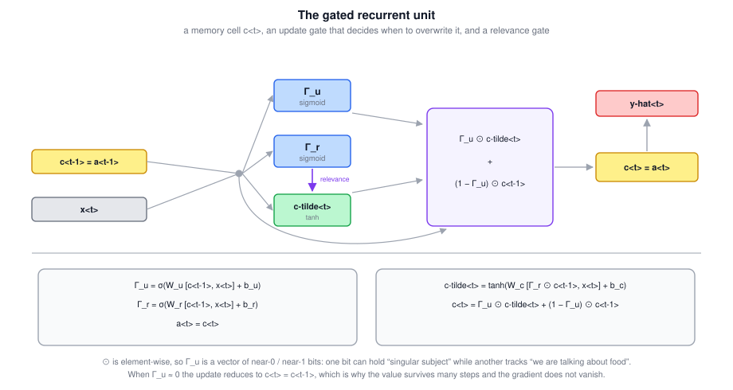

Why $\Gamma_r$ and not a simpler design? Because researchers experimented with many possible versions over many years, trying to get longer-range connections and to address vanishing gradients, and the GRU is one of the two that the community converged on as robust and useful across many problems. You are free to invent your own variant; this is the standard one.

> **A notational warning.** The academic literature often writes these quantities as $\tilde{h}$, $u$, $r$, and $h$ rather than $\tilde{c}$, $\Gamma_u$, $\Gamma_r$, and $c$. The $\Gamma$ convention used here is chosen to stay consistent between the GRU and the LSTM; the underlying equations are the same either way.

### 8.7 Tricky Interview Questions

**Q: What is the single equation that makes a GRU work?**  
$c^{\langle t \rangle} = \Gamma_u \odot \tilde{c}^{\langle t \rangle} + (1 - \Gamma_u) \odot c^{\langle t-1 \rangle}$. With $\Gamma_u \approx 0$ it reduces to $c^{\langle t \rangle} = c^{\langle t-1 \rangle}$, so both the value and the gradient can cross many time steps intact.

**Q: What is the relationship between $c^{\langle t \rangle}$ and $a^{\langle t \rangle}$ in a GRU?**  
They are equal. The two names exist so that the notation carries over to the LSTM, where they differ.

**Q: Why is $\odot$ element-wise rather than a matrix product?**  
Because the gate is a vector of per-dimension decisions. Element-wise multiplication lets the unit update some dimensions of the memory while leaving others exactly as they were, which is the entire point.

**Q: What does the relevance gate $\Gamma_r$ do?**  
It scales $c^{\langle t-1 \rangle}$ before it is used to compute the candidate, so the unit can decide how much of the old memory is relevant to proposing a new value. It sits inside the candidate equation, not the update equation.

**Q: If $\Gamma_u$ is a vector, what does it mean for it to be "0.5"?**  
That some dimensions are being partially updated. It is convenient for intuition to treat the gate as exactly 0 or 1, but the sigmoid does produce intermediate values and the unit does use them.

**Q: Does the GRU eliminate the vanishing gradient problem?**  
It greatly mitigates it by providing a near-identity path through time that the unit can choose to keep open. It is not a mathematical guarantee — the gates are learned, and if they close the wrong way the signal is still lost — but in practice it is enough to learn much longer-range dependencies.

---

## 9. Long Short-Term Memory

**The main idea**: the same trick as a GRU, but with three gates instead of two, and a memory cell that is no longer the same thing as the activation. Even more powerful and more general than the GRU (Hochreiter and Schmidhuber).

### 9.1 The Equations

Two structural changes from the GRU. First, $a^{\langle t \rangle} \neq c^{\langle t \rangle}$, and the gates are computed from $a^{\langle t-1 \rangle}$ rather than $c^{\langle t-1 \rangle}$. Second, and more importantly, instead of having a single gate control both terms of the update via $\Gamma_u$ and $1 - \Gamma_u$, there are **two separate gates**.

| Equation | |
|---|---|
| $\tilde{c}^{\langle t \rangle} = \tanh\!\left(W_c \left[a^{\langle t-1 \rangle}, x^{\langle t \rangle}\right] + b_c\right)$ | candidate |
| $\Gamma_u = \sigma\!\left(W_u \left[a^{\langle t-1 \rangle}, x^{\langle t \rangle}\right] + b_u\right)$ | **update** gate |
| $\Gamma_f = \sigma\!\left(W_f \left[a^{\langle t-1 \rangle}, x^{\langle t \rangle}\right] + b_f\right)$ | **forget** gate |
| $\Gamma_o = \sigma\!\left(W_o \left[a^{\langle t-1 \rangle}, x^{\langle t \rangle}\right] + b_o\right)$ | **output** gate |
| $c^{\langle t \rangle} = \Gamma_u \odot \tilde{c}^{\langle t \rangle} + \Gamma_f \odot c^{\langle t-1 \rangle}$ | cell update |
| $a^{\langle t \rangle} = \Gamma_o \odot c^{\langle t \rangle}$ | output |

$$\boxed{\text{GRU: } \Gamma_u \text{ and } 1 - \Gamma_u \qquad \text{LSTM: } \Gamma_u \text{ and } \Gamma_f, \text{ independent}}$$

That independence is the substantive difference. A GRU must **trade off** keeping the old value against writing the new one: the more it writes, the more it forgets. An LSTM can keep the old value **and** add to it, or forget without writing, because the two coefficients are separate numbers.

The common version of the LSTM drops the relevance gate $\Gamma_r$; you can put it back, but most implementations do not bother.

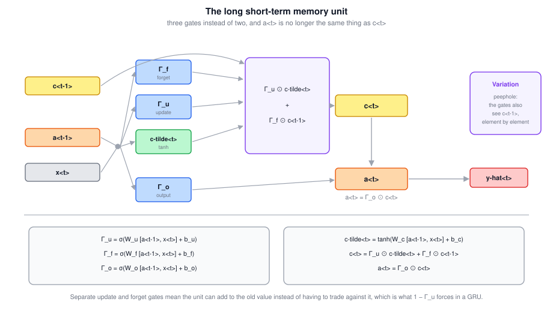

### 9.2 The Memory Highway

Chain several of these together and one feature stands out. Along the top there is a line carrying the cell state from one unit to the next, and the only things on it are two element-wise products. So as long as the forget and update gates are set appropriately — $\Gamma_f \approx 1$, $\Gamma_u \approx 0$ — it is relatively easy for the LSTM to take some value $c^{\langle 0 \rangle}$ and pass it all the way to the right, so that $c^{\langle 3 \rangle} = c^{\langle 0 \rangle}$.

$$\boxed{\Gamma_f \approx 1, \; \Gamma_u \approx 0 \;\Longrightarrow\; c^{\langle t \rangle} = c^{\langle t-1 \rangle}}$$

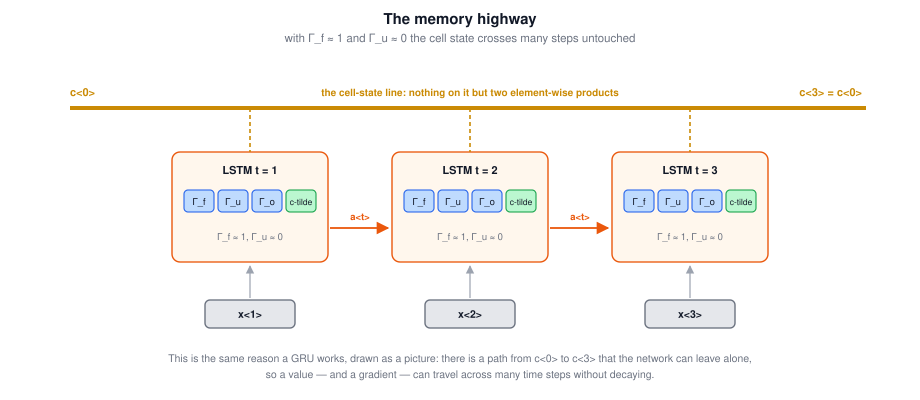

This is why LSTMs and GRUs are both good at memorizing values for a long time — real values stored in the memory cells, surviving many, many time steps.

> **Historical details** The LSTM paper is from 1997, long before the GRU, and it is one of the more difficult papers to read, going deep into the theory of vanishing gradients; most people learned the details from other sources. The original design did not actually have a forget gate — it was added by Gers, Schmidhuber, and Cummins a few years later, and it turned out to be essential. A common modern trick is to **initialize the forget gate bias to 1**, so the unit starts out remembering by default and has to learn to forget.

### 9.3 The Peephole Variation

The most common variation: let the gate values depend not only on $a^{\langle t-1 \rangle}$ and $x^{\langle t \rangle}$ but also on the previous memory cell $c^{\langle t-1 \rangle}$. This is called a **peephole connection**, and it can be added to all three gate computations.

One technical detail: the relationship is **one-to-one**, not fully connected. With a 100-dimensional memory cell, the fifth element of $c^{\langle t-1 \rangle}$ affects only the fifth element of the corresponding gates — the first element affects the first, the second the second, and so on.

### 9.4 GRU or LSTM?

There is no widespread consensus, and on different problems different algorithms win. Historically the LSTM came first, and the GRU is a relatively recent invention, derived partly as a simplification of the more complicated LSTM.

| | GRU | LSTM |
|---|---|---|
| Gates | 2 ($\Gamma_u$, $\Gamma_r$) | 3 ($\Gamma_u$, $\Gamma_f$, $\Gamma_o$) |
| State | $c^{\langle t \rangle} = a^{\langle t \rangle}$ | $c^{\langle t \rangle}$ and $a^{\langle t \rangle}$ separate |
| Advantage | simpler, so computation runs faster and you can scale to a somewhat bigger network | more powerful and more flexible |
| Reputation | gaining momentum; often works just as well, and may be easier to scale | the historically more proven choice |

$$\boxed{\text{if you must pick one to try first, the LSTM is still the default}}$$

### 9.5 Tricky Interview Questions

**Q: What is the one real difference between a GRU's update and an LSTM's?**  
The GRU uses $\Gamma_u$ and $1 - \Gamma_u$, so writing new information necessarily displaces old information. The LSTM uses independent $\Gamma_u$ and $\Gamma_f$, so it can add to the old value without discarding it.

**Q: In an LSTM, what is $a^{\langle t \rangle}$?**  
$\Gamma_o \odot c^{\langle t \rangle}$ — the memory cell filtered by the output gate. The cell holds everything the unit remembers; the activation is the part it chooses to expose.

**Q: Which quantity do the LSTM gates depend on, $a^{\langle t-1 \rangle}$ or $c^{\langle t-1 \rangle}$?**  
$a^{\langle t-1 \rangle}$ and $x^{\langle t \rangle}$, in the standard version. With peephole connections they also see $c^{\langle t-1 \rangle}$, element by element.

**Q: How many gates does an LSTM have, and what are they called?**  
Three: update, forget, and output. Some papers call the update gate the "input" gate.

**Q: Why is the LSTM good at remembering things for a long time?**  
Because the cell state travels from step to step through nothing but two element-wise products. With $\Gamma_f \approx 1$ and $\Gamma_u \approx 0$ that path is the identity, so both the stored value and the gradient cross many steps undamaged.

**Q: Which has more parameters, and by how much?**  
The LSTM. Per layer, a plain RNN has one weight block, a GRU has three (candidate, update, relevance), and an LSTM has four (candidate plus three gates) — so roughly $3\times$ and $4\times$ a plain RNN.

**Q: Does the LSTM have a relevance gate?**  
Not in the common version. You can add a variant that puts $\Gamma_r$ back in, but most implementations do not.

---

## 10. Bidirectional RNNs

**The main idea**: add a second recurrent layer that runs the other way, so a prediction anywhere in the sequence can use information from the whole sequence.

### 10.1 The Problem It Solves

Back to the sentence from section 2.4. To decide whether the third word "Teddy" is part of a person's name, the first three words are not enough — they do not distinguish Teddy Roosevelt from teddy bears. This is true whether the cells are basic RNN blocks, GRU units, or LSTM blocks; all of them are **forward only**.

### 10.2 The Construction

Take the forward recurrent components $\overrightarrow{a}^{\langle 1 \rangle}, \ldots, \overrightarrow{a}^{\langle T \rangle}$, connected left to right as usual. Now add a **backward** recurrent layer $\overleftarrow{a}^{\langle 1 \rangle}, \ldots, \overleftarrow{a}^{\langle T \rangle}$, whose cells connect to each other going **backwards in time**. Both layers read the same inputs $x^{\langle t \rangle}$.

The order of computation, given $x^{\langle 1 \rangle}$ through $x^{\langle 4 \rangle}$:

1. Forward pass, left to right: $\overrightarrow{a}^{\langle 1 \rangle} \rightarrow \overrightarrow{a}^{\langle 2 \rangle} \rightarrow \overrightarrow{a}^{\langle 3 \rangle} \rightarrow \overrightarrow{a}^{\langle 4 \rangle}$.
2. Backward pass, right to left: $\overleftarrow{a}^{\langle 4 \rangle} \rightarrow \overleftarrow{a}^{\langle 3 \rangle} \rightarrow \overleftarrow{a}^{\langle 2 \rangle} \rightarrow \overleftarrow{a}^{\langle 1 \rangle}$.
3. Only then, with all hidden activations available, make the predictions.

Both of those are **forward propagation** — the backward pass here is about the direction in time, not about backpropagation. The resulting graph is **acyclic**.

$$\boxed{\hat{y}^{\langle t \rangle} = g\!\left(W_y \left[\overrightarrow{a}^{\langle t \rangle}, \overleftarrow{a}^{\langle t \rangle}\right] + b_y\right)}$$

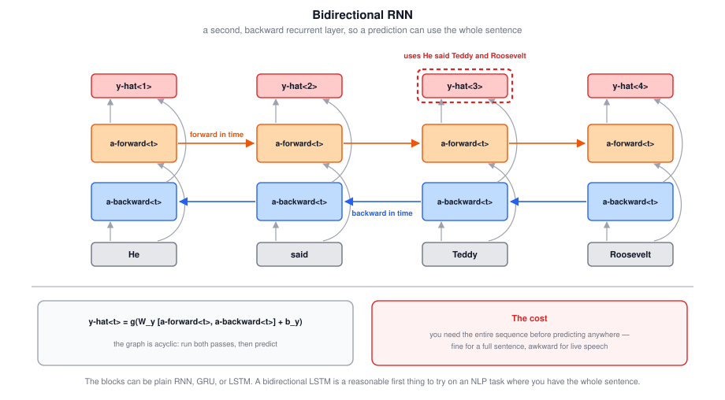

Look at the prediction at $t = 3$. Information from $x^{\langle 1 \rangle}$ flows through $\overrightarrow{a}^{\langle 1 \rangle} \rightarrow \overrightarrow{a}^{\langle 2 \rangle} \rightarrow \overrightarrow{a}^{\langle 3 \rangle}$, and information from $x^{\langle 4 \rangle}$ flows through $\overleftarrow{a}^{\langle 4 \rangle} \rightarrow \overleftarrow{a}^{\langle 3 \rangle}$. So $\hat{y}^{\langle 3 \rangle}$ takes into account the **past**, the **present**, and the **future**.

### 10.3 What It Costs

The blocks can be basic RNN, GRU, or LSTM. For a lot of NLP problems, a **bidirectional RNN with LSTM blocks** is commonly used, and if you have a complete sentence and are trying to label things in it, that is a reasonable first thing to try.

The disadvantage is structural:

$$\boxed{\text{you need the entire sequence before you can predict anywhere in it}}$$

For a speech recognition system, a bidirectional RNN lets you use the whole utterance — but in a straightforward implementation you have to wait for the person to **stop talking** before you can process anything. Real-time speech recognition therefore uses more complex models than the standard bidirectional RNN. For the many NLP applications where the whole sentence arrives at once, the standard algorithm is very effective.

> **A nuance worth knowing.** The classic sequence-labelling architecture is the **BiLSTM-CRF**: a bidirectional LSTM producing per-token scores, with a conditional random field on top to model dependencies between adjacent labels. The CRF is what enforces that label sequences are coherent — for instance, that a name's interior tag cannot start a name. On the streaming side, the usual compromise is to run bidirectionally over fixed **chunks** with a little lookahead, trading a bounded latency for most of the benefit.

### 10.4 Tricky Interview Questions

**Q: Does a bidirectional RNN contain a cycle?**  
No. The forward and backward layers are separate sets of units, each internally connected in one direction. The graph is acyclic; you just run two passes before predicting.

**Q: Is the "backward" pass in a BRNN the same thing as backpropagation?**  
No, and the naming is unfortunate. Both passes are forward propagation. The backward layer computes activations right to left; backpropagation is a separate thing that happens afterward, through both layers.

**Q: What are the dimensions of the input to the output layer?**  
The concatenation of the forward and backward activations at that step, so twice the width of one direction's hidden state.

**Q: Why can you not use a bidirectional RNN for live speech transcription?**  
Because $\overleftarrow{a}^{\langle t \rangle}$ depends on every input after $t$, so no prediction can be made until the utterance is complete. You would have to wait for the speaker to finish.

**Q: Can you combine bidirectionality with gated units?**  
Yes, and you usually should. A bidirectional LSTM is the standard choice for NLP sequence labelling. The two ideas are orthogonal: gating fixes memory over distance, bidirectionality fixes which direction the context comes from.

---

## 11. Deep RNNs

**The main idea**: for learning very complex functions, stack multiple layers of RNNs on top of each other.

### 11.1 The Notation

A standard network takes an input $x$, stacks it into hidden layers with activations $a^{[1]}, a^{[2]}, a^{[3]}$, and predicts $\hat{y}$. A deep RNN is that same network unrolled in time, which means the activations need two indices:

$$\boxed{a^{[l]\langle t \rangle} = \text{the activation of layer } l \text{ at time } t}$$

So $a^{[1]\langle 1 \rangle}$ is layer 1 at time 1, $a^{[1]\langle 2 \rangle}$ is layer 1 at time 2, and stacking these gives a network with three hidden recurrent layers.

### 11.2 Computing One Activation

Each unit now has **two** inputs: one from the left (the same layer, previous time step) and one from below (the previous layer, same time step).

$$\boxed{a^{[2]\langle 3 \rangle} = g\!\left(W_a^{[2]} \left[a^{[2]\langle 2 \rangle}, a^{[1]\langle 3 \rangle}\right] + b_a^{[2]}\right)}$$

The parameters $W_a^{[2]}, b_a^{[2]}$ are shared across **every time step of that layer**, while layer 1 has its own $W_a^{[1]}, b_a^{[1]}$.

| Sharing | Direction |
|---|---|
| Shared | across time, within a layer |
| Not shared | across layers |

![Three recurrent layers over four time steps with a[l]<t> labels and the computation of a[2]<3> highlighted, beside a variant where three recurrent layers are topped by a per-step fully connected head with no horizontal connections.](figures/seq-deep-rnn.svg)

### 11.3 How Deep Is Deep

For feedforward networks, 100 layers is not unusual. For RNNs, **three layers is already quite a lot**. Because of the temporal dimension, these networks get quite big even with a small handful of layers, and you do not usually see them stacked 100 deep. Deep RNNs are also expensive to train, since there is already a large temporal extent.

A pattern you do see: stack a few recurrent layers, then take the output of the top one and feed it into a **deep stack that is not connected horizontally** — an ordinary feedforward head, applied separately at each time step, that produces $\hat{y}^{\langle t \rangle}$. You get depth in the representation without paying for it in the recurrence.

And as everywhere in these notes, the blocks do not have to be simple RNN cells: they can be GRU blocks or LSTM blocks, and you can build deep versions of the bidirectional RNN too.

> **A nuance worth knowing.** Two to four stacked layers is the usual sweet spot, and past that you need the same trick that made very deep ConvNets trainable: **residual connections between layers**. Google's neural machine translation system stacked 8 LSTM layers in the encoder and 8 in the decoder, with residual connections from the third layer up, precisely because a plain stack that deep would not train.

### 11.4 Tricky Interview Questions

**Q: In $a^{[2]\langle 3 \rangle}$, what does each index mean?**  
Square brackets are the **layer**, angle brackets are the **time step**. So this is the second recurrent layer at the third position.

**Q: How many inputs does a unit in a deep RNN take?**  
Two: the activation from the same layer at the previous time step, and the activation from the layer below at the same time step. They are concatenated and multiplied by that layer's weight matrix.

**Q: Are the parameters shared across layers?**  
No. Each layer has its own $W_a^{[l]}, b_a^{[l]}$. Sharing is across time within a layer.

**Q: Why are RNNs rarely stacked more than a few layers deep, when ConvNets go to 100?**  
Because the unrolled network is already very deep in the time direction, so a handful of recurrent layers multiplies out to a very large computation graph. It is a cost and trainability problem, not a conceptual limit.

**Q: How do you get a deeper output computation without more recurrent layers?**  
Put a non-recurrent, fully connected stack on top of the last recurrent layer, applied independently at each time step. It adds representational depth without adding horizontal connections.

---

## 12. Quick Reference

| Unit | Gates | State | What it buys you |
|---|---|---|---|
| Basic RNN | none | $a^{\langle t \rangle}$ | Shared parameters, any sequence length; local influence only |
| GRU | $\Gamma_u$, $\Gamma_r$ | $c^{\langle t \rangle} = a^{\langle t \rangle}$ | A memory the unit can hold unchanged; simpler and faster than an LSTM |
| LSTM | $\Gamma_u$, $\Gamma_f$, $\Gamma_o$ | $c^{\langle t \rangle}$, $a^{\langle t \rangle}$ separate | Independent write and forget, so it can add to memory without displacing it |
| Bidirectional | — | two directions | Predictions use the future as well as the past |
| Deep / stacked | — | $a^{[l]\langle t \rangle}$ | More representational capacity per step |

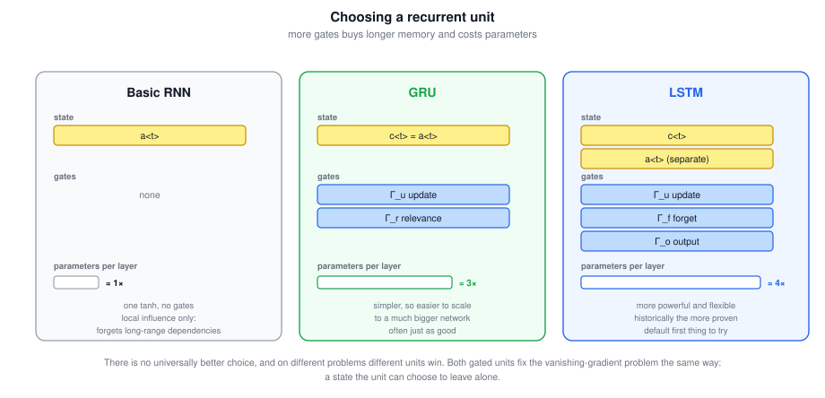

Key formulas:

$$\boxed{\text{RNN: } a^{\langle t \rangle} = g\!\left(W_a \left[a^{\langle t-1 \rangle}, x^{\langle t \rangle}\right] + b_a\right), \quad \hat{y}^{\langle t \rangle} = g\!\left(W_y a^{\langle t \rangle} + b_y\right)}$$

$$\boxed{\text{GRU: } c^{\langle t \rangle} = \Gamma_u \odot \tilde{c}^{\langle t \rangle} + \left(1 - \Gamma_u\right) \odot c^{\langle t-1 \rangle}}$$

$$\boxed{\text{LSTM: } c^{\langle t \rangle} = \Gamma_u \odot \tilde{c}^{\langle t \rangle} + \Gamma_f \odot c^{\langle t-1 \rangle}, \quad a^{\langle t \rangle} = \Gamma_o \odot c^{\langle t \rangle}}$$

$$\boxed{\text{BRNN: } \hat{y}^{\langle t \rangle} = g\!\left(W_y \left[\overrightarrow{a}^{\langle t \rangle}, \overleftarrow{a}^{\langle t \rangle}\right] + b_y\right)}$$

$$\boxed{\text{Deep: } a^{[l]\langle t \rangle} = g\!\left(W_a^{[l]} \left[a^{[l]\langle t-1 \rangle}, a^{[l-1]\langle t \rangle}\right] + b_a^{[l]}\right)}$$

$$\boxed{\text{Loss: } L = \sum_{t=1}^{T_y} L^{\langle t \rangle}\!\left(\hat{y}^{\langle t \rangle}, y^{\langle t \rangle}\right)}$$

| Goal | Tool |
|---|---|
| Handle variable-length inputs | An RNN: one shared parameter set scanned over the sequence |
| Share what is learned across positions | The recurrence itself — $W_a$ is the same at every $t$ |
| Represent a word | Vocabulary index, then a one-hot vector (or an embedding) |
| Handle an out-of-vocabulary word | The `UNK` token, or a character-level model |
| One label per input token | Many-to-many with $T_x = T_y$ |
| One label for the whole sequence | Many-to-one: output only at the last step |
| Generate a sequence from nothing | One-to-many, feeding each sampled output back in as the next input |
| Map a sequence to a different-length sequence | Encoder-decoder |
| Score how likely a sentence is | A language model, multiplying the per-step conditionals |
| Produce novel text from a trained model | Sample from each softmax and feed the sample forward |
| Remember something across many steps | A gated unit: GRU or LSTM |
| Stop gradients from blowing up | Gradient clipping |
| Use context from later in the sequence | A bidirectional RNN |
| Add capacity at each step | Stack two or three recurrent layers, or add a feedforward head |

| Symptom | Likely cause | Fix |
|---|---|---|
| `NaN`s in the loss, parameters blowing up | Exploding gradients | Gradient clipping |
| Model never learns long-range agreement | Vanishing gradients in a basic RNN | Switch to a GRU or an LSTM |
| Every prediction depends only on nearby inputs | Local influence of the plain recurrence | Gated unit, and check whether you need bidirectionality |
| A mid-sequence label needs later context | Unidirectional architecture | Bidirectional RNN |
| Generation never terminates | No stopping rule | Put `<EOS>` in the vocabulary, or cap the number of steps |
| Generated text keeps repeating itself | Taking the argmax instead of sampling | Sample from the softmax; consider temperature or top-$k$ |
| Sequence lengths do not match between $X$ and $Y$ | Wrong architecture shape | Encoder-decoder rather than per-position outputs |
| Training is fine, generation is much worse | Exposure bias from teacher forcing | Expect some gap; beam search or scheduled sampling at generation time |
| Dev loss is fine but rare words are always wrong | Everything rare collapsed into `UNK` | Larger vocabulary, subword tokenization, or a character-level model |
| Deep stack of recurrent layers will not train | Too many layers for a plain stack | Two or three layers, or add residual connections between them |

Core principle: an RNN is one small cell applied over and over, so its strength — sharing parameters across every position — is also the source of its weakness, since the same matrix is composed with itself once per step. Every improvement in these notes is a response to that: gates give the state a path it can leave alone, bidirectionality gives a prediction both halves of the sequence, and depth adds capacity without lengthening the recurrence.
