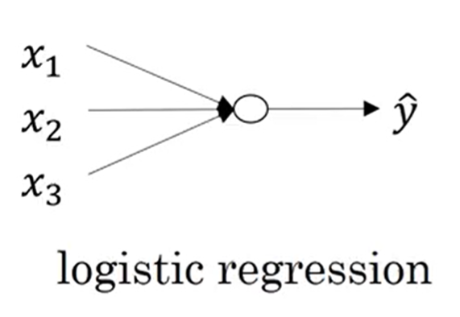

# Neural Networks: Logistic Regression as the Simplest Network

This note uses **vectorized** notation: one training step updates all parameters using full matrices for $m$ examples at once.

**Notation (used throughout).**

- $n_x$: number of features per example.
- $m$: number of examples (batch size).
- Design matrix $\mathbf{X} \in \mathbb{R}^{n_x \times m}$: each **column** is one example $\mathbf{x}^{(i)} \in \mathbb{R}^{n_x}$.
- Labels $\mathbf{y} \in \mathbb{R}^{1 \times m}$ (row vector), with $y^{(i)} \in \{0,1\}$ for binary classification.
- Weights $\mathbf{w} \in \mathbb{R}^{n_x}$ (column vector) and bias $b \in \mathbb{R}$.
- $\sigma(\cdot)$ is the sigmoid, applied **element-wise** to matrices.
- $\odot$ is the Hadamard (element-wise) product.
- $\mathbf{1}_m \in \mathbb{R}^{m}$ is a column vector of ones (subscript omitted when size is clear).

---

## 1. Logistic Regression as the Simplest Neural Network

### 1.1 Binary classification

**Goal.** Predict one of two classes, encoded as $y^{(i)} \in \{0, 1\}$.

**Probabilistic model.** Estimate the probability that output $y^{(i)}$ is of class $1$ given the input example $\mathbf{x}^{(i)}$:

$$
\hat{y}^{(i)} = P\bigl(y^{(i)} = 1 \mid \mathbf{x}^{(i)}\bigr), \qquad \hat{y}^{(i)} \in (0,1).
$$

**Decision rule.** Predict class $1$ if $\hat{y}^{(i)} \ge \tfrac{1}{2}$, else class $0$.

---

### 1.2 Logistic regression (vectorized)

For one example,

$$
z^{(i)} = \mathbf{w}^\top \mathbf{x}^{(i)} + b, \qquad
\hat{y}^{(i)} = a^{(i)} = \sigma\bigl(z^{(i)}\bigr) = \frac{1}{1 + e^{-z^{(i)}}}.
$$

**All $m$ examples at once.** Stack columns in $\mathbf{X}$ and define

$$
\mathbf{Z} = \mathbf{w}^\top \mathbf{X} + b \,\mathbf{1}_m^\top \ \in \mathbb{R}^{1 \times m},
$$

$$
\mathbf{A} = \sigma(\mathbf{Z}) \quad \text{(element-wise)},
$$

where

- $\mathbf{Y}$ is the output (target) row vector of size $1 \times m$:

$$
\mathbf{Y} = \bigl[\, y^{(1)},\ y^{(2)},\ \dots,\ y^{(m)} \,\bigr] \in \mathbb{R}^{1 \times m}.
$$

- $\mathbf{w}^\top$ is the **transposed** weight vector of size $1 \times n_x$:

$$
\mathbf{w}^\top = \bigl[\, w_1,\ w_2,\ \dots,\ w_{n_x} \,\bigr] \in \mathbb{R}^{1 \times n_x}.
$$

- $\mathbf{X}$ is the input (features) matrix of size $n_x \times m$ (each column is one example):

$$
\mathbf{X} =
\begin{bmatrix}
\mid & \mid & & \mid \\
\mathbf{x}^{(1)} & \mathbf{x}^{(2)} & \cdots & \mathbf{x}^{(m)} \\
\mid & \mid & & \mid
\end{bmatrix}
\in \mathbb{R}^{n_x \times m}.
$$

- $b$ is a scalar bias **broadcast** across all columns of $\mathbf{w}^\top \mathbf{X}$ (equivalently, add the row vector $b\,\mathbf{1}_m^\top \in \mathbb{R}^{1 \times m}$).

- $\mathbf{Z} \in \mathbb{R}^{1 \times m}$ is the row vector of pre-activations (logits), one entry per example.

- $\mathbf{A} \in \mathbb{R}^{1 \times m}$ is the row vector of predicted probabilities, $\mathbf{A} = \sigma(\mathbf{Z})$.

- $\sigma$ is the sigmoid activation function:

$$
\sigma(z) = \frac{1}{1 + e^{-z}}, \qquad \sigma(z) \in (0, 1),
$$

so that 
- If $z$ is a large positive number, $\sigma(z) \approx 1$.
- If $z$ is a large negative number, $\sigma(z) \approx 0$.
- If $z = 0$, $\sigma(z) = 0.5$.

---

### 1.3 Logistic regression cost function (vectorized)

**Loss function (binary cross-entropy, negative log-likelihood for Bernoulli labels).**

The loss function measures the discrepancy between the prediction $\hat{y}^{(i)}$ and the desired output $y^{(i)}$ **per example**. In other words, the loss function computes the error for a single training example $\mathbf{x}^{(i)}$.

$$
\mathcal{L}^{(i)} = - \Bigl( y^{(i)} \log a^{(i)} + \bigl(1 - y^{(i)}\bigr) \log\bigl(1 - a^{(i)}\bigr) \Bigr).
$$

- If $y^{(i)} = 1$: $\mathcal{L}^{(i)} = -\log a^{(i)}$, which is small when $a^{(i)}$ is close to $1$.
- If $y^{(i)} = 0$: $\mathcal{L}^{(i)} = -\log\bigl(1 - a^{(i)}\bigr)$, which is small when $a^{(i)}$ is close to $0$.

**Cost function.**

The cost function is the **average** of the loss over the entire training set (the whole batch). The goal of NN training is to find the parameters $\mathbf{w}$ and $b$ that minimize the overall cost function.

$$
J(\mathbf{w}, b) = \frac{1}{m} \sum_{i=1}^{m} \mathcal{L}^{(i)}
= -\frac{1}{m} \sum_{i=1}^{m} \Bigl( y^{(i)} \log a^{(i)} + \bigl(1 - y^{(i)}\bigr) \log\bigl(1 - a^{(i)}\bigr) \Bigr).
$$

**Vector form** (same value as the sum; $\mathbf{y}, \mathbf{A} \in \mathbb{R}^{1 \times m}$ as row vectors, $\mathbf{1}$ a row of ones of matching size, logs element-wise):

$$
\boldsymbol{\ell} = \mathbf{y} \odot \log \mathbf{A} + (\mathbf{1} - \mathbf{y}) \odot \log(\mathbf{1} - \mathbf{A}) \in \mathbb{R}^{1 \times m},
$$

$$
J = -\frac{1}{m}\,\mathbf{1}_{1 \times m}\,\boldsymbol{\ell}^\top
= -\frac{1}{m}\sum_{j=1}^{m} \ell_j.
$$

Equivalently, with $\mathbf{y}_c = \mathbf{y}^\top$, $\mathbf{A}_c = \mathbf{A}^\top$ in $\mathbb{R}^{m}$,

$$
J = -\frac{1}{m}\,\mathbf{1}_m^\top\Bigl( \mathbf{y}_c \odot \log \mathbf{A}_c + (\mathbf{1}_m - \mathbf{y}_c) \odot \log(\mathbf{1}_m - \mathbf{A}_c) \Bigr).
$$

---

### 1.4 Binary cross-entropy as a cost function

**Cross-entropy** is a way to measure how different two probability distributions are. In machine learning, it usually measures how well a model's predicted probabilities match the true labels, so it is commonly used as a loss function for classification.

For discrete distributions $p$ and $q$, cross-entropy is

$$
H(p, q) = - \sum_{x} p(x) \log q(x),
$$

where $p$ is the **true** distribution and $q$ is the **predicted** distribution.

Logistic regression predicts a probability $a^{(i)} = P\bigl(y^{(i)} = 1 \mid \mathbf{x}^{(i)}\bigr)$. Since the true label $y^{(i)}$ is either $0$ or $1$, it makes sense to measure how likely the model thinks the true answer is. The cost function does exactly that by taking the **negative log-likelihood**.

For one example:

- if $y = 1$, the loss becomes $-\log(a)$;
- if $y = 0$, the loss becomes $-\log(1 - a)$.

The combined form is

$$
-\bigl( y \log a + (1 - y) \log(1 - a) \bigr).
$$

This is just a compact way to write both cases at once. If the correct class gets low probability, the loss becomes large.

**Probabilistic view.** Assume $y^{(i)} \sim \mathrm{Bernoulli}(a^{(i)})$ with $a^{(i)} = P(y^{(i)}=1\mid \mathbf{x}^{(i)})$. The **negative log-likelihood** for independent examples is

$$
-\frac{1}{m}\sum_{i=1}^{m} \log P\bigl(y^{(i)} \mid \mathbf{x}^{(i)}\bigr)
= -\frac{1}{m}\sum_{i=1}^{m} \Bigl( y^{(i)}\log a^{(i)} + (1-y^{(i)})\log(1-a^{(i)}) \Bigr),
$$

which is exactly $J$.

**Properties.**

- **Convex** in $(\mathbf{w}, b)$ for logistic regression (sigmoid + cross-entropy), so gradient descent with a suitable learning rate $\alpha$ finds the global minimum under typical conditions.
  For logistic regression, sigmoid plus cross-entropy gives a convex objective in $(\mathbf{w}, b)$. That means optimization is much easier than with many other neural-network losses, because gradient descent is not fighting lots of bad local minima in this case.

- **Penalizes confident mistakes heavily**: if $y^{(i)} = 1$ but $a^{(i)} \approx 0$, then $-\log a^{(i)}$ is large. For example:
  - if the true label is $1$ and the model predicts $a = 0.99$, the loss is small;
  - if the true label is $1$ and the model predicts $a = 0.01$, the loss is huge.
  
  That is good behavior, because being confidently wrong should be punished more than being uncertain.

- **Matches outputs to probabilities** when trained with this loss, so $a^{(i)}$ is calibrated as an estimate of class probability under the model assumptions.
  Because the output is interpreted as a probability, the model is trained to make the predicted probability match the observed label. So after training, $a$ can be read as the model's estimate of class probability, not just a raw score.

---

### 1.5 Gradient descent

Gradient descent is used for NN training during backpropagation.

**Idea.** Update NN parameters $\mathbf{w}$ and $b$ in the direction **opposite** to the gradient of $J$:

$$
\mathbf{w} := \mathbf{w} - \alpha \,\frac{\partial J}{\partial \mathbf{w}}, \qquad
b := b - \alpha \,\frac{\partial J}{\partial b},
$$

where $\alpha > 0$ is the **learning rate**.

---

### 1.6 Computation graph

A **computation graph** is a directed acyclic graph of operations: inputs $\to$ intermediate nodes (sums, products, nonlinearities) $\to$ output loss. A computation graph is a step-by-step map of the forward calculation, and backpropagation uses that map **in reverse** to apply the chain rule and compute gradients efficiently. Each step is a small operation like add, multiply, or apply a function like sigmoid.

For logistic regression (one example), a minimal graph is:

1. inputs $\mathbf{x}$, weights $\mathbf{w}$, bias $b$;
2. compute $z = \mathbf{w}^\top \mathbf{x} + b$;
3. compute $a = \sigma(z)$;
4. compute the loss $\mathcal{L}(y, a)$.

$$
\mathbf{x},\, \mathbf{w},\, b \ \Rightarrow\ z = \mathbf{w}^\top \mathbf{x} + b \ \Rightarrow\ a = \sigma(z) \ \Rightarrow\ \mathcal{L}(y, a).
$$

With batch training, the same graph is repeated for many examples, or written in vector form so you process the whole batch at once. Batch training repeats the same structure for each column of $\mathbf{X}$, or uses vectorized nodes for $\mathbf{Z}$ and $\mathbf{A}$. The structure is the same; only the shapes become matrices and vectors.

---

### 1.7 Derivatives with a computation graph

**Backpropagation** means walking **backward** through the graph and using the chain rule. At each node, multiply local derivatives along paths (chain rule) and **sum** paths that merge. If one variable affects the loss through more than one route, all those gradient contributions are added together.

For a node $u = f(v)$, the contribution to $\dfrac{\partial \mathcal{L}}{\partial v}$ is

$$
\frac{\partial \mathcal{L}}{\partial v} \mathrel{+}= \frac{\partial \mathcal{L}}{\partial u}\,\frac{\partial f}{\partial v}.
$$

---

### 1.8 Logistic regression: gradient descent (single example)

**Forward:** $z = \mathbf{w}^\top \mathbf{x} + b$, $a = \sigma(z)$,

$$
\mathcal{L} = - \bigl( y \log a + (1-y)\log(1-a) \bigr).
$$

**Useful intermediate:**

$$
\frac{\partial \mathcal{L}}{\partial a} = -\frac{y}{a} + \frac{1-y}{1-a}, \qquad
\frac{\partial a}{\partial z} = a(1-a).
$$

**Chain rule for $z$:**

$$
\frac{\partial \mathcal{L}}{\partial z} = \frac{\partial \mathcal{L}}{\partial a}\frac{\partial a}{\partial z}
= \Bigl(-\frac{y}{a} + \frac{1-y}{1-a}\Bigr) a(1-a) = a - y.
$$

**Gradients for parameters:**

$$
\frac{\partial \mathcal{L}}{\partial \mathbf{w}} = \frac{\partial \mathcal{L}}{\partial z}\,\mathbf{x} = (a - y)\,\mathbf{x}, \qquad
\frac{\partial \mathcal{L}}{\partial b} = a - y.
$$

---

### 1.9 Gradient descent on $m$ examples (fully vectorized)

The main idea is that the gradient is computed over **all examples at once**: compute all prediction errors together, turn them into gradients with matrix multiplication, and then update $\mathbf{w}$ and $b$ in one step.

Define the row vector of errors (same shape as $\mathbf{Z}$, i.e. $1 \times m$):

$$
\mathbf{dZ} = \mathbf{A} - \mathbf{y} \ \in \mathbb{R}^{1 \times m},
$$

where

- $\mathbf{Z} \in \mathbb{R}^{1 \times m}$ is the row vector of logits $z^{(i)} = \mathbf{w}^\top \mathbf{x}^{(i)} + b$,
- $\mathbf{A} = \sigma(\mathbf{Z}) \in \mathbb{R}^{1 \times m}$ is the row vector of predicted probabilities,
- $\mathbf{y} \in \mathbb{R}^{1 \times m}$ is the row vector of true labels.

**Gradients of the average cost** $J = \dfrac{1}{m}\sum_i \mathcal{L}^{(i)}$:

$$
\frac{\partial J}{\partial \mathbf{w}} = \frac{1}{m}\,\mathbf{X}\,\mathbf{dZ}^\top
\ \in \mathbb{R}^{n_x},
\qquad
\frac{\partial J}{\partial b} = \frac{1}{m}\,\mathbf{dZ}\,\mathbf{1}_m
= \frac{1}{m}\sum_{i=1}^{m} \bigl(a^{(i)} - y^{(i)}\bigr)
\ \in \mathbb{R}.
$$

**Gradient descent step:**

$$
\mathbf{w} \leftarrow \mathbf{w} - \alpha \,\frac{\partial J}{\partial \mathbf{w}}, \qquad
b \leftarrow b - \alpha \,\frac{\partial J}{\partial b}.
$$

---

## Summary

Logistic regression is the **simplest** neural network: one layer, one activation, trained by gradient descent on a convex cost — yet it already contains forward pass, loss, backward pass, and vectorization used in deep networks.

| Item | Vectorized form |
|------|------------------|
| Linear logits | $\mathbf{Z} = \mathbf{w}^\top \mathbf{X} + b\,\mathbf{1}_m^\top$ |
| Activations | $\mathbf{A} = \sigma(\mathbf{Z})$ |
| Cost | $J = -\dfrac{1}{m}\sum_{i=1}^{m}\bigl( y^{(i)}\log a^{(i)} + (1-y^{(i)})\log(1-a^{(i)})\bigr)$ |
| Error signal | $\dfrac{\partial \mathcal{L}^{(i)}}{\partial z^{(i)}} = a^{(i)} - y^{(i)}$; batch: $\mathbf{dZ} = \mathbf{A} - \mathbf{y}$ |
| Gradients of $J$ | $\dfrac{\partial J}{\partial \mathbf{w}} = \dfrac{1}{m}\mathbf{X}\,\mathbf{dZ}^\top$, $\dfrac{\partial J}{\partial b} = \dfrac{1}{m}\mathbf{dZ}\,\mathbf{1}_m$ |

