# Structuring Machine Learning Projects

A compact reference for choosing what to do next in a machine learning project:
- Orthogonalization;
- Choosing evaluation metrics;
- Dividing data into train/dev/test sets;
- Comparing model performance to human-level performance;
- Diagnosing avoidable bias and variance;
- Carrying out error analysis;
- Handling incorrectly labeled data;
- Working with mismatched training and dev/test distributions;
- Using transfer learning and multitask learning;
- Deciding when to use end-to-end deep learning.

Main idea: set the right target, diagnose the bottleneck, then use the tool that addresses that bottleneck most directly.

---

## 1. Introduction to ML Strategy

Machine learning strategy is about making good prioritization decisions. When a model is not good enough, there are many possible things to try: collect more data, tune hyperparameters, change the model, regularize, change the metric, clean labels, or inspect errors. Strategy helps decide which direction is most likely to matter.

### 1.1 Why ML Strategy

Applied ML is an iterative process:

1. Build or modify a system.
2. Train it.
3. Evaluate it.
4. Diagnose the error.
5. Choose the next experiment.

Without a clear diagnosis, teams can spend months on low-impact work. A good strategy turns vague ideas into targeted actions.

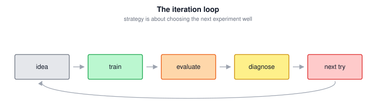

### 1.2 Orthogonalization

Orthogonalization means separating the controls of your ML system so each control fixes one kind of problem.

For supervised learning, check the system in this order:

| Stage | Desired result | If it fails, try |
|---|---|---|
| Training set | Low training error | Bigger model, train longer, better optimizer, better architecture |
| Dev set | Good generalization | Regularization, more data, data augmentation |
| Test set | Dev performance transfers | Larger/better dev set, avoid dev overfitting |
| Real world | Metric matches product value | Change metric or dev/test distribution |

Early stopping is less orthogonal because it affects both training error and dev error: stopping earlier can reduce overfitting, but it also prevents the model from fitting the training set as well as possible.

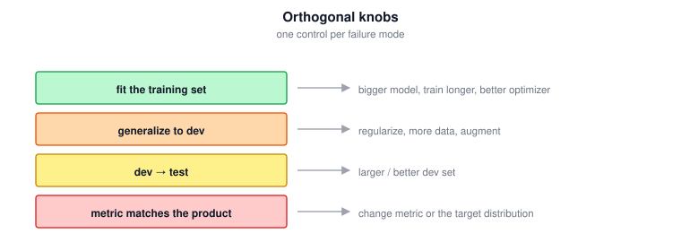

### 1.3 Tricky Interview Questions

**Q: What does orthogonalization mean in ML strategy?**  
It means using different tools for different failure modes, rather than one knob that changes many things at once.

**Q: Why is early stopping less orthogonal?**  
Because it affects both training-set fit and dev-set generalization: it can reduce overfitting, but it also stops the model from fitting the training set further.

**Q: If training one model takes two weeks, why is that a strategic problem?**  
It slows down iteration. Sometimes using a smaller dataset or faster hardware can improve productivity because the team can run more experiments.

---

## 2. Setting Up your Goal

Before improving a model, define what "better" means. The dev set and metric are the target your team will optimize toward.

### 2.1 Single Number Evaluation Metric

A single-number metric lets you quickly compare models.

If you track several metrics separately, model selection becomes ambiguous. Combine them when possible.

For precision $P$ and recall $R$, a common combined metric is the F1 score:

$$\boxed{F_1 = \frac{2}{\frac{1}{P} + \frac{1}{R}} = \frac{2PR}{P+R}}$$

Use a single-number metric to rank models, but still inspect secondary metrics for diagnosis.

### 2.2 Satisficing and Optimizing Metric

When several metrics matter but should not be merged into one artificial score:

- choose one **optimizing metric**: the metric to maximize or minimize;
- choose one or more **satisficing metrics**: constraints that only need to pass a threshold.

Example rule:

$$\boxed{\text{maximize accuracy subject to runtime} \leq 100\text{ ms}}$$

General rule: with $N$ metrics, use 1 optimizing metric and $N-1$ satisficing metrics.

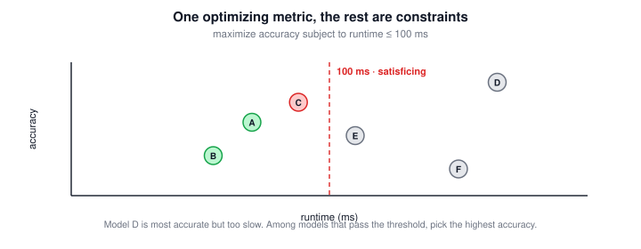

### 2.3 Train/Dev/Test Distributions

The dev and test sets should:

- come from the same distribution;
- reflect the data you expect in the future;
- represent what you actually care about doing well on.

The dev set plus metric is the target. If the dev set is wrong, the team will optimize for the wrong thing.

| Set | Purpose |
|---|---|
| Train | Fit model parameters |
| Dev | Compare ideas and tune choices |
| Test | Estimate final unbiased performance |

### 2.4 Size of the Dev and Test Sets

Old fixed splits like 60/20/20 or 70/30 are not always appropriate.

In large datasets, dev and test sets can be much smaller percentages because even 1% may contain many examples.

Example: with 1,000,000 examples, a 98/1/1 split gives 980,000 training examples, 10,000 dev examples, and 10,000 test examples, which may be enough for reliable model selection and final evaluation.

| Set | Size principle |
|---|---|
| Dev | Big enough to reliably choose between models |
| Test | Big enough to estimate final performance with confidence |
| Train | Use as much remaining useful data as possible |

If you tune on a set, call it a **dev set**, not a test set.

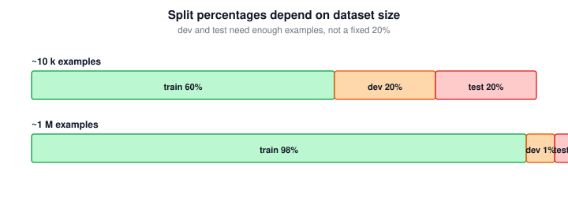

### 2.5 When to Change Dev/Test Sets and Metrics?

Change the metric or dev/test set when doing well on them no longer corresponds to doing well on the real task:
- Change the **metric** if it ranks models incorrectly according to real preferences.

Example: a cat classifier with lower overall error may still be worse if it lets offensive images through. In that case, use a metric that penalizes those mistakes more heavily.

- Change the **dev/test set** if its distribution does not match the real-world data you need to handle.

Example: if the dev/test set contains clean web images but users upload blurry mobile photos, replace or rebalance the dev/test set toward mobile-uploaded images.

For weighted errors:

$$\boxed{\text{weighted error} = \frac{1}{\sum_i w^{(i)}}\sum_i w^{(i)}\mathbf{1}\{\hat{y}^{(i)} \neq y^{(i)}\}}$$

Define the target first, then optimize toward it. If the target later proves wrong, move it.

Example: start with average dev-set error as the target so experiments are comparable. If later you discover that errors on mobile uploads matter much more than errors on web images, change the dev set or metric and continue optimizing toward the new target.

### 2.6 Tricky Interview Questions

**Q: Why is a single-number metric useful?**  
It lets you rank models quickly, which speeds up iteration.

**Q: What is the difference between optimizing and satisficing metrics?**  
The optimizing metric is improved as much as possible; satisficing metrics only need to pass a threshold.

**Q: Why should dev and test sets come from the same distribution?**  
The dev set is the target you tune toward, and the test set checks whether hitting that target generalizes.

**Q: A product needs high accuracy, low runtime, and low memory use. Should you use one primary evaluation rule?**  
Yes. Pick one optimizing metric and convert the others into satisficing constraints, such as runtime $\leq 100$ ms and memory $\leq$ a fixed limit.

**Q: With 10,000,000 examples, is a 60/20/20 split usually necessary?**  
No. A smaller dev/test percentage can be enough; for example, 95/2.5/2.5 still gives 250,000 examples each for dev and test.

**Q: If users prefer a model with lower false negatives even though its overall accuracy is lower, what should you do?**  
Change the metric so it reflects the real preference, for example by weighting false negatives more heavily or tracking them as a key constraint.

---

## 3. Comparing to Human-level Performance

Human-level performance helps estimate how much better the system can realistically become.

### 3.1 Why Human-level Performance?

Human-level performance is useful because it can act as a proxy for **Bayes error**, the best possible error achievable by any function.

**Bayes error** is the irreducible minimum error for a task: the error that remains even for an ideal classifier that knows the true data distribution. It comes from ambiguity, missing information, noisy inputs, overlapping classes, or inconsistent labels. It is usually unknown, so for tasks humans are good at, the best human or team performance is often used as a practical estimate.

It helps with:

- estimating avoidable bias;
- deciding whether to focus on bias or variance;
- using human insight for error analysis;
- collecting or checking labels.

These tools are most useful before the model surpasses human-level performance.

### 3.2 Avoidable Bias

Classic bias analysis compares training error to 0%, but some tasks have irreducible error. Instead compare training error to Bayes error, or to a human-level proxy.

$$\boxed{\text{avoidable bias} = \text{training error} - \text{Bayes error estimate}}$$

$$\boxed{\text{variance} = \text{dev error} - \text{training error}}$$

Interpretation:

| Larger gap | Problem | Typical fixes |
|---|---|---|
| Training error $-$ Bayes error estimate is large | Avoidable bias | Bigger model, train longer, better optimizer |
| Dev error $-$ training error is large | Variance | More data, regularization, augmentation |

Why:
- If **training error is much higher than the Bayes error estimate**, the model is not even doing well on data it was trained on. This means the model is underfitting the training set, so the main issue is bias.
- If **dev error is much higher than training error**, the model learned patterns that work well on the specific training examples but do not hold on new examples. In other words, the model is too sensitive to the particular training sample, which is exactly a high-variance / overfitting problem.

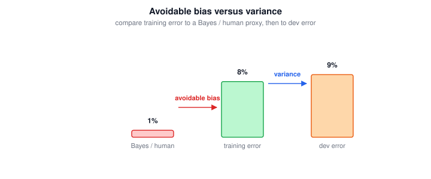

### 3.3 Bias vs Variance Intuition

**Bias** measures how far the model's average prediction is from the best possible prediction. A high-bias model is too simple or poorly optimized, so it misses real patterns in the data. This is why **underfitting is a high-bias problem**: the model cannot even fit the training set well.

**Variance** measures how much the model would change if trained on a different sample of data. A high-variance model is too sensitive to the exact examples it saw during training. This is why **overfitting is a high-variance problem**: the model fits the training set well, but the learned patterns do not generalize to new dev/test examples.

| Case | Training error | Dev error | Meaning |
|---|---:|---:|---|
| High bias / underfitting | High | High | Model misses important structure |
| High variance / overfitting | Low | High | Model memorizes training-specific patterns |
| Good fit | Low | Low | Model captures useful patterns and generalizes |

### 3.4 Understanding Human-level Performance

Use the definition of human-level performance that matches your purpose.

If the goal is estimating Bayes error, use the best available human performance, not average human performance.

If the goal is deployment or communication, a different benchmark may be useful, such as typical expert performance.

| Purpose | Human-level reference |
|---|---|
| Estimate Bayes error | Best human/team performance |
| Compare product readiness | Relevant user or expert baseline |

### 3.5 Surpassing Human-level Performance

Once a model surpasses human-level performance, progress often becomes harder because:

- Bayes error is harder to estimate;
- human error analysis becomes less informative;
- remaining errors may be subtle or data-limited.

ML systems often surpass humans on structured-data tasks with huge datasets. It is usually harder on natural perception tasks such as vision, speech, and language, where humans are strong.

Example: a recommendation system can outperform a human friend at predicting which movie a user will click because it learns from millions of users' past clicks and ratings, far more examples than any person could observe. But in a road situation, a human may still understand subtle context better, such as a pedestrian about to cross, a cyclist behaving unpredictably, or a police officer directing traffic.

### 3.6 Improving your Model Performance

Use this diagnosis loop:

1. Estimate Bayes error or human-level error.
2. Measure training error.
3. Measure dev error.
4. Decide whether avoidable bias or variance is larger.
5. Apply the matching fix.

| Diagnosis | Try |
|---|---|
| High avoidable bias | Bigger network, train longer, better optimization, better architecture |
| High variance | More data, L2/dropout, data augmentation, better architecture |
| Metric/dev mismatch | Redefine metric or dev/test set |
| Dev/test gap | Bigger dev set or less tuning to dev set |

### 3.7 Tricky Interview Questions

**Q: Is human-level error the same as Bayes error?**  
No. Bayes error is theoretical and usually unknown; human-level error is often used as a practical proxy.

**Q: Why is underfitting a high-bias problem?**  
Because the model cannot fit even the training data well, so its assumptions are too simple or optimization is insufficient.

**Q: Why is overfitting a high-variance problem?**  
Because the model is too sensitive to the specific training sample and fails to generalize to dev/test examples.

**Q: Training error is 4.0% and dev error is 4.5%. Can you conclude that bias is high?**  
Not without a Bayes-error or human-level estimate. If human-level error is near 0%, bias may be high; if human-level error is near 4%, bias may be low.

**Q: For estimating Bayes error in bird identification, whose performance should define human-level performance?**  
Use the best available expert performance, such as a specialist or team of specialists, not the average person.

**Q: What is the correct order from worst to best performance?**  
Usually: learning algorithm performance $\rightarrow$ human-level performance $\rightarrow$ Bayes optimal performance. A model can surpass humans, but cannot surpass Bayes optimal performance.

**Q: Human-level error is 0.1%, training error is 2.0%, and dev error is 2.1%. What should you prioritize?**  
Reducing avoidable bias, because training error is much higher than the human/Bayes estimate while the dev-training gap is small.

**Q: Dev error is 2.1% but test error is 7.0%. What does this suggest?**  
You may have overfit the dev set or the dev set may be too small/unrepresentative. Consider getting a larger or better dev set.

**Q: If training and dev error are both below measured human-level error, what can you conclude?**  
The model has surpassed that human benchmark. Estimating avoidable bias becomes harder, and the true Bayes error must be at or below the model's error if the estimate is reliable.

---

## 4. Error Analysis

Error analysis means manually inspecting examples the model got wrong to identify which errors matter most.

### 4.1 Carrying Out Error Analysis

Procedure:

1. Collect a sample of mislabeled dev-set examples.
2. Create columns for possible error categories.
3. Mark which categories apply to each example.
4. Count the percentage of errors in each category.
5. Prioritize categories with the largest possible impact.

Example: inspect 100 dev-set mistakes for a cat classifier. If 8% (8 out of 100) are dogs, 43% are big cats, and 61% are blurry images, then improving blurry-image performance has a much higher possible payoff than focusing on dogs.

If a category accounts for 5% of current errors, fully solving it can only reduce total error by maximum 5% relative. If it accounts for 50%, it may be worth major effort.

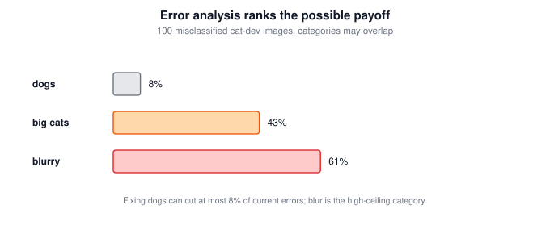

Categories can overlap. Add new categories while inspecting if you notice repeated patterns.

### 4.2 Cleaning Up Incorrectly Labeled Data

Incorrectly labeled data means the dataset label $y$ is wrong.

Training-set label errors:

- random errors are often tolerated by deep learning models (so no need to clean it);
- systematic errors are more harmful (so should be detected and fixed);
- cleaning the entire training set may not be the best use of time.

Dev/test label errors:

- matter more because they affect model selection and final evaluation;
- should be fixed if they significantly change your ability to compare models.

If you clean labels:

- apply the same process to dev and test sets;
- consider checking correct predictions as well as incorrect ones;
- it is acceptable to clean dev/test without cleaning the full training set.

### 4.3 Build your First System Quickly, then Iterate

For a new ML application:

1. Set up dev/test sets and a metric.
2. Build a simple first system quickly.
3. Measure performance.
4. Run bias/variance analysis.
5. Run error analysis.
6. Use the evidence to choose the next step.

The first system does not need to be perfect. Its main value is producing real errors you can analyze.

This advice applies less when you already have strong prior experience or a known strong baseline for the exact task.

### 4.4 Tricky Interview Questions

**Q: Why do error analysis on the dev set?**  
Because the dev set represents the target you are optimizing during development.

**Q: If 5% of current errors are in one category, what is the maximum payoff from fully solving it?**  
At most a 5% relative reduction in the current error.

**Q: Why are dev/test label errors more important than random training label errors?**  
Because dev/test labels affect model selection and final evaluation directly.

**Q: When starting a new self-driving perception project, should you first solve the hardest-looking subproblem or build a basic system?**  
Build a basic system first, then use error analysis to decide which subproblem actually matters most.

**Q: Which examples should you manually inspect during error analysis?**  
Dev-set examples the algorithm got wrong, because the dev set is used to choose between model iterations.

**Q: If 8.0% out of 15.3% total dev error is due to foggy pictures, must fog be the top priority?**  
Not automatically. It has a high ceiling, but the decision also depends on how costly or feasible it is to collect or synthesize foggy data.

**Q: If a fix targets a category responsible for 7.2% absolute dev error, what is the maximum possible improvement?**  
At most 7.2 percentage points on dev error, assuming that category is fully solved.

**Q: If you correct mislabeled examples in the dev set, should you also correct the test set?**  
Yes. Apply the same correction process to dev and test so they remain from the same distribution. Training labels are less urgent unless errors are systematic.

**Q: A new rare class appears and you only have a small number of examples. What is a good first step?**  
Use data augmentation or targeted data collection to create more training examples for that class, then evaluate whether performance improves.

---

## 5. Mismatched Training and Dev/Test Set

In deep learning, it is common to use extra training data from a different distribution because more data can help. The key is to keep dev and test sets aligned with the distribution you actually care about.

### 5.1 Training and Testing on Different Distributions

If you have a small amount of target-distribution data and a large amount of related off-distribution data:

- use the off-distribution data in training if it helps;
- keep dev and test from the target distribution;
- optionally include some target-distribution data in training.

Do **not** randomly shuffle all data into train/dev/test if the large off-distribution source would dominate dev and test. That would make the target wrong.

Example: if your task is to detect a cat on a mobile phone image and you have 10,000 mobile-uploaded cat images and 200,000 clean web images, do not randomly split all 210,000 images. The dev/test sets would mostly contain web images, so they would measure the wrong target. Instead, train on the web images plus some mobile images, and keep dev/test from mobile uploads.

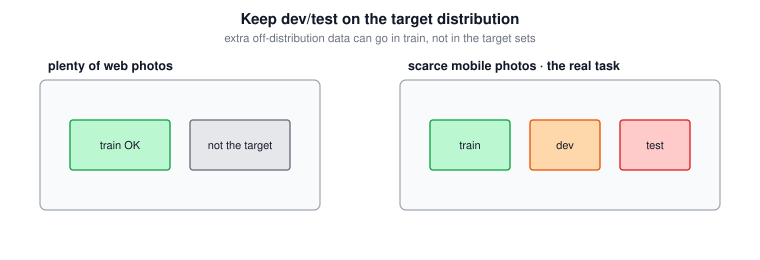

### 5.2 Bias and Variance with Mismatched Data Distributions

When training and dev/test distributions differ, a train-dev gap is needed to separate variance from data mismatch.

Example: if training and dev/test distributions differ and training error is 1% and dev error is 10%, you cannot tell whether the model overfits or whether dev data is just different. If training-dev error is 9%, the problem is mostly variance. If training-dev error is 1.5%, the problem is mostly data mismatch.

Create a **training-dev set**:

- same distribution as the training set;
- not used for training;
- used only for diagnosis.

| Large gap | Means |
|---|---|
| Training error $-$ Human/Bayes error is large-scale | Avoidable bias |
| Training-dev error $-$ training error is large-scale | Variance |
| Dev error $-$ training-dev error is large-scale | Data mismatch |
| Test error $-$ dev error is large-scale | Dev-set overfitting |

Formulas:

$$\boxed{\text{variance} = \text{training-dev error} - \text{training error}}$$

$$\boxed{\text{data mismatch} = \text{dev error} - \text{training-dev error}}$$

If training-dev error is close to training error but dev error is much worse, the main problem is data mismatch.

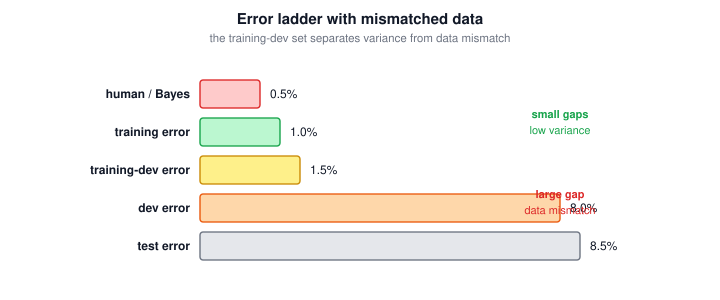

### 5.3 Addressing Data Mismatch

There is no fully systematic solution, but a useful process is:

1. Perform error analysis on the dev set.
2. Identify how dev examples differ from training examples.
3. Change training data so that the distribution would be closer to dev/test data distribution (collect more training data similar to dev/test data; use data synthesis or augmentation when realistic and diverse enough).

Artificial data synthesis can help, but avoid synthesizing from a tiny subset of possible cases. Synthetic data that looks realistic to humans can still be too narrow for a neural network.

Example: adding the same 1 hour of car-noise recording to 10,000 hours of clean speech may sound realistic, but the model can overfit to that one noise pattern. It is better to use many different noise recordings, speeds, microphones, and environments.

### 5.4 Tricky Interview Questions

**Q: Why not randomly split all available data when distributions differ?**  
If off-distribution data dominates, the dev/test sets will measure the wrong target.

**Q: What is the training-dev set for?**  
It separates variance from data mismatch by testing on unseen examples from the training distribution.

**Q: What does a large gap between training-dev error and dev error mean?**  
The model generalizes within the training distribution but struggles on the dev/test distribution, so the issue is data mismatch.

**Q: Can you add helpful training data from a different distribution?**  
Yes. Extra training data can help even if its distribution differs from dev/test. What matters most is that dev and test reflect the target distribution.

**Q: Why not add off-distribution citizen data to the test set?**  
It would change the test distribution and stop the test set from measuring the target distribution you care about.

**Q: If car-camera images are the target distribution and internet road images are extra data, how should you split data?**  
Train can include internet images plus some car-camera images, but dev/test should be car-camera images.

**Q: Training error is 1%, training-dev error is 5.1%, dev error is 5.6%, and human error is 0.5%. What is the main issue?**  
High variance, because the training-dev error is much higher than training error on the same distribution.

**Q: Training error is 2%, training-dev error is 2.3%, dev error is 1.3%, and test error is 1.1%. Does this prove target data has higher Bayes error?**  
No. Dev/test errors are lower than training/training-dev errors, so the target distribution may actually be easier.

**Q: Can synthesized foggy images be useful even if the fog source differs from the main datasets?**  
Yes, if they make training examples more like the dev/test conditions and are diverse enough not to create a narrow synthetic distribution.

---

## 6. Learning from Multiple Tasks

Related tasks can help each other when they share useful representations.

### 6.1 Transfer Learning

Transfer learning is sequential:

1. Train on task A, usually with a large dataset.
2. Reuse learned features or parameters.
3. Fine-tune on task B, usually with less data.

It is useful when:

- task A and task B have similar low-level features;
- task A has much more data;
- task B has limited labeled data.

Transfer learning is used very often in practice.

Examples:
- Computer vision: pretrain on a large image dataset, then fine-tune on a small medical-image dataset.
- NLP: start from a pretrained language model, then fine-tune it for sentiment classification or question answering.
- Speech: train on a large general speech dataset, then adapt to a smaller dataset from a specific accent, microphone, or domain.

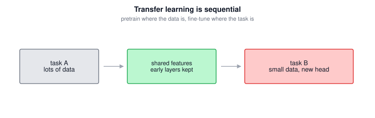

### 6.2 Multi-task Learning

Multitask learning trains one model to do several tasks at the same time.

Instead of one label per example, each example may have a vector of labels:

$$\boxed{y^{(i)} = \begin{bmatrix} y_1^{(i)} \\ y_2^{(i)} \\ \cdots \\ y_T^{(i)} \end{bmatrix}}$$

For $T$ binary tasks, the loss can sum over task-specific logistic losses:

$$\boxed{J = \frac{1}{m}\sum_{i=1}^{m}\sum_{j=1}^{T}\mathcal{L}\left(\hat{y}_j^{(i)}, y_j^{(i)}\right)}$$

If some labels are missing, do **not** replace the missing label with class value $0$. A missing label means "unknown", not "absent". Keep it as missing/NaN in the dataset and use a mask $m_j^{(i)}$: $m_j^{(i)} = 1$ when label $y_j^{(i)}$ is available, and $m_j^{(i)} = 0$ only to ignore that missing label in the loss:

$$\boxed{J = \frac{1}{\sum_{i,j} m_j^{(i)}}\sum_{i=1}^{m}\sum_{j=1}^{T} m_j^{(i)}\mathcal{L}\left(\hat{y}_j^{(i)}, y_j^{(i)}\right)}$$

So if an image is labeled for "car" but not for "traffic light", the car term contributes to the loss and the traffic-light term is skipped.

Multitask learning makes sense when:

- tasks share low-level features;
- each task can benefit from data from the others;
- the network is large enough to perform all tasks well.

It is used less often than transfer learning, but is common in settings like object detection where many related labels are predicted together.

Example: a self-driving perception model can use one shared network to detect pedestrians, cars, stop signs, traffic lights, and lane markings in the same image.

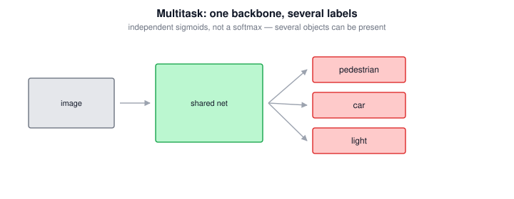

### 6.3 Tricky Interview Questions

**Q: When is transfer learning most useful?**  
When the target task has little data and a related source task has much more data.

**Q: How is multitask learning different from softmax classification?**  
Softmax chooses one class; multitask learning can assign multiple labels to the same example.

**Q: What should you do with missing labels in multitask learning?**  
Keep them as unknown and mask their loss terms, rather than converting them to class value $0$.

**Q: For road-scene labels with five possible objects, should the output use softmax or independent sigmoid outputs?**  
Use independent sigmoid outputs with a summed binary loss, because multiple objects can appear in the same image.

**Q: If an example has labels like $[0, ?, 1, ?, 1]$, how should its loss be computed?**  
Compute loss only for the known components and skip the unknown `?` entries.

**Q: A yellow-traffic-light classifier has little data, while a red/green-light model was trained on lots of road data. What should you try?**  
Use transfer learning: initialize from the trained road/traffic model and fine-tune on yellow-light examples.

**Q: When can road-sign classification benefit from multitask learning?**  
When related signs share visual features and one model can learn useful shared representations across sign types.

**Q: Is using one network to localize signs and a separate network to classify stop signs multitask learning?**  
No. Multitask learning means one model jointly learns multiple related tasks; two separate models form a pipeline.

---

## 7. End-to-end Deep Learning

End-to-end deep learning replaces a multi-stage pipeline with one model that maps directly from input $X$ to output $Y$.

### 7.1 What is End-to-end Deep Learning?

Traditional pipeline:

$$X \rightarrow \text{intermediate steps} \rightarrow Y$$

End-to-end approach:

$$\boxed{X \rightarrow Y}$$

Example: in speech recognition, a traditional pipeline might be `audio -> features -> phonemes -> words -> transcript`, while an end-to-end model learns `audio -> transcript` directly.

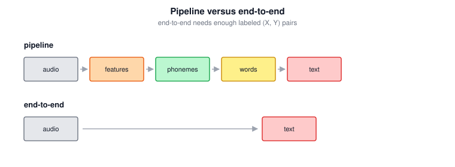

Benefits:

- lets the data learn the representation;
- reduces hand-designed components;
- can simplify the system;
- can perform very well with enough labeled $(X, Y)$ data.

### 7.2 Whether to use End-to-end Deep Learning

Use end-to-end learning when:

- there is a large amount of labeled end-to-end data;
- the direct mapping is learnable with available model capacity;
- hand-designed intermediate steps are limiting performance.

Prefer a multi-step pipeline when:

- there is not enough end-to-end data;
- intermediate subtasks are simpler;
- there is plenty of data for the subtasks;
- hand-designed structure injects useful domain knowledge.

End-to-end learning is powerful, but it is not automatically better. Choose the $X \rightarrow Y$ mappings based on what data you can actually get.

### 7.3 Tricky Interview Questions

**Q: What is the main advantage of end-to-end deep learning?**  
It lets the model learn the direct input-output mapping and avoids hand-designed intermediate representations.

**Q: What is the main risk of end-to-end deep learning?**  
It may require much more labeled end-to-end data than a pipeline of simpler subtasks.

**Q: When should you prefer a pipeline?**  
When intermediate subtasks are simpler, have enough data, or benefit from useful domain knowledge.

**Q: Why can a two-step stop-sign system beat an end-to-end model?**  
If there is not enough labeled end-to-end data, splitting the task into sign localization and sign classification can make each subproblem easier to learn.

---

## 8. Strategy Checklist

Use this checklist when deciding what to do next:

| Observation | Likely issue | Next action |
|---|---|---|
| Training error much higher than human/Bayes error | Avoidable bias | Bigger model, train longer, better optimizer |
| Dev error much higher than training error | Variance | More data, regularization, augmentation |
| Training-dev good but dev poor | Data mismatch | Make training data more like dev/test |
| Dev good but test poor | Dev overfitting | Larger/better dev set |
| Test good but product poor | Wrong target | Change metric or dev/test distribution |
| Unsure what matters | Unknown error sources | Manual error analysis |

Core principle: place the target correctly, build a quick system, diagnose errors, then improve the biggest bottleneck.

---
